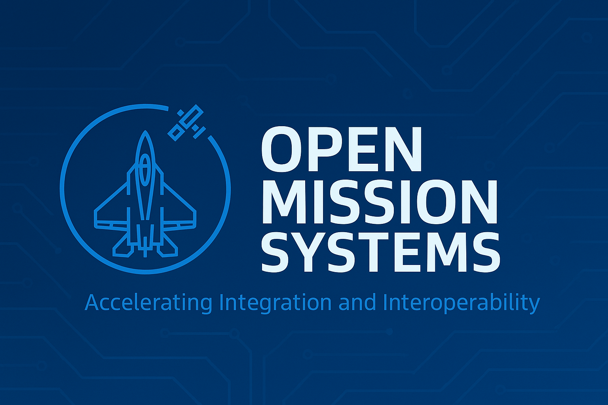
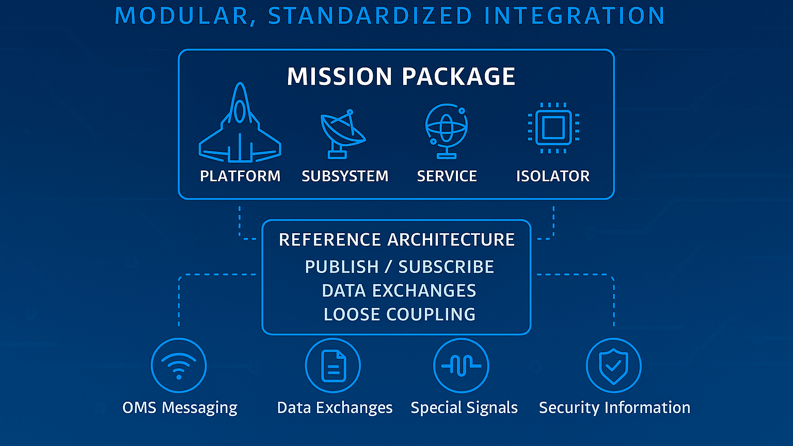

   

Welcome to the unclassified repository for the Open Mission Systems (OMS) Standard, a government-owned, non-proprietary open architecture specification for mission systems. This repo contains the core technical documents defining OMS Version 2.5 (released January 22, 2026). The OMS standard promotes interoperability, modularity, and rapid integration in defense systems.

> [!NOTE]
> The United States Air Force is experimenting with releasing unclassified standards on <https://gitlab.com/modular-af/> and <https://gitlab.com/modular-af>.  We welcome [constructive feedback](mailto:aflcmc.ase.architectures@us.af.mil) on how we can improve this approach.  These repositories currently focus exclusively on the technical standard and documentation. Example "hello world" software implementation code is forthcoming.

## 🚀 Overview

The OMS standard creates a standard abstraction layer to enable integration of modular components—called Units of Replaceability (UoRs)—such as hardware subsystems and software services into mission packages. At its core, the OMS standard defines a reference architecture that emphasizes loose coupling, publish/subscribe messaging, and standardized data exchanges to facilitate adaptability in complex mission environments.

Key elements include:

- **Mission Packages**: Composed of platforms, subsystems, services, and isolators.
- **Data Exchanges**: Standardized via OMS Messaging, Data Transfer, Special Signals, and Security Information Exchanges.
- **Tiered Compliance**: Allows gradual adoption (Tier 1 for legacy systems, up to Tier 3 for full interoperability).

The OMS standard draws from service-oriented principles to decouple implementations from interfaces, enabling future upgrades and reuse.

## 📊 Why OMS?

In an era of rapid technological change and contested battlespaces, OMS stands out by:

- **Reduced Costs and Schedule**: Modular design enables rapid integration while lowering acquisition, sustainment, and upgrade expenses through reusable components.
- **Enhanced Interoperability**: Standardized interfaces allow "plug-and-play" capabilities across platforms, supporting machine-to-machine data exchanges for battlespace superiority.
- **Fosters Competition**: Non-proprietary nature empowers providers to deliver innovative solutions.
- **Proven Flexibility**: Tiered compliance paths make it accessible for legacy systems while scaling to advanced setups, balancing complexity with functionality.

OMS is a "living standard," evolving to meet mission needs while ensuring backward compatibility where possible—making it a future-proof foundation for mission-critical systems.

## 📦 What's Included in the Standard

This repository includes all documents comprising the OMS Definition and Documentation (D&D) set for Version 2.5. Files are organized by type (standards, specifications, guides, templates, instructions, and checklists).

These files cover requirements, architecture, compliance checklists, templates for documentation (e.g., Mission Package Worksheets), specifications (e.g., Critical Abstraction Layer), and guidance (e.g., cybersecurity).

## 🧭 Where to Find More Information

- **Official Governance**: Visit the Open Architecture Collaborative Working Group (OACWG) for updates and governance details. Contact via <aflcmc.ase.architectures@us.af.mil>.
- **Related Standards**: The OMS standard builds on the [Universal Command and Control Interface (UCI)](/modular-af/UCI) standard.
