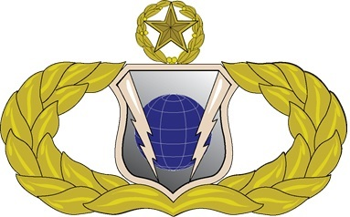
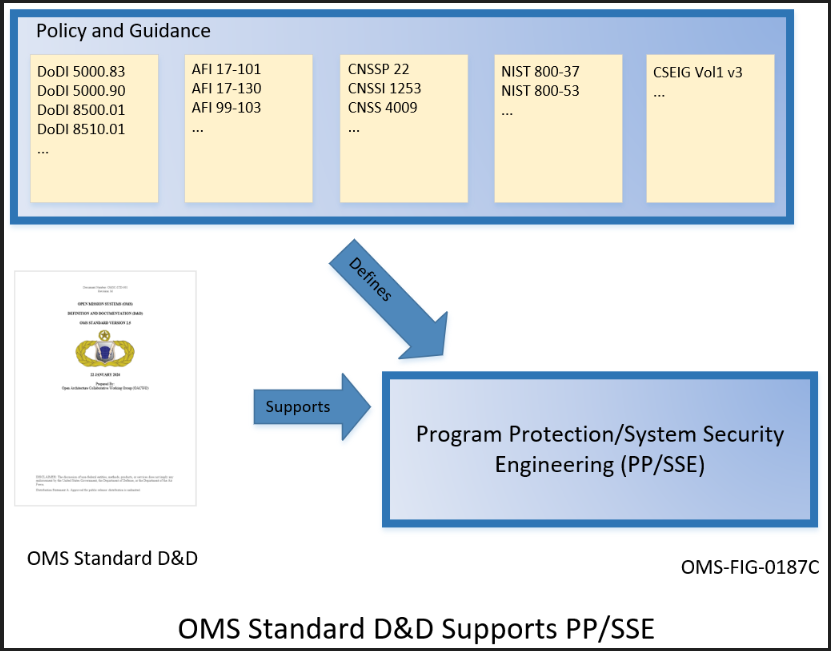
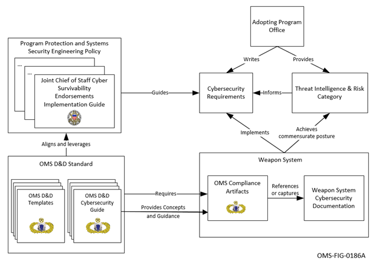
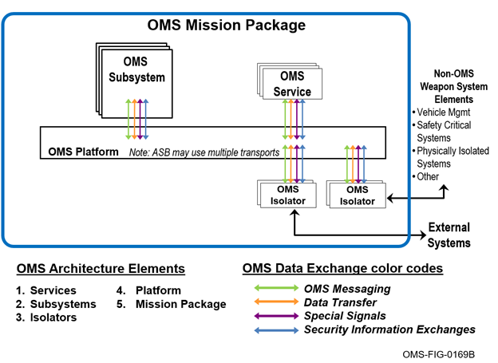
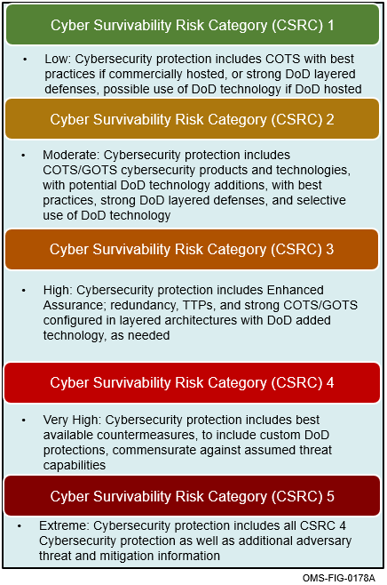

Open Mission Systems (OMS)

Definition And Documentation (D&D)

Cybersecurity Guide

22 January 2026

Prepared By:

Open Architecture Collaborative Working Group (OACWG)

This page is intentionally left blank.

Abstract

Open Mission Systems (OMS) is a non-proprietary open architecture for
integrating subsystems and services into mission packages.

The OMS Cybersecurity Guide provides guidance for documenting and
referencing cybersecurity within the OMS artifacts. This guide defines
OMS cybersecurity-related terms used in the document, integrates
concepts from the Joint Chiefs of Staff (JCS) Cyber Survivability
Endorsements Implementation Guide (CSEIG), and describes a risk-informed
process for capturing cybersecurity information tailored to a Cyber
Survivability Risk Category (CSRC).

This page is intentionally left blank.

Revision Record

<table>
<thead>
<tr class="header">
<th>REVISION</th>
<th>DATE</th>
<th>DESCRIPTION</th>
</tr>
</thead>
<tbody>
<tr class="odd">
<td>D</td>
<td>22 January 2026</td>
<td>Initial public release</td>
</tr>
</tbody>
</table>

This page is intentionally left blank.

Table of Contents

[1 Introduction 1](#introduction)

[1.1 OMS Architecture 3](#oms-architecture)

[2 References 5](#references)

[2.1 OMS D&D Documents 5](#oms-dd-documents)

[2.2 Other Documents 5](#other-documents)

[3 Cyber Survivability 7](#cyber-survivability)

[3.1 CSRC and CSA Introduction 8](#csrc-and-csa-introduction)

[3.1.1 Cyber Survivability Risk Category (CSRC)
8](#cyber-survivability-risk-category-csrc)

[3.1.2 Cyber Survivability Attributes (CSAs)
10](#cyber-survivability-attributes-csas)

[3.2 OMS Cybersecurity for Cyber Survivability
13](#oms-cybersecurity-for-cyber-survivability)

[3.3 Removal of OMS Cybersecurity Control Overlay
13](#removal-of-oms-cybersecurity-control-overlay)

[4 OMS Cybersecurity Guidance 15](#oms-cybersecurity-guidance)

[4.1 Service OMS Cybersecurity Guidance
17](#service-oms-cybersecurity-guidance)

[4.2 Isolator OMS Cybersecurity Guidance
18](#isolator-oms-cybersecurity-guidance)

[4.3 Subsystem OMS Cybersecurity Guidance
19](#subsystem-oms-cybersecurity-guidance)

[4.4 Platform OMS Cybersecurity Guidance
23](#platform-oms-cybersecurity-guidance)

[4.5 Mission Package OMS Cybersecurity Guidance
25](#mission-package-oms-cybersecurity-guidance)

[5 Acronyms and Abbreviations 28](#acronyms-and-abbreviations)

[6 Glossary 29](#glossary)

This page is intentionally left blank.

List of Figures

[Figure 1.0-1 OMS Standard D&D Supports PP/SSE 2](#_Toc219293202)

[Figure 1.0-2 OMS Cybersecurity Guidance in Acquisition
2](#_Toc219293203)

[Figure 1.1-1 Top-Level View of the OMS Reference Architecture
4](#_Toc219293204)

[Figure 3.1-1 CSRC Levels for OMS Compliance 9](#_Toc219293205)

This page is intentionally left blank.

List of Tables

[Table 2.1-1 OMS D&D Documents 5](#_Toc219293206)

[Table 2.2-1 Other Documents 5](#_Toc219293207)

[Table 3.1-2: System Survivability KPP Pillars Mapped to Cyber
Survivability Attributes 11](#_Toc219293208)

[Table 4.0‑1 CSAs to OMS Architecture Elements Mapping
16](#_Toc219293209)

This page is intentionally left blank.

Introduction
============

Cybersecurity is defined in National Security Presidential
Directive-54/Homeland Security Presidential Directive-23 as follows, and
is addressed in DoDI 8500.01 Cybersecurity:

> Prevention of damage to, protection of, and restoration of computers,
> electronic communications systems, electronic communications services,
> wire communication, and electronic communication, including
> information contained therein, to ensure its availability, integrity,
> authentication, confidentiality, and nonrepudiation.

Cybersecurity is applicable to all DoD Information and Communications
Technology (ICT). It is DoD policy that the DoD will implement a
multi-tiered cybersecurity risk management process as described in DoDI
8510.01, Risk Management Framework (RMF) for DoD Information Technology.

The OMS Standard supports DoD Program Protection and Systems Security
Engineering (PP/SSE) processes and aligns with existing cybersecurity
policy and guidance as illustrated in Figure 1.0-1. The figure below
does not provide an exhaustive list of existing cybersecurity policy and
guidance.

Figure 1.0-1 OMS Standard
D&D Supports PP/SSE

The OMS Cybersecurity Guide provides concepts and guidance to complete
OMS compliance documentation. These documents can be used as part of a
PP/SSE process and incorporate concepts provided by the Joint Chiefs of
Staff (JCS) Cyber Survivability Endorsements Implementation Guide
(CSEIG) to address both cybersecurity and cyber resiliency. OMS D&D
Documents helps fill the gap when no external cybersecurity requirements
are present, and provides flexibility to reference external documents
when a system-level cybersecurity process with requirements is in place.
The role of OMS cybersecurity in the SSE process is therefore to
reference or provide relevant information to support the Adopting
Program and system designers in addressing cybersecurity requirements as
shown in Figure 1.0-2.

Figure 1.0-2 OMS
Cybersecurity Guidance in Acquisition

As shown in Figure 1.0-2, this guide incorporates the concept of Cyber
Survivability from the JCS CSEIG, and as defined by DODI 8500.01:

> The ability of warfighter systems to prevent, mitigate, recover from
> and adapt to adverse cyber-events that could impact mission related
> functions, by applying a risk managed approach to achieve and maintain
> an operationally relevant risk posture, throughout its lifecycle.

The purpose of the OMS Cybersecurity Guide is to provide additional
guidance on how to document cybersecurity in support of Cyber
Survivability consistent with DoD Guidance and the JCS-CSEIG. It does
not alter or add cybersecurity requirements in the PP/SSE process. The
guide helps standardize the location and overall layout of the
cybersecurity related documentation and makes it easier for
Authorization Officials to quickly locate and reference the required
information to make informed risk-based accreditation decisions. The
adopting program is responsible for all program identified security
requirements (including allocation and verification). Security topics
beyond documenting cybersecurity is out of scope of this guide.

OMS Architecture
----------------

The scope of OMS is bounded by the OMS Mission Package, the
highest-level OMS construct. The top-level view of the OMS Reference
Architecture (Figure 1.1-1) depicts an OMS Mission Package (hereafter
referred to as “Mission Package”) as an OMS Platform (hereafter referred
to as “Platform”) integrated with OMS Subsystems (hereafter referred to
as “Subsystems”), OMS Services (hereafter referred to as “Services”),
and OMS Isolators (hereafter referred to as “Isolators”). OMS elements
are interconnected using OMS Data Exchanges and are architecturally
isolated, using Isolators, from the elements of the larger weapon system
into which it is integrated. While Subsystems and Services are the
building blocks that enable OMS mission functionality, the top-level
system design of a Mission Package is largely defined by the Platform.
Services can be contained in Subsystems or integrated directly in
Platform-provided mission processing, with the Platform also providing
an Abstract Service Bus (ASB), Critical Abstraction Layer (CAL), time
reference/synch processing, position information, and data storage.

See OMSC-STD-001, OMS Standard D&D, for additional information on OMS
Architecture.

Figure 1.1-1 Top-Level
View of the OMS Reference Architecture

The focus of this document is the cybersecurity concerns within a
Mission Package which is typically not an entire weapon system, but may
also include multiple weapons systems (as OMS Subsystems). Thus, it is
imperative to consider those portions of a weapons system where their
implementations may intersect.

References
==========

OMS D&D Documents
-----------------

The documents listed in Table 2.1-1, OMS D&D Documents, are the
documents that assist in the understanding and implementation of OMS.

Table 2.1-1 OMS D&D
Documents

<table>
<thead>
<tr class="header">
<th>Document Number</th>
<th>Document Title</th>
<th>Revision</th>
<th>Date</th>
</tr>
</thead>
<tbody>
<tr class="odd">
<td>OMSC-STD-001</td>
<td>OMS Standard Version 2.5</td>
<td>M</td>
<td>22 January 2026</td>
</tr>
<tr class="even">
<td>OMSC-STD-002</td>
<td>Abbreviations and Glossary</td>
<td>M</td>
<td>22 January 2026</td>
</tr>
<tr class="odd">
<td>OMSC-TMP-006</td>
<td>Mission Package Worksheet (MPW) Template</td>
<td>H</td>
<td>22 January 2026</td>
</tr>
<tr class="even">
<td>OMSC-INS-001</td>
<td>Platform Description Document (PDD) Template Instructions</td>
<td>M</td>
<td>22 January 2026</td>
</tr>
<tr class="odd">
<td>OMSC-INS-002</td>
<td>Subsystem Description Document (SDD) Template Instructions</td>
<td>M</td>
<td>22 January 2026</td>
</tr>
<tr class="even">
<td>OMSC-INS-003</td>
<td>Service Contract Template Instructions</td>
<td>M</td>
<td>22 January 2026</td>
</tr>
<tr class="odd">
<td>OMSC-INS-007</td>
<td>Mission Package Description Document (MPDD) Template Instructions</td>
<td>I</td>
<td>22 January 2026</td>
</tr>
</tbody>
</table>

Other Documents
---------------

The documents listed in Table 2.2-1, Other Documents, are cited
throughout this document. For dated references, only the edition cited
applies. For undated references, the latest edition of the referenced
document (including any amendments or corrigenda) applies.

Table 2.2-1 Other
Documents

<table>
<thead>
<tr class="header">
<th>Document Number</th>
<th>Document Title</th>
<th>Revision</th>
<th>Date</th>
</tr>
</thead>
<tbody>
<tr class="odd">
<td>CNSSP No. 22</td>
<td>Policy on Information Assurance Risk Management for National Security Systems</td>
<td></td>
<td>August 2016</td>
</tr>
<tr class="even">
<td>CNSSI No. 1253</td>
<td>Security Categorization and Control Selection for National Security Systems</td>
<td></td>
<td>27 March 2014</td>
</tr>
<tr class="odd">
<td>CNSSI No. 4009</td>
<td>National Information Assurance (IA) Glossary</td>
<td></td>
<td>26 April 2010</td>
</tr>
<tr class="even">
<td>N/A</td>
<td>Cyber Survivability Endorsement Implementation Guide (CSEIG)</td>
<td>Version 3</td>
<td>July 2022</td>
</tr>
<tr class="odd">
<td>DODI 8500.01</td>
<td>Cybersecurity</td>
<td></td>
<td>14 March 2014</td>
</tr>
<tr class="even">
<td>DODI 8510.01</td>
<td>Risk Management Framework (RMF) for DoD Information Technology (IT)</td>
<td></td>
<td>12 March 2014</td>
</tr>
<tr class="odd">
<td>NIST SP 800-37</td>
<td>Guide for Applying the Risk Management Framework to Federal Information Systems</td>
<td>Revision 1</td>
<td>February 2010</td>
</tr>
<tr class="even">
<td>NIST SP 800-53</td>
<td>Security and Privacy Controls for Federal Information Systems and Organizations</td>
<td>Revision 5</td>
<td>September 2020</td>
</tr>
<tr class="odd">
<td>AFI 17-101</td>
<td>RMF for Air Force Information Technology</td>
<td></td>
<td>6 February 2020</td>
</tr>
<tr class="even">
<td>NIST SP 800-160</td>
<td>Developing Cyber-Resilient Systems: A Systems Security Engineering Approach</td>
<td>Revision 1</td>
<td>December 2021</td>
</tr>
<tr class="odd">
<td>N/A</td>
<td>AFLCMC/EN-EZ Memo: Aircraft Security Control Overlay</td>
<td>Revision 5</td>
<td>January 2021</td>
</tr>
</tbody>
</table>

Cyber Survivability
===================

Cyber Survivability is defined as “the ability of warfighter systems to
prevent, mitigate, recover from and adapt to adverse cyber-events that
could impact mission related functions, by applying a risk managed
approach to achieve and maintain an operationally relevant risk posture,
throughout its lifecycle.” (NIST SP 800-160 Vol 2).

Cyber survivability is a key program acquisition element that must be
considered as part of the System Survivability. The Joint Chiefs of
Staff developed the Cyber Survivability Endorsement (CSE) criteria to
ensure joint warfighting systems’ requirements are developed to prevent,
mitigate and recover from and adapt to adverse cyber events by applying
a risk-managed approach. CSE is a simple process designed to help
requirement developers to better understand the cyber risks and define
mitigations for ensuring an acceptable level of mission assurance. The
CSE process helps develop mission impact-focused requirements for cyber
survivability, cybersecurity and cyber operational resilience. The CSE
does this by defining a Cyber Survivability Risk Category (CSRC) that
guides the strength of implementation levels to promote cyber
survivability. CSE has the potential to reduce acquisition/sustainment
costs and improve mission assurance under the following conditions:

-   resource and mission risk implications of a capability’s Cyber
    Survivability Attributes (CSA) are considered;

-   criteria are defined for the CSAs determined to be most critical to
    the system’s survivability and required to achieve a reasoned CSRC;

-   CSAs are decomposed and engineered in during development and tested
    throughout the lifecycle; and

-   systems maintained to preserve its cyber survivability capabilities.

CSRC and CSA Introduction
-------------------------

### Cyber Survivability Risk Category (CSRC)

The CSRC is defined for an acquisition per the CSEIG. The CSRC leads to
the selection of an integrated cyber threat and cyber requirements for
the Interface Control Document (ICD) and Analysis of Alternatives (AoA)
guidance. It also helps define a consistent understanding of the level
of cyber survivability required during development, testing and
operations.

The CSEIG provides six categories of CSRC-level exemplar language that
integrate anticipated cyber threat and mitigation requirements, before a
program’s specific technologies are known, and before a tailored cyber
threat assessment can be made. The CSRC identifies appropriate strength
of implementation levels for cyber survivability. For purposes of OMS,
CSRC 0 is out of scope because it identifies cyber survivability for
situations where there are no information exchange, hardware, software,
firmware, processing/sensors, or wired/wireless network connections.
Since OMS is focused on interactions between OMS Architecture Elements,
CSRC 0 is not applicable. Figure 3.1-1 provides additional information
on the expected protection at each CSRC level.

Figure 3.1-1 CSRC Levels
for OMS Compliance

### Cyber Survivability Attributes (CSAs)

A system’s CSRC drives the number of CSAs that are considered, tailored
and implemented in its design to achieve the defined CSRC level. The
CSRC uses a broad operational threat perspective and help define the
CSAs critical to system survivability. The CSAs are aligned with the
System Survivability Key Performance Parameter (KPP) pillars (Prevent,
Mitigate, Recover, and Adapt) to support and achieve the overall CSRC.
The System Survivability KPP is intended to ensure the system maintains
its critical capabilities under applicable threat environments, to
include the cyber threat. The System Survivability KPP pillars include:

-   Prevent: requirements that identify, protect and harden functions
    from adversary cybersecurity threats (CSAs 01-06)

-   Mitigate: requirements to detect and respond to cyber-events making
    it through defenses (CSAs 07-08)

-   Recover: requirements to recover to a known good condition after a
    cyber event (CSA-09)

-   Adapt: requirements to Actively Manage System’s Configurations to
    Achieve and Maintain an Operationally Relevant Cyber Risk Posture
    (CSA-10)

CSAs are traceable to the System Survivability KPP mandatory pillars of
Prevent, Mitigate, Recover, and Adapt (Table 3.1-2). CSAs can be applied
as cybersecurity capability requirements with appropriate levels of
strength of cybersecurity requirements to ensure the resulting system
will be cyber-survivable in its intended operational environment. Based
on the lessons learned, nine to ten CSAs are usually needed to support a
CSRC-5, six to nine CSAs for CSRC 4 capability; five to seven CSAs for
CSRC 3; two to five CSAs for CSRC 2, and one to three CSAs for CSRC 1.

The following table defines the ten CSAs and the related System
Survivability KPP.

Table 3.1-2: System
Survivability KPP Pillars Mapped to Cyber Survivability Attributes

<table>
<thead>
<tr class="header">
<th>System Survivability KPP Pillars (Mandatory)</th>
<th>
Cyber Survivability Attributes (CSA)

(Consider all, then select the applicable subset of CSAs)
</th>
</tr>
</thead>
<tbody>
<tr class="odd">
<td>Prevent</td>
<td>CSA-01 - Control Access</td>
</tr>
<tr class="even">
<td></td>
<td>CSA-02 - Reduce System’s Cyber Detectability</td>
</tr>
<tr class="odd">
<td></td>
<td>CSA-03 - Secure Transmissions and Communications</td>
</tr>
<tr class="even">
<td></td>
<td>CSA-04 - Protect System’s Information from Exploitation</td>
</tr>
<tr class="odd">
<td></td>
<td>CSA-05 - Partition and Ensure Critical Functions at Mission Completion Performance Levels</td>
</tr>
<tr class="even">
<td></td>
<td>CSA-06 - Minimize and Harden Attack Surfaces</td>
</tr>
<tr class="odd">
<td>Mitigate</td>
<td>CSA-07 - Baseline &amp; Monitor Systems and Detect Anomalies</td>
</tr>
<tr class="even">
<td></td>
<td>CSA-08 - Manage System Performance and Enable Cyberspace Defense</td>
</tr>
<tr class="odd">
<td>Recover</td>
<td>CSA-09 - Recover System Capabilities</td>
</tr>
<tr class="even">
<td>Adapt for Prevent, Mitigate &amp; Recover</td>
<td>CSA-10 - Actively Manage System’s Configurations to Achieve and Maintain an Operationally-Relevant Cyber Risk Posture</td>
</tr>
</tbody>
</table>

The following tailored CSA descriptions are based on the descriptions
found in the CSEIG and have been adapted to be applicable to the
respective OMS Architecture Elements.

-   **CSA-01 - Control Access:** When
    applicable, an OMS Architecture Element should only allow
    identified, authenticated, and authorized persons and non-person
    entities access or interconnection to other OMS Architecture
    Elements.

-   **CSA-02 - Reduce System’s Cyber
    Detectability:** When applicable, an OMS Architecture Element
    that requires signaling and communications (both wired and wireless)
    should not enable an adversary to monitor and/or target system
    and/or supported DoD weapon systems through its emanations.

-   **CSA-03 - Secure Transmissions and
    Communication:** When applicable, an OMS Architecture Element
    should ensure all transmissions and communications of data ‘in
    transit’ are protected commensurate with its confidentiality and
    integrity requirements.

-   **CSA-04 - Protect System’s Information from
    Exploitation:** When applicable, an OMS Architecture Element
    should ensure all data ‘at rest’ is protected commensurate with its
    confidentiality and integrity requirements. It should prevent
    unauthorized access, use, modification, and transfer/removal of
    data, including attempted exfiltration, from the system to
    unauthorized person and non-person entities throughout the system’s
    lifecycle (including development).

-   **CSA-05 - Partition and Ensure Critical
    Mission Functions:** When applicable, an OMS Architecture
    Element should implement technical/logical mitigations including
    logical and physical segmentation. The OMS Architecture Element
    should be able to maintain mission critical functions at minimum
    performance thresholds. Compromise of non-critical functions should
    not significantly impact system mission capability.

-   **CSA-06 - Minimize and Harden Attack
    Surfaces:** When applicable, an OMS Architecture Element
    should automatically disable all unauthorized ports, protocols, and
    services, including access points, by default. The OMS Architecture
    Element should support automated monitoring and logging of system
    attack surface and associated cyber events.

-   **CSA-07 - Baseline and Monitor Systems and
    Detect Anomalies:** When applicable, an OMS Architecture
    Element should implement and maintain a cybersecurity configuration
    baseline, to detect and report system anomalies indicative of a
    cyber-event. The OMS Architecture Element should monitor the
    cybersecurity configuration baseline of system functions, and report
    health status and anomalies to system operators.

-   **CSA-08 - Manage System Performance and
    Enable Cyberspace Defense:** When applicable, an OMS
    Architecture Element should be sufficiently resilient to mitigate
    cyber-event effects through orderly, structured and prioritized
    system responses, in order to ensure minimum mission functionality
    requirements to complete the current mission or return for recovery.
    The OMS Architecture Element should enable assigned cyberspace
    defenses to impose effects on adversaries to counter their
    operations and objectives.

-   **CSA-09 - Recover System
    Capabilities:** When applicable, an OMS Architecture Element
    should be capable of being restored to a known-good configuration
    from a trusted source between mission cycles. Recovery should
    prioritize critical functions.

-   **CSA-10 - Actively Manage System’s
    Configuration to Achieve and Maintain an Operationally-Relevant
    Cyber Risk Posture:** When applicable, an OMS Architecture
    Element should have a configuration management process supported by
    automated capabilities to achieve and continuously maintain an
    objectively assessed, operationally relevant Cyber Risk Posture.

The CSRC and the selected CSAs provide a foundation for developing
system security requirements and architecture. CSA’s should be
determined early to provide the system security engineer with decision
options prior to establishing the solution architectures. This maximizes
the cyber survivability solutions available necessary to achieve system
survivability within identified priorities and constraints.

OMS Cybersecurity for Cyber Survivability
-----------------------------------------

The OMS Standard is aligned with guidance from the Joint Chiefs of Staff
(JCS) to capture cybersecurity information in support of Cyber
Survivability. An Adopting Program Office that follows Cyber
Survivability guidance provides cybersecurity requirements to system
designers that are commensurate to a CSRC. System designers must
implement these tailored cybersecurity requirements. Tailored
requirements are intended to capture the strength of the required
cybersecurity implementation. OMS documentation aims to capture
cybersecurity information as it is implemented to describe a tailored
cybersecurity posture that meets an expected CSRC.

The role of OMS cybersecurity documentation in the SSE process is
therefore to reference or provide relevant information to support the
Adopting Program and system designers in addressing cybersecurity
requirements. The OMS Standard does not impose an SSE process, but
rather helps fill the gap when no external cybersecurity requirements
are present, and provides flexibility to reference external documents
when a system-level cybersecurity process with requirements is in place.

In alignment with the JCS CSEIG, the OMS Standard documents the CSRC of
the system at the Mission Package level. OMS Architecture Elements
capture their cybersecurity posture by documenting or referencing
cybersecurity information as CSAs. Finally, Cyber Survivability
rationale is captured at the Mission Package level that provides or
references justification that a cybersecurity posture meets the expected
CSRC. Additional documentation guidance is provided in Section 4, OMS
Cybersecurity Guidance.

Removal of OMS Cybersecurity Control Overlay
--------------------------------------------

NIST SP 800-53 security controls provide a common foundation for
cybersecurity in a National Security System (NSS). As part of the SSE
process, a Security Control Traceability Matrix (SCTM) is often used to
tailor and track applicable NIST security controls for an NSS. In
previous versions, the OMS Standard provided a suggested OMS security
overlay consisting of tailored security controls. In a departure from
this approach, the OMS Standard now provides the flexibility to
reference external SCTMs as part of the Cyber Survivability framework.
Such an external SCTM would likely be part of the larger Adopting
Program weapon system or a subset overlay created as part of the SSE
process. Within the Cyber Survivability framework, cybersecurity
implementation information is captured or referenced in ten CSAs. The
CSAs can be traced directly to RMF control families. They articulate
measurable and testable cybersecurity implementation and are supported
by NIST cybersecurity technical controls.

Leveraging and linking CSAs to NIST SP 800-53 cybersecurity technical
controls enables an easier understanding and implementation by
cybersecurity professionals. The OMS Standard does not provide a
recommended linkage to security controls; however, additional resources
for linking security controls are available as part of the Cyber
Survivability Portal (https://intelshare.intelink.gov/sites/cybersurvivability/).
Furthermore, recent guidance from weapon system Authorization Officials
provides recommended controls for each CSA (AFLCMC/EN-EZ Memo).

OMS Cybersecurity Guidance
==========================

The OMS Standard provides cybersecurity guidance to properly capture and
communicate the cybersecurity posture of a Mission Package. The
objective of OMS cybersecurity documentation is for it to be used as
part of an overarching cybersecurity strategy at the weapon system
level, which could differ depending on the Adopting Program. The OMS
Standard provides flexibility in how this information is documented. OMS
compliance documentation requires Adopting Programs to consider
cybersecurity when no external cybersecurity requirements are present,
and provides flexibility to reference external documents when a
system-level cybersecurity process with requirements is in place.

In the context of the OMS Standard, Table 4.0-1 provides a recommended
minimum mapping of CSA applicability to each OMS Architecture Element.
This recommendation is based on the OMS interfaces of the OMS
Architecture Elements hosted on the Platform. The Platform provides the
infrastructure for the Mission Package and therefore most of the CSAs
may apply. A Subsystem consists of hardware and software therefore most
of the CSAs may apply. Services and Isolators are software only and
operate on mission processing, therefore fewer CSAs may apply. Any
additional cybersecurity needs that do not utilize the Platform
resources are beyond the scope of this document. The presented mapping
does not necessitate a CSA must be implemented for all instances of the
OMS Architecture Element, nor does it preclude the implementation of
additional CSAs. It is the Adopting Program’s responsibility to
determine which CSAs to implement. Furthermore, the strength of
implementation of cybersecurity features should be tailored to achieve a
cybersecurity posture commensurate to the CSRC. Additional details and
guidelines (GUIDs) on CSA to Architecture mapping is provided in
following subsections.

Table 4.0‑1 CSAs to OMS
Architecture Elements Mapping

<table>
<thead>
<tr class="header">
<th>System Survivability KPP Pillars</th>
<th>CSAs</th>
<th>Mission Package</th>
<th>Platform</th>
<th>Subsystem</th>
<th>Service</th>
<th>Isolator</th>
</tr>
</thead>
<tbody>
<tr class="odd">
<td>Prevent</td>
<td>CSA-01 - Control Access</td>
<td>(1)</td>
<td>X</td>
<td>X</td>
<td></td>
<td></td>
</tr>
<tr class="even">
<td></td>
<td>CSA-02 - Reduce System’s Cyber Detectability</td>
<td>(1)</td>
<td>X</td>
<td>X</td>
<td></td>
<td></td>
</tr>
<tr class="odd">
<td></td>
<td>CSA-03 - Secure Transmissions and Communications</td>
<td>(1)</td>
<td>X</td>
<td>X</td>
<td>X</td>
<td>X</td>
</tr>
<tr class="even">
<td></td>
<td>CSA-04 - Protect System’s Information from Exploitation</td>
<td>(1)</td>
<td>X</td>
<td>X</td>
<td></td>
<td></td>
</tr>
<tr class="odd">
<td></td>
<td>CSA-05 - Partition and Ensure Critical Functions at Mission Completion Performance Levels</td>
<td>(1)</td>
<td>X</td>
<td>X</td>
<td></td>
<td></td>
</tr>
<tr class="even">
<td></td>
<td>CSA-06 - Minimize and Harden Attack Surfaces</td>
<td>(1)</td>
<td>X</td>
<td>X</td>
<td></td>
<td></td>
</tr>
<tr class="odd">
<td>Mitigate</td>
<td>CSA-07 - Baseline &amp; Monitor Systems and Detect Anomalies</td>
<td>(1)</td>
<td>X</td>
<td>X</td>
<td></td>
<td></td>
</tr>
<tr class="even">
<td></td>
<td>CSA-08 - Manage System Performance and Enable Cyberspace Defense</td>
<td>(1)</td>
<td>X</td>
<td>X</td>
<td>X</td>
<td>X</td>
</tr>
<tr class="odd">
<td>Recover</td>
<td>CSA-09 - Recover System Capabilities</td>
<td>(1)</td>
<td>X</td>
<td>X</td>
<td>X</td>
<td>X</td>
</tr>
<tr class="even">
<td>Adapt</td>
<td>CSA-10 - Actively Manage System’s Configurations to Achieve and Maintain an Operationally-Relevant Cyber Risk Posture</td>
<td>(1)</td>
<td>X</td>
<td>X</td>
<td>X</td>
<td>X</td>
</tr>
<tr class="odd">
<td>
<strong>Key</strong>

X Applicable

(1) Composite construct
</td>
<td></td>
<td></td>
<td></td>
<td></td>
<td></td>
<td></td>
</tr>
</tbody>
</table>

Service OMS Cybersecurity Guidance
----------------------------------

The OMS Standard requires that the cybersecurity posture of a Service is
documented in the “Cybersecurity Posture” section of the Service
Contract. The cybersecurity posture is documented as a description of
how each CSA is explicitly addressed by the Service. The description
should be unclassified and non-proprietary, and capture the
cybersecurity posture. CSA information can be referenced directly when
it is captured in other sections of OMS documentation and non-OMS
documentation. This prevents OMS from duplicating documentation by
referencing external cybersecurity documents. Cybersecurity information
referenced that is not captured in CSAs should be described in CSA
language and documented in the “Cybersecurity Posture” section of the
Service Contract.

Services should apply the GUIDs provided below, as applicable. The
implementation of CSAs should be tailored to the CSRC. It is strongly
recommended that all CSAs be considered and documented accordingly,
however not all CSAs may be applicable or addressed in an
implementation.

> GUID CYB-003913 \[An OMS Service should document in the “Cybersecurity
> Posture” section of the Service Contract how it supports secure
> transmissions/communications in accordance with CSA-03 guidelines.\]

GUID CYB-003913 primarily applies to the Service’s OMS Data Transfers
and Non-OMS Data Transfers. The Platform will be responsible for secure
transmissions and communications as it pertains to OMS Messages and
Non-OMS Messages.

> GUID CYB-003915 \[An OMS Service should document in the “Cybersecurity
> Posture” section of the Service Contract how it supports
> reduced/minimized performance and enables cyberspace defense in
> accordance with CSA-08 guidelines.\]

GUID CYB-003915 primarily applies to what functionality a Service
provides that can be used to modify its performance behavior. For
example, reducing the rate of **ServiceStatus** messages published.

> GUID CYB-003917 \[An OMS Service should document in the “Cybersecurity
> Posture” section of the Service Contract how it supports recovery in
> accordance with CSA-09 guidelines.\]

GUID CYB-003917 primarily applies to how a Service handles a service
restart without interrupting critical functionality.

> GUID CYB-003919 \[An OMS Service should document in the “Cybersecurity
> Posture” section of the Service Contract how it actively manages
> configuration to achieve/maintain an operationally-relevant cyber risk
> posture in accordance with CSA-10 guidelines.\]

GUID CYB-003919 primarily applies to the software supply chain
associated with the Service.

Isolator OMS Cybersecurity Guidance
-----------------------------------

The OMS Standard requires that the cybersecurity posture of an Isolator
to be documented in the “Cybersecurity Posture” section of the Service
Contract. In accordance with the OMS Standard, the Cybersecurity posture
of an Isolator is limited to the software components for the OMS-facing
side of the Isolator. The cybersecurity posture is documented as a
description of how each CSA is explicitly addressed by the Isolator. The
description should be unclassified and non-proprietary, and capture the
cybersecurity posture. CSA information can be referenced directly when
it is captured in other sections of OMS documentation and non-OMS
documentation. This prevents OMS from duplicating documentation by
referencing external cybersecurity documents. Cybersecurity information
referenced that is not captured in CSAs should be described in CSA
language and documented in the “Cybersecurity Posture” section of the
Service Contract. For the non-OMS facing isolation layer, the
cybersecurity information can be referenced in external documents.

Isolators should apply the GUIDs provided below, as applicable. The
implementation of CSAs should be tailored to the CSRC. It is strongly
recommended that all CSAs be considered and documented accordingly,
however not all CSAs may be applicable or addressed in an
implementation.

> GUID CYB-003923 \[An OMS Isolator should document in the
> “Cybersecurity Posture” section of the Service Contract how it
> supports secure transmissions/communications in accordance with CSA-03
> guidelines.\]

GUID CYB-003923 applies to the Isolator’s OMS Data Transfers and Non-OMS
Data Transfers. The Platform will be responsible for secure
transmissions and communications as it pertains to OMS Messages and
Non-OMS Messages.

> GUID CYB-003925 \[An OMS Isolator should document in the
> “Cybersecurity Posture” section of the Service Contract how it
> supports reduced/minimized performance and enables cyberspace defense
> in accordance with CSA-08 guidelines.\]

GUID CYB-003925 primarily applies to what functionality an Isolator
provides that can be used to modify its performance behavior. For
example, reducing the rate of **ServiceStatus** messages published.

> GUID CYB-003927 \[An OMS Isolator should document in the
> “Cybersecurity Posture” section of the Service Contract how it
> supports recovery in accordance with CSA-09 guidelines.\]

GUID CYB-003927 primarily applies to how an Isolator handles a service
restart without interrupting critical functionality.

> GUID CYB-003929 \[An OMS Isolator should document in the
> “Cybersecurity Posture” section of the Service Contract how it
> actively manages configuration to achieve/maintain an
> operationally-relevant cyber risk posture in accordance with CSA-10
> guidelines.\]

GUID CYB-003929 applies to the software supply chain associated with the
Isolator.

Subsystem OMS Cybersecurity Guidance
------------------------------------

The OMS Standard requires the cybersecurity posture for the
software-related and hardware-related components of the Subsystem in the
“Cybersecurity Posture” section of the Service Contract and
“Cybersecurity Posture” section of the Subsystem Description Document
(SDD), respectively. The cybersecurity posture is documented as a
description of how each CSA is explicitly addressed by the OMS
Subsystem. The description should be unclassified and non-proprietary,
and capture the cybersecurity posture. CSA information can be referenced
directly when it is captured in other sections of OMS documentation and
non-OMS documentation. This prevents OMS from duplicating documentation
by referencing external cybersecurity documents. Cybersecurity
information referenced that is not captured in CSAs should be described
in CSA language and documented in the “Cybersecurity Posture” section of
the SDD.

A Subsystem may consist of internal legacy or proprietary components
which do not have documentation requirements in OMS artifacts. The
impact of these external components may need to be captured or
referenced if they affect the cybersecurity posture of the Subsystem.

Subsystems should apply the GUIDs provided below, as applicable. The
implementation of CSAs should be tailored to the CSRC. It is strongly
recommended that all CSAs be considered and documented accordingly,
however not all CSAs may be applicable or addressed in an
implementation.

> GUID CYB-003934 \[An OMS Subsystem should document in the
> “Cybersecurity Posture” section of the Service Contract how it
> supports controlling access in accordance with CSA-01 guidelines.\]

GUID CYB-003934 primarily applies to the Subsystem software that
communicates with a Subsystem-hosted data storage.

> GUID CYB-003936 \[An OMS Subsystem should document in the
> “Cybersecurity Posture” section of the Subsystem Description Document
> how it supports controlling access in accordance with CSA-01
> guidelines.\]

GUID CYB-003936 primarily applies to a Subsystem-hosted data storage.

> GUID CYB-003938 \[An OMS Subsystem should document in the
> “Cybersecurity Posture” section of the Service Contract how it
> supports reducing cyber detectability in accordance with CSA-02
> guidelines.\]

GUID CYB-003938 primarily applies to the Subsystem software that
supports reducing cyber detectability.

> GUID CYB-003940 \[An OMS Subsystem should document in the
> “Cybersecurity Posture” section of the Subsystem Description Document
> how it supports reducing cyber detectability in accordance with CSA-02
> guidelines.\]

GUID CYB-003940 primarily applies to the Subsystem hardware that
supports reducing cyber detectability.

> GUID CYB-003942 \[An OMS Subsystem should document in the
> “Cybersecurity Posture” section of the Service Contract how it
> supports secure transmissions/communications in accordance with CSA-03
> guidelines.\]

GUID CYB-003942 primarily applies to the Subsystem’s OMS Data Transfers
and Non-OMS Data Transfers. The Platform will be responsible for secure
transmissions and communications as it pertains to OMS Messages and
Non-OMS Messages.

> GUID CYB-003944 \[An OMS Subsystem should document in the
> “Cybersecurity Posture” section of the Subsystem Description Document
> how it supports secure transmissions/communications in accordance with
> CSA-03 guidelines.\]

GUID CYB-003944 primarily applies to any Subsystem hardware support for
secure transmission mechanism (e.g., using a hardware supported virtual
private network).

> GUID CYB-003946 \[An OMS Subsystem should document in the
> “Cybersecurity Posture” section of the Service Contract how it
> supports protecting information from exploitation in accordance with
> CSA-04 guidelines.\]

GUID CYB-003946 primarily applies to any Subsystem software that
supports data-at-rest encryption.

> GUID CYB-003948 \[An OMS Subsystem should document in the
> “Cybersecurity Posture” section of the Subsystem Description Document
> how it supports protecting information from exploitation in accordance
> with CSA-04 guidelines.\]

GUID CYB-003948 primarily applies to any Subsystem hardware that
supports data-at-rest encryption.

> GUID CYB-003950 \[An OMS Subsystem should document in the
> “Cybersecurity Posture” section of the Service Contract how it
> supports partitioning/ensuring critical mission functions in
> accordance with CSA-05 guidelines.\]

GUID CYB-003950 primarily applies to any Subsystem software that
supports maintaining mission critical functions (e.g., leveraging SE
Linux to partition mission critical functions).

> GUID CYB-003952 \[An OMS Subsystem should document in the
> “Cybersecurity Posture” section of the Subsystem Description Document
> how it supports partitioning/ensuring critical mission functions in
> accordance with CSA-05 guidelines.\]

GUID CYB-003952 primarily applies to any Subsystem hardware that
supports maintaining mission critical functions.

> GUID CYB-003954 \[An OMS Subsystem should document in the
> “Cybersecurity Posture” section of the Service Contract how it
> supports minimizing/hardening attack surfaces in accordance with
> CSA-06 guidelines.\]

GUID CYB-003954 primarily applies to any Subsystem software that has
gone through cybersecurity analysis methods (e.g., leveraging code
coverage analysis technologies to minimize unused code).

> GUID CYB-003956 \[An OMS Subsystem should document in the
> “Cybersecurity Posture” section of the Subsystem Description Document
> how it supports minimizing/hardening attack surfaces in accordance
> with CSA-06 guidelines.\]

GUID CYB-003956 primarily applies to any Subsystem hardware that has
gone through cybersecurity analysis methods (e.g., disabling all unused
USB ports).

> GUID CYB-003958 \[An OMS Subsystem should document in the
> “Cybersecurity Posture” section of the Service Contract how it
> supports baselining/monitoring/detecting anomalies in accordance with
> CSA-07 guidelines.\]

GUID CYB-003958 primarily applies to any Subsystem software that
supports cybersecurity anomaly detection (e.g., host-based intrusion
software).

> GUID CYB-003960 \[An OMS Subsystem should document in the
> “Cybersecurity Posture” section of the Subsystem Description Document
> how it supports baselining/monitoring/detecting anomalies in
> accordance with CSA-07 guidelines.\]

GUID CYB-003960 primarily applies to any Subsystem hardware that
supports cybersecurity anomaly detection (e.g., host-based intrusion
hardware).

> GUID CYB-003962 \[An OMS Subsystem should document in the
> “Cybersecurity Posture” section of the Service Contract how it
> supports managing Subsystem performance and enables cyberspace defense
> in accordance with CSA-08 guidelines.\]

GUID CYB-003962 primarily applies to Subsystem software that needs to
handle overall degradation of system capability (e.g., reduce the amount
of **SubsystemStatus** messages published due to network bandwidth
degradation).

> GUID CYB-003964 \[An OMS Subsystem should document in the
> “Cybersecurity Posture” section of the Subsystem Description Document
> how it supports managing Subsystem performance and enables cyberspace
> defense in accordance with CSA-08 guidelines.\]

GUID CYB-003964 primarily applies to Subsystem hardware that needs to
handle overall degradation of system capability (e.g., reduce the power
on a Subsystem sensor due to a cyber event).

> GUID CYB-003966 \[An OMS Subsystem should document in the
> “Cybersecurity Posture” section of the Service Contract how it
> supports recovering the Subsystem capability in accordance with CSA-09
> guidelines.\]

GUID CYB-003966 primarily applies to Subsystem software that needs to
handle a software restart without interruption to critical
functionality.

> GUID CYB-003968 \[An OMS Subsystem should document in the
> “Cybersecurity Posture” section of the Subsystem Description Document
> how it supports recovering the Subsystem capability in accordance with
> CSA-09 guidelines.\]

GUID CYB-003968 primarily applies to Subsystem hardware that supports
recovery of mission critical functions without interruption to critical
functionality (e.g., integrating hardware redundancy such as a hardware
redundant array of independent disks (RAID)).

> GUID CYB-003970 \[An OMS Subsystem should document in the
> “Cybersecurity Posture” section of the Service Contract how it
> supports actively managing configuration to achieve/maintain an
> operationally-relevant cyber risk posture in accordance with CSA-10
> guidelines.\]
>
> GUID CYB-003971 \[An OMS Subsystem should document in the
> “Cybersecurity Posture” section of the Subsystem Description Document
> how it supports actively managing configuration to achieve/maintain an
> operationally-relevant cyber risk posture in accordance with CSA-10
> guidelines.\]

GUID CYB-003970 and GUID CYB-003971 applies to the supply chain
associated with the Subsystem software and hardware, respectively.

Platform OMS Cybersecurity Guidance
-----------------------------------

The OMS Standard requires that the cybersecurity posture of a Platform
is documented in the “Cybersecurity Posture” section of the Platform
Description Document (PDD). The cybersecurity posture is documented as a
description of how each CSA is explicitly addressed by the Platform. The
description should be unclassified and non-proprietary, and capture the
cybersecurity posture. CSA information can be referenced directly when
it is captured in other sections of OMS documentation and non-OMS
documentation. This prevents OMS from duplicating documentation by
referencing external cybersecurity documents. Cybersecurity information
referenced that is not captured in CSAs should be described in CSA
language and documented in the “Cybersecurity Posture” section of the
PDD.

A Platform should apply the GUIDs provided below, as applicable. The
implementation of CSAs should be tailored to the CSRC. It is strongly
recommended that all CSAs be considered and documented accordingly,
however not all CSAs may be applicable or addressed in an
implementation.

> GUID CYB-003975 \[An OMS Platform should document in the
> “Cybersecurity Posture” section of the Platform Description Document
> how it supports controlling access in accordance with CSA-01
> guidelines.\]

GUID CYB-003975 primarily applies to the Platform that controls access
for the OMS hosted OCE and data storage (e.g., Security-Enhanced (SE)
Linux and Network Attached Storage implementation).

> GUID CYB-003977 \[An OMS Platform should document in the
> “Cybersecurity Posture” section of the Platform Description Document
> how it supports reducing cyber detectability in accordance with CSA-02
> guidelines.\]

GUID CYB-003977 primarily applies to the Platform supports reducing
cyber detectability (e.g., moving target defense technologies to
obfuscate network topology).

> GUID CYB-003979 \[An OMS Platform should document in the
> “Cybersecurity Posture” section of the Platform Description Document
> how it supports secure transmissions/communications in accordance with
> CSA-03 guidelines.\]

GUID CYB-003979 primarily applies to the Platform for secure
transmission of OMS Messages (e.g., how the CAL implements any
combination of confidentiality, integrity, and non-repudiation), Non-OMS
Messages, OMS Data Transfers, and Non-OMS Data Transfers.

> GUID CYB-003981 \[An OMS Platform should document in the
> “Cybersecurity Posture” section of the Platform Description Document
> how it supports protecting information from exploitation in accordance
> with CSA-04 guidelines.\]

GUID CYB-003981 primarily applies to any Platform component that
supports data-at-rest encryption and preventing exfiltration of data in
the Platform development environment (e.g., intrusion prevention systems
on the Platform software development environment).

> GUID CYB-003983 \[An OMS Platform should document in the
> “Cybersecurity Posture” section of the Platform Description Document
> how it supports partitioning/ensuring critical mission functions in
> accordance with CSA-05 guidelines.\]

GUID CYB-003983 primarily applies to any Platform that supports
maintaining mission critical functions (e.g., leveraging SE Linux to
partition mission critical functions in the OCE).

> GUID CYB-003985 \[An OMS Platform should document in the
> “Cybersecurity Posture” section of the Platform Description Document
> how it supports minimizing/hardening attack surfaces in accordance
> with CSA-06 guidelines.\]

GUID CYB-003985 primarily applies to any Platform that has gone through
cybersecurity analysis methods (e.g., leveraging code coverage analysis
technologies to minimize unused Platform code or disabling all unused
USB ports in the Platform hardware).

> GUID CYB-003987 \[An OMS Platform should document in the
> “Cybersecurity Posture” section of the Platform Description Document
> how it supports baselining/monitoring/detecting anomalies in
> accordance with CSA-07 guidelines.\]

GUID CYB-003987 primarily applies to any Platform that supports
cybersecurity anomaly detection (e.g., host-based intrusion software).

> GUID CYB-003989 \[An OMS Platform should document in the
> “Cybersecurity Posture” section of the Platform Description Document
> how it supports managing Subsystem performance and enables cyberspace
> defense in accordance with CSA-08 guidelines.\]

GUID CYB-003989 primarily applies any Platform that needs to handle
overall degradation of system capability (e.g., disabling non-mission
critical services from the Platform).

> GUID CYB-003991 \[An OMS Platform should document in the
> “Cybersecurity Posture” section of the Platform Description Document
> how it supports recovering the Platform capability in accordance with
> CSA-09 guidelines.\]

GUID CYB-003991 primarily applies to any Platform that needs to handle a
restart without interruption to critical functionality (e.g.,
integrating hardware redundancy such as a hardware RAID onto Platform
storage).

> GUID CYB-003993 \[An OMS Platform should document in the
> “Cybersecurity Posture” section of the Platform Description Document
> how it supports actively managing configuration to achieve/maintain an
> operationally-relevant cyber risk posture in accordance with CSA-10
> guidelines.\]

GUID CYB-003993 primarily applies to the supply chain associated with
the Platform software and hardware and features enabling automated
configuration management to maintain operationally relevant Cyber Risk
Posture (e.g., enabling over the air updates of mission software).

Mission Package OMS Cybersecurity Guidance
------------------------------------------

The Mission Package is the highest-level OMS construct and typically
consists of a Platform, one or more Subsystems, one or more Services,
and any necessary Isolators. The cybersecurity posture of a Mission
Package is achieved as a whole, not as a sum of its individual
components. This is due to the fact that multiple secure components
could be integrated in a manner that creates new insecure conditions.
The cybersecurity focus of the Mission Package as a composite construct
is therefore on the integration of its Architecture Elements. The
Mission Package leverages cybersecurity information provided by its
Architecture Elements and addresses cybersecurity integration to capture
the overarching cybersecurity posture of the Mission Package.

The OMS Standard requires that the CSRC of a Mission Package be
documented in the “Cybersecurity Posture” section of the Mission Package
Description Document (MPDD) and the Mission Package Worksheet (MPW). The
CSRC is typically provided by the Adopting Program as part of an SSE
process with tailored Cyber Survivability requirements, and is
applicable at the Weapon System level. The OMS Mission Package, and its
constituent Architecture Elements, inherit the CSRC of the Weapon
System.

> GUID CYB-003997 \[An OMS Mission Package should document in the
> Mission Package Worksheet the expected CSRC of the Weapon System, if
> provided, for a risk-informed commensurate implementation of CSAs.\]
>
> GUID CYB-003998 \[An OMS Mission Package should document in the
> “Cybersecurity Posture” section of the Mission Package Description
> Document the expected CSRC of the Weapon System, if provided, for a
> risk-informed commensurate implementation of CSAs.\]

The OMS Standard requires that the cybersecurity posture of a Mission
Package be documented in the “Cybersecurity Posture” section of the
MPDD. The cybersecurity posture is documented as a description of how
each CSA is explicitly addressed by the Mission Package.

A unique aspect of the Mission Package is that it consists of one or
more OMS Architecture Elements, and captures information related to
their integration. The description should be unclassified and
non-proprietary, and capture the cybersecurity posture. CSA information
can be referenced directly when it is captured in other sections of OMS
documentation and non-OMS documentation. This prevents OMS from
duplicating documentation by referencing external cybersecurity
documents. Cybersecurity information referenced that is not captured in
CSAs should be described in CSA language and documented in the
“Cybersecurity Posture” section of the MPDD.

> GUID CYB-004001 \[An OMS Mission Package should document in the
> “Cybersecurity Posture” section of the Mission Package Description
> Document how the cybersecurity posture of the Mission Package is
> achieved as a whole.\]

The OMS Standard requires that the Cyber Survivability Rationale of a
Mission Package be documented in the “Cybersecurity Posture” section of
the MPDD. The Cyber Survivability Rationale consists of the technical
evidence to justify a cybersecurity posture, as described by the CSAs,
meets the expected CSRC. Information captured in non-OMS documentation
can be referenced directly. This prevents OMS from duplicating
documentation by referencing external cybersecurity documents. Cyber
Survivability Rationale typically consists of verification, validation,
and assessment documentation.

> GUID CYB-004003 \[If a CSRC is provided, an OMS Mission Package should
> document in the “Cybersecurity Posture” section of the Mission Package
> Description Document the cyber survivability rationale to justify how
> the cybersecurity posture meets the expected Mission Package CSRC.\]

Acronyms and Abbreviations
==========================

For the acronyms and abbreviations, refer to the document OMSC-STD-002,
Abbreviations and Glossary.

Glossary
========

For the glossary of terms, refer to the document OMSC-STD-002,
Abbreviations and Glossary.
