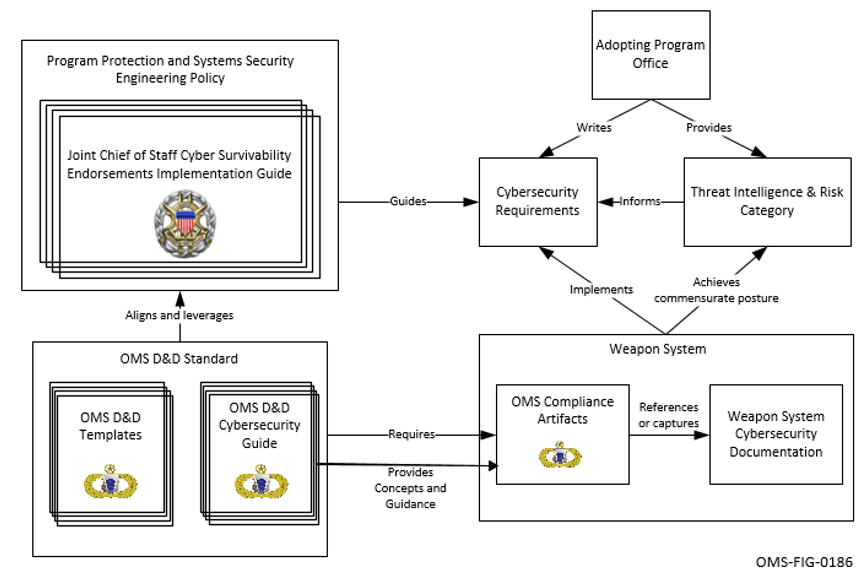

Open Mission Systems (OMS)

Definition And Documentation (D&D)

Mission Package Description Document (MPDD) Template

22 January 2026

Prepared By:

Open Architecture Collaborative Working Group (OACWG)

&lt;REQUIRED: Mission Package Description Document Title&gt;

&lt;OPTIONAL: Organizational Logo&gt;

&lt;REQUIRED: Date as DD Month YYYY&gt;

&lt;OPTIONAL: Other labeling as appropriate&gt;

Prepared by:

&lt;REQUIRED: Organization&gt;

&lt;OPTIONAL: Address&gt;

&lt;OPTIONAL: Approval Signatures&gt;

This page is intentionally left blank.

Abstract

Required: Insert program specific abstract summary details here.

Open Mission Systems (OMS) is a non-proprietary open architecture for
integrating subsystems and services into mission packages.

This Mission Package Description Document (MPDD) complies with the
Mission Package Description Document (MPDD) Template, OMSC-TMP-007,
Revision I, dated 22 January 2026.

The template is prescribed by the OMS Standard Version 2.5,
OMSC-STD-001, Revision M, dated 22 January 2026.

This page is intentionally left blank.

Revision Record

<table>
<thead>
<tr class="header">
<th>REVISION</th>
<th>DATE</th>
<th>DESCRIPTION</th>
</tr>
</thead>
<tbody>
<tr class="odd">
<td></td>
<td></td>
<td></td>
</tr>
</tbody>
</table>

This page is intentionally left blank.

Table of Contents

[1 Overview 1](#overview)

[1.1 References 1](#references)

[1.2 Mission Package Worksheet 1](#mission-package-worksheet)

[1.3 Mission Package Data Storage 2](#mission-package-data-storage)

[1.4 Mission Package Open Computing Environment (OCE)
2](#mission-package-open-computing-environment-oce)

[1.5 Mission Package External Interface
2](#mission-package-external-interface)

[2 Cybersecurity Posture 3](#cybersecurity-posture)

[2.1 Policy Overview 3](#policy-overview)

[2.2 CSRC 4](#csrc)

[2.3 Cyber Survivability Attributes (CSAs)
4](#cyber-survivability-attributes-csas)

[2.3.1 Prevent CSAs 4](#prevent-csas)

[2.3.1.1 Security Domain Definition 4](#security-domain-definition)

[2.3.1.2 Cybersecurity Flow Description
4](#cybersecurity-flow-description)

[2.3.1.3 Cybersecurity Confidentiality Implementation(s)
5](#cybersecurity-confidentiality-implementations)

[2.3.1.4 Cybersecurity Flow, Ports, and Protocols Restriction Policy
5](#cybersecurity-flow-ports-and-protocols-restriction-policy)

[2.3.1.5 Cybersecurity Identification & Authentication Implementation(s)
6](#cybersecurity-identification-authentication-implementations)

[2.3.1.6 Cybersecurity Access Controls
6](#cybersecurity-access-controls)

[2.3.1.6.1 Non-Streaming Data Transfer Access Controls
6](#non-streaming-data-transfer-access-controls)

[2.3.1.6.2 Streaming Data Transfer Access Controls
8](#streaming-data-transfer-access-controls)

[2.3.1.7 Cybersecurity Integrity Implementation(s)
9](#cybersecurity-integrity-implementations)

[2.3.2 Mitigate CSAs 9](#mitigate-csas)

[2.3.3 Recover CSA 9](#recover-csa)

[2.3.4 Adapt CSA 9](#adapt-csa)

[2.4 Cyber Survivability Rationale 9](#cyber-survivability-rationale)

[3 Security Addendum 10](#security-addendum)

[A Appendix A Acronyms and Abbreviations 11](#_Toc219294377)

[B Appendix B Glossary 13](#_Toc219294378)

This page is intentionally left blank.

List of Figures

[Figure 2.1-1 OMS Cybersecurity Guidance in Acquisition
3](#_Toc219294379)

[Figure 2.3-1 Security Domain Boundaries 4](#_Toc219294380)

[Figure 2.3-2 Non-Streaming Data Transfer Information Flow Diagram
5](#_Toc219294381)

[Figure 2.3-3 Streaming Data Transfer Information Flow Diagram
5](#_Toc219294382)

This page is intentionally left blank.

List of Tables

[Table 1.1-1 Reference Documents 1](#_Toc219294383)

[Table 1.2-1 Mission Package Worksheet 1](#_Toc219294384)

[Table 1.2-2 Units of Replaceability Within the Mission Package
Worksheet 1](#_Toc219294385)

[Table 1.3-1 Data Storage Allocation 2](#_Toc219294386)

[Table 1.4-1 Open Computing Environment 2](#_Toc219294387)

[Table 1.5-1 External Interface 2](#_Toc219294388)

[Table 2.2-1 Mission Package CSRC 4](#_Toc219294389)

[Table 2.3-1 Applicable System Survivability KPP Prevent CSAs
4](#_Toc219294390)

[Table 2.3-2 Non-Streaming Data Transfer Information Flow
5](#_Toc219294391)

[Table 2.3-3 Streaming Data Transfer Information Flow 5](#_Toc219294392)

[Table 2.3-4 Confidentiality Implementation 5](#_Toc219294393)

[Table 2.3-5 Ports and Protocol Enforcement Policy 6](#_Toc219294394)

[Table 2.3-6 Open Ports and Protocols 6](#_Toc219294395)

[Table 2.3-7 Product/Data and Data Transfer Servers 6](#_Toc219294396)

[Table 2.3-8 Data Transfer Protocol Identification & Authentication
6](#_Toc219294397)

[Table 2.3-9 Non-Streaming Data Transfer Access Control Policy
7](#_Toc219294398)

[Table 2.3-10 Streaming Data Transfer Access Control Policy
8](#_Toc219294399)

[Table 2.3-11 Integrity Implementation 9](#_Toc219294400)

[Table 2.3-12 Applicable System Survivability KPP Mitigate CSAs
9](#_Toc219294401)

[Table A.0-1 List of Acronyms and Abbreviation Definitions
11](#_Toc219294402)

[Table B.0-1 List of Term Definitions 13](#_Toc219294403)

This page is intentionally left blank.

Overview
========

Proprietary Notice: This document contains only non-proprietary
information. Referenced documents conform to the Proprietary Notice
statement for each major sub section. References to external documents
that provide for the data in this section (i.e., Section 1) refer only
to non-proprietary documents.

This section identifies the Units of Replaceability (UoRs), data
storage, and Open Computing Environment (OCE) of the Mission Package.

References
----------

Proprietary Notice: References to external documents that provide for
the data in this section may refer to proprietary documents.

This section lists all the referenced documents that are required to
support the integration of this Mission Package as shown in Table 1.1-1,
Reference Documents.

Table 1.1-1 Reference
Documents

<table>
<thead>
<tr class="header">
<th>Document Number</th>
<th>Document Title</th>
<th>Revision</th>
<th>Date</th>
</tr>
</thead>
<tbody>
<tr class="odd">
<td>OMSC-GDE-003</td>
<td>Cybersecurity Guide</td>
<td>D</td>
<td>22 January 2026</td>
</tr>
<tr class="even">
<td>OMSC-STD-001</td>
<td>OMS Standard Version 2.5</td>
<td>M</td>
<td>22 January 2026</td>
</tr>
<tr class="odd">
<td>OMSC-TMP-007</td>
<td>Mission Package Description Document (MPDD) Template</td>
<td>I</td>
<td>22 January 2026</td>
</tr>
<tr class="even">
<td>N/A</td>
<td>Cyber Survivability Endorsement Implementation Guide (CSEIG)</td>
<td>Version 3</td>
<td>July 2022</td>
</tr>
</tbody>
</table>

Mission Package Worksheet
-------------------------

This section identifies the UoRs of the Mission Package by referencing
the version of the Mission Package Worksheet (MPW) identified in Table
1.2-1, Mission Package Worksheet, and UoRs identified in Table 1.2-2,
Units of Replaceability Within the Mission Package Worksheet.

Table 1.2-1 Mission
Package Worksheet

<table>
<thead>
<tr class="header">
<th>Document Title</th>
<th>Document Number</th>
</tr>
</thead>
<tbody>
<tr class="odd">
<td></td>
<td></td>
</tr>
</tbody>
</table>

Table 1.2-2 Units of
Replaceability Within the Mission Package Worksheet

<table>
<thead>
<tr class="header">
<th>Name of UoR</th>
<th>Document Title</th>
<th>Document Number</th>
</tr>
</thead>
<tbody>
<tr class="odd">
<td></td>
<td></td>
<td></td>
</tr>
</tbody>
</table>

Mission Package Data Storage
----------------------------

This section identifies where Subsystems, Services, and Isolators store
files and subdirectories on a Platform or Subsystem and the capacities
available to each Subsystem, Services, and Isolators as shown in Table
1.3-1, Data Storage Allocation.

Table 1.3-1 Data Storage
Allocation

<table>
<thead>
<tr class="header">
<th>Subsystem/Service/Isolator</th>
<th>Data Store Label</th>
<th>Data Store Address</th>
<th>Storage Allocation</th>
<th>Data Transfer Protocol(s)</th>
</tr>
</thead>
<tbody>
<tr class="odd">
<td></td>
<td></td>
<td></td>
<td></td>
<td></td>
</tr>
</tbody>
</table>

Mission Package Open Computing Environment (OCE)
------------------------------------------------

This section identifies where Open Computing Environments exist within
the Mission Package as shown in Table 1.4-1, Open Computing Environment.

Table 1.4-1 Open
Computing Environment

<table>
<thead>
<tr class="header">
<th>Platform/Subsystem</th>
<th>H/W</th>
<th>Linux</th>
<th>Java</th>
<th>Virtualization</th>
</tr>
</thead>
<tbody>
<tr class="odd">
<td>Platform</td>
<td></td>
<td></td>
<td></td>
<td></td>
</tr>
</tbody>
</table>

Mission Package External Interface
----------------------------------

This section identifies the documentation for the external interface of
the Mission Package as shown in Table 1.5-1, External Interface.

Table 1.5-1 External
Interface

<table>
<thead>
<tr class="header">
<th>Document Number</th>
<th>Document Title</th>
</tr>
</thead>
<tbody>
<tr class="odd">
<td></td>
<td></td>
</tr>
</tbody>
</table>

Cybersecurity Posture
=====================

Proprietary Notice: References to external documents that provide for
the data in this section refer only to non-proprietary documents.

This section identifies the cybersecurity posture of the Mission
Package.

Policy Overview
---------------

The OMS Cybersecurity Guide, OMSC-GDE-003, provides concepts and
guidance to complete OMS compliance documentation. These documents can
be used as part of a Program Protection and Systems Security Engineering
(SSE) process and incorporate concepts provided by the Joint Chiefs of
Staff (JCS) Cyber Survivability Endorsements Implementation Guide
(CSEIG). OMS documentation helps fill the gap when no external
cybersecurity requirements are present, and provides flexibility to
reference external documents when a system-level cybersecurity process
with requirements is in place. The role of OMS Cybersecurity in the SSE
process is therefore to reference or provide relevant information to
support the Adopting Program and system designers in addressing
cybersecurity requirements as shown in Figure 2.1-1. The OMS
Cybersecurity is a component of the overall cybersecurity accreditation
of the weapon system.

Figure 2.1-1 OMS
Cybersecurity Guidance in Acquisition

CSRC
----

This identifies the CSRC for the Mission Package as shown in Table 2.2-1
Mission Package CSRC.

Table 2.2-1 Mission
Package CSRC

<table>
<thead>
<tr class="header">
<th>CSRC 1</th>
<th>CSRC 2</th>
<th>CSRC 3</th>
<th>CSRC 4</th>
<th>CSRC 5</th>
</tr>
</thead>
<tbody>
<tr class="odd">
<td></td>
<td></td>
<td></td>
<td></td>
<td></td>
</tr>
</tbody>
</table>

Cyber Survivability Attributes (CSAs)
-------------------------------------

This section identifies the CSAs applicable to the Mission Package.

### Prevent CSAs

This section identifies and documents the System Survivability Key
Performance Parameters (KPPs) Prevent CSAs implementation for the
Mission Package. Table 2.3-1 identifies the System Survivability KPP
Prevent CSAs applicable to the Mission Package.

Table 2.3-1 Applicable
System Survivability KPP Prevent CSAs

<table>
<thead>
<tr class="header">
<th>CSA-01</th>
<th>CSA-02</th>
<th>CSA-03</th>
<th>CSA-04</th>
<th>CSA-05</th>
<th>CSA-06</th>
</tr>
</thead>
<tbody>
<tr class="odd">
<td></td>
<td></td>
<td></td>
<td></td>
<td></td>
<td></td>
</tr>
</tbody>
</table>

#### Security Domain Definition

This section describes the cybersecurity policies and configurations
implemented in the Mission Package.

Figure 2.3-1, Security Domain Boundaries, is a representation of the
security domains for a platform. It provides a reference for how the
network described in the PDD is connected to Subsystems which may have
single or multiple security domains.

&lt;&lt;INSERT FIGURE HERE. SEE ACCOMPANYING INSTRUCTIONS FOR AN
EXAMPLE&gt;&gt;

Figure 2.3-1 Security
Domain Boundaries

#### Cybersecurity Flow Description

This section describes the cybersecurity policies for flow control as
implemented in this Mission Package.

Figure 2.3-2, Non-Streaming Data Transfer Information Flow Diagram,
identifies the server and clients.

&lt;&lt;INSERT FIGURE HERE. SEE ACCOMPANYING INSTRUCTIONS FOR AN
EXAMPLE&gt;&gt;

Figure 2.3-2
Non-Streaming Data Transfer Information Flow Diagram

Table 2.3-2, Non-Streaming Data Transfer Information Flow, identifies
the actors and the information being sent in the flow described.

Table 2.3-2 Non-Streaming
Data Transfer Information Flow

<table>
<thead>
<tr class="header">
<th>Ref #</th>
<th>Actor A (Server)</th>
<th>Actor B (Client)</th>
<th>Information Item</th>
<th>Security Domain(s)</th>
</tr>
</thead>
<tbody>
<tr class="odd">
<td></td>
<td></td>
<td></td>
<td></td>
<td></td>
</tr>
</tbody>
</table>

Figure 2.3-3, Streaming Data Transfer Information Flow Diagram,
identifies the producer and consumers.

&lt;&lt;INSERT FIGURE HERE. SEE ACCOMPANYING INSTRUCTIONS FOR AN
EXAMPLE&gt;&gt;

Figure 2.3-3 Streaming
Data Transfer Information Flow Diagram

Table 2.3-3, Streaming Data Transfer Information Flow, identifies the
actors and the information being sent in the flow described.

Table 2.3-3 Streaming
Data Transfer Information Flow

<table>
<thead>
<tr class="header">
<th>Ref #</th>
<th>Actor A (Producer)</th>
<th>Actor B (Consumer)</th>
<th>Information Item</th>
<th>Security Domain(s)</th>
</tr>
</thead>
<tbody>
<tr class="odd">
<td></td>
<td></td>
<td></td>
<td></td>
<td></td>
</tr>
</tbody>
</table>

#### Cybersecurity Confidentiality Implementation(s)

This section describes the implemented mechanism(s) used to ensure
confidentiality of information in the Mission Packages as shown in Table
2.3-4, Confidentiality Implementation.

Table 2.3-4
Confidentiality Implementation

<table>
<thead>
<tr class="header">
<th>Information Flow</th>
<th>Outside of Mission Package</th>
<th>Ports and Protocols Restriction</th>
<th>
Restriction

Mechanism
</th>
<th>Implementation Summary</th>
</tr>
</thead>
<tbody>
<tr class="odd">
<td></td>
<td></td>
<td></td>
<td></td>
<td></td>
</tr>
</tbody>
</table>

#### Cybersecurity Flow, Ports, and Protocols Restriction Policy

This section documents the cybersecurity policies for restricting
information flows, ports, and protocols as implemented in this Mission
Package.

Table 2.3-5, Ports and Protocol Enforcement Policy, summarizes the
information flow policy and restriction of ports and protocols.

Table 2.3-5 Ports and
Protocol Enforcement Policy

<table>
<thead>
<tr class="header">
<th>Enforcement Component</th>
<th>Controlled Flows</th>
<th>Port and Protocol Restrictions</th>
<th>Restriction Method</th>
<th>Implementation Summary</th>
</tr>
</thead>
<tbody>
<tr class="odd">
<td></td>
<td></td>
<td></td>
<td></td>
<td></td>
</tr>
</tbody>
</table>

Table 2.3-6, Open Ports and Protocols, summarizes the open ports and
protocols on the Mission Package.

Table 2.3-6 Open Ports
and Protocols

<table>
<thead>
<tr class="header">
<th>Port (TCP/UDP)</th>
<th>Protocol</th>
<th>Process/Service</th>
<th>Address</th>
<th>Purpose</th>
<th>Restriction Mechanism</th>
</tr>
</thead>
<tbody>
<tr class="odd">
<td></td>
<td></td>
<td></td>
<td></td>
<td></td>
<td></td>
</tr>
</tbody>
</table>

Table 2.3-7, Product/Data and Data Transfer Servers, identifies the
products being sent or received by the Data Transfer server.

Table 2.3-7 Product/Data
and Data Transfer Servers

<table>
<thead>
<tr class="header">
<th>Client Address</th>
<th>Product/Data</th>
<th>Format</th>
<th>Send/Receive</th>
<th>Data Transfer Server</th>
</tr>
</thead>
<tbody>
<tr class="odd">
<td></td>
<td></td>
<td></td>
<td></td>
<td></td>
</tr>
</tbody>
</table>

#### Cybersecurity Identification & Authentication Implementation(s)

This section documents the mechanism(s) used to identify Platform,
Subsystems, Services, and Isolators as implemented as shown in Table
2.3-8, Data Transfer Protocol Identification & Authentication.

Table 2.3-8 Data Transfer
Protocol Identification & Authentication

<table>
<thead>
<tr class="header">
<th>Data Transfer Server</th>
<th>Anonymous Login (Yes/No)</th>
<th>Client Identification</th>
<th>Authentication Mechanism</th>
</tr>
</thead>
<tbody>
<tr class="odd">
<td></td>
<td></td>
<td></td>
<td></td>
</tr>
</tbody>
</table>

#### Cybersecurity Access Controls

This section describes the cybersecurity policies for access control as
implemented in this Mission Package.

##### Non-Streaming Data Transfer Access Controls

This section documents the access control policy in place for the data
transfer within the Mission Package as shown in Table 2.3-9,
Non-Streaming Data Transfer Access Control Policy.

Table 2.3-9 Non-Streaming
Data Transfer Access Control Policy

<table>
<thead>
<tr class="header">
<th>Data Flow</th>
<th>Server</th>
<th>Client</th>
<th>Permissions</th>
<th>Information Item (Product/Data)</th>
<th>Implementation Summary</th>
</tr>
</thead>
<tbody>
<tr class="odd">
<td></td>
<td></td>
<td></td>
<td></td>
<td></td>
<td></td>
</tr>
</tbody>
</table>

##### Streaming Data Transfer Access Controls

This section describes the streaming data flows and the mechanism that
is used to initiate the start of the streaming data transfer as shown in
Table 2.3-10, Streaming Data Transfer Access Control Policy.

Table 2.3-10 Streaming
Data Transfer Access Control Policy

<table>
<thead>
<tr class="header">
<th>Data Flow</th>
<th>Producer</th>
<th>Consumer</th>
<th>Permissions</th>
<th>Information Item (Product/Data)</th>
<th>Implementation Summary</th>
</tr>
</thead>
<tbody>
<tr class="odd">
<td></td>
<td></td>
<td></td>
<td></td>
<td></td>
<td></td>
</tr>
</tbody>
</table>

#### Cybersecurity Integrity Implementation(s)

This section documents the implemented mechanism(s) used to ensure
integrity of data in the Mission Package as shown in Table 2.3-11,
Integrity Implementation.

Table 2.3-11 Integrity
Implementation

<table>
<thead>
<tr class="header">
<th>Information Flow</th>
<th>Outside of Mission Package</th>
<th>Integrity Mechanism</th>
<th>Implementation Summary</th>
</tr>
</thead>
<tbody>
<tr class="odd">
<td></td>
<td></td>
<td></td>
<td></td>
</tr>
</tbody>
</table>

### Mitigate CSAs

This section identifies and documents the System Survivability KPP
Mitigate CSAs implementation for the Mission Package. Table 2.3-12
identifies the System Survivability KPP Mitigate CSAs applicable to the
Mission Package.

Table 2.3-12 Applicable
System Survivability KPP Mitigate CSAs

<table>
<thead>
<tr class="header">
<th>CSA-07</th>
<th>CSA-08</th>
</tr>
</thead>
<tbody>
<tr class="odd">
<td></td>
<td></td>
</tr>
</tbody>
</table>

### Recover CSA

This section identifies and documents the System Survivability KPP
Recover CSA implementation for the Mission Package.

### Adapt CSA

This section identifies and documents the System Survivability KPP Adapt
CSA implementation for the Mission Package.

Cyber Survivability Rationale
-----------------------------

This subsection describes Cyber Survivability rationale.

Security Addendum
=================

Proprietary Notice: The Security Addendum reference in this section is a
non-proprietary document. The Security addendum may contain references
to external documents that may be proprietary.

This section identifies the Security Addendum document(s).

Appendix A Acronyms and Abbreviations
=====================================

This section lists the abbreviations and acronyms used in this document
not a copy of the OMS lexicon as shown in Table A.0-1, List of Acronyms
and Abbreviation Definitions.

Table A.0-1 List of
Acronyms and Abbreviation Definitions

<table>
<thead>
<tr class="header">
<th>Acronym/Abbreviation</th>
<th>Definition</th>
</tr>
</thead>
<tbody>
<tr class="odd">
<td>CSA</td>
<td>Cyber Survivability Attribute</td>
</tr>
<tr class="even">
<td>KPP</td>
<td>Key Performance Parameter</td>
</tr>
<tr class="odd">
<td>OACWG</td>
<td>Open Architecture Collaborative Working Group</td>
</tr>
<tr class="even">
<td>OCE</td>
<td>Open Computing Environment</td>
</tr>
<tr class="odd">
<td>OMS</td>
<td>Open Mission Systems</td>
</tr>
</tbody>
</table>

This page is intentionally left blank.

Appendix B Glossary
===================

This section lists the terms used in this document as shown in Table
B.0-1, List of Term Definitions.

Table B.0-1 List of Term
Definitions

<table>
<thead>
<tr class="header">
<th>Term</th>
<th>Definition</th>
</tr>
</thead>
<tbody>
<tr class="odd">
<td></td>
<td></td>
</tr>
</tbody>
</table>
