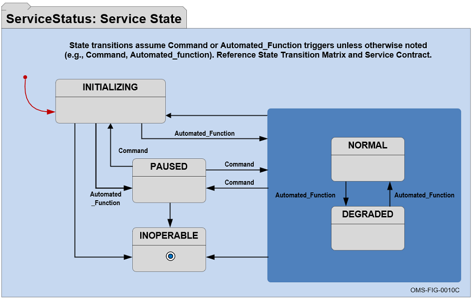
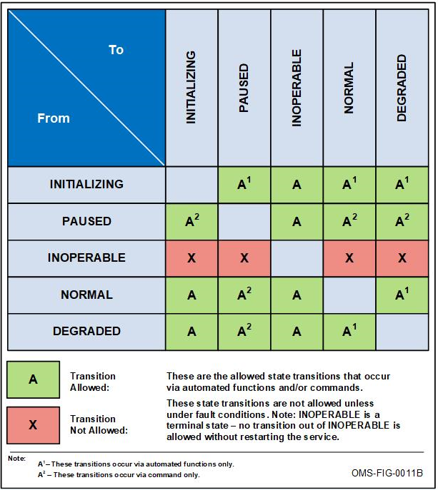
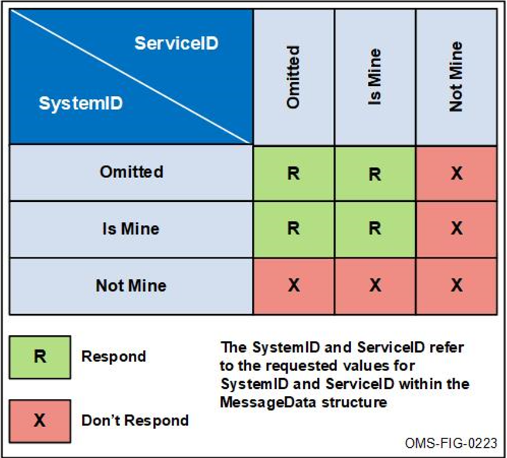
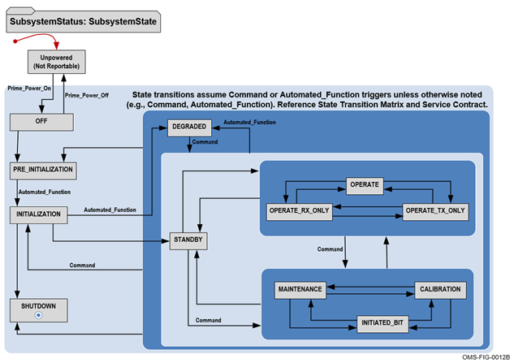
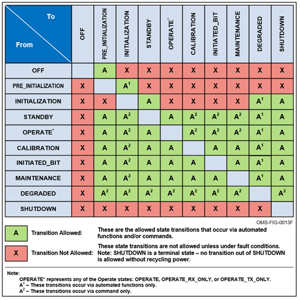
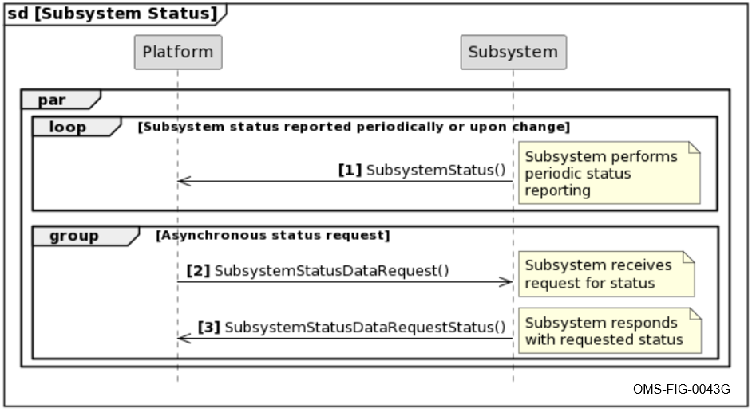
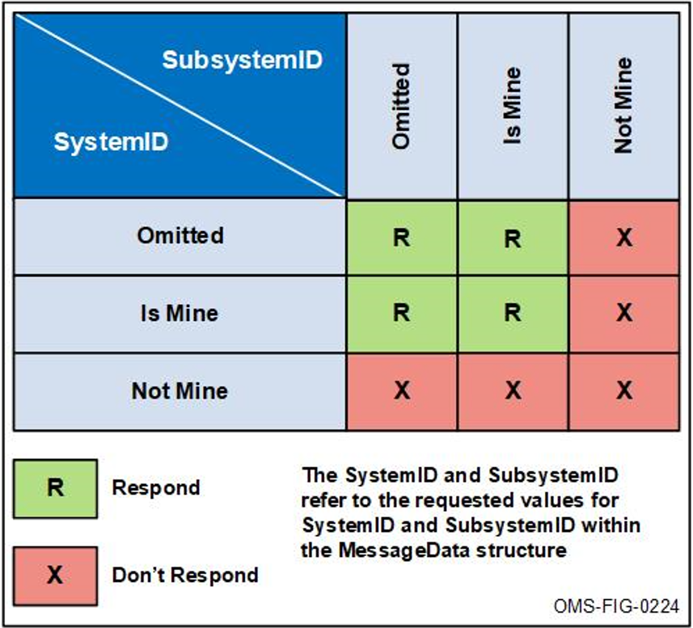

Open Mission Systems (OMS)

Definition And Documentation (D&D)

Service Contract Template

22 january 2026

Prepared By:

Open Architecture Collaborative Working Group (OACWG)

&lt;REQUIRED: Service Contract Title&gt;

&lt;OPTIONAL: Organizational Logo&gt;

&lt;REQUIRED: Date as DD Month YYYY&gt;

&lt;OPTIONAL: Other labeling as appropriate&gt;

Prepared by:

&lt;REQUIRED: Organization&gt;

&lt;OPTIONAL: Address&gt;

&lt;OPTIONAL: Approval Signatures&gt;

This page is intentionally left blank.

Abstract

Required: Insert program specific abstract summary details here for the
OMS Subsystem, Service, or Isolator.

Open Mission Systems (OMS) is a non-proprietary open architecture for
integrating subsystems and services into mission packages.

This Service Contract complies with the Service Contract Template,
OMSC-TMP-003, Revision M, dated 22 January 2026.

The template is prescribed by the OMS Standard Version 2.5,
OMSC-STD-001, Revision M, dated 22 January 2026.

This page is intentionally left blank.

Revision Record

<table>
<thead>
<tr class="header">
<th>REVISION</th>
<th>DATE</th>
<th>DESCRIPTION</th>
</tr>
</thead>
<tbody>
<tr class="odd">
<td></td>
<td></td>
<td></td>
</tr>
</tbody>
</table>

This page is intentionally left blank.

Table of Contents

[1 Overview 1](#overview)

[1.1 References 1](#references)

[1.2 OMS Environment Specifications 1](#oms-environment-specifications)

[1.2.1 Externalizer Specifications 2](#externalizer-specifications)

[1.2.2 CAL Operational Attributes 2](#cal-operational-attributes)

[1.3 Classification 2](#classification)

[1.4 Known Limitations 3](#known-limitations)

[1.5 System Requirements 3](#system-requirements)

[1.5.1 Hardware Requirements 3](#hardware-requirements)

[1.5.2 Operating Systems 3](#operating-systems)

[1.6 Data Transfer 3](#data-transfer)

[1.6.1 Data Items for OMS Data Transfer
3](#data-items-for-oms-data-transfer)

[1.6.2 Data Items for Non-OMS Data Transfer
5](#data-items-for-non-oms-data-transfer)

[1.6.3 Data Transfer Configuration 7](#data-transfer-configuration)

[1.6.4 Data Transfer Ports and Protocols
9](#data-transfer-ports-and-protocols)

[1.6.5 Data Transfer Confidentiality Mechanisms
11](#data-transfer-confidentiality-mechanisms)

[1.6.6 Data Transfer Integrity Mechanisms
11](#data-transfer-integrity-mechanisms)

[1.6.7 Data Transfer Boundary Protection Mechanisms
11](#data-transfer-boundary-protection-mechanisms)

[1.6.8 Data Transfer Failure Behaviors
11](#data-transfer-failure-behaviors)

[1.7 Data Storage 11](#data-storage)

[1.8 External Data Dependencies 11](#external-data-dependencies)

[1.8.1 Configuration 12](#configuration)

[1.9 Additional Prerequisites 12](#additional-prerequisites)

[1.9.1 Dependencies 12](#dependencies)

[1.9.2 Licenses 12](#licenses)

[1.10 Service Level Agreements 12](#service-level-agreements)

[1.10.1 Capacity/Performance 12](#capacityperformance)

[1.10.2 Handling Time Characteristics
12](#handling-time-characteristics)

[1.10.3 Availability Category 13](#availability-category)

[1.11 Special Signals 13](#special-signals)

[2 Lifecycle Management 14](#lifecycle-management)

[2.1 Packaging and Deployment 14](#packaging-and-deployment)

[2.2 Initialization 14](#initialization)

[2.3 Restart 14](#restart)

[2.4 Shutdown 14](#shutdown)

[3 Functions 15](#functions)

[3.1 Required Service Functions 17](#required-service-functions)

[3.1.1 Service Initialization 17](#service-initialization)

[3.1.1.1 Service Initialization Description
17](#service-initialization-description)

[3.1.1.2 Service Initialization Preconditions
17](#service-initialization-preconditions)

[3.1.1.3 Service Initialization Reporting Interval
17](#service-initialization-reporting-interval)

[3.1.1.4 Service Initialization Inputs and Outputs
18](#service-initialization-inputs-and-outputs)

[3.1.1.5 Service Initialization Workflow and Orchestration
19](#service-initialization-workflow-and-orchestration)

[3.1.1.6 Service Initialization Post Conditions
19](#service-initialization-post-conditions)

[3.1.1.7 Service Initialization Error Handling
19](#service-initialization-error-handling)

[3.1.2 Service Status 19](#service-status)

[3.1.2.1 Service Status Description 19](#service-status-description)

[3.1.2.2 Service Status Preconditions 19](#service-status-preconditions)

[3.1.2.3 Service Status Reporting Interval
19](#service-status-reporting-interval)

[3.1.2.4 Service Status Inputs and Outputs
20](#service-status-inputs-and-outputs)

[3.1.2.5 Service Status Workflow and Orchestration
21](#service-status-workflow-and-orchestration)

[3.1.2.5.1 Allowed States and Transitions
21](#allowed-states-and-transitions)

[3.1.2.5.2 Service Status Sequence Diagram
22](#service-status-sequence-diagram)

[3.1.2.6 Service Status Post Conditions
24](#service-status-post-conditions)

[3.1.2.7 Service Status Error Handling
24](#service-status-error-handling)

[3.2 Required Subsystem Functions 24](#required-subsystem-functions)

[3.2.1 Subsystem Startup 24](#subsystem-startup)

[3.2.1.1 Subsystem Startup Description
24](#subsystem-startup-description)

[3.2.1.2 Subsystem Startup Preconditions
24](#subsystem-startup-preconditions)

[3.2.1.3 Subsystem Startup Reporting Interval
24](#subsystem-startup-reporting-interval)

[3.2.1.4 Subsystem Startup Inputs and Outputs
25](#subsystem-startup-inputs-and-outputs)

[3.2.1.5 Subsystem Startup Workflow and Orchestration
26](#subsystem-startup-workflow-and-orchestration)

[3.2.1.6 Subsystem Startup Post Conditions
26](#subsystem-startup-post-conditions)

[3.2.1.7 Subsystem Startup Error Handling
26](#subsystem-startup-error-handling)

[3.2.2 Subsystem Status 26](#subsystem-status)

[3.2.2.1 Subsystem Status Description 26](#subsystem-status-description)

[3.2.2.2 Subsystem Status Preconditions
26](#subsystem-status-preconditions)

[3.2.2.3 Subsystem Status Reporting Interval
26](#subsystem-status-reporting-interval)

[3.2.2.4 Subsystem Status Inputs and Outputs
27](#subsystem-status-inputs-and-outputs)

[3.2.2.5 Subsystem Status Workflow and Orchestration
28](#subsystem-status-workflow-and-orchestration)

[3.2.2.5.1 Allowed States and Transitions
28](#allowed-states-and-transitions-1)

[3.2.2.5.2 Subsystem Status Sequence Diagram
30](#subsystem-status-sequence-diagram)

[3.2.2.6 Subsystem Status Post Conditions
31](#subsystem-status-post-conditions)

[3.2.2.7 Subsystem Status Error Handling
31](#subsystem-status-error-handling)

[3.2.3 Subsystem State Command Processing
31](#subsystem-state-command-processing)

[3.2.3.1 Subsystem State Command Processing Description
31](#subsystem-state-command-processing-description)

[3.2.3.2 Subsystem State Command Processing Preconditions
31](#subsystem-state-command-processing-preconditions)

[3.2.3.3 Subsystem State Command Processing Reporting Interval
31](#subsystem-state-command-processing-reporting-interval)

[3.2.3.4 Subsystem State Command Processing Inputs and Outputs
32](#subsystem-state-command-processing-inputs-and-outputs)

[3.2.3.5 Subsystem State Command Processing Workflow and Orchestration
33](#subsystem-state-command-processing-workflow-and-orchestration)

[3.2.3.6 Subsystem State Command Processing Post Conditions
33](#subsystem-state-command-processing-post-conditions)

[3.2.3.7 Subsystem State Command Processing Error Handling
33](#subsystem-state-command-processing-error-handling)

[3.2.4 Subsystem Built-In Test (BIT) 33](#subsystem-built-in-test-bit)

[3.2.4.1 Subsystem BIT Description 33](#subsystem-bit-description)

[3.2.4.2 Subsystem BIT Preconditions 33](#subsystem-bit-preconditions)

[3.2.4.3 Subsystem BIT Reporting Interval
34](#subsystem-bit-reporting-interval)

[3.2.4.4 Subsystem BIT Inputs and Outputs
35](#subsystem-bit-inputs-and-outputs)

[3.2.4.5 Subsystem BIT Workflow and Orchestration
36](#subsystem-bit-workflow-and-orchestration)

[3.2.4.6 Subsystem BIT Post Conditions
36](#subsystem-bit-post-conditions)

[3.2.4.7 Subsystem BIT Error Handling 36](#subsystem-bit-error-handling)

[3.2.5 Subsystem Calibration 36](#subsystem-calibration)

[3.2.5.1 Subsystem Calibration Description
36](#subsystem-calibration-description)

[3.2.5.2 Subsystem Calibration Preconditions
36](#subsystem-calibration-preconditions)

[3.2.5.3 Subsystem Calibration Reporting Interval
36](#subsystem-calibration-reporting-interval)

[3.2.5.4 Subsystem Calibration Inputs and Outputs
37](#subsystem-calibration-inputs-and-outputs)

[3.2.5.5 Subsystem Calibration Workflow and Orchestration
38](#subsystem-calibration-workflow-and-orchestration)

[3.2.5.6 Subsystem Calibration Post Conditions
38](#subsystem-calibration-post-conditions)

[3.2.5.7 Subsystem Calibration Error Handling
38](#subsystem-calibration-error-handling)

[3.2.6 Subsystem Shutdown 38](#subsystem-shutdown)

[3.2.6.1 Subsystem Shutdown Description
38](#subsystem-shutdown-description)

[3.2.6.2 Subsystem Shutdown Preconditions
38](#subsystem-shutdown-preconditions)

[3.2.6.3 Subsystem Shutdown Reporting Interval
38](#subsystem-shutdown-reporting-interval)

[3.2.6.4 Subsystem Shutdown Inputs and Outputs
39](#subsystem-shutdown-inputs-and-outputs)

[3.2.6.5 Subsystem Shutdown Workflow and Orchestration
40](#subsystem-shutdown-workflow-and-orchestration)

[3.2.6.6 Subsystem Shutdown Post Conditions
40](#subsystem-shutdown-post-conditions)

[3.2.6.7 Subsystem Shutdown Error Handling
40](#subsystem-shutdown-error-handling)

[3.3 Required Capability-related Functions
40](#required-capability-related-functions)

[3.3.1 Position Information Processing
40](#position-information-processing)

[3.3.1.1 Position Information Processing Description
40](#position-information-processing-description)

[3.3.1.2 Position Information Processing Preconditions
40](#position-information-processing-preconditions)

[3.3.1.3 Position Information Processing Reporting Interval
40](#position-information-processing-reporting-interval)

[3.3.1.4 Position Information Processing Inputs and Outputs
41](#position-information-processing-inputs-and-outputs)

[3.3.1.5 Position Information Processing Workflow and Orchestration
42](#position-information-processing-workflow-and-orchestration)

[3.3.1.6 Position Information Processing Post Conditions
42](#position-information-processing-post-conditions)

[3.3.1.7 Position Information Processing Error Handling
42](#position-information-processing-error-handling)

[3.3.2 \[CapabilityName\] Capability-related Functions
42](#capabilityname-capability-related-functions)

[3.3.2.1 \[CapabilityName\] Capability and Capability Status
42](#capabilityname-capability-and-capability-status)

[3.3.2.1.1 \[CapabilityName\] Capability and Capability Status
Description
42](#capabilityname-capability-and-capability-status-description)

[3.3.2.1.2 \[CapabilityName\] Capability and Capability Status
Preconditions
42](#capabilityname-capability-and-capability-status-preconditions)

[3.3.2.1.3 \[CapabilityName\] Capability and Capability Status Reporting
Interval
42](#capabilityname-capability-and-capability-status-reporting-interval)

[3.3.2.1.4 \[CapabilityName\] Capability and Capability Status Inputs
and Outputs
43](#capabilityname-capability-and-capability-status-inputs-and-outputs)

[3.3.2.1.5 \[CapabilityName\] Capability and Capability Status Workflow
and Orchestration
44](#capabilityname-capability-and-capability-status-workflow-and-orchestration)

[3.3.2.1.6 \[CapabilityName\] Capability and Capability Status Post
Conditions
44](#capabilityname-capability-and-capability-status-post-conditions)

[3.3.2.1.7 \[CapabilityName\] Capability and Capability Status Error
Handling
44](#capabilityname-capability-and-capability-status-error-handling)

[3.3.2.2 \[CapabilityName\] Capability Enable/Disable
44](#capabilityname-capability-enabledisable)

[3.3.2.2.1 \[CapabilityName\] Capability Enable/Disable Description
44](#capabilityname-capability-enabledisable-description)

[3.3.2.2.2 \[CapabilityName\] Capability Enable/Disable Preconditions
44](#capabilityname-capability-enabledisable-preconditions)

[3.3.2.2.3 \[CapabilityName\] Capability Enable/Disable Reporting
Interval
44](#capabilityname-capability-enabledisable-reporting-interval)

[3.3.2.2.4 \[CapabilityName\] Capability Enable/Disable Inputs and
Outputs 45](#capabilityname-capability-enabledisable-inputs-and-outputs)

[3.3.2.2.5 \[CapabilityName\] Capability Enable/Disable Workflow and
Orchestration
46](#capabilityname-capability-enabledisable-workflow-and-orchestration)

[3.3.2.2.6 \[CapabilityName\] Capability Enable/Disable Post Conditions
46](#capabilityname-capability-enabledisable-post-conditions)

[3.3.2.2.7 \[CapabilityName\] Capability Enable/Disable Error Handling
46](#capabilityname-capability-enabledisable-error-handling)

[3.3.2.3 \[CapabilityName\] Capability Operations
46](#capabilityname-capability-operations)

[3.3.2.3.1 \[CapabilityName\] Capability Operations Description
46](#capabilityname-capability-operations-description)

[3.3.2.3.2 \[CapabilityName\] Capability Operations Preconditions
46](#capabilityname-capability-operations-preconditions)

[3.3.2.3.3 \[CapabilityName\] Capability Operations Reporting Interval
46](#capabilityname-capability-operations-reporting-interval)

[3.3.2.3.4 \[CapabilityName\] Capability Operations Inputs and Outputs
47](#capabilityname-capability-operations-inputs-and-outputs)

[3.3.2.3.5 \[CapabilityName\] Capability Operations Workflow and
Orchestration
48](#capabilityname-capability-operations-workflow-and-orchestration)

[3.3.2.3.6 \[CapabilityName\] Capability Operations Post Conditions
48](#capabilityname-capability-operations-post-conditions)

[3.3.2.3.7 \[CapabilityName\] Capability Operations Error Handling
48](#capabilityname-capability-operations-error-handling)

[3.4 Specific Functions 48](#specific-functions)

[3.4.1 \[FunctionName\] 48](#functionname)

[3.4.1.1 \[FunctionName\] Description 48](#functionname-description)

[3.4.1.2 \[FunctionName\] Preconditions 48](#functionname-preconditions)

[3.4.1.3 \[FunctionName\] Reporting Interval
48](#functionname-reporting-interval)

[3.4.1.4 \[FunctionName\] Inputs and Outputs
49](#functionname-inputs-and-outputs)

[3.4.1.5 \[FunctionName\] Workflow and Orchestration
50](#functionname-workflow-and-orchestration)

[3.4.1.6 \[FunctionName\] Post Conditions
50](#functionname-post-conditions)

[3.4.1.7 \[FunctionName\] Error Handling
50](#functionname-error-handling)

[4 Non-OMS Messages 51](#non-oms-messages)

[5 Change Request Identification 52](#change-request-identification)

[6 Cybersecurity Posture 53](#cybersecurity-posture)

[6.1 Cyber Survivability Attributes (CSAs)
53](#cyber-survivability-attributes-csas)

[6.1.1 Prevent CSAs 53](#prevent-csas)

[6.1.2 Mitigate CSAs 53](#mitigate-csas)

[6.1.3 Recover CSA 53](#recover-csa)

[6.1.4 Adapt CSA 53](#adapt-csa)

[7 Security Addendum 54](#security-addendum)

[A Appendix A Acronyms and Abbreviations
55](#appendix-a-acronyms-and-abbreviations)

[B Appendix B Glossary 56](#appendix-b-glossary)

[C Appendix C Message Details 57](#appendix-c-message-details)

List of Figures

[Figure 3.1-1 Service Status State Diagram 21](#_Toc219295723)

[Figure 3.1-2 Allowed Service State Transitions 22](#_Toc219295724)

[Figure 3.1-3 Service Status Sequence Diagram 23](#_Toc219295725)

[Figure 3.1-4 Service Status Data Request Response Rules
23](#_Toc219295726)

[Figure 3.2-1 Subsystem Status State Diagram 28](#_Toc219295727)

[Figure 3.2-2 Allowed Subsystem State Transitions 29](#_Toc219295728)

[Figure 3.2-3 Subsystem Status Sequence Diagram 30](#_Toc219295729)

[Figure 3.2-4 Subsystem Status Data Request Response Rules
31](#_Toc219295730)

This page is intentionally left blank.

List of Tables

[Table 1.1-1 Reference Documents 1](#_Toc219295731)

[Table 1.2-1 Environment Specifications 1](#_Toc219295732)

[Table 1.2-2 OMS Message Set 1](#_Toc219295733)

[Table 1.2-3 Externalizer Version Information 2](#_Toc219295734)

[Table 1.2-4 SOAC-1 2](#_Toc219295735)

[Table 1.5-1 Hardware Requirements 3](#_Toc219295736)

[Table 1.5-2 Compatible Operating Systems 3](#_Toc219295737)

[Table 1.6-1 Data Items for OMS Data Transfer 4](#_Toc219295738)

[Table 1.6-2 Data Items for Non-OMS Data Transfer 6](#_Toc219295739)

[Table 1.6-3 Data Transfer Configuration 8](#_Toc219295740)

[Table 1.6-4 Open Ports and Protocols 10](#_Toc219295741)

[Table 1.6-5 Data Transfer Confidentiality 11](#_Toc219295742)

[Table 1.6-6 Data Transfer Integrity 11](#_Toc219295743)

[Table 1.9-1 Dependencies 12](#_Toc219295744)

[Table 1.9-2 Licenses 12](#_Toc219295745)

[Table 1.11-1 OMS Special Signals 13](#_Toc219295746)

[Table 1.11-2 Non-OMS Special Signals 13](#_Toc219295747)

[Table 3.0-1 Function List 15](#_Toc219295748)

[Table 3.1-1 Service Initialization Inputs and Outputs
18](#_Toc219295749)

[Table 3.1-2 Service Status Inputs and Outputs 20](#_Toc219295750)

[Table 3.2-1 Subsystem Startup Inputs and Outputs 25](#_Toc219295751)

[Table 3.2-2 Subsystem Status Inputs and Outputs 27](#_Toc219295752)

[Table 3.2-3 Subsystem State Command Processing Inputs and Outputs
32](#_Toc219295753)

[Table 3.2-4 Subsystem BIT Inputs and Outputs 35](#_Toc219295754)

[Table 3.2-5 Subsystem Calibration Inputs and Outputs
37](#_Toc219295755)

[Table 3.2-6 Subsystem Shutdown Inputs and Outputs 39](#_Toc219295756)

[Table 3.3-1 Position Information Processing Inputs and Outputs
41](#_Toc219295757)

[Table 3.3-2 \[CapabilityName\] Capability and Capability Status Inputs
and Outputs 43](#_Toc219295758)

[Table 3.3-3 \[CapabilityName\] Capability Enable/Disable Inputs and
Outputs 45](#_Toc219295759)

[Table 3.3-4 \[CapabilityName\] Capability Operations Inputs and Outputs
47](#_Toc219295760)

[Table 3.4-1 \[FunctionName\] Inputs and Outputs 49](#_Toc219295761)

[Table 4.0-1 Non-OMS Messages 51](#_Toc219295762)

[Table 5.0-1 Change Request Identification 52](#_Toc219295763)

[Table 6.1-1 Applicable System Survivability KPP Prevent CSAs
53](#_Toc219295764)

[Table 6.1-2 Applicable System Survivability KPP Mitigate CSAs
53](#_Toc219295765)

[Table A.0-1 List of Acronyms and Abbreviation Definitions
55](#_Toc219295766)

[Table B.0-1 List of Term Definitions 56](#_Toc219295767)

This page is intentionally left blank.

Proprietary Notice: This document contains only non-proprietary
information. Referenced documents conform to the Proprietary Notice
statement for each major sub section.

Overview
========

Proprietary Notice: References to external documents that provide for
the data in this section refer only to non-proprietary documents, except
where otherwise noted in specific sub-sections that may refer to
proprietary documents.

Notice for all Service Contract creators/readers: This Service Contract
applies to Subsystems, Services, and Isolators. Every occurrence of the
term “Service” by itself really means “Subsystem, Service, or Isolator”.

This section provides the Service details, name, contact information,
and version of the Service.

References
----------

Proprietary Notice: References to external documents that provide for
the data in this section may refer to proprietary documents.

This section lists all the referenced documents that are required to
support the integration of this Service as shown in Table 1.1-1,
Reference Documents.

Table 1.1-1 Reference
Documents

<table>
<thead>
<tr class="header">
<th>Document Number</th>
<th>Document Title</th>
<th>Revision</th>
<th>Date</th>
</tr>
</thead>
<tbody>
<tr class="odd">
<td>OMSC-STD-001</td>
<td>OMS Standard Version 2.5</td>
<td>M</td>
<td>22 January 2026</td>
</tr>
<tr class="even">
<td>OMSC-TMP-003</td>
<td>Service Contract Template</td>
<td>M</td>
<td>22 January 2026</td>
</tr>
</tbody>
</table>

OMS Environment Specifications
------------------------------

This Service is designed for the OMS environment described in Table
1.2-1, Environment Specifications, and Table 1.2-2, OMS Message Set.

Table 1.2-1 Environment
Specifications

<table>
<thead>
<tr class="header">
<th>CAL Name</th>
<th>OMS Specification Version</th>
<th>CAL Implementation Version</th>
<th>Programming Language</th>
<th>OS</th>
<th>OS Version</th>
</tr>
</thead>
<tbody>
<tr class="odd">
<td></td>
<td></td>
<td></td>
<td></td>
<td></td>
<td></td>
</tr>
</tbody>
</table>

Table 1.2-2 OMS Message
Set

<table>
<thead>
<tr class="header">
<th>Baseline OMS Message Schema Version</th>
<th>Extension Schemas</th>
</tr>
</thead>
<tbody>
<tr class="odd">
<td></td>
<td></td>
</tr>
</tbody>
</table>

### Externalizer Specifications

This Service is designed for the optional Externalizer as described in
Table 1.2-3, Externalizer Version Information.

Table 1.2-3 Externalizer
Version Information

<table>
<thead>
<tr class="header">
<th>Externalizer Name</th>
<th>Language/Environment</th>
<th>Encoding</th>
<th>Schema Version</th>
<th>CAL API (OMS Version)</th>
<th>Vendor</th>
<th>Externalizer Version</th>
<th>Reference Documentation</th>
</tr>
</thead>
<tbody>
<tr class="odd">
<td></td>
<td></td>
<td></td>
<td></td>
<td></td>
<td></td>
<td></td>
<td></td>
</tr>
</tbody>
</table>

### CAL Operational Attributes

This section documents the operational attributes of each supported CAL.
These attributes are captured in a Supported Operational Attribute
Configuration (SOAC) table. Since a CAL can support different
configurations of operational attributes, this Service Contract should
specify the supported values of these operational attributes in one or
more tables, as needed. The first configuration is shown in Table 1.2-4,
SOAC-1.

Table 1.2-4 SOAC-1

<table>
<thead>
<tr class="header">
<th>SOAC-1</th>
<th></th>
<th></th>
<th></th>
</tr>
</thead>
<tbody>
<tr class="odd">
<td>Operational Attribute</td>
<td>Value</td>
<td>Notes</td>
<td></td>
</tr>
<tr class="even">
<td>CAL READER</td>
<td>MIN</td>
<td>MAX</td>
<td></td>
</tr>
<tr class="odd">
<td>Queue Length</td>
<td></td>
<td></td>
<td></td>
</tr>
<tr class="even">
<td>Filter Time</td>
<td></td>
<td></td>
<td></td>
</tr>
<tr class="odd">
<td>Expiration Time</td>
<td></td>
<td></td>
<td></td>
</tr>
<tr class="even">
<td>Overflow Action</td>
<td></td>
<td></td>
<td></td>
</tr>
<tr class="odd">
<td>Reliability</td>
<td></td>
<td></td>
<td></td>
</tr>
<tr class="even">
<td>CAL WRITER</td>
<td>MIN</td>
<td>MAX</td>
<td></td>
</tr>
<tr class="odd">
<td>Queue Length</td>
<td></td>
<td></td>
<td></td>
</tr>
<tr class="even">
<td>Overflow Action</td>
<td></td>
<td></td>
<td></td>
</tr>
<tr class="odd">
<td>Reliability</td>
<td></td>
<td></td>
<td></td>
</tr>
</tbody>
</table>

Classification
--------------

This section lists the minimum classification level of the compiled
Service.

\_\_\_Unclassified

\_\_\_Secret

\_\_\_Top Secret

\_\_\_Other

Known Limitations
-----------------

This section describes the known limitations of logical functionality of
the Service.

System Requirements
-------------------

Proprietary Notice: References to external documents that provide for
the data in this section may refer to proprietary documents.

This section describes the hardware and operating system requirements to
run this Subsystem, Service, or Isolator in the Mission Package’s OCE or
Other Mission Processing.

### Hardware Requirements

This section describes the minimum and recommended hardware to run this
Service in the Mission Package’s OCE or Other Mission Processing, as
shown in Table 1.5-1, Hardware Requirements.

Table 1.5-1 Hardware
Requirements

<table>
<thead>
<tr class="header">
<th>Article</th>
<th>Minimum Hardware Requirements</th>
<th>Recommended Hardware</th>
</tr>
</thead>
<tbody>
<tr class="odd">
<td></td>
<td></td>
<td></td>
</tr>
</tbody>
</table>

### Operating Systems

This section specifies what operating systems are supported by this
Service as shown in Table 1.5-2, Compatible Operating Systems.

Table 1.5-2 Compatible
Operating Systems

<table>
<thead>
<tr class="header">
<th>Operating System Name</th>
<th>Version</th>
<th>Notable Characteristics</th>
</tr>
</thead>
<tbody>
<tr class="odd">
<td></td>
<td></td>
<td></td>
</tr>
</tbody>
</table>

Data Transfer
-------------

This section provides interface information for data items provided or
digested by this Service.

### Data Items for OMS Data Transfer

This section describes the data items for any OMS Data Transfer used by
the Service as shown in Table 1.6-1, Data Items for OMS Data Transfer.
The contents of the columns in Table 1.6-1, Data Items for OMS Data
Transfer, comply with the OMS Standard, OMSC-STD-001, “Data Transfer
Formats, APIs, and Protocols” table.

Table 1.6-1 Data Items
for OMS Data Transfer

<table>
<thead>
<tr class="header">
<th>Name</th>
<th>Type</th>
<th>Format and MIME Type</th>
<th>Protocol or API</th>
<th>Data Transfer Server</th>
<th>Sharing Pattern</th>
<th>Send/Receive</th>
<th>Implementation Details</th>
</tr>
</thead>
<tbody>
<tr class="odd">
<td></td>
<td></td>
<td></td>
<td></td>
<td></td>
<td></td>
<td></td>
<td></td>
</tr>
</tbody>
</table>

### Data Items for Non-OMS Data Transfer

This section describes the data items for any Non-OMS Data Transfer used
by the Service as shown in Table 1.6-2, Data Items for Non-OMS Data
Transfer.

Non-OMS Data Transfer deals with file and product exchanges that fall
outside the OMS Data Transfer defined data types and their allowed data
formats, transfer protocols or APIs, and sharing patterns described by
the OMS Standard. Non-OMS Data Transfers are typically restricted to OMS
compliance Tier 1. However, when an OACWG-approved Change Request is
identified, then the Non-OMS Data Transfer will be assessed at the
maximum allowed Tier specified by the OACWG.

Table 1.6-2 Data Items
for Non-OMS Data Transfer

<table>
<thead>
<tr class="header">
<th>Name</th>
<th>Type</th>
<th>Format and MIME Type</th>
<th>Protocol or API</th>
<th>Data Transfer Server</th>
<th>Sharing Pattern</th>
<th>Send/Receive</th>
<th>Implementation Details</th>
<th>Rationale</th>
</tr>
</thead>
<tbody>
<tr class="odd">
<td></td>
<td></td>
<td></td>
<td></td>
<td></td>
<td></td>
<td></td>
<td></td>
<td></td>
</tr>
</tbody>
</table>

### Data Transfer Configuration

This section documents the configuration details used by the Service for
any OMS Data Transfer and Non-OMS Data Transfer as shown in Table 1.6-3,
Data Transfer Configuration.

Table 1.6-3 Data Transfer
Configuration

<table>
<thead>
<tr class="header">
<th>Server Identity</th>
<th>Data Item(s)</th>
<th>Protocol/API</th>
<th>Version</th>
<th>Configuration</th>
<th>Implementation Detail</th>
</tr>
</thead>
<tbody>
<tr class="odd">
<td></td>
<td></td>
<td></td>
<td></td>
<td></td>
<td></td>
</tr>
</tbody>
</table>

### Data Transfer Ports and Protocols

This section identifies the ports and protocols used by the Service for
any OMS Data Transfer and Non-OMS Data Transfer as shown in Table 1.6-4,
Open Ports and Protocols.

Table 1.6-4 Open Ports
and Protocols

<table>
<thead>
<tr class="header">
<th>Ports (TCP/UDP)</th>
<th>Protocol/API</th>
<th>Process/Service</th>
<th>Purpose</th>
<th>Restriction Mechanism</th>
<th>Implementation Details</th>
</tr>
</thead>
<tbody>
<tr class="odd">
<td></td>
<td></td>
<td></td>
<td></td>
<td></td>
<td></td>
</tr>
</tbody>
</table>

### Data Transfer Confidentiality Mechanisms

This section identifies the specific confidentiality mechanisms and use
of encryption by the Service for any OMS Data Transfer and Non-OMS Data
Transfer as shown in Table 1.6-5, Data Transfer Confidentiality.

Table 1.6-5 Data Transfer
Confidentiality

<table>
<thead>
<tr class="header">
<th>Protected Data</th>
<th>Confidentiality Mechanism</th>
<th>Implementation Details</th>
</tr>
</thead>
<tbody>
<tr class="odd">
<td></td>
<td></td>
<td></td>
</tr>
</tbody>
</table>

### Data Transfer Integrity Mechanisms

This section identifies the specific integrity mechanisms for any OMS
Data Transfer and Non-OMS Data Transfer as shown in Table 1.6-6, Data
Transfer Integrity.

Table 1.6-6 Data Transfer
Integrity

<table>
<thead>
<tr class="header">
<th>Protected Data</th>
<th>
Integrity

Mechanism
</th>
<th>Implementation Details</th>
</tr>
</thead>
<tbody>
<tr class="odd">
<td></td>
<td></td>
<td></td>
</tr>
</tbody>
</table>

### Data Transfer Boundary Protection Mechanisms

This section describes OMS Data Transfer and Non-OMS Data Transfer
Boundary Protection Mechanisms (between data exchanges on the OMS ASB
and elements external to the OMS Mission Package) as is typical of
Isolators.

### Data Transfer Failure Behaviors

This section describes OMS Data Transfer and Non-OMS Data Transfer
mode(s) of failure.

Data Storage
------------

Proprietary Notice: References to external documents that provide for
the data in this section may refer to proprietary documents.

This section describes the minimum storage requirements for the Service.

External Data Dependencies
--------------------------

This section lists any dependencies on external data that are not
provided as part of the installation package.

### Configuration

This section lists details of configuration files needed for Service
operation.

Additional Prerequisites
------------------------

This section describes any additional packages, executable, licenses or
libraries required by the Service that are prerequisites for the
Service.

### Dependencies

Proprietary Notice: References to external documents that provide for
the data in this section may refer to proprietary documents.

This section describes dependencies required by the Service as shown in
Table 1.9-1, Dependencies.

Table 1.9-1 Dependencies

<table>
<thead>
<tr class="header">
<th>Name</th>
<th>Provider</th>
<th>Version</th>
<th>Purpose</th>
</tr>
</thead>
<tbody>
<tr class="odd">
<td></td>
<td></td>
<td></td>
<td></td>
</tr>
</tbody>
</table>

### Licenses

This section describes licenses required by the Service to run as shown
in Table 1.9-2, Licenses.

Table 1.9-2 Licenses

<table>
<thead>
<tr class="header">
<th>License Name</th>
<th>Provider</th>
<th>Version</th>
<th>Purpose</th>
<th>Type</th>
<th>URI</th>
</tr>
</thead>
<tbody>
<tr class="odd">
<td></td>
<td></td>
<td></td>
<td></td>
<td></td>
<td></td>
</tr>
</tbody>
</table>

Service Level Agreements
------------------------

This section explains the reliability and availability that the Service
can achieve.

### Capacity/Performance

This section indicates the maximum number of requests per second,
maximum number of requests per day, peak performance, and normal/average
performance of this/these Service-implementation(s).

### Handling Time Characteristics

This section indicates the normal/average and maximum time to process a
response to a command (or request) in this implementation, as applicable
for time constrained responses.

### Availability Category

This section identifies and explains the level of availability of this
implementation.

Special Signals
---------------

This section defines the non-message-based special signals used by the
Subsystem or Service.

Table 1.11-1, OMS Special Signals, identifies the OMS Special Signals
used.

Table 1.11-1 OMS Special
Signals

<table>
<thead>
<tr class="header">
<th>OMS Special Signal Name</th>
<th>OMS Special Signal Used</th>
<th>Description</th>
</tr>
</thead>
<tbody>
<tr class="odd">
<td></td>
<td></td>
<td></td>
</tr>
</tbody>
</table>

Table 1.11-2, Non-OMS Special Signals, identifies the non-OMS special
signals used.

WARNING: The use of non-OMS special signals are not allowed. Any
Subsystem, Service, or Isolator using non-OMS special signals will not
be OMS compliant at any tier unless it is identified as “Other Non-OMS
Special Signal” with an associated OACWG-approved Change Request.

Table 1.11-2 Non-OMS
Special Signals

<table>
<thead>
<tr class="header">
<th>Non-OMS Special Signal Name</th>
<th>Non-OMS Special Signal Used</th>
<th>Description</th>
<th>Rationale</th>
</tr>
</thead>
<tbody>
<tr class="odd">
<td></td>
<td></td>
<td></td>
<td></td>
</tr>
</tbody>
</table>

Lifecycle Management
====================

Proprietary Notice: References to external documents that provide for
the data in this section refer only to non-proprietary documents.

Packaging and Deployment
------------------------

This section describes packaging and deployment mechanisms.

Initialization
--------------

This section describes the initialization and advancement to an
operational state.

Restart
-------

This section contains the required restart sequence.

Shutdown
--------

This section contains the required shutdown sequence.

Functions
=========

Proprietary Notice: References to external documents that provide for
the data in this section refer only to non-proprietary documents.

This section identifies all functions of the Service. A Service function
refers to a unique operation that a Subsystem, Service, or Isolator
performs.

Table 3.0-1, Function List, lists all the functions supported by the
Service.

Table 3.0-1 Function List

<table>
<thead>
<tr class="header">
<th>Function</th>
<th>Category</th>
<th>Details</th>
</tr>
</thead>
<tbody>
<tr class="odd">
<td></td>
<td></td>
<td></td>
</tr>
</tbody>
</table>

IMPORTANT: All Section 3 functions include a “&lt;function name&gt;
Inputs and Outputs” table that specifies its function inputs and outputs
according to the following column definitions (e.g., Table 3.1-1,
Service Initialization Inputs and Outputs):

-   Message Primitive (MP) – this column indicates the Message
    Primitive, defined in the OAC-SPC-001 UCI Schema Style and Design
    Specification and corresponds to the PRIMITIVE\_TYPE tag annotation
    for the message in the UCI schema message definitions file, as:

<!-- -->

-   D = Data-1

-   DRec = DataRecord-1

-   S = Status-1

-   C/CS = Command-2, where C is the command and CS is the command
    status response

-   AR/ARS = ActionRequest-2, where AR is the action request and ARS is
    the action request status response

-   DR/DRS = DataRequest-2, where DR is the data request and DRS is the
    data request status response

<!-- -->

-   Input / Output (I/O) – this column indicates whether the data
    exchange is an input (I) or an output (O)

-   Data Exchange (DE) – this column indicates the Data Exchange as
    (Leave Blank if Non-OMS Message):

<!-- -->

-   M = OMS Message

-   DT = Data Transfer

-   SS = Special Signal

-   SE = Security Exchange.

<!-- -->

-   Data Exchange Name – this column indicates:

<!-- -->

-   When DE=M, the specific OMS Message name (e.g., **ServiceStatus**)

-   when DE=DT, the name from the “Data Items for OMS Data Transfer” or
    “Data Items for Non-OMS Data Transfer” table

-   when DE= blank, the name should match the name in the “Non-OMS
    Messages” section.

<!-- -->

-   Data Exchange Information (e.g., Topic Name for Messages or Protocol
    for Data Transfers)– this column indicates:

<!-- -->

-   when DE=M, the specific topic name on which this message is
    published. For a given topic, if not using the CAL default
    operational attributes, then specify one of the operational
    attributes previously identified in section “CAL Operational
    Attributes” as a specific configuration (e.g., SOAC-1, SOAC-2) in
    brackets, if known (e.g., Topic Name \[SOAC-1\]). If applicable, the
    subscription group follows in brackets: Topic Name \[Subscription
    Group\]

-   when DE=DT, the protocol name plus three DT values corresponding to
    the OMS STD DT Table: Protocol Name \[Data Type name, Data Format
    name, Sharing Pattern\]

-   when DE= blank, leave DE Information blank and use the “Non-OMS
    Messages” table to document this information.

<!-- -->

-   Level of Mandate (LoM) – this column states whether this message is
    mandatory or Optional to the execution of the function

<!-- -->

-   Mandatory (M) – Service cannot perform this functionality without
    this input or output

-   Optional (O) – This input or output enhances the execution of this
    functionality but is not required to operate in a normal state

<!-- -->

-   Periodicity (P) – This column details whether or not a message is
    periodic and information about the periodicity

<!-- -->

-   Aperiodic (A) – This is an irregular occurrence. Acceptable options,
    configurability, and limits should be documented (e.g., reported
    when available) in the Response Time columns. Use “n/a” for
    aperiodic, input messages in the Response Time or Periodic Rate
    columns

-   On Demand (OD) – This is expected in response to a
    command/request/output. Acceptable options, configurability, and
    limits should be documented (e.g., response within 0.5 seconds as
    “0.5 sec” or “500 msec”) in the Response Time columns

-   Periodic (P) – This is expected at a predictable, fixed rate.
    Acceptable options, configurability, and limits should be documented
    (e.g., reported once every second as “1 Hz”) in the Periodic Rate
    columns

<!-- -->

-   Nominal Response Time or Nominal Periodic Rate – This column details
    the informative (not normative) nominal response time (in seconds)
    or a periodic rate (in Hertz)

-   Max Response Time or Max Periodic Rate – This column details the
    informative (not normative) maximum response time (in seconds) or a
    maximum periodic rate (in Hertz)

-   Appendix C Mapping – this column provides the cross reference to the
    workbook/tab name for the message details contained in Appendix C

Required Service Functions
--------------------------

This section details the functions provided as OMS Functions. Every OMS
Service is required to provide these functions to ensure that all OMS
Services have a basic level of communication with one another. This
section also applies to Isolators.

### Service Initialization

This section is required for Services and Isolators.

#### Service Initialization Description

This section describes the Service Initialization function for
deployment and establishing network connections and data transfer
protocols. Also refer to Section 2.1, Packaging and Deployment, and
Section 2.2, Initialization, for deployment details.

#### Service Initialization Preconditions

The Service has access to its unique, protected Service Identifier
(manually or automatic mechanism) to obtain its Service Identifier for
CAL initialization provided with the CAL implementation. The Service
Identifier should not be known by the Service a priori for security
reasons.

Once the Service is deployed, the Service begins its initialization
process.

#### Service Initialization Reporting Interval

This section indicates Service specific modifiable configuration items
that will be provided.

This section is not applicable for this function.

#### Service Initialization Inputs and Outputs

Table 3.1-1, Service Initialization Inputs and Outputs, identifies the
inputs and outputs for the Service Initialization function.

Table 3.1-1 Service
Initialization Inputs and Outputs

<table>
<thead>
<tr class="header">
<th>MP</th>
<th>IO</th>
<th>DE</th>
<th>Data Exchange Name</th>
<th>
Data Exchange Information

(e.g., Topic Name for Messages or Protocol for Data Transfers)
</th>
<th>LoM</th>
<th>P</th>
<th>Nominal Response Time or Nominal Periodic Rate</th>
<th>Max Response Time or Max Periodic Rate</th>
<th>Appendix C Mapping</th>
</tr>
</thead>
<tbody>
<tr class="odd">
<td></td>
<td></td>
<td></td>
<td></td>
<td></td>
<td></td>
<td></td>
<td></td>
<td></td>
<td></td>
</tr>
<tr class="even">
<td></td>
<td></td>
<td></td>
<td></td>
<td></td>
<td></td>
<td></td>
<td></td>
<td></td>
<td></td>
</tr>
<tr class="odd">
<td></td>
<td></td>
<td></td>
<td></td>
<td></td>
<td></td>
<td></td>
<td></td>
<td></td>
<td></td>
</tr>
<tr class="even">
<td>
Column Headings &amp; Cell Abbreviations:

<ul>
<li>
MP=Message Primitive: S=Status-1; C/CS=Command-2; AR/ARS=ActionRequest-2; DR/DRS=DataRequest-2; D=Data-1; DRec=DataRecord-1
</li>
<li>
I/O=Input/Output: I=Input; O=Output
</li>
<li>
DE=Data Exchange: M=OMS Message; DT=Data Transfer; SS=Special Signal; SE=Security Exchange
</li>
<li>
LoM=Level of Mandate: M=Mandatory; O=Optional
</li>
<li>
P=Periodicity: A=Asynchronous; OD=On Demand; P=Periodic
</li>
</ul></td>
<td></td>
<td></td>
<td></td>
<td></td>
<td></td>
<td></td>
<td></td>
<td></td>
<td></td>
</tr>
</tbody>
</table>

#### Service Initialization Workflow and Orchestration

This section is used to detail the sequence of interactions required for
the Service Initialization function.

The Service is deployed. Initialization begins. The Service initializes
its CAL connection. Once the CAL connection is initialized, this
function can initiate additional functions.

#### Service Initialization Post Conditions

This section indicates the possible states during function completion.

Service has completed its initialization and is in any state, typically
NORMAL.

#### Service Initialization Error Handling

This section explains the behavior if errors and exceptions occur during
the course of execution of this function.

### Service Status

This section is required for Services and Isolators.

#### Service Status Description

This section describes the Service Status function. Each OMS Service,
including OMS Services running on a Subsystem, will report Service
Status.

This OMS Service reports Service status periodically and aperiodically
upon request. The periodic **ServiceStatus** message is published at a
configurable interval time; no other trigger is required. The periodic
rate is discussed in Section 3.1.2.3, Service Status Reporting Interval.

In addition to the periodic message, this Service will reply to a
received **ServiceStatusDataRequest** message with a
**ServiceStatusDataRequestStatus** message, if the request is applicable
to the Service. There are rules that govern whether a response is needed
based on the content of the **ServiceStatusDataRequest** message. These
rules are outlined in Table 3.1-3, **ServiceStatusDataRequest** Response
Rules.

#### Service Status Preconditions

The Service must be up and running, and is initializing or initialized.
Network connection has been established to allow publication of
messages. Once the Service in initialized, the Service can be in any
state (except INOPERABLE).

#### Service Status Reporting Interval

This section indicates Service specific modifiable configuration items
that will be provided.

Configuration parameter assignment for periodicity is configurable
within the range of 1 to 600 seconds in 1 second increments.

#### Service Status Inputs and Outputs

Table 3.1-2, Service Status Inputs and Outputs, identifies the inputs
and outputs for the Service Status function. Level of mandate can be
“mandatory” or “optional.”

Table 3.1-2 Service
Status Inputs and Outputs

<table>
<thead>
<tr class="header">
<th>MP</th>
<th>IO</th>
<th>DE</th>
<th>Data Exchange Name</th>
<th>
Data Exchange Information

(e.g., Topic Name for Messages or Protocol for Data Transfers)
</th>
<th>LoM</th>
<th>P</th>
<th>Nominal Response Time or Nominal Periodic Rate</th>
<th>Max Response Time or Max Periodic Rate</th>
<th>Appendix C Mapping</th>
</tr>
</thead>
<tbody>
<tr class="odd">
<td>D</td>
<td>O</td>
<td>M</td>
<td>ServiceStatus</td>
<td>ServiceStatus</td>
<td>M</td>
<td>P</td>
<td></td>
<td></td>
<td></td>
</tr>
<tr class="even">
<td>DR</td>
<td>I</td>
<td>M</td>
<td>ServiceStatusDataRequest</td>
<td>ServiceStatusDataRequest</td>
<td>M</td>
<td>A</td>
<td>N/A</td>
<td>N/A</td>
<td></td>
</tr>
<tr class="odd">
<td>DRS</td>
<td>O</td>
<td>M</td>
<td>ServiceStatusDataRequestStatus</td>
<td>ServiceStatusDataRequestStatus</td>
<td>M</td>
<td>OD</td>
<td></td>
<td></td>
<td></td>
</tr>
<tr class="even">
<td>
Column Headings &amp; Cell Abbreviations:

<ul>
<li>
MP=Message Primitive: S=Status-1; C/CS=Command-2; AR/ARS=ActionRequest-2; DR/DRS=DataRequest-2; D=Data-1; DRec=DataRecord-1
</li>
<li>
I/O=Input/Output: I=Input; O=Output
</li>
<li>
DE=Data Exchange: M=OMS Message; DT=Data Transfer; SS=Special Signal; SE=Security Exchange
</li>
<li>
LoM=Level of Mandate: M=Mandatory; O=Optional
</li>
<li>
P=Periodicity: A=Asynchronous; OD=On Demand; P=Periodic
</li>
</ul></td>
<td></td>
<td></td>
<td></td>
<td></td>
<td></td>
<td></td>
<td></td>
<td></td>
<td></td>
</tr>
</tbody>
</table>

#### Service Status Workflow and Orchestration

This section is used to detail the sequence of interactions required for
the Service Status function.

##### Allowed States and Transitions

Figure 3.1-1, Service Status State Diagram, shows allowed states for
reporting **ServiceStatus**. Figure 3.1-2, Allowed Service State
Transitions, shows allowed states and transitions for this Service.

Figure 3.1-1 Service
Status State Diagram

Figure 3.1-2 Allowed
Service State Transitions

##### Service Status Sequence Diagram

Figure 3.1-3, Service Status Sequence Diagram, is the sequence diagram
for Service Status. The sequence diagram shows both the periodic Service
Status and the aperiodic Service Status Data Request functions. As the
name implies, the communication pattern for the periodic Service Status
function is a periodic publishing pattern. At the specified interval,
the Service publishes the **ServiceStatus** message. This interval is
defined in Section 3.1.1.3, Service Status Reporting Interval.

Figure 3.1-3 Service
Status Sequence Diagram

The communication pattern for the aperiodic Service Status function is
Request/Reply; wherein a request is received by the Service. The Service
processes the request and sends a reply if appropriate per the Response
Rules outlined in Figure 3.1-4, **ServiceStatusDataRequest** Response
Rules. This is an on-time operation, meaning that there are no (long)
time intervals between sending the request, the processing of the
request, and sending the reply.

Figure 3.1-4 Service
Status Data Request Response Rules

#### Service Status Post Conditions

This section indicates the possible states during function completion.

Service is running and is in any state (except INOPERABLE), typically
NORMAL.

#### Service Status Error Handling

This section explains the behavior if errors and exceptions occur during
the course of execution of this function.

Required Subsystem Functions
----------------------------

This section details the functions provided by OMS Subsystems. Every OMS
Subsystem is required to provide these functions to ensure that all OMS
Subsystems have a basic level of communication with one another. This
section is required for Subsystems.

### Subsystem Startup

This section is required for OMS Subsystems.

#### Subsystem Startup Description

This section describes the Subsystem startup function, which includes
establishing network connection. Also refer to Section 2.2,
Initialization, for additional details.

#### Subsystem Startup Preconditions

Once power has been applied to the Subsystem, the Subsystem can begin
its initialization sequence. Network connection must be established to
allow receipt and publication of messages.

#### Subsystem Startup Reporting Interval

This section indicates Subsystem specific modifiable configuration items
that will be provided.

This section is not applicable for this function.

#### Subsystem Startup Inputs and Outputs

Table 3.2-1, Subsystem Startup Inputs and Outputs, identifies the inputs
and outputs for the Subsystem Startup function.

Table 3.2-1 Subsystem
Startup Inputs and Outputs

<table>
<thead>
<tr class="header">
<th>MP</th>
<th>IO</th>
<th>DE</th>
<th>Data Exchange Name</th>
<th>
Data Exchange Information

(e.g., Topic Name for Messages or Protocol for Data Transfers)
</th>
<th>LoM</th>
<th>P</th>
<th>Nominal Response Time or Nominal Periodic Rate</th>
<th>Max Response Time or Max Periodic Rate</th>
<th>Appendix C Mapping</th>
</tr>
</thead>
<tbody>
<tr class="odd">
<td></td>
<td></td>
<td></td>
<td></td>
<td></td>
<td></td>
<td></td>
<td></td>
<td></td>
<td></td>
</tr>
<tr class="even">
<td></td>
<td></td>
<td></td>
<td></td>
<td></td>
<td></td>
<td></td>
<td></td>
<td></td>
<td></td>
</tr>
<tr class="odd">
<td>
Column Headings &amp; Cell Abbreviations:

<ul>
<li>
MP=Message Primitive: S=Status-1; C/CS=Command-2; AR/ARS=ActionRequest-2; DR/DRS=DataRequest-2; D=Data-1; DRec=DataRecord-1
</li>
<li>
I/O=Input/Output: I=Input; O=Output
</li>
<li>
DE=Data Exchange: M=OMS Message; DT=Data Transfer; SS=Special Signal; SE=Security Exchange
</li>
<li>
LoM=Level of Mandate: M=Mandatory; O=Optional
</li>
<li>
P=Periodicity: A=Asynchronous; OD=On Demand; P=Periodic
</li>
</ul></td>
<td></td>
<td></td>
<td></td>
<td></td>
<td></td>
<td></td>
<td></td>
<td></td>
<td></td>
</tr>
</tbody>
</table>

#### Subsystem Startup Workflow and Orchestration

This section is used to detail the sequence of interactions required for
the Subsystem Startup function.

Power has been applied to the Subsystem. Initialization begins. The
Subsystem initializes its CAL connection. Once the CAL connection is
initialized, this function can initiate additional functions.

#### Subsystem Startup Post Conditions

This section indicates the possible states during function completion.

Subsystem is running and is in any state (except SHUTDOWN), typically
STANDBY or INITIALIZATION (awaiting
**SubsystemStateCommand**(CommandedState=OPERATE) message) to continue.

#### Subsystem Startup Error Handling

This section explains the behavior if errors and exceptions occur during
the course of execution of this function.

### Subsystem Status

This section is required for OMS Subsystems.

#### Subsystem Status Description

This section describes the Subsystem status function. This OMS Subsystem
reports Subsystem status periodically and aperiodically upon request.
The periodic **SubsystemStatus** message is published at a configurable
interval time; no other trigger is required. The periodic rate is
discussed in Section 3.2.2.3, Subsystem Status Reporting Interval.

In addition to the periodic message, this Subsystem will reply to a
received **SubsystemStatusDataRequest** message with a
**SubsystemStatusDataRequestStatus** message, if the request is
applicable to the Subsystem.

#### Subsystem Status Preconditions

The Subsystem must be up and running, and is initializing or
initialized. Once the Subsystem in initialized, the Subsystem can be in
any state, except SHUTDOWN.

#### Subsystem Status Reporting Interval

This section indicates Subsystem specific modifiable configuration items
that will be provided.

Configuration parameter assignment for periodicity is configurable
within the range of 1 to 600 seconds in 1 second increments.

#### Subsystem Status Inputs and Outputs

Table 3.2-2, Subsystem Status Inputs and Outputs, identifies the inputs
and outputs for the Subsystem Status function.

Table 3.2-2 Subsystem
Status Inputs and Outputs

<table>
<thead>
<tr class="header">
<th>MP</th>
<th>IO</th>
<th>DE</th>
<th>Data Exchange Name</th>
<th>
Data Exchange Information

(e.g., Topic Name for Messages or Protocol for Data Transfers)
</th>
<th>LoM</th>
<th>P</th>
<th>Nominal Response Time or Nominal Periodic Rate</th>
<th>Max Response Time or Max Periodic Rate</th>
<th>Appendix C Mapping</th>
</tr>
</thead>
<tbody>
<tr class="odd">
<td>D</td>
<td>O</td>
<td>M</td>
<td><strong>SubsystemStatus</strong></td>
<td>SubsystemStatus</td>
<td>M</td>
<td>P</td>
<td></td>
<td></td>
<td></td>
</tr>
<tr class="even">
<td>DR</td>
<td>I</td>
<td>M</td>
<td><strong>SubsystemStatusDataRequest</strong></td>
<td>SubsystemStatusDataRequest</td>
<td>M</td>
<td>A</td>
<td>N/A</td>
<td>N/A</td>
<td></td>
</tr>
<tr class="odd">
<td>DRS</td>
<td>O</td>
<td>M</td>
<td><strong>SubsystemStatusDataRequestStatus</strong></td>
<td>SubsystemStatusDataRequestStatus</td>
<td>M</td>
<td>OD</td>
<td></td>
<td></td>
<td></td>
</tr>
<tr class="even">
<td>
Column Headings &amp; Cell Abbreviations:

<ul>
<li>
MP=Message Primitive: S=Status-1; C/CS=Command-2; AR/ARS=ActionRequest-2; DR/DRS=DataRequest-2; D=Data-1; DRec=DataRecord-1
</li>
<li>
I/O=Input/Output: I=Input; O=Output
</li>
<li>
DE=Data Exchange: M=OMS Message; DT=Data Transfer; SS=Special Signal; SE=Security Exchange
</li>
<li>
LoM=Level of Mandate: M=Mandatory; O=Optional
</li>
<li>
P=Periodicity: A=Asynchronous; OD=On Demand; P=Periodic
</li>
</ul></td>
<td></td>
<td></td>
<td></td>
<td></td>
<td></td>
<td></td>
<td></td>
<td></td>
<td></td>
</tr>
</tbody>
</table>

#### Subsystem Status Workflow and Orchestration

This section is used to detail the sequence of interactions required for
the Subsystem Status function.

##### Allowed States and Transitions

Figure 3.2-1, Subsystem Status State Diagram, shows allowed states for
reporting **SubsystemStatus**. Figure 3.2-2 Allowed Subsystem State
Transitions, shows allowed states and transitions for this Subsystem.

Figure 3.2-1 Subsystem
Status State Diagram

Figure 3.2-2 Allowed
Subsystem State Transitions

##### Subsystem Status Sequence Diagram

Figure 3.2-3, Subsystem Status Sequence Diagram, is the sequence diagram
for Subsystem Status. The sequence diagram shows both the periodic
Subsystem Status and the aperiodic Subsystem Status functions. As the
name implies, the communication pattern for the periodic Subsystem
Status function is a periodic publishing pattern. At the specified
interval, the Subsystem publishes the **SubsystemStatus** message. This
interval is defined in Section 3.2.2.3, Subsystem Status Reporting
Interval.

Figure 3.2-3 Subsystem
Status Sequence Diagram

The communication pattern for the aperiodic Subsystem Status function is
Request/Reply; wherein a request is received by the Subsystem. The
Subsystem processes the request and sends a reply if appropriate per the
Response Rules outlined in Table 3.2-4, **SubsystemStatusDataRequest**
Response Rules. This is an on-time operation, meaning that there are no
(long) time intervals between sending the request, the processing of the
request, and sending the reply.

Figure 3.2-4 Subsystem
Status Data Request Response Rules

#### Subsystem Status Post Conditions

This section indicates the possible states during function completion.

Subsystem is running and is in any state (except SHUTDOWN), typically
OPERATE.

#### Subsystem Status Error Handling

This section explains the behavior if errors and exceptions occur during
the course of execution of this function.

### Subsystem State Command Processing

This section is only applicable for OMS Subsystems.

#### Subsystem State Command Processing Description

This section describes the Subsystem State Command Processing function.

#### Subsystem State Command Processing Preconditions

The Subsystem must be up and running, and is initialized. Once the
Subsystem in initialized, the Subsystem can be in any state, except
SHUTDOWN.

#### Subsystem State Command Processing Reporting Interval

This section indicates Subsystem specific modifiable configuration items
that will be provided.

This section is not applicable for this function.

#### Subsystem State Command Processing Inputs and Outputs

Table 3.2-3, Subsystem State Command Processing Inputs and Outputs,
identifies the inputs and outputs for the Subsystem State Command
Processing function.

Table 3.2-3 Subsystem
State Command Processing Inputs and Outputs

<table>
<thead>
<tr class="header">
<th>MP</th>
<th>IO</th>
<th>DE</th>
<th>Data Exchange Name</th>
<th>
Data Exchange Information

(e.g., Topic Name for Messages or Protocol for Data Transfers)
</th>
<th>LoM</th>
<th>P</th>
<th>Nominal Response Time or Nominal Periodic Rate</th>
<th>Max Response Time or Max Periodic Rate</th>
<th>Appendix C Mapping</th>
</tr>
</thead>
<tbody>
<tr class="odd">
<td>C</td>
<td>I</td>
<td>M</td>
<td>SubsystemStateCommand</td>
<td>SubsystemStateCommand</td>
<td>M</td>
<td>A</td>
<td>N/A</td>
<td>N/A</td>
<td></td>
</tr>
<tr class="even">
<td>CS</td>
<td>O</td>
<td>M</td>
<td>SubsystemStateCommandStatus</td>
<td>SubsystemStateCommandStatus</td>
<td>M</td>
<td>OD</td>
<td></td>
<td></td>
<td></td>
</tr>
<tr class="odd">
<td>
Column Headings &amp; Cell Abbreviations:

<ul>
<li>
MP=Message Primitive: S=Status-1; C/CS=Command-2; AR/ARS=ActionRequest-2; DR/DRS=DataRequest-2; D=Data-1; DRec=DataRecord-1
</li>
<li>
I/O=Input/Output: I=Input; O=Output
</li>
<li>
DE=Data Exchange: M=OMS Message; DT=Data Transfer; SS=Special Signal; SE=Security Exchange
</li>
<li>
LoM=Level of Mandate: M=Mandatory; O=Optional
</li>
<li>
P=Periodicity: A=Asynchronous; OD=On Demand; P=Periodic
</li>
</ul></td>
<td></td>
<td></td>
<td></td>
<td></td>
<td></td>
<td></td>
<td></td>
<td></td>
<td></td>
</tr>
</tbody>
</table>

#### Subsystem State Command Processing Workflow and Orchestration

This section is used to detail the sequence of interactions required for
the Subsystem State Command Processing function.

Upon receipt of a **SubsystemStateCommand** with
CommandedState=INITIATED\_BIT, Subsystem Initiated BIT processing is
handled in Section 3.2.4, Subsystem Built-In Test (BIT).

Upon receipt of a **SubsystemStateCommand** with
CommandedState=CALIBRATION, Subsystem Calibration processing is handled
in Section 3.2.5, Subsystem Calibration.

Upon receipt of a **SubsystemStateCommand** with
CommandedState=SHUTDOWN, Subsystem shutdown processing is handled in
Section 3.2.6, Subsystem Shutdown.

Otherwise, upon receipt of a **SubsystemStateCommand**, the Subsystem
performs a state transition to the commanded state if it is able and
allowed, or it rejects the command if a transition to the commanded
state is not allowed as defined by Figure 3.2-3 Subsystem Status
Sequence Diagram. The Subsystem responds with
**SubsystemStateCommandStatus** in which the CommandProcessingState
field is set to ACCEPTED or REJECTED.

While the Subsystem is processing the **SubsystemStateCommand**, the
Subsystem Status function defined in Section 3.2.2, Subsystem Status,
will publish **SubsystemStatus** showing the progress of the Subsystem
state change.

#### Subsystem State Command Processing Post Conditions

This section indicates the possible states during function completion.

Subsystem transitions to the commanded state or remains in its current
state due to transition rejection or failure.

#### Subsystem State Command Processing Error Handling

This section explains the behavior if errors and exceptions occur during
the course of execution of this function.

### Subsystem Built-In Test (BIT)

This section is only applicable for OMS Subsystems that support BIT
processing.

#### Subsystem BIT Description

This section describes the Subsystem Built-In Test (BIT) function.

#### Subsystem BIT Preconditions

The Subsystem is up and running, and is initializing or initialized. The
Subsystem can begin performing various BIT processing from any state,
except SHUTDOWN.

#### Subsystem BIT Reporting Interval

This section indicates Subsystem specific modifiable configuration items
that will be provided.

#### Subsystem BIT Inputs and Outputs

Table 3.2-4, Subsystem BIT Inputs and Outputs, identifies the inputs and
outputs for the Subsystem BIT function.

Table 3.2-4 Subsystem BIT
Inputs and Outputs

<table>
<thead>
<tr class="header">
<th>MP</th>
<th>IO</th>
<th>DE</th>
<th>Data Exchange Name</th>
<th>
Data Exchange Information

(e.g., Topic Name for Messages or Protocol for Data Transfers)
</th>
<th>LoM</th>
<th>P</th>
<th>Nominal Response Time or Nominal Periodic Rate</th>
<th>Max Response Time or Max Periodic Rate</th>
<th>Appendix C Mapping</th>
</tr>
</thead>
<tbody>
<tr class="odd">
<td></td>
<td></td>
<td></td>
<td></td>
<td></td>
<td></td>
<td></td>
<td></td>
<td></td>
<td></td>
</tr>
<tr class="even">
<td></td>
<td></td>
<td></td>
<td></td>
<td></td>
<td></td>
<td></td>
<td></td>
<td></td>
<td></td>
</tr>
<tr class="odd">
<td>
Column Headings &amp; Cell Abbreviations:

<ul>
<li>
MP=Message Primitive: S=Status-1; C/CS=Command-2; AR/ARS=ActionRequest-2; DR/DRS=DataRequest-2; D=Data-1; DRec=DataRecord-1
</li>
<li>
I/O=Input/Output: I=Input; O=Output
</li>
<li>
DE=Data Exchange: M=OMS Message; DT=Data Transfer; SS=Special Signal; SE=Security Exchange
</li>
<li>
LoM=Level of Mandate: M=Mandatory; O=Optional
</li>
<li>
P=Periodicity: A=Asynchronous; OD=On Demand; P=Periodic
</li>
</ul></td>
<td></td>
<td></td>
<td></td>
<td></td>
<td></td>
<td></td>
<td></td>
<td></td>
<td></td>
</tr>
</tbody>
</table>

#### Subsystem BIT Workflow and Orchestration

This section is used to detail the sequence of interactions required for
the Subsystem BIT function.

#### Subsystem BIT Post Conditions

This section indicates the possible states during function completion.

#### Subsystem BIT Error Handling

This section explains the behavior if errors and exceptions occur during
the course of execution of this function.

### Subsystem Calibration

This section is only applicable for OMS Subsystems.

#### Subsystem Calibration Description

This section describes the Subsystem calibration function.

#### Subsystem Calibration Preconditions

The Subsystem is up and running, and is initialized. The Subsystem can
begin its calibration sequence from any state, except SHUTDOWN.

#### Subsystem Calibration Reporting Interval

This section indicates Subsystem specific modifiable configuration items
that will be provided.

#### Subsystem Calibration Inputs and Outputs

Table 3.2-5, Subsystem Calibration Inputs and Outputs, identifies the
inputs and outputs for the Subsystem Calibration function.

Table 3.2-5 Subsystem
Calibration Inputs and Outputs

<table>
<thead>
<tr class="header">
<th>MP</th>
<th>IO</th>
<th>DE</th>
<th>Data Exchange Name</th>
<th>
Data Exchange Information

(e.g., Topic Name for Messages or Protocol for Data Transfers)
</th>
<th>LoM</th>
<th>P</th>
<th>Nominal Response Time or Nominal Periodic Rate</th>
<th>Max Response Time or Max Periodic Rate</th>
<th>Appendix C Mapping</th>
</tr>
</thead>
<tbody>
<tr class="odd">
<td></td>
<td></td>
<td></td>
<td></td>
<td></td>
<td></td>
<td></td>
<td></td>
<td></td>
<td></td>
</tr>
<tr class="even">
<td></td>
<td></td>
<td></td>
<td></td>
<td></td>
<td></td>
<td></td>
<td></td>
<td></td>
<td></td>
</tr>
<tr class="odd">
<td>
Column Headings &amp; Cell Abbreviations:

<ul>
<li>
MP=Message Primitive: S=Status-1; C/CS=Command-2; AR/ARS=ActionRequest-2; DR/DRS=DataRequest-2; D=Data-1; DRec=DataRecord-1
</li>
<li>
I/O=Input/Output: I=Input; O=Output
</li>
<li>
DE=Data Exchange: M=OMS Message; DT=Data Transfer; SS=Special Signal; SE=Security Exchange
</li>
<li>
LoM=Level of Mandate: M=Mandatory; O=Optional
</li>
<li>
P=Periodicity: A=Asynchronous; OD=On Demand; P=Periodic
</li>
</ul></td>
<td></td>
<td></td>
<td></td>
<td></td>
<td></td>
<td></td>
<td></td>
<td></td>
<td></td>
</tr>
</tbody>
</table>

#### Subsystem Calibration Workflow and Orchestration

This section is used to detail the sequence of interactions required for
the Subsystem Calibration function.

#### Subsystem Calibration Post Conditions

This section indicates the possible states during function completion.

#### Subsystem Calibration Error Handling

This section explains the behavior if errors and exceptions occur during
the course of execution of this function.

### Subsystem Shutdown

This section is only applicable for OMS Subsystems.

#### Subsystem Shutdown Description

This section describes the Subsystem shutdown function. Also refer to
Section 2.4, Shutdown, for additional details.

#### Subsystem Shutdown Preconditions

The Subsystem is up and running, and is initialized. The Subsystem can
begin its shutdown sequence from any state, except SHUTDOWN.

#### Subsystem Shutdown Reporting Interval

This section indicates Subsystem specific modifiable configuration items
that will be provided.

This section is not applicable for this function.

#### Subsystem Shutdown Inputs and Outputs

Table 3.2-6, Subsystem Shutdown Inputs and Outputs, identifies the
inputs and outputs for the Subsystem Shutdown function.

Table 3.2-6 Subsystem
Shutdown Inputs and Outputs

<table>
<thead>
<tr class="header">
<th>MP</th>
<th>IO</th>
<th>DE</th>
<th>Data Exchange Name</th>
<th>
Data Exchange Information

(e.g., Topic Name for Messages or Protocol for Data Transfers)
</th>
<th>LoM</th>
<th>P</th>
<th>Nominal Response Time or Nominal Periodic Rate</th>
<th>Max Response Time or Max Periodic Rate</th>
<th>Appendix C Mapping</th>
</tr>
</thead>
<tbody>
<tr class="odd">
<td></td>
<td></td>
<td></td>
<td></td>
<td></td>
<td></td>
<td></td>
<td></td>
<td></td>
<td></td>
</tr>
<tr class="even">
<td></td>
<td></td>
<td></td>
<td></td>
<td></td>
<td></td>
<td></td>
<td></td>
<td></td>
<td></td>
</tr>
<tr class="odd">
<td>
Column Headings &amp; Cell Abbreviations:

<ul>
<li>
MP=Message Primitive: S=Status-1; C/CS=Command-2; AR/ARS=ActionRequest-2; DR/DRS=DataRequest-2; D=Data-1; DRec=DataRecord-1
</li>
<li>
I/O=Input/Output: I=Input; O=Output
</li>
<li>
DE=Data Exchange: M=OMS Message; DT=Data Transfer; SS=Special Signal; SE=Security Exchange
</li>
<li>
LoM=Level of Mandate: M=Mandatory; O=Optional
</li>
<li>
P=Periodicity: A=Asynchronous; OD=On Demand; P=Periodic
</li>
</ul></td>
<td></td>
<td></td>
<td></td>
<td></td>
<td></td>
<td></td>
<td></td>
<td></td>
<td></td>
</tr>
</tbody>
</table>

#### Subsystem Shutdown Workflow and Orchestration

This section is used to detail the sequence of interactions required for
the Subsystem Shutdown function.

While the Subsystem is going through its shutdown process, the Subsystem
Status function defined in Section 3.2.2, Subsystem Status, will publish
**SubsystemStatus** showing the progress of the shutdown process until
it completes with the last message occurrence showing SubsystemState set
to SHUTDOWN.

#### Subsystem Shutdown Post Conditions 

This section indicates the possible states during function completion.

Subsystem in the SHUTDOWN state and is no longer responding, awaiting
power shutdown.

#### Subsystem Shutdown Error Handling

This section explains the behavior if errors and exceptions occur during
the course of execution of this function.

Required Capability-related Functions
-------------------------------------

This section details the Capability-related functions provided by OMS
Subsystems and OMS Services. A Subsystem or Service that provides a
Capability is required to provide these functions to ensure that all
Subsystems and Services have a basic level of communication with one
another.

### Position Information Processing

This section describes the Position Information Processing function that
supports Capabilities.

#### Position Information Processing Description

This section describes the Position Information Processing function to
subscribe to periodic **PositionReport** or **PositionReportDetailed**
messages.

#### Position Information Processing Preconditions

The Subsystem has initialized and is in the STANDBY state or an
Operational state (e.g., OPERATE), or the Service has initialized and is
in the NORMAL state. Network connection must be established to allow
receipt and publication of messages.

#### Position Information Processing Reporting Interval

This section indicates Service specific modifiable configuration items
that will be provided.

This section is not applicable for this function.

#### Position Information Processing Inputs and Outputs

Table 3.3-1, Position Information Processing Inputs and Outputs,
identifies the inputs and outputs for the Position Information
Processing function.

Table 3.3-1 Position
Information Processing Inputs and Outputs

<table>
<thead>
<tr class="header">
<th>MP</th>
<th>IO</th>
<th>DE</th>
<th>Data Exchange Name</th>
<th>
Data Exchange Information

(e.g., Topic Name for Messages or Protocol for Data Transfers)
</th>
<th>LoM</th>
<th>P</th>
<th>Nominal Response Time or Nominal Periodic Rate</th>
<th>Max Response Time or Max Periodic Rate</th>
<th>Appendix C Mapping</th>
</tr>
</thead>
<tbody>
<tr class="odd">
<td></td>
<td></td>
<td></td>
<td></td>
<td></td>
<td></td>
<td></td>
<td></td>
<td></td>
<td></td>
</tr>
<tr class="even">
<td></td>
<td></td>
<td></td>
<td></td>
<td></td>
<td></td>
<td></td>
<td></td>
<td></td>
<td></td>
</tr>
<tr class="odd">
<td>
Column Headings &amp; Cell Abbreviations:

<ul>
<li>
MP=Message Primitive: S=Status-1; C/CS=Command-2; AR/ARS=ActionRequest-2; DR/DRS=DataRequest-2; D=Data-1; DRec=DataRecord-1
</li>
<li>
I/O=Input/Output: I=Input; O=Output
</li>
<li>
DE=Data Exchange: M=OMS Message; DT=Data Transfer; SS=Special Signal; SE=Security Exchange
</li>
<li>
LoM=Level of Mandate: M=Mandatory; O=Optional
</li>
<li>
P=Periodicity: A=Asynchronous; OD=On Demand; P=Periodic
</li>
</ul></td>
<td></td>
<td></td>
<td></td>
<td></td>
<td></td>
<td></td>
<td></td>
<td></td>
<td></td>
</tr>
</tbody>
</table>

#### Position Information Processing Workflow and Orchestration

This section is used to detail the sequence of interactions required for
the Position Information Processing function.

Upon receipt of a **PositionReport** or **PositionReportDetailed**
message, the Subsystem or Service retains the position information for
use by the Capability.

#### Position Information Processing Post Conditions

This section indicates the possible states during function completion.

This function will not cause a state change.

#### Position Information Processing Error Handling

This section explains the behavior if errors and exceptions occur during
the course of execution of this function.

### \[CapabilityName\] Capability-related Functions 

This section describes the \[CapabilityName\] Capability-related
functions.

#### \[CapabilityName\] Capability and Capability Status 

This section describes the \[CapabilityName\] Capability and Capability
Status function.

This function publishes **\[CapabilityName\]Capability** and
**\[CapabilityName\]CapabilityStatus** messages.

Availability of Capabilities are initially DISABLED until they are
enabled as defined in Section 3.3.2.2, \[CapabilityName\] Capability
Enable/Disable function.

##### \[CapabilityName\] Capability and Capability Status Description

This section describes the Capability and Capability Status function,
which publishes specific **\[CapabilityName\]Capability** and
**\[CapabilityName\]CapabilityStatus** messages periodically.

##### \[CapabilityName\] Capability and Capability Status Preconditions

The Subsystem has initialized and is in the STANDBY state or an
Operational state (e.g., OPERATE) or the Service has initialized and is
in the NORMAL state.

##### \[CapabilityName\] Capability and Capability Status Reporting Interval

This section indicates Service specific modifiable configuration items
that will be provided.

Configuration parameter assignment for periodicity is configurable
within the range of 1 to 600 seconds in 1 second increments.

##### \[CapabilityName\] Capability and Capability Status Inputs and Outputs

Table 3.3-2, \[CapabilityName\] Capability and Capability Status Inputs
and Outputs, identifies the inputs and outputs for the
\[CapabilityName\] Capability and Capability Status function.

Table 3.3-2
\[CapabilityName\] Capability and Capability Status Inputs and Outputs

<table>
<thead>
<tr class="header">
<th>MP</th>
<th>IO</th>
<th>DE</th>
<th>Data Exchange Name</th>
<th>
Data Exchange Information

(e.g., Topic Name for Messages or Protocol for Data Transfers)
</th>
<th>LoM</th>
<th>P</th>
<th>Nominal Response Time or Nominal Periodic Rate</th>
<th>Max Response Time or Max Periodic Rate</th>
<th>Appendix C Mapping</th>
</tr>
</thead>
<tbody>
<tr class="odd">
<td></td>
<td></td>
<td></td>
<td></td>
<td></td>
<td></td>
<td></td>
<td></td>
<td></td>
<td></td>
</tr>
<tr class="even">
<td></td>
<td></td>
<td></td>
<td></td>
<td></td>
<td></td>
<td></td>
<td></td>
<td></td>
<td></td>
</tr>
<tr class="odd">
<td>
Column Headings &amp; Cell Abbreviations:

<ul>
<li>
MP=Message Primitive: S=Status-1; C/CS=Command-2; AR/ARS=ActionRequest-2; DR/DRS=DataRequest-2; D=Data-1; DRec=DataRecord-1
</li>
<li>
I/O=Input/Output: I=Input; O=Output
</li>
<li>
DE=Data Exchange: M=OMS Message; DT=Data Transfer; SS=Special Signal; SE=Security Exchange
</li>
<li>
LoM=Level of Mandate: M=Mandatory; O=Optional
</li>
<li>
P=Periodicity: A=Asynchronous; OD=On Demand; P=Periodic
</li>
</ul></td>
<td></td>
<td></td>
<td></td>
<td></td>
<td></td>
<td></td>
<td></td>
<td></td>
<td></td>
</tr>
</tbody>
</table>

##### \[CapabilityName\] Capability and Capability Status Workflow and Orchestration

This section is used to detail the sequence of interactions required for
the **\[CapabilityName\]** Capability and Capability Status function.

##### \[CapabilityName\] Capability and Capability Status Post Conditions

This section indicates the possible states during function completion.

##### \[CapabilityName\] Capability and Capability Status Error Handling

This section explains the behavior if errors and exceptions occur during
the course of execution of this function.

#### \[CapabilityName\] Capability Enable/Disable 

This section describes the \[CapabilityName\] Capability Enable/Disable
function.

##### \[CapabilityName\] Capability Enable/Disable Description

This section describes the \[CapabilityName\] Capability Enable/Disable
function, which subscribes to **\[CapabilityName\]SettingsCommand**
messages and publishes **\[CapabilityName\]SettingsCommandStatus**
response messages.

##### \[CapabilityName\] Capability Enable/Disable Preconditions

The Subsystem has initialized and is in the STANDBY state or an
Operational state (e.g., OPERATE) or the Service has initialized and is
in the NORMAL state. Network connection must be established to allow
receipt and publication of messages.

##### \[CapabilityName\] Capability Enable/Disable Reporting Interval

This section indicates Service specific modifiable configuration items
that will be provided.

This is not applicable for this function.

##### \[CapabilityName\] Capability Enable/Disable Inputs and Outputs

Table 3.3-3, \[CapabilityName\] Capability Enable/Disable Inputs and
Outputs, identifies the inputs and outputs for the \[CapabilityName\]
Capability Enable/Disable Reporting function.

Table 3.3-3
\[CapabilityName\] Capability Enable/Disable Inputs and Outputs

<table>
<thead>
<tr class="header">
<th>MP</th>
<th>IO</th>
<th>DE</th>
<th>Data Exchange Name</th>
<th>
Data Exchange Information

(e.g., Topic Name for Messages or Protocol for Data Transfers)
</th>
<th>LoM</th>
<th>P</th>
<th>Nominal Response Time or Nominal Periodic Rate</th>
<th>Max Response Time or Max Periodic Rate</th>
<th>Appendix C Mapping</th>
</tr>
</thead>
<tbody>
<tr class="odd">
<td></td>
<td></td>
<td></td>
<td></td>
<td></td>
<td></td>
<td></td>
<td></td>
<td></td>
<td></td>
</tr>
<tr class="even">
<td></td>
<td></td>
<td></td>
<td></td>
<td></td>
<td></td>
<td></td>
<td></td>
<td></td>
<td></td>
</tr>
<tr class="odd">
<td>
Column Headings &amp; Cell Abbreviations:

<ul>
<li>
MP=Message Primitive: S=Status-1; C/CS=Command-2; AR/ARS=ActionRequest-2; DR/DRS=DataRequest-2; D=Data-1; DRec=DataRecord-1
</li>
<li>
I/O=Input/Output: I=Input; O=Output
</li>
<li>
DE=Data Exchange: M=OMS Message; DT=Data Transfer; SS=Special Signal; SE=Security Exchange
</li>
<li>
LoM=Level of Mandate: M=Mandatory; O=Optional
</li>
<li>
P=Periodicity: A=Asynchronous; OD=On Demand; P=Periodic
</li>
</ul></td>
<td></td>
<td></td>
<td></td>
<td></td>
<td></td>
<td></td>
<td></td>
<td></td>
<td></td>
</tr>
</tbody>
</table>

##### \[CapabilityName\] Capability Enable/Disable Workflow and Orchestration

This section is used to detail the sequence of interactions required for
the \[CapabilityName\] Capability Enable/Disable function.

##### \[CapabilityName\] Capability Enable/Disable Post Conditions

This section indicates the possible states during function completion.

##### \[CapabilityName\] Capability Enable/Disable Error Handling

This section explains the behavior if errors and exceptions occur during
the course of execution of this function.

#### \[CapabilityName\] Capability Operations

This section describes the \[CapabilityName\] Capability Operations
function.

##### \[CapabilityName\] Capability Operations Description

This section describes the \[CapabilityName\] Capability Operations
function that performs a Capability.

##### \[CapabilityName\] Capability Operations Preconditions

The Subsystem has initialized and is in the OPERATE state or the Service
has initialized and is in the NORMAL state. Network connection must be
established to allow receipt and publication of messages.

##### \[CapabilityName\] Capability Operations Reporting Interval

This section indicates Service specific modifiable configuration items
that will be provided.

##### \[CapabilityName\] Capability Operations Inputs and Outputs

Table 3.3-4, \[CapabilityName\] Capability Operations Inputs and
Outputs, identifies the inputs and outputs for the \[CapabilityName\]
Capability Operations function.

Table 3.3-4
\[CapabilityName\] Capability Operations Inputs and Outputs

<table>
<thead>
<tr class="header">
<th>MP</th>
<th>IO</th>
<th>DE</th>
<th>Data Exchange Name</th>
<th>
Data Exchange Information

(e.g., Topic Name for Messages or Protocol for Data Transfers)
</th>
<th>LoM</th>
<th>P</th>
<th>Nominal Response Time or Nominal Periodic Rate</th>
<th>Max Response Time or Max Periodic Rate</th>
<th>Appendix C Mapping</th>
</tr>
</thead>
<tbody>
<tr class="odd">
<td></td>
<td></td>
<td></td>
<td></td>
<td></td>
<td></td>
<td></td>
<td></td>
<td></td>
<td></td>
</tr>
<tr class="even">
<td></td>
<td></td>
<td></td>
<td></td>
<td></td>
<td></td>
<td></td>
<td></td>
<td></td>
<td></td>
</tr>
<tr class="odd">
<td>
Column Headings &amp; Cell Abbreviations:

<ul>
<li>
MP=Message Primitive: S=Status-1; C/CS=Command-2; AR/ARS=ActionRequest-2; DR/DRS=DataRequest-2; D=Data-1; DRec=DataRecord-1
</li>
<li>
I/O=Input/Output: I=Input; O=Output
</li>
<li>
DE=Data Exchange: M=OMS Message; DT=Data Transfer; SS=Special Signal; SE=Security Exchange
</li>
<li>
LoM=Level of Mandate: M=Mandatory; O=Optional
</li>
<li>
P=Periodicity: A=Asynchronous; OD=On Demand; P=Periodic
</li>
</ul></td>
<td></td>
<td></td>
<td></td>
<td></td>
<td></td>
<td></td>
<td></td>
<td></td>
<td></td>
</tr>
</tbody>
</table>

##### \[CapabilityName\] Capability Operations Workflow and Orchestration

This section is used to detail the sequence of interactions required for
the \[CapabilityName\] Capability Operations function.

##### \[CapabilityName\] Capability Operations Post Conditions

This section indicates the possible states during function completion.

##### \[CapabilityName\] Capability Operations Error Handling

This section explains the behavior if errors and exceptions occur during
the course of execution of this function.

Specific Functions
------------------

In the following subsections, the specific functions provided by the
Subsystem, Service, or Isolator, beyond the Required Functions discussed
in earlier subsections of Section 3, are detailed.

### \[FunctionName\]

This section details the specific function provided.

#### \[FunctionName\] Description

This section describes the specific function performed by the Service.

#### \[FunctionName\] Preconditions

This section indicates and describes the conditions that a requester of
this operation must meet and the checks that have to be performed to
assure optimal, secure and error-free execution and performance of this
operation.

#### \[FunctionName\] Reporting Interval

This section indicates Service specific modifiable configuration items
that will be provided.

#### \[FunctionName\] Inputs and Outputs

Table 3.4-1, \[FunctionName\] Inputs and Outputs, identifies the inputs
and outputs for the \[FunctionName\] function.

Table 3.4-1
\[FunctionName\] Inputs and Outputs

<table>
<thead>
<tr class="header">
<th>MP</th>
<th>IO</th>
<th>DE</th>
<th>Data Exchange Name</th>
<th>
Data Exchange Information

(e.g., Topic Name for Messages or Protocol for Data Transfers)
</th>
<th>LoM</th>
<th>P</th>
<th>Nominal Response Time or Nominal Periodic Rate</th>
<th>Max Response Time or Max Periodic Rate</th>
<th>Appendix C Mapping</th>
</tr>
</thead>
<tbody>
<tr class="odd">
<td></td>
<td></td>
<td></td>
<td></td>
<td></td>
<td></td>
<td></td>
<td></td>
<td></td>
<td></td>
</tr>
<tr class="even">
<td></td>
<td></td>
<td></td>
<td></td>
<td></td>
<td></td>
<td></td>
<td></td>
<td></td>
<td></td>
</tr>
<tr class="odd">
<td>
Column Headings &amp; Cell Abbreviations:

<ul>
<li>
MP=Message Primitive: S=Status-1; C/CS=Command-2; AR/ARS=ActionRequest-2; DR/DRS=DataRequest-2; D=Data-1; DRec=DataRecord-1
</li>
<li>
I/O=Input/Output: I=Input; O=Output
</li>
<li>
DE=Data Exchange: M=OMS Message; DT=Data Transfer; SS=Special Signal; SE=Security Exchange
</li>
<li>
LoM=Level of Mandate: M=Mandatory; O=Optional
</li>
<li>
P=Periodicity: A=Asynchronous; OD=On Demand; P=Periodic
</li>
</ul></td>
<td></td>
<td></td>
<td></td>
<td></td>
<td></td>
<td></td>
<td></td>
<td></td>
<td></td>
</tr>
</tbody>
</table>

#### \[FunctionName\] Workflow and Orchestration

This section is used to detail the sequence of interactions required for
the \[FunctionName\] function.

#### \[FunctionName\] Post Conditions

This section indicates the possible states during function completion.

#### \[FunctionName\] Error Handling

This section explains the behavior if errors and exceptions occur during
the course of execution of this function.

Non-OMS Messages
================

This section summarizes the Non-OMS Messages used in the functions
defined in Section 3 as shown in Table 4.0-1, Non-OMS Messages.

Table 4.0-1 Non-OMS
Messages

<table>
<thead>
<tr class="header">
<th>Non-OMS Message Name</th>
<th>Description</th>
<th>Rationale</th>
</tr>
</thead>
<tbody>
<tr class="odd">
<td></td>
<td></td>
<td></td>
</tr>
</tbody>
</table>

Change Request Identification
=============================

This section identifies the Change Request (CR) as applicable as shown
in Table 5.0-1, Change Request Identification.

Table 5.0-1 Change
Request Identification

<table>
<thead>
<tr class="header">
<th>CR#</th>
<th>Title</th>
<th>Date</th>
<th>Status</th>
<th>Status Date</th>
<th>Brief CR Description</th>
</tr>
</thead>
<tbody>
<tr class="odd">
<td></td>
<td></td>
<td></td>
<td></td>
<td></td>
<td></td>
</tr>
</tbody>
</table>

Cybersecurity Posture
=====================

This section identifies the cybersecurity posture of the Subsystem,
Service, or Isolator.

Cyber Survivability Attributes (CSAs)
-------------------------------------

This section identifies the CSAs applicable to the Subsystem, Service,
or Isolator.

### Prevent CSAs

This section identifies and documents the System Survivability Key
Performance Parameters (KPPs) Prevent CSAs implementation for the
Subsystem, Service, or Isolator. Table 6.1-1 identifies the System
Survivability KPP Prevent CSAs applicable to the Subsystem, Service, or
Isolator.

Table 6.1-1 Applicable
System Survivability KPP Prevent CSAs

<table>
<thead>
<tr class="header">
<th>CSA-01</th>
<th>CSA-02</th>
<th>CSA-03</th>
<th>CSA-04</th>
<th>CSA-05</th>
<th>CSA-06</th>
</tr>
</thead>
<tbody>
<tr class="odd">
<td></td>
<td></td>
<td></td>
<td></td>
<td></td>
<td></td>
</tr>
</tbody>
</table>

### Mitigate CSAs

This section identifies and documents the System Survivability KPP
Mitigate CSAs implementation for the Subsystem, Service, or Isolator.
Table 6.1-2 identifies the System Survivability KPP Mitigate CSAs
applicable to the Subsystem, Service, or Isolator.

Table 6.1-2 Applicable
System Survivability KPP Mitigate CSAs

<table>
<thead>
<tr class="header">
<th>CSA-07</th>
<th>CSA-08</th>
</tr>
</thead>
<tbody>
<tr class="odd">
<td></td>
<td></td>
</tr>
</tbody>
</table>

### Recover CSA

This section identifies and documents the System Survivability KPP
Recover CSA implementation for the Subsystem, Service, or Isolator.

### Adapt CSA

This section identifies and documents the System Survivability KPP Adapt
CSA implementation for the Subsystem, Service, or Isolator.

Security Addendum
=================

Proprietary Notice: The Security Addendum reference in this section is a
non-proprietary document. The Security Addendum may contain references
to external documents that may be proprietary.

This section identifies the Security Addendum document(s).

Appendix A Acronyms and Abbreviations
=====================================

This section lists the abbreviations and acronyms used in this document
not a copy of the OMS lexicon as shown in Table A.0-1, List of Acronyms
and Abbreviation Definitions.

Table A.0-1 List of
Acronyms and Abbreviation Definitions

<table>
<thead>
<tr class="header">
<th>Acronym/Abbreviation</th>
<th>Definition</th>
</tr>
</thead>
<tbody>
<tr class="odd">
<td>ASB</td>
<td>Abstract Service Bus</td>
</tr>
<tr class="even">
<td>CAL</td>
<td>Critical Abstraction Layer</td>
</tr>
<tr class="odd">
<td>CSA</td>
<td>Cyber Survivability Attribute</td>
</tr>
<tr class="even">
<td>KPP</td>
<td>Key Performance Parameter</td>
</tr>
<tr class="odd">
<td>OACWG</td>
<td>Open Architecture Collaborative Working Group</td>
</tr>
<tr class="even">
<td>OCE</td>
<td>Open Computing Environment</td>
</tr>
<tr class="odd">
<td>OMS</td>
<td>Open Mission Systems</td>
</tr>
<tr class="even">
<td>SOAC</td>
<td>Supported Operational Attribute Configuration</td>
</tr>
<tr class="odd">
<td>UCI</td>
<td>Universal C2 Interface</td>
</tr>
</tbody>
</table>

Appendix B Glossary
===================

This section lists the terms used in this document as shown in Table
B.0-1, List of Term Definitions.

Table B.0-1 List of Term
Definitions

<table>
<thead>
<tr class="header">
<th>Term</th>
<th>Definition</th>
</tr>
</thead>
<tbody>
<tr class="odd">
<td></td>
<td></td>
</tr>
</tbody>
</table>

Appendix C Message Details
==========================

This appendix consists of one or more spreadsheet workbooks with a
separate tab for each message use based on each function’s input and
output messages.

This section also includes a table to document the usage of any
ForeignKey and other user-defined index elements of the schema that are
used by the Service.
