Open Mission Systems (OMS)

Definition And Documentation (D&D)

Service Contract Template Instructions

22 January 2026

Prepared By:

Open Architecture Collaborative Working Group (OACWG)

This page is intentionally left blank.

Abstract

This Service Contract Template Instructions describes how the Service
Contract Template is filled out for an OMS Subsystem, Service, or
Isolator. The General Template Instructions provides a description of
how this Template Instructions document is used in filling out the
corresponding associated Service Contract Template.

This Service Contract Template Instructions is aligned with the Service
Contract Template, OMSC-TMP-003, Revision M, dated 22 January 2026.

This template should be used by OMS Subsystem, Service, and Isolator
providers to document their OMS-facing interface.

This page is intentionally left blank.

Revision Record

<table>
<thead>
<tr class="header">
<th>REVISION</th>
<th>DATE</th>
<th>DESCRIPTION</th>
</tr>
</thead>
<tbody>
<tr class="odd">
<td>M</td>
<td>22 January 2026</td>
<td>Initial public release</td>
</tr>
</tbody>
</table>

This page is intentionally left blank.

Table of Contents

[1 Overview 4](#overview)

[1.1 References 5](#references)

[1.2 OMS Environment Specifications 5](#oms-environment-specifications)

[1.2.1 Externalizer Specifications 6](#externalizer-specifications)

[1.2.2 CAL Operational Attributes 7](#cal-operational-attributes)

[1.3 Classification 11](#classification)

[1.4 Known Limitations 11](#known-limitations)

[1.5 System Requirements 11](#system-requirements)

[1.5.1 Hardware Requirements 11](#hardware-requirements)

[1.5.2 Operating Systems 12](#operating-systems)

[1.6 Data Transfer 12](#data-transfer)

[1.6.1 Data Items for OMS Data Transfer
12](#data-items-for-oms-data-transfer)

[1.6.1.1 Simulation Data Details 17](#simulation-data-details)

[1.6.2 Data Items for Non-OMS Data Transfer
18](#data-items-for-non-oms-data-transfer)

[1.6.3 Data Transfer Configuration 21](#data-transfer-configuration)

[1.6.4 Data Transfer Ports and Protocols
23](#data-transfer-ports-and-protocols)

[1.6.5 Data Transfer Confidentiality Mechanisms
27](#data-transfer-confidentiality-mechanisms)

[1.6.6 Data Transfer Integrity Mechanisms
28](#data-transfer-integrity-mechanisms)

[1.6.7 Data Transfer Boundary Protection Mechanisms
29](#data-transfer-boundary-protection-mechanisms)

[1.6.8 Data Transfer Failure Behaviors
29](#data-transfer-failure-behaviors)

[1.7 Data Storage 30](#data-storage)

[1.8 External Data Dependencies 31](#external-data-dependencies)

[1.8.1 Configuration 31](#configuration)

[1.9 Additional Prerequisites 31](#additional-prerequisites)

[1.9.1 Dependencies 31](#dependencies)

[1.9.2 Licenses 32](#licenses)

[1.10 Service Level Agreements 32](#service-level-agreements)

[1.10.1 Capacity/Performance 33](#capacityperformance)

[1.10.2 Handling Time Characteristics
33](#handling-time-characteristics)

[1.10.3 Availability Category 33](#availability-category)

[1.11 Special Signals 33](#special-signals)

[2 Lifecycle Management 36](#lifecycle-management)

[2.1 Packaging and Deployment 36](#packaging-and-deployment)

[2.2 Initialization 36](#initialization)

[2.3 Restart 36](#restart)

[2.4 Shutdown 36](#shutdown)

[3 Functions 37](#functions)

[3.1 Required Service Functions 41](#required-service-functions)

[3.1.1 Service Initialization 41](#service-initialization)

[3.1.1.1 Service Initialization Description
41](#service-initialization-description)

[3.1.1.2 Service Initialization Preconditions
41](#service-initialization-preconditions)

[3.1.1.3 Service Initialization Reporting Interval
42](#service-initialization-reporting-interval)

[3.1.1.4 Service Initialization Inputs and Outputs
43](#service-initialization-inputs-and-outputs)

[3.1.1.5 Service Initialization Workflow and Orchestration
44](#service-initialization-workflow-and-orchestration)

[3.1.1.6 Service Initialization Post Conditions
44](#service-initialization-post-conditions)

[3.1.1.7 Service Initialization Error Handling
44](#service-initialization-error-handling)

[3.1.2 Service Status 45](#service-status)

[3.1.2.1 Service Status Description 45](#service-status-description)

[3.1.2.2 Service Status Preconditions 45](#service-status-preconditions)

[3.1.2.3 Service Status Reporting Interval
45](#service-status-reporting-interval)

[3.1.2.4 Service Status Inputs and Outputs
46](#service-status-inputs-and-outputs)

[3.1.2.5 Service Status Workflow and Orchestration
47](#service-status-workflow-and-orchestration)

[3.1.2.5.1 Allowed States and Transitions
47](#allowed-states-and-transitions)

[3.1.2.5.2 Service Status Sequence Diagram
53](#service-status-sequence-diagram)

[3.1.2.6 Service Status Post Conditions
54](#service-status-post-conditions)

[3.1.2.7 Service Status Error Handling
54](#service-status-error-handling)

[3.2 Required Subsystem Functions 55](#required-subsystem-functions)

[3.2.1 Subsystem Startup 55](#subsystem-startup)

[3.2.1.1 Subsystem Startup Description
55](#subsystem-startup-description)

[3.2.1.2 Subsystem Startup Preconditions
55](#subsystem-startup-preconditions)

[3.2.1.3 Subsystem Startup Reporting Interval
55](#subsystem-startup-reporting-interval)

[3.2.1.4 Subsystem Startup Inputs and Outputs
56](#subsystem-startup-inputs-and-outputs)

[3.2.1.5 Subsystem Startup Workflow and Orchestration
57](#subsystem-startup-workflow-and-orchestration)

[3.2.1.6 Subsystem Startup Post Conditions
60](#subsystem-startup-post-conditions)

[3.2.1.7 Subsystem Startup Error Handling
61](#subsystem-startup-error-handling)

[3.2.2 Subsystem Status 61](#subsystem-status)

[3.2.2.1 Subsystem Status Description 61](#subsystem-status-description)

[3.2.2.2 Subsystem Status Preconditions
61](#subsystem-status-preconditions)

[3.2.2.3 Subsystem Status Reporting Interval
61](#subsystem-status-reporting-interval)

[3.2.2.4 Subsystem Status Inputs and Outputs
62](#subsystem-status-inputs-and-outputs)

[3.2.2.5 Subsystem Status Workflow and Orchestration
63](#subsystem-status-workflow-and-orchestration)

[3.2.2.5.1 Allowed States and Transitions
63](#allowed-states-and-transitions-1)

[3.2.2.5.2 Subsystem Status Sequence Diagram
72](#subsystem-status-sequence-diagram)

[3.2.2.6 Subsystem Status Post Conditions
73](#subsystem-status-post-conditions)

[3.2.2.7 Subsystem Status Error Handling
73](#subsystem-status-error-handling)

[3.2.3 Subsystem State Command Processing
74](#subsystem-state-command-processing)

[3.2.3.1 Subsystem State Command Processing Description
74](#subsystem-state-command-processing-description)

[3.2.3.2 Subsystem State Command Processing Preconditions
74](#subsystem-state-command-processing-preconditions)

[3.2.3.3 Subsystem State Command Processing Reporting Interval
74](#subsystem-state-command-processing-reporting-interval)

[3.2.3.4 Subsystem State Command Processing Inputs and Outputs
75](#subsystem-state-command-processing-inputs-and-outputs)

[3.2.3.5 Subsystem State Command Processing Workflow and Orchestration
76](#subsystem-state-command-processing-workflow-and-orchestration)

[3.2.3.6 Subsystem State Command Processing Post Conditions
83](#subsystem-state-command-processing-post-conditions)

[3.2.3.7 Subsystem State Command Processing Error Handling
83](#subsystem-state-command-processing-error-handling)

[3.2.4 Subsystem Built-In Test (BIT) 83](#subsystem-built-in-test-bit)

[3.2.4.1 Subsystem BIT Description 83](#subsystem-bit-description)

[3.2.4.2 Subsystem BIT Preconditions 83](#subsystem-bit-preconditions)

[3.2.4.3 Subsystem BIT Reporting Interval
84](#subsystem-bit-reporting-interval)

[3.2.4.4 Subsystem BIT Inputs and Outputs
85](#subsystem-bit-inputs-and-outputs)

[3.2.4.5 Subsystem BIT Workflow and Orchestration
86](#subsystem-bit-workflow-and-orchestration)

[3.2.4.6 Subsystem BIT Post Conditions
90](#subsystem-bit-post-conditions)

[3.2.4.7 Subsystem BIT Error Handling 90](#subsystem-bit-error-handling)

[3.2.5 Subsystem Calibration 91](#subsystem-calibration)

[3.2.5.1 Subsystem Calibration Description
91](#subsystem-calibration-description)

[3.2.5.2 Subsystem Calibration Preconditions
91](#subsystem-calibration-preconditions)

[3.2.5.3 Subsystem Calibration Reporting Interval
91](#subsystem-calibration-reporting-interval)

[3.2.5.4 Subsystem Calibration Inputs and Outputs
92](#subsystem-calibration-inputs-and-outputs)

[3.2.5.5 Subsystem Calibration Workflow and Orchestration
93](#subsystem-calibration-workflow-and-orchestration)

[3.2.5.6 Subsystem Calibration Post Conditions
97](#subsystem-calibration-post-conditions)

[3.2.5.7 Subsystem Calibration Error Handling
97](#subsystem-calibration-error-handling)

[3.2.6 Subsystem Shutdown 98](#subsystem-shutdown)

[3.2.6.1 Subsystem Shutdown Description
98](#subsystem-shutdown-description)

[3.2.6.2 Subsystem Shutdown Preconditions
98](#subsystem-shutdown-preconditions)

[3.2.6.3 Subsystem Shutdown Reporting Interval
98](#subsystem-shutdown-reporting-interval)

[3.2.6.4 Subsystem Shutdown Inputs and Outputs
99](#subsystem-shutdown-inputs-and-outputs)

[3.2.6.5 Subsystem Shutdown Workflow and Orchestration
100](#subsystem-shutdown-workflow-and-orchestration)

[3.2.6.6 Subsystem Shutdown Post Conditions
103](#subsystem-shutdown-post-conditions)

[3.2.6.7 Subsystem Shutdown Error Handling
104](#subsystem-shutdown-error-handling)

[3.3 Required Capability-related Functions
104](#required-capability-related-functions)

[3.3.1 Position Information Processing
104](#position-information-processing)

[3.3.1.1 Position Information Processing Description
104](#position-information-processing-description)

[3.3.1.2 Position Information Processing Preconditions
105](#position-information-processing-preconditions)

[3.3.1.3 Position Information Processing Reporting Interval
105](#position-information-processing-reporting-interval)

[3.3.1.4 Position Information Processing Inputs and Outputs
106](#position-information-processing-inputs-and-outputs)

[3.3.1.5 Position Information Processing Workflow and Orchestration
107](#position-information-processing-workflow-and-orchestration)

[3.3.1.6 Position Information Processing Post Conditions
108](#position-information-processing-post-conditions)

[3.3.1.7 Position Information Processing Error Handling
108](#position-information-processing-error-handling)

[3.3.2 \[CapabilityName\] Capability-related Functions
108](#capabilityname-capability-related-functions)

[3.3.2.1 \[CapabilityName\] Capability and Capability Status
108](#capabilityname-capability-and-capability-status)

[3.3.2.1.1 \[CapabilityName\] Capability and Capability Status
Description
108](#capabilityname-capability-and-capability-status-description)

[3.3.2.1.2 \[CapabilityName\] Capability and Capability Status
Preconditions
109](#capabilityname-capability-and-capability-status-preconditions)

[3.3.2.1.3 \[CapabilityName\] Capability and Capability Status Reporting
Interval
109](#capabilityname-capability-and-capability-status-reporting-interval)

[3.3.2.1.4 \[CapabilityName\] Capability and Capability Status Inputs
and Outputs
110](#capabilityname-capability-and-capability-status-inputs-and-outputs)

[3.3.2.1.5 \[CapabilityName\] Capability and Capability Status Workflow
and Orchestration
111](#capabilityname-capability-and-capability-status-workflow-and-orchestration)

[3.3.2.1.6 \[CapabilityName\] Capability and Capability Status Post
Conditions
112](#capabilityname-capability-and-capability-status-post-conditions)

[3.3.2.1.7 \[CapabilityName\] Capability and Capability Status Error
Handling
112](#capabilityname-capability-and-capability-status-error-handling)

[3.3.2.2 \[CapabilityName\] Capability Enable/Disable
112](#capabilityname-capability-enabledisable)

[3.3.2.2.1 \[CapabilityName\] Capability Enable/Disable Description
113](#capabilityname-capability-enabledisable-description)

[3.3.2.2.2 \[CapabilityName\] Capability Enable/Disable Preconditions
113](#capabilityname-capability-enabledisable-preconditions)

[3.3.2.2.3 \[CapabilityName\] Capability Enable/Disable Reporting
Interval
113](#capabilityname-capability-enabledisable-reporting-interval)

[3.3.2.2.4 \[CapabilityName\] Capability Enable/Disable Inputs and
Outputs
114](#capabilityname-capability-enabledisable-inputs-and-outputs)

[3.3.2.2.5 \[CapabilityName\] Capability Enable/Disable Workflow and
Orchestration
115](#capabilityname-capability-enabledisable-workflow-and-orchestration)

[3.3.2.2.6 \[CapabilityName\] Capability Enable/Disable Post Conditions
118](#capabilityname-capability-enabledisable-post-conditions)

[3.3.2.2.7 \[CapabilityName\] Capability Enable/Disable Error Handling
119](#capabilityname-capability-enabledisable-error-handling)

[3.3.2.3 \[CapabilityName\] Capability Operations
119](#capabilityname-capability-operations)

[3.3.2.3.1 \[CapabilityName\] Capability Operations Description
119](#capabilityname-capability-operations-description)

[3.3.2.3.2 \[CapabilityName\] Capability Operations Preconditions
119](#capabilityname-capability-operations-preconditions)

[3.3.2.3.3 \[CapabilityName\] Capability Operations Reporting Interval
119](#capabilityname-capability-operations-reporting-interval)

[3.3.2.3.4 \[CapabilityName\] Capability Operations Inputs and Outputs
120](#capabilityname-capability-operations-inputs-and-outputs)

[3.3.2.3.5 \[CapabilityName\] Capability Operations Workflow and
Orchestration
121](#capabilityname-capability-operations-workflow-and-orchestration)

[3.3.2.3.6 \[CapabilityName\] Capability Operations Post Conditions
126](#capabilityname-capability-operations-post-conditions)

[3.3.2.3.7 \[CapabilityName\] Capability Operations Error Handling
126](#capabilityname-capability-operations-error-handling)

[3.4 Specific Functions 126](#specific-functions)

[3.4.1 \[FunctionName\] 126](#functionname)

[3.4.1.1 \[FunctionName\] Description 126](#functionname-description)

[3.4.1.2 \[FunctionName\] Preconditions
127](#functionname-preconditions)

[3.4.1.3 \[FunctionName\] Reporting Interval
127](#functionname-reporting-interval)

[3.4.1.4 \[FunctionName\] Inputs and Outputs
128](#functionname-inputs-and-outputs)

[3.4.1.5 \[FunctionName\] Workflow and Orchestration
129](#functionname-workflow-and-orchestration)

[3.4.1.6 \[FunctionName\] Post Conditions
129](#functionname-post-conditions)

[3.4.1.7 \[FunctionName\] Error Handling
129](#functionname-error-handling)

[4 Non-OMS Messages 130](#non-oms-messages)

[5 Change Request Identification 131](#change-request-identification)

[6 Cybersecurity Posture 132](#cybersecurity-posture)

[6.1 Cyber Survivability Attributes (CSAs)
132](#cyber-survivability-attributes-csas)

[6.1.1 Prevent CSAs 132](#prevent-csas)

[6.1.2 Mitigate CSAs 133](#mitigate-csas)

[6.1.3 Recover CSA 134](#recover-csa)

[6.1.4 Adapt CSA 134](#adapt-csa)

[7 Security Addendum 135](#security-addendum)

[A Appendix A Acronyms and Abbreviations
136](#appendix-a-acronyms-and-abbreviations)

[B Appendix B Glossary 137](#appendix-b-glossary)

[C Appendix C Message Details 138](#appendix-c-message-details)

[D Appendix D Examples In PlantUML Code
141](#appendix-d-examples-in-plantuml-code)

List of Figures

[Figure 3.1-1 Service Status State Diagram 47](#_Toc219296196)

[Figure 3.1.2-1 Service Status State Diagram Crossed-Out Example
48](#_Toc256000163)

[Figure 3.1.2-2 Service Status State Diagram Recreated Using Cameo
Example 49](#_Toc256000164)

[Figure 3.1.2-3 Service Status State Diagram Recreated Using PlantUML
Example 49](#_Toc256000165)

[Figure 3.1-2 Allowed Service State Transitions 50](#_Toc219296200)

[Figure 3.1.2-4 Allowed Service State Transitions Crossed-Out Example
51](#_Toc256000166)

[Figure 3.1.2-5 Allowed Service State Transitions Recreated Using Cameo
Example 52](#_Toc256000167)

[Figure 3.1.2-6 Allowed Service State Transitions Recreated Using
PlantUML Example 52](#_Toc256000168)

[Figure 3.1-3 Service Status Sequence Diagram 53](#_Toc219296204)

[Figure 3.1-4 Service Status Data Request Response Rules
54](#_Toc219296205)

[Figure 3.2.1-1 Mission Data File Stored in Subsystem Configuration File
Message Sequence Example 58](#_Toc256000169)

[Figure 3.2.1-2 Mission Data File Location Pushed by the Platform
Message Sequence Example 59](#_Toc256000170)

[Figure 3.2.1-3 Mission Data File QueryDataRequest Message Sequence
Example 60](#_Toc256000171)

[Figure 3.2-1 Subsystem Status State Diagram 63](#_Toc219296209)

[Figure 3.2.2-1 Subsystem Status State Diagram Crossed-Out Example
64](#_Toc256000172)

[Figure 3.2.2-2 Subsystem Status State Diagram Recreated Using Cameo
Example 65](#_Toc256000173)

[Figure 3.2.2-3 Subsystem Status State Diagram Recreated Using PlantUML
Example 66](#_Toc256000174)

[Figure 3.2-2 Allowed Subsystem State Transitions 67](#_Toc219296213)

[Figure 3.2.2-4 Allowed Subsystem State Transitions Crossed-Out Example
69](#_Toc256000175)

[Figure 3.2.2-5 Allowed Subsystem State Transitions Recreated Using
Cameo Example 70](#_Toc256000176)

[Figure 3.2.2-6 Allowed Subsystem State Transitions Recreated Using
PlantUML Example 71](#_Toc256000177)

[Figure 3.2-3 Subsystem Status Sequence Diagram 72](#_Toc219296217)

[Figure 3.2-4 Subsystem Status Data Request Response Rules
73](#_Toc219296218)

[Figure 3.2.3-1 Automatic Subsystem State Transition from INITALIZATION
to STANDBY Message Sequence Example 77](#_Toc256000178)

[Figure 3.2.3-2 Subsystem State Transition from INITIALIZATION to
STANDBY Using SubsystemStateCommand Message Sequence Example
78](#_Toc256000179)

[Figure 3.2.3-3 Subsystem State Transition from STANDBY to OPERATE Using
SubsystemStateCommand Message Sequence Example 79](#_Toc256000180)

[Figure 3.2.3-4 Subsystem State Transition from OPERATE to STANDBY using
SubsystemStateCommand Message Sequence Example 81](#_Toc256000181)

[Figure 3.2.3-5 Subsystem State Transition from STANDBY to
INITIALIZATION Using SubsystemStateCommand Message Sequence Example
82](#_Toc256000182)

[Figure 3.2.4-1 Subsystem State Transition from OPERATE to
INITIATED\_BIT using SubsystemStateCommand Message Sequence Example
88](#_Toc256000183)

[Figure 3.2.4-2 SubsystemBIT\_Command Message Sequence Example
90](#_Toc256000184)

[Figure 3.2.5-1 Subsystem State Transition from OPERATE to CALIBRATION
Using SubsystemStateCommand Message Sequence Example 95](#_Toc256000185)

[Figure 3.2.5-2 SubsystemCalibrationCommand Message Sequence Example
97](#_Toc256000186)

[Figure 3.2.6-1 Subsystem Shutdown Processing from Any State Except
OPERATE Message Sequence Example 101](#_Toc256000187)

[Figure 3.2.6-2 Subsystem Shutdown Processing from OPERATE State Message
Sequence Example 103](#_Toc256000188)

[Figure 3.3.1-1 Position Report Message Sequence Example
107](#_Toc256000189)

[Figure 3.3.1-2 Position Report Detailed Message Sequence Example
107](#_Toc256000190)

[Figure 3.3-1 CapabilityAvailability State Diagram 111](#_Toc256000191)

[Figure 3.3.2-1 ESM Capability & Capability Status Function Message
Sequence Example 112](#_Toc256000192)

[Figure 3.3.2-2 ESM Capability Enable Function Message Sequence Example
117](#_Toc256000193)

[Figure 3.3.2-3 ESM Capability Disable Function Message Sequence Example
118](#_Toc256000194)

[Figure 3.3.2-4 ESM AUTO Operations Message Sequence Example
122](#_Toc256000195)

[Figure 3.3.2-5 ESM MANUAL Operations Message Sequence Example
124](#_Toc256000196)

[Figure 3.3.2-6 Passive Optical Image Sent Using Data Transfer Message
Sequence Example 126](#_Toc256000197)

List of Tables

[Table 0.0-1 OMS D&D Documents 2](#_Toc219296239)

[Feedback Form Table 3](#_Toc219296240)

[Table 1.1-1 Reference Documents 5](#_Toc219296241)

[Table 1.2-1 Environment Specifications 6](#_Toc219296242)

[Table 1.2-2 OMS Message Set 6](#_Toc219296243)

[Table 1.2-3 Externalizer Version Information 7](#_Toc219296244)

[Table 1.2-4 SOAC-1 &lt;SOAC name&gt; 10](#_Toc219296245)

[Table 1.5-1 Hardware Requirements 11](#_Toc219296246)

[Table 1.5-2 Compatible Operating Systems 12](#_Toc219296247)

[Table 1.6-1 Data Items for OMS Data Transfer 14](#_Toc219296248)

[Table 1.6.1-1 Time Rate Variant of the Attribute PDU
17](#_Toc256000198)

[Table 1.6.1-2 Time Rate Reply Variant of the Attribute PDU
18](#_Toc256000199)

[Table 1.6-2 Data Items for Non-OMS Data Transfer 20](#_Toc219296251)

[Table 1.6-3 Data Transfer Configuration 22](#_Toc219296252)

[Table 1.6-4 Open Ports and Protocols 24](#_Toc219296253)

[Table 1.6-5 Data Transfer Confidentiality 27](#_Toc219296254)

[Table 1.6-6 Data Transfer Integrity 28](#_Toc219296255)

[Table 1.9-1 Dependencies 32](#_Toc219296256)

[Table 1.9-2 Licenses 32](#_Toc219296257)

[Table 1.11-1 OMS Special Signals 34](#_Toc219296258)

[Table 1.11-2 Non-OMS Special Signals 35](#_Toc219296259)

[Table 3.0-1 Function List 37](#_Toc219296260)

[Table 3.1-1 Service Initialization Inputs and Outputs
43](#_Toc219296261)

[Table 3.1-2 Service Status Inputs and Outputs 46](#_Toc219296262)

[Table 3.2-1 Subsystem Startup Inputs and Outputs 56](#_Toc219296263)

[Table 3.2-2 Subsystem Status Inputs and Outputs 62](#_Toc219296264)

[Table 3.2-3 Subsystem State Command Processing Inputs and Outputs
75](#_Toc219296265)

[Table 3.2-4 Subsystem BIT Inputs and Outputs 85](#_Toc219296266)

[Table 3.2-5 Subsystem Calibration Inputs and Outputs
92](#_Toc219296267)

[Table 3.2-6 Subsystem Shutdown Inputs and Outputs 99](#_Toc219296268)

[Table 3.3-1 Position Information Processing Inputs and Outputs
106](#_Toc219296269)

[Table 3.3-2 \[CapabilityName\] Capability and Capability Status Inputs
and Outputs 110](#_Toc219296270)

[Table 3.3-3 \[CapabilityName\] Capability Enable/Disable Inputs and
Outputs 114](#_Toc219296271)

[Table 3.3-4 \[CapabilityName\] Capability Operations Inputs and Outputs
120](#_Toc219296272)

[Table 3.4-1 \[FunctionName\] Inputs and Outputs 128](#_Toc219296273)

[Table 4.0-1 Non-OMS Messages 130](#_Toc219296274)

[Table 5.0-1 Change Request Identification 131](#_Toc219296275)

[Table 6.1-1 Applicable System Survivability KPP Prevent CSAs
132](#_Toc219296276)

[Table 6.1-2 Applicable System Survivability KPP Mitigate CSAs
133](#_Toc219296277)

[Table A.0-1 List of Acronyms and Abbreviation Definitions
136](#_Toc219296278)

[Table B.0-1 List of Term Definitions 137](#_Toc219296279)

[Table C.0-1 Mapping of Foreign Keys and Indexes 140](#_Toc256000200)

This page is intentionally left blank.

General Template Instructions

This document, Service Contract Template Instructions, OMSC-INS-003,
provides information on how to fill in required information on the
Service Contract Template, OMSC-TMP-003 for an OMS Subsystem, Service,
or Isolator. The outline of the Service Contract Template Instructions
is one-to-one aligned with each section in the Service Contract
Template. The green text in each section of this Service Contract
Template Instructions document should be used as guidance to fill out
the corresponding section in the Service Contract Template. Green text
in the Service Contract Template is considered guidance only and should
be removed after providing or responding to the requested information.
NOTE: The first page of the Service Contract Template document is for
Open Mission Systems (OMS) purposes only and should be removed prior to
the release of the completed Template.

A Subsystem, Service, or Isolator provider should save the Service
Contract Template using an appropriate unique filename. The provider
should add an appropriate document number, revision history and document
date for configuration management of program specific information. The
distribution statement should be filled out based on the program
specific restrictions, and at a minimum should be Distribution Statement
A. If the contents of the document require a higher restriction, the
appropriate distribution statement should be updated as needed. Green
text in the Service Contract Template represents guidance for the
creation of the Service Contract. Green text should not remain in the
completed Service Contract and should be replaced on the Cover page, in
the Abstract, in the Revision Record and all applicable sections defined
in the Service Contract Template.

This document contains only non-proprietary information. Referenced
documents may contain proprietary information except in sections noted
otherwise. Proprietary information included in referenced documents
should include data transfer mechanisms and data structures, but should
not include proprietary data content. Classification of the Service
Contract should be based on the contents of the document.

Modify the sections in the template using the following guidelines:

1.  **Existing black text is required and should not be deleted.**

2.  **If a section is not applicable**, keep that section heading and
    add “Not Applicable” with a rationale for why that section is not
    applicable on a new line. For figures and tables below the not
    applicable section, replace figures with “Figure not applicable” and
    enter “N/A” in the first empty cell for tables.

The rationale behind not deleting table captions, figure captions, or
sections is to preserve section references and table/figure identifiers
to maintain traceability within the document and between documents. For
example, the Security Control Traceability Matrix (SCTM) traces a
security control to a specific document template, section and/or table
identifier.

1.  **Maintain existing table column headers.**

Tables can be further modified (e.g., adding additional columns when
applicable) but the original structure of existing tables should be
preserved.

1.  **Delete all green guidance text in the section, including green
    text added in table rows provided for exemplar purposes only.**

2.  **If additional tables or figures are added,** the table/figure
    caption must follow the third level numbering system. Existing,
    default captions already in the template are numbered against
    headings at level 2 (e.g., Under Section 1, the first table in the
    section is numbered Table 1.0-1. Under Section 2.4.1, the second
    table in the section is numbered Table 2.4-2). Newly added
    tables/figures should be numbered against headings at level 3 (e.g.,
    Under Section 1, the first newly added table in the section is
    numbered Table 1.0.0-1. Under Section 2.4.1, the second newly added
    table in the section is numbered 2.4.1-2). This results in
    preserving the numbering of the original tables.

Ensure correct table and figure caption styles are applied so they
appear in the List of Tables and List of Figures. Use the “TableCaption”
Style for table captions and “FigureCaption” Style for figure captions.

All documents referenced within this Service Contract must include a
document reference number with release dates and be included in the
compliance package deliverable.

The documents listed in Table 0.0-1, OMS D&D Documents, are the
documents that assist in the understanding and implementation of OMS.

Table 0.0-1 OMS D&D
Documents

<table>
<thead>
<tr class="header">
<th>Document Number</th>
<th>Document Title</th>
<th>Revision</th>
<th>Date</th>
</tr>
</thead>
<tbody>
<tr class="odd">
<td>OMSC-STD-001</td>
<td>OMS Standard Version 2.5</td>
<td>M</td>
<td>22 January 2026</td>
</tr>
<tr class="even">
<td>OMSC-STD-002</td>
<td>Abbreviations and Glossary</td>
<td>M</td>
<td>22 January 2026</td>
</tr>
</tbody>
</table>

OMS Documentation Feedback Form

This form gives customers using the OMS documentation (Mission Package
Worksheet, Mission Package Description Document, Platform Description
Document, Subsystem Description Document and Service Contract) a venue
to submit feedback to the OACWG. Comments should identify errors in the
documentation or highlight areas of confusion.

Feedback Form Table

<table>
<tbody>
<tr class="odd">
<td>Name of Commenter</td>
<td>Contact Information (Email/Phone)</td>
</tr>
<tr class="even">
<td></td>
<td></td>
</tr>
<tr class="odd">
<td></td>
<td></td>
</tr>
<tr class="even">
<td>Applicable File Name</td>
<td>Section, Figure, Table</td>
</tr>
<tr class="odd">
<td></td>
<td></td>
</tr>
<tr class="even">
<td></td>
<td></td>
</tr>
<tr class="odd">
<td>Comment Details (i.e., Description of Issue and Proposed Updates (if applicable))</td>
<td></td>
</tr>
<tr class="even">
<td></td>
<td></td>
</tr>
</tbody>
</table>

Completed feedback forms may be submitted in one of two ways:

-   Upload the completed form to the Submit Requests folder on Pydio
    here: https://pydio.dle.afrl.af.mil/ws-ase-group-1/OMS\_UCI/%2001\_Submitting%20a%20Change%20Request/Submit%20Requests

-   Submit the completed form to the User Support Group at oam-cwg-usersupport@rlist.app.ray.com

Overview
========

Notice for all Service Contract creators/readers: This Service Contract
applies to Subsystems, Services, and Isolators. Every occurrence of the
term “Service” by itself really means “Subsystem, Service, or Isolator”.

This section provides the Service details, name, contact information,
and version of the Service.

Notice to Service Contract writer: This Service Contract applies to
Subsystems, Services, and Isolators. Every occurrence of the term
“Service” by itself means “Subsystem, Service, or Isolator”.

A Service provides a specific set of functionality in an OMS Mission
Package. In the context of the Service Contract Template, the term
“Service” generically applies to software developed by the Service
provider and integrated into the Mission Package. A Service may include
an OMS Adapter where the Service Contract would document the Adapter’s
OMS-facing interface for the Service.

This section references the associated service requirements
specification document to which the service conforms. If none is
available, then state there is none. The identification of these
documents must be unclassified and non-proprietary, but the identified
documents themselves may be classified and/or proprietary.

This Description should include the following:

-   Brief description of the Service (Required)

-   Service functionality (Required)

-   List of functions supported (Required)

-   Scope (Required)

-   System levels of operation (Required).

-   Name (Required)

-   Contact (Required)

-   Version (Required)

Include the name of the Service. This should be a unique name,
identifying this specific Service. This name will be used when
communicating about this Service with other parties. Generic names e.g.,
“Task Manager” will not allow this particular Service to be
distinguished from other similarly named Services.

Include the name and contact information of the individual or group
responsible for the Service.

Support Email (Required): john.doe@company.com

Point of Contact (Optional)

Name: (Optional): John Doe

Email: (Optional): john.doe@company.com

Phone Number: (Optional): 321-555-1234

Division: (Optional): Aerospace Division

Role: (Optional): System Engineer

Include the version of the software service.

For example: Version: 2.0.2

References
----------

This section lists all the referenced documents that are required to
support the integration of this Service as shown in Table 1.1-1,
Reference Documents.

This section should include the current OMS Standard for basis of
compliance, internal and external ICDs, and other important documents or
standards. Table 1.1-1, Reference Documents, lists all the required
reference documents.

Table 1.1-1 Reference
Documents

<table>
<thead>
<tr class="header">
<th>Document Number</th>
<th>Document Title</th>
<th>Revision</th>
<th>Date</th>
</tr>
</thead>
<tbody>
<tr class="odd">
<td>OMSC-STD-001</td>
<td>OMS Standard Version 2.5</td>
<td>M</td>
<td>22 January 2026</td>
</tr>
<tr class="even">
<td>OMSC-TMP-003</td>
<td>Service Contract Template</td>
<td>M</td>
<td>22 January 2026</td>
</tr>
<tr class="odd">
<td>Add rows as required.</td>
<td></td>
<td></td>
<td></td>
</tr>
</tbody>
</table>

OMS Environment Specifications
------------------------------

This Service is designed for the OMS environment described in Table
1.2-1, Environment Specifications, and Table 1.2-2, OMS Message Set.

The columns in Table 1.2-1, Environment Specifications, should contain
the following information:

-   CAL Name – Provide the name of the CAL (e.g., “Reference”)

-   OMS Specification Version – Provide the specification version that
    defines the API of the CAL

-   CAL Implementation Version – Provide the version of the CAL
    Implementation which the Service was built against

-   Programming Language – Provide programming language used to interact
    with the CAL. If using a language-agnostic CAL, list the supported
    protocols and message formats (e.g., WebSocket/OMS JSON)

-   OS – Provide the operating system that the CAL is built and run on

-   OS Version – Provide the version of the operating system that the
    CAL is built and run on.

Table 1.2-1 Environment
Specifications

<table>
<thead>
<tr class="header">
<th>CAL Name</th>
<th>OMS Specification Version</th>
<th>CAL Implementation Version</th>
<th>Programming Language</th>
<th>OS</th>
<th>OS Version</th>
</tr>
</thead>
<tbody>
<tr class="odd">
<td>Starter Kit</td>
<td>2.0</td>
<td>1.2.2</td>
<td>C++</td>
<td>Windows</td>
<td>7</td>
</tr>
<tr class="even">
<td>Starter Kit</td>
<td>2.3</td>
<td>1.0</td>
<td>Golang Websocket/OMS JSON</td>
<td>Windows</td>
<td>10</td>
</tr>
<tr class="odd">
<td>Add rows as required</td>
<td></td>
<td></td>
<td></td>
<td></td>
<td></td>
</tr>
</tbody>
</table>

The columns in Table 1.2-2, OMS Message Set, should contain the
following information:

-   Baseline OMS Message Schema Version – Provide the baseline OMS
    Message Schema Version the Service/CAL Implementation was built
    against, which should be an official UCI Schema release

-   Extension Schema(s) – list any extension schema that was used in the
    service, otherwise mark as “None”.

Table 1.2-2 OMS Message
Set

<table>
<thead>
<tr class="header">
<th>Baseline OMS Message Schema Version</th>
<th>Extension Schemas</th>
</tr>
</thead>
<tbody>
<tr class="odd">
<td>UCI 2.2</td>
<td>Ghost Detector Extension Schema v1.8</td>
</tr>
<tr class="even">
<td>Add rows as required</td>
<td></td>
</tr>
</tbody>
</table>

### Externalizer Specifications

This Service is designed for the optional Externalizer as described in
Table 1.2-3, Externalizer Version Information.

This section may include specifics on the optional Externalizer
implementation for each target language (Java or C++).

The Externalizer is a software interface that converts CAL messages into
another format. It enables the services to take the messages from the
CAL and externalize them to whatever format the service wants. It is
referenced in the Java and C++ CAL Specifications. The Externalizer
cannot be used for OMS Data Transfers. It is situated between the
Service and the CAL API. The Externalizer API allows an externally
generated tool, built to the API, to export/import to an external
format. The Externalizer API allows a method to export/import to an
external format independent of any underlying/internal CAL serialization
and/or transport implementations. Multiple Externalizers are allowed.
These may include Externalizers provided by the CAL or by a Service
Provider. If this section is not applicable, mark as “Not Applicable”
with a rationale and the first empty cell of the table with “N/A”.

The columns in Table 1.2-3, Externalizer Version Information, should
contain the following information:

-   Externalizer Name– Provide the name of the Externalizer that will be
    used

-   Language/Environment – Provide the language to which the
    Externalizer is implemented against

-   Encoding – Provide the encoding the Externalizer performs (i.e.,
    JSON, XML, custom, etc.)

-   Schema Version – Provide the UCI Message Schema version the
    Externalizer was built against with any related Extensions, if
    applicable

-   CAL API (OMS Version) – Provide the CAL API (OMS Version) as
    specified by the vendor associated with each Externalizer as
    applicable

-   Vendor – Provide the name of the Externalizer vendor

-   Externalizer Version – Provide the version of the Externalizer

-   Reference Documentation – A reference that provides details,
    description, and/or implementation of the encoding as referenced in
    Table 1.1-1, Reference Documents

Table 1.2-3 Externalizer
Version Information

<table>
<thead>
<tr class="header">
<th>Externalizer Name</th>
<th>Language/Environment</th>
<th>Encoding</th>
<th>Schema Version</th>
<th>CAL API (OMS Version)</th>
<th>Vendor</th>
<th>Externalizer Version</th>
<th>Reference Documentation</th>
</tr>
</thead>
<tbody>
<tr class="odd">
<td>Company A Externalizer</td>
<td>Java</td>
<td>XML</td>
<td>v2.2.0</td>
<td>v2.2.0</td>
<td>A</td>
<td>1.0.0</td>
<td>A-EXT-001</td>
</tr>
<tr class="even">
<td>Add rows as required</td>
<td></td>
<td></td>
<td></td>
<td></td>
<td></td>
<td></td>
<td></td>
</tr>
</tbody>
</table>

### CAL Operational Attributes

This section documents the operational attributes of each supported CAL.
These attributes are captured in a Supported Operational Attribute
Configuration (SOAC) table. Since a CAL can support different
configurations of operational attributes, this Service Contract should
specify the supported values of these operational attributes in one or
more tables, as needed. The first configuration is shown in Table 1.2-4,
SOAC-1 &lt;SOAC name&gt;.

If this section is not applicable, mark as “Not Applicable” with a
rationale and the first empty cell of the table with “N/A.”

The operational attributes of a CAL are those attributes that control
how the CAL (via its Readers and Writers) operates when exchanging
messages between the Service and the Platform. These attributes are
primarily used to configure the CAL’s Readers and Writers operational
attributes when they are instantiated. The attributes listed in this
section are the minimal set of attributes that all CALs must support
(the relevant CERTs are listed below).

For a given topic, the Service can use the default operational
attributes provided by the CAL unless a particular configuration
requires a different configuration setting as specified in the following
table(s) (see Data Exchange Information found in the Functions section
for guidance).

A Service documents its needs and behaviors, if known, especially if
there are resource and/or design constraints (e.g., if designed to run
on a resource constrained environment). If a Service undergoes testing,
there may be operational attribute constraints to document.

CAL Readers have the following input queue attributes that are
configured when the CAL Reader is instantiated:

-   **Queue Length**: The length of the CAL Reader’s input queue (see
    CERT CAL-015746, defined in the “Message Buffer” section of the
    Critical Abstraction Layer (CAL) Specification)

-   **Filter Time**: The time interval that is used with time-based
    filtering (see CERT CAL-005431, defined in the “Time Based Filter”
    section of the Critical Abstraction Layer (CAL) Specification)

-   **Expiration Time**: The expiration time for messages held by the
    CAL Reader (see CERT CAL-005437, defined in the “Expiration” section
    of the Critical Abstraction Layer (CAL) Specification)

-   **Overflow Action**: The action that is to be taken should the CAL
    Reader’s input queue overflow (see CERT CAL-016079, defined in the
    “Message Buffer” section of the Critical Abstraction Layer (CAL)
    Specification)

-   **Reliability**: The reliability requested indicates one of two
    levels: Best Effort and Reliable (see CERT CAL-005434, defined in
    the “Reliability” section of the Critical Abstraction Layer (CAL)
    Specification).

CAL Writers have the following output queue attributes that are
configured when the CAL Writer is instantiated:

-   **Queue Length**: The length of the CAL Writer’s output queue (see
    CERT CAL-005444, defined in the “Message Buffer” section of the
    Critical Abstraction Layer (CAL) Specification)

-   **Overflow Action**: The action that is to be taken should the CAL
    Writer’s output queue overflow (see CERT CAL-005445, defined in the
    “Message Buffer” section of the Critical Abstraction Layer (CAL)
    Specification)

-   **Reliability**: The reliability requested indicates one of two
    levels: Best Effort and Reliable (see CERT CAL-005434, defined in
    the “Reliability” section of the Critical Abstraction Layer (CAL)
    Specification).

The operational attributes as specified in this table include the CAL
Reader’s input queue. If an operational attribute is “Unknown” or “Don’t
Care,” mark it as “UNK” or “DC,” respectively. The notes entry should
document any benefits or adverse effects from the indicated values.

-   **Queue Length**: Specifies in number of messages, the minimum and
    maximum length of the input queue that is optimal for the Service’s
    operation. If not specified, the assumption is the Service is not
    sensitive to Queue Length. The minimum queue length is at least one,
    per the CAL specification, unless set to a different value greater
    than one.

-   **Filter Time**: Specifies in microseconds, the minimum and maximum
    filter time instantiated by the CAL that is optimal for the
    Service’s operation. If not specified, the assumption is the Service
    is not sensitive to filter time.

-   **Expiration Time**: Specifies in microseconds, the minimum and
    maximum expiration time instantiated by the CAL that is optimal for
    the Service’s operation. If not specified, the assumption is the
    Service is not sensitive to expiration time.

-   **Overflow Action**: Specifies the action that should be taken by
    CAL Readers instantiated by the CAL if their input queue should
    overflow. If not specified, the action is determined by the
    Platform. Actions include:

<!-- -->

-   **Drop Oldest**: Specifies that the CAL Reader should drop the
    oldest message in the input queue when the input queue overflows

-   **Drop Newest**: Specifies that the CAL Reader should drop the
    newest message in the input queue when the input queue overflows.

<!-- -->

-   **Reliability**: Specifies the reliability setting requested of CAL
    Readers by the CAL Client to indicate one of two levels of
    reliability: Best Effort and Reliable. Settings include:

<!-- -->

-   **Best Effort**: The CAL does not guarantee message delivery and
    will not retransmit missing or dropped data

-   **Reliable**: The CAL will try to deliver the message after failure,
    giving best effort. This means the reliable delivery may be built
    upon best effort and could introduce latency and throughput
    complications.

The operational attributes as specified in this table also include the
CAL Writer’s output queue. If an operational attribute is “Unknown” or
“Don’t Care,” mark it as “UNK” or “DC,” respectively. The notes entry
should document any benefits or adverse effects from the indicated
values.

-   **Queue Length**: Specifies in number of messages, the minimum and
    maximum length of the output queue that is optimal for the Service’s
    operation. If not specified, the assumption is the Service is not
    sensitive to queue length.

-   **Overflow Action**: Specifies the default action that should be
    taken by CAL Writers instantiated by the CAL if their output queue
    should overflow. If not specified, the action is determined by the
    Platform. Actions include:

<!-- -->

-   **Drop Oldest**: Specifies that the CAL Writer should drop the
    oldest message in the output queue when the output queue overflows

-   **Drop Newest**: Specifies that the CAL Writer should drop the
    newest message in the output queue when the output queue overflows

-   **Block**: Specifies that the CAL Writer’s write operation should
    block until room becomes available in that CAL Writer’s output queue

-   **Throw Exception**: Specifies that the CAL Writer’s write operation
    should throw an exception indicating that the CAL Writer’s output
    queue is full.

<!-- -->

-   **Reliability**: Specifies the reliability setting requested of CAL
    Writers by the CAL Client to indicate one of two levels of
    reliability: Best Effort and Reliable. Settings include:

<!-- -->

-   **Best Effort**: The CAL does not guarantee message delivery and
    will not retransmit missing or dropped data

-   **Reliable:** The CAL will try to deliver the message after failure,
    giving best effort. This means the reliable delivery may be built
    upon best effort and could introduce latency and throughput
    complications.

The following table is filled with example data.

Table 1.2-4 SOAC-1
&lt;SOAC name&gt;

<table>
<thead>
<tr class="header">
<th>SOAC-1 &lt;SOAC name&gt;</th>
<th></th>
<th></th>
<th></th>
</tr>
</thead>
<tbody>
<tr class="odd">
<td>Operational Attribute</td>
<td>Value</td>
<td>Notes</td>
<td></td>
</tr>
<tr class="even">
<td>CAL READER</td>
<td>MIN</td>
<td>MAX</td>
<td></td>
</tr>
<tr class="odd">
<td>Queue Length</td>
<td>5</td>
<td>5</td>
<td>This is designed for a specific queue length.</td>
</tr>
<tr class="even">
<td>Filter Time</td>
<td>DC</td>
<td>DC</td>
<td></td>
</tr>
<tr class="odd">
<td>Expiration Time</td>
<td>DC</td>
<td>DC</td>
<td></td>
</tr>
<tr class="even">
<td>Overflow Action</td>
<td>Drop Oldest</td>
<td></td>
<td></td>
</tr>
<tr class="odd">
<td>Reliability</td>
<td>Reliable</td>
<td></td>
<td></td>
</tr>
<tr class="even">
<td>CAL WRITER</td>
<td>MIN</td>
<td>MAX</td>
<td></td>
</tr>
<tr class="odd">
<td>Queue Length</td>
<td>20</td>
<td>UNK</td>
<td>The output queue length must be able to support messages in a burst mode</td>
</tr>
<tr class="even">
<td>Overflow Action</td>
<td>Drop Oldest</td>
<td></td>
<td></td>
</tr>
<tr class="odd">
<td>Reliability</td>
<td>Reliable</td>
<td></td>
<td></td>
</tr>
</tbody>
</table>

When more than one SOAC needs to be specified, copy the Table 1.2-4
table caption and Table 1.2-4 table here. Include a sentence before the
new table caption that introduces the new table, such as “Another
configuration is shown in Table 1.2.2-1, SOAC-2.” (see General Template
Instructions above for table numbering). Note that the table caption in
the introductory sentence and the actual table caption both need to be
consistent; remember to increment the numbers by one every time a new
configuration is documented.

Classification
--------------

This section lists the minimum classification level of the compiled
Service.

If a service is executing in an environment at a higher classification
level, the service may inherit that classification.

\_\_\_Unclassified

\_\_\_Secret

\_\_\_Top Secret

\_\_\_Other Fill out here if there is additional information.

Known Limitations
-----------------

This section describes the known limitations of logical functionality of
the Service.

A sub-paragraph should be generated for each known limitation or the
phrase “No limitations are known at this time.” will be entered at this
level.

System Requirements
-------------------

This section describes the hardware and operating system requirements to
run this Subsystem, Service, or Isolator in the Mission Package’s OCE or
Other Mission Processing.

Note that this section is only applicable for Subsystems that have a
Platform-hosted Adapter running in the Mission Package’s OCE or Other
Mission Processing; otherwise, Subsystems that do not have a
Platform-hosted Adapter can mark this section as “Not Applicable”.

### Hardware Requirements

This section describes the minimum and recommended hardware to run this
Service in the Mission Package’s OCE or Other Mission Processing, as
shown in Table 1.5-1, Hardware Requirements.

The “Recommended Hardware” column entries may be marked as “N/A” when
not applicable.

Provide clear distinction between hardware options and hardware
requirements.

Table 1.5-1 Hardware
Requirements

<table>
<thead>
<tr class="header">
<th>Article</th>
<th>Minimum Hardware Requirements</th>
<th>Recommended Hardware</th>
</tr>
</thead>
<tbody>
<tr class="odd">
<td>Processor for Microsoft Windows Vista/Windows 7/ Windows 8</td>
<td>1 GHz</td>
<td>1 GHz</td>
</tr>
<tr class="even">
<td>Processor for Microsoft Windows XP</td>
<td>300 MHz</td>
<td>300 MHz</td>
</tr>
<tr class="odd">
<td>RAM</td>
<td>256 MB</td>
<td>512 MB</td>
</tr>
<tr class="even">
<td>Available Hard Disk Space</td>
<td>300 MB</td>
<td>600 MB</td>
</tr>
<tr class="odd">
<td>Peripherals (if not installing via electronic download)</td>
<td>CD-ROM or DVD drive</td>
<td>CD-ROM or DVD drive</td>
</tr>
<tr class="even">
<td>Add rows as required</td>
<td></td>
<td></td>
</tr>
</tbody>
</table>

### Operating Systems

This section specifies what operating systems are supported by this
Service as shown in Table 1.5-2, Compatible Operating Systems.

It also needs to specify which versions of the operating systems will
work with this Service. Table 1.5-2, Compatible Operating Systems, is
the table format that should be used for this data.

Table 1.5-2 Compatible
Operating Systems

<table>
<thead>
<tr class="header">
<th>Operating System Name</th>
<th>Version</th>
<th>Notable Characteristics</th>
</tr>
</thead>
<tbody>
<tr class="odd">
<td>Microsoft Windows</td>
<td>
Vista

Windows 7

Windows 8
</td>
<td></td>
</tr>
<tr class="even">
<td>Wind River Linux</td>
<td>4.3</td>
<td>64-bit</td>
</tr>
<tr class="odd">
<td>Add rows as required</td>
<td></td>
<td></td>
</tr>
</tbody>
</table>

Data Transfer
-------------

This section provides interface information for data items provided or
digested by this Service.

If the Service does not include any OMS Data Transfer or Non-OMS Data
Transfer, mark this section and its subsections as “Not Applicable” with
a rationale and the first empty cell of the tables with “N/A”.

### Data Items for OMS Data Transfer

This section describes the data items for any OMS Data Transfer used by
the Service as shown in Table 1.6-1, Data Items for OMS Data Transfer.
The contents of the columns in Table 1.6-1, Data Items for OMS Data
Transfer, comply with the OMS Standard, OMSC-STD-001, “Data Transfer
Formats, APIs, and Protocols” Table.

The following restrictions apply for all OMS Data Transfer combinations:
1) does not overlap with OMS Messages, 2) does not overlap with any
other OMS Data Exchanges, and 3) does not transfer external standards
second hand.

If none exists, mark this section as “Not Applicable” with a rationale
and the first empty cell of the table with “N/A”.

The columns in Table 1.6-1, Data Items for OMS Data Transfer, should
contain the following information:

-   Name – A descriptive label for the data item being sent or received
    by this Service which can be referenced elsewhere within this
    document \[use underscores in label name\]

-   Type – The data type of the data item as identified in the OMS
    Standard, OMSC-STD-001, “Data Transfer Formats, APIs, and Protocols”
    Table

-   Format and MIME Type – The data format of the data item as
    identified in the OMS Standard, OMSC-STD-001, “Data Transfer
    Formats, APIs, and Protocols” Table and the applicable IANA MIME
    Type as defined in OMS Standard “Data Formats and MIME Types” Table

-   Protocol or API – The protocol or API of the data item as identified
    in the OMS Standard, OMSC-STD-001, “Data Transfer Formats, APIs, and
    Protocols” Table

-   Data Transfer Server – Identify via the URI the Data Transfer Server
    to/from which data is being sent or received including the path
    and/or filename as appropriate. Indicate if the URI is provided via
    a configuration file or **ProductLocation/ProductMetadata** message

-   Sharing Pattern – Identifies the case for the data that is
    exchanged: Exclusive Use, Shared Read-Only, or Shared Read/Modify as
    identified in the OMS Standard, OMSC-STD-001, “Data Transfer
    Formats, APIs, and Protocols” table

-   Send/Receive – Identifies if the data item is being sent and/or
    received. Indicate “Send” where Send = upload, write; indicate
    “Receive” where Receive = download, read; or indicate both as
    “Send/Receive.”

-   Implementation Details – This column is for additional
    implementation details for the other columns of this table and may
    include references to supporting documentation, paragraphs added
    below this table, or subsections added below this table.

Table 1.6-1 Data Items
for OMS Data Transfer

<table>
<thead>
<tr class="header">
<th>Name</th>
<th>Type</th>
<th>Format and MIME Type</th>
<th>Protocol or API</th>
<th>Data Transfer Server</th>
<th>Sharing Pattern</th>
<th>Send/Receive</th>
<th>Implementation Details</th>
</tr>
</thead>
<tbody>
<tr class="odd">
<td>(1) OFP</td>
<td>OFP</td>
<td>
Custom/binary

application/x-oms.bin
</td>
<td>TFTP</td>
<td>tftp://10.2.1.12/path/to/ofp.exe</td>
<td>Exclusive Use</td>
<td>Receive</td>
<td>DocID_001a, “OFP binary Format"</td>
</tr>
<tr class="even">
<td>(2) Config_File</td>
<td>Configuration File</td>
<td>
Custom/text

text/plain
</td>
<td>NFS</td>
<td>nfs://10.2.1.12/path/to/cfg.txt</td>
<td>Exclusive Use</td>
<td>Receive</td>
<td>ASCII File</td>
</tr>
<tr class="odd">
<td>(3) MDF</td>
<td>MDF</td>
<td>
Custom/text

text/plain
</td>
<td>NFS</td>
<td>
nfs://&lt;host1&gt;/path/mdf.txt

The host is identified in Config_File.
</td>
<td>Exclusive Use</td>
<td>Receive</td>
<td>ASCII File</td>
</tr>
<tr class="even">
<td>(4) Log</td>
<td>Log File</td>
<td>
Custom/text

text/plain
</td>
<td>NFS</td>
<td>nfs://&lt;host1&gt;/path/log.txt</td>
<td>Exclusive Use</td>
<td>Send</td>
<td>ASCII File</td>
</tr>
<tr class="odd">
<td>(5) Checkpoint</td>
<td>Checkpoint File</td>
<td>
Custom/text

text/plain
</td>
<td>NFS</td>
<td>nfs://&lt;host1&gt;/path/cp.txt</td>
<td>Exclusive Use</td>
<td>
Send /

Receive
</td>
<td>ASCII File</td>
</tr>
<tr class="even">
<td>(6) SAR_Map</td>
<td>Imagery</td>
<td>
JPEG 2000

image/jp2
</td>
<td>
HTTPS

TCP
</td>
<td>
<a href="https://products.oms/fileserver/sar_map.j2">https://products.oms/fileserver/sar_map.j2</a>

tcp://172.25.50.49:&lt;port1&gt;/ (ports 1024..1039)
</td>
<td>Shared Read/Modify</td>
<td>Send</td>
<td>Location and metadata for this product will be published in ProductLocation/ ProductMetadata messages.</td>
</tr>
<tr class="odd">
<td>(7) Pilot_ Prompts</td>
<td>Audio</td>
<td>
WAV

audio/wav
</td>
<td>RTP (as specified in MISP)</td>
<td>
rtp://&lt;host2&gt;:&lt;port2&gt;/

The host and port are identified in the Service’s configuration file.
</td>
<td>Shared Read/Modify</td>
<td>Send</td>
<td>Conforming to MISP 6.6, details found in DocID_003, "Streaming Protocols ICD"</td>
</tr>
<tr class="even">
<td>
(8) Forward_

Camera
</td>
<td>Video</td>
<td>
H.264

video/H264
</td>
<td>RTP with RTCP (as specified in MISP)</td>
<td>Server identified in a <strong>ProductLocation</strong> message.</td>
<td>Shared Read/Modify</td>
<td>Receive</td>
<td>Conforming to MISP 6.6, details found in DocID_003, "Streaming Protocols ICD"</td>
</tr>
<tr class="odd">
<td>
(9) Rear_

Camera
</td>
<td>Video</td>
<td>
H.264

video/H264
</td>
<td>RTP with RTCP (as specified in MISP)</td>
<td>Server identified in a <strong>ProductLocation</strong> message.</td>
<td>Shared Read/Modify</td>
<td>Receive</td>
<td>Conforming to MISP 6.6, details found in DocID_003, "Streaming Protocols ICD"</td>
</tr>
<tr class="even">
<td>(10) Annotated_ Video</td>
<td>Video</td>
<td>
H.264

video/H264
</td>
<td>RTP with RTCP (as specified in MISP)</td>
<td>
rtp://&lt;host3&gt;:&lt;port3&gt;/

The host and port are identified in the Service’s configuration file.
</td>
<td>Shared Read/Modify</td>
<td>Send</td>
<td>Conforming to MISP 6.6, details found in DocID_003 "Streaming Protocols ICD"</td>
</tr>
<tr class="odd">
<td>(11) Simulation_ Data</td>
<td>Simulation Data</td>
<td>
DIS PDU

application/x-oms.dispdu
</td>
<td>UDP</td>
<td>udp://172.25.50.56:789</td>
<td>Shared Read-Only</td>
<td>Receive</td>
<td>Reference DocID_004, Svc_PDU_List.doc</td>
</tr>
<tr class="even">
<td>Add rows as required</td>
<td></td>
<td></td>
<td></td>
<td></td>
<td></td>
<td></td>
<td></td>
</tr>
</tbody>
</table>

The table above illustrates example scenarios as described below. The
row numbers in the name column are for reference only.

Example Scenario \#1: File Server (rows
1-5)

A Subsystem retrieves its OFP and a Config\_File from a boot server
using TFTP (Trivial File Transfer Protocol) and Network File System
(NFS), respectively. The Config\_File contains the &lt;host1&gt;
information for a server location that the Subsystem can use to access
its Mission Data File (MDF), a Log File, and a Checkpoint File using the
NFS protocol. All files will only be accessed by this Subsystem.

Specific format details for the OFP are referenced.

Example Scenario \#2: Multiple Protocols (row
6)

A Radar can produce SAR Maps and either write them to a file server
using Hypertext Transfer Protocol Secure (HTTPS) or allow a Service to
receive them via a raw Transmission Control Protocol (TCP) socket.

For HTTPS, the RADAR will first write the SAR\_Map to the file server,
then publish the file location in a **ProductLocation** message.

For raw TCP sockets, the Radar will listen on a TCP port that it selects
(ports 1024 through 1039) for a given SAR\_Map data item. This port
(along with the IP address) is published in a **ProductLocation**
message for the given SAR\_MAP data item.

Example Scenario \#3: Streaming (rows
7-10)

A Service takes as input two video streams (from a forward and rear
camera) and produces an output video stream which is a combination of
the input streams that have been annotated with location, altitude,
airspeed, etc. It also produces audio for pilot prompts.

The formats and protocols conform to the Motion Imagery Standards
Profile (MISP) version 6.6.

Example Scenario \#4: Simulation Data (row
11)

This is an example of a Service using simulation data. In this example,
the Simulation Manager (Service) is internal to the OMS Mission Package
which means that the OMS Services are allowed to send/receive the DIS
PDU messages, especially for simulation management (Time, Start/Stop,
etc.). The Services need to be developed to send/receive DIS PDU data
transfers if they need that capability.

When using simulation data, copy Section 1.6.1.1 in its entirety into
the Service Contract and change it to black text.

#### Simulation Data Details

The simulation data file listed in Table 1.6-1, Data Items for OMS Data
Transfer, contains information on what DIS PDUs are supported in the
Service Contract. The ability to adjust time rate is a current need. Two
customized versions of the Attribute PDU from the DIS standard can serve
as a stop-gap; one to specify the time rate and the other as an optional
reply. The Attribute PDU contains a record-specific field that is
definable by the user. The format specification of the PDUs to
accomplish the required time rate capability, absent in the current DIS
standard, is below.

Table 1.6.1-1 Time Rate
Variant of the Attribute PDU

<table>
<thead>
<tr class="header">
<th>Field Size (Bits)</th>
<th>Field Name</th>
<th>Data Type</th>
</tr>
</thead>
<tbody>
<tr class="odd">
<td>32</td>
<td>Record Type</td>
<td>RATE_CHANGE</td>
</tr>
<tr class="even">
<td>16</td>
<td>Record Length = 6 + K + P = 6 + 12 + 6 = 24</td>
<td>24</td>
</tr>
<tr class="odd">
<td>8K</td>
<td>Record-Specific Time Rate ID</td>
<td>32-bit identifier of this time declaration</td>
</tr>
<tr class="even">
<td></td>
<td>Record-Specific Multiple</td>
<td>32-bit double greater than 0, measures how fast time passes relative to RTC</td>
</tr>
<tr class="odd">
<td></td>
<td>Record-Specific Implementation Time</td>
<td>32-bit double. Amount of time until the time change takes effect (can default to 0, meaning right now; not for high precision)</td>
</tr>
<tr class="even">
<td>8P</td>
<td>Padding</td>
<td>Padding to a 64-bit boundary – 6 octets</td>
</tr>
<tr class="odd">
<td>
Total Attribute record size = 48 + 8<em>K</em> + 8<em>P</em> bits = 48 + 8*12 + 8*6 = 192 bits

Where

<em>K</em> is the length of the RECORD-Specific fields in octets = 12

<em>P</em> is the number of padding octets, which is [(6+<em>K</em>)/8]8-(6+<em>K</em>) = 6

[x] is the largest integer &lt; x+1
</td>
<td></td>
<td></td>
</tr>
</tbody>
</table>

Table 1.6.1-2 Time Rate
Reply Variant of the Attribute PDU

<table>
<thead>
<tr class="header">
<th>Field Size (Bits)</th>
<th>Field Name</th>
<th>Data Type</th>
</tr>
</thead>
<tbody>
<tr class="odd">
<td>32</td>
<td>Record Type</td>
<td>RATE_CHANGE_REPLY</td>
</tr>
<tr class="even">
<td>16</td>
<td>Record Length = 6 + K + P = 6 + 5 + 5 = 16</td>
<td>16</td>
</tr>
<tr class="odd">
<td>8K</td>
<td>Record-Specific Time Rate ID</td>
<td>32-bit identifier of time rate declaration</td>
</tr>
<tr class="even">
<td></td>
<td>Record-Specific Reply Enum</td>
<td>8-bit enum for {SUCCESS, INTERMEDIATE, FAILURE}</td>
</tr>
<tr class="odd">
<td>8P</td>
<td>Padding</td>
<td>Padding to a 64-bit boundary – 5 octets</td>
</tr>
<tr class="even">
<td>
Total Attribute record size = 48 + 8<em>K</em> + 8<em>P</em> bits = 48 + 8*5 + 8*5 = 128 bits

Where

<em>K</em> is the length of the RECORD-Specific fields in octets = 5

<em>P</em> is the number of padding octets, which is [(6+<em>K</em>)/8]8-(6+<em>K</em>) = 5

[x] is the largest integer &lt; x+1
</td>
<td></td>
<td></td>
</tr>
</tbody>
</table>

### Data Items for Non-OMS Data Transfer

This section describes the data items for any Non-OMS Data Transfer used
by the Service as shown in Table 1.6-2, Data Items for Non-OMS Data
Transfer.

Non-OMS Data Transfer deals with file and product exchanges that fall
outside the OMS Data Transfer defined data types and their allowed data
formats, transfer protocols or APIs, and sharing patterns described by
the OMS Standard. Non-OMS Data Transfers are typically restricted to OMS
compliance Tier 1. However, when an OACWG-approved Change Request is
identified, then the Non-OMS Data Transfer will be assessed at the
maximum allowed Tier specified by the OACWG.

If none exists, mark this section as “Not Applicable” with a rationale
and the first empty cell of the table with “N/A”.

The columns in Table 1.6-2, Data Items for Non-OMS Data Transfer, should
contain the following information:

-   Name – A descriptive label for the data item being sent or received
    by this Service which can be referenced elsewhere within this
    document \[use underscores in label name\]

-   Type – The data type of the data item

-   Format and MIME Type – The data format of the data item as
    identified in the OMS Standard, OMSC-STD-001, “Non-OMS Data
    Transfers” Table and IANA MIME Type (if applicable) or proposed MIME
    Type (if applicable)

-   Protocol or API – The protocol or API of the data item

-   Data Transfer Server – Identify via the URI the Data Transfer Server
    to/from which data is being sent or received including the path
    and/or filename as appropriate. Indicate if the URI is provided via
    a configuration file or **ProductLocation/ProductMetadata** message

-   Sharing Pattern – Identifies the case for the data that is
    exchanged: Exclusive Use, Shared Read-Only, or Shared Read/Modify as
    identified in the OMS Standard, OMSC-STD-001, “Data Transfer
    Formats, APIs, and Protocols” Table

-   Send/Receive – Identifies if the data item is being sent and/or
    received. Indicate “Send” where Send = upload, write; indicate
    “Receive” where Receive = download, read; or indicate both as
    “Send/Receive”

-   Implementation Details – This column is for additional
    implementation details for the other columns of this table and may
    include references to supporting documentation, paragraphs added
    below this table, or subsections added below this table

-   Rationale – For the data item the reason for using a Non-OMS Data
    Transfer instead of an approved OMS Data Transfer as identified in
    the OMS Standard, OMSC-STD-001, “Data Transfer Formats, APIs, and
    Protocols” Table.

Table 1.6-2 Data Items
for Non-OMS Data Transfer

<table>
<thead>
<tr class="header">
<th>Name</th>
<th>Type</th>
<th>Format and MIME Type</th>
<th>Protocol or API</th>
<th>Data Transfer Server</th>
<th>Sharing Pattern</th>
<th>Send/Receive</th>
<th>Implementation Details</th>
<th>Rationale</th>
</tr>
</thead>
<tbody>
<tr class="odd">
<td>(1) Ghost_Detections</td>
<td>Ghost Detections</td>
<td>
FormatXYZ

text/plain
</td>
<td>ProtocolABC</td>
<td>tcp://172.25.50.49:1040/</td>
<td>Shared Read / Modify</td>
<td>Send</td>
<td>DocID_005, "Ghost Detections ICD”</td>
<td>Ghost detections are fundamentally different than the detection present in other data types approved for Data Transfer</td>
</tr>
<tr class="even">
<td>Add rows as required</td>
<td></td>
<td></td>
<td></td>
<td></td>
<td></td>
<td></td>
<td></td>
<td></td>
</tr>
</tbody>
</table>

The table above illustrates an example scenario as described below. The
row number(s) in the name column are for reference only.

Example Scenario \#5: Non-OMS Data Transfer (row
1)

A Ghost Detector Subsystem sends out Ghost Detections. A Ghost Detection
is not an approved data type \[see column “A) Data Type” in the OMS
Standard, OMSC-STD-001, “Data Transfer Formats, APIs, and Protocols”
Table\], and therefore, the Subsystem can only achieve Tier 1 OMS
compliance without a Change Request approved by the Open Architecture
Collaborative Working Group (OACWG). The format and protocol used are
unique to Ghost Detections, and therefore are not already approved by
OMS.

### Data Transfer Configuration

This section documents the configuration details used by the Service for
any OMS Data Transfer and Non-OMS Data Transfer as shown in Table 1.6-3,
Data Transfer Configuration.

If none exists, mark this section as “Not Applicable” with a rationale
and the first empty cell of the table with “N/A”.

The columns in Table 1.6-3, Data Transfer Configuration, should contain
the following information:

-   Server Identity – This column should identify the server used for
    the OMS Data Transfer and Non-OMS Data Transfer; this could either
    be a server that this Service accesses or a product server that this
    Service hosts for data items(s) sent as indicated in the
    Send/Receive columns of Table 1.6-1, Data Items for OMS Data
    Transfer, and Table 1.6-2, Data Items for Non-OMS Data Transfer

-   Data Item(s) – Identifies the data item(s) by name as indicated in
    Table 1.6-1, Data Items for OMS Data Transfer, and Table 1.6-2, Data
    Items for Non-OMS Data Transfer, that are associated with the server
    and protocol/API

-   Protocol/API – The protocol or API used to access the data item(s)
    via the server and should be consistent with Table 1.6-1, Data Items
    for OMS Data Transfer, and Table 1.6-2, Data Items for Non-OMS Data
    Transfer

-   Version – This column should identify the specific version of the
    Protocol/API standards

-   Configuration– This column should identify any specific
    configuration for a given Protocol/API; For instance, if a given
    Protocol/API standard has options then document the options that the
    Service supports/uses

-   Implementation Details – This column is for additional
    implementation details in the other columns of this table and may
    include references to supporting documentation, paragraphs added
    below this table, or subsections added below this table.

Table 1.6-3 Data Transfer
Configuration

<table>
<thead>
<tr class="header">
<th>Server Identity</th>
<th>Data Item(s)</th>
<th>Protocol/API</th>
<th>Version</th>
<th>Configuration</th>
<th>Implementation Details</th>
</tr>
</thead>
<tbody>
<tr class="odd">
<td>(1) Boot Server</td>
<td>OFP</td>
<td>TFTP</td>
<td>N/A</td>
<td>UDP, IPv4</td>
<td>DocID_001b, “Data Transfer Configuration Guide”</td>
</tr>
<tr class="even">
<td>(2) Boot Server</td>
<td>Config_File</td>
<td>NFS</td>
<td>4</td>
<td>TCP, IPv4</td>
<td>DocID_001b, “Data Transfer Configuration Guide”</td>
</tr>
<tr class="odd">
<td>(3) File Server</td>
<td>MDF, Log, Checkpoint</td>
<td>NFS</td>
<td>4</td>
<td>TCP, IPv4</td>
<td>DocID_001b, “Data Transfer Configuration Guide”</td>
</tr>
<tr class="even">
<td>(4) Radar Product Server</td>
<td>SAR_Map</td>
<td>HTTPS</td>
<td>TLS v1.3</td>
<td>IPv4</td>
<td>DocID_002a, “Radar Data Transfer Configuration Guide”</td>
</tr>
<tr class="odd">
<td>(5) Radar Subsystem</td>
<td>SAR_Map</td>
<td>TCP</td>
<td>N/A</td>
<td>IPv4</td>
<td>DocID_002a, “Radar Data Transfer Configuration Guide”</td>
</tr>
<tr class="even">
<td>(6) Streaming Service</td>
<td>Pilot_Prompts</td>
<td>RTP (as specified in MISP)</td>
<td>N/A</td>
<td>UDP</td>
<td>Conforming to MISP 6.6, details found in DocID_003, "Streaming Protocols ICD"</td>
</tr>
<tr class="odd">
<td>(7) Video Stream Producers</td>
<td>Forward _Camera, Rear_ Camera</td>
<td>RTP with RTCP (as specified in MISP)</td>
<td>N/A</td>
<td>UDP or TCP</td>
<td>Conforming to MISP 6.6, details found in DocID_003, "Streaming Protocols ICD"</td>
</tr>
<tr class="even">
<td>(8) Streaming Service</td>
<td>Annotated _Video</td>
<td>RTP with RTCP (as specified in MISP)</td>
<td>N/A</td>
<td>TCP</td>
<td>Conforming to MISP 6.6, details found in DocID_003, "Streaming Protocols ICD"</td>
</tr>
<tr class="odd">
<td>(9) Simulation Manager (Service)</td>
<td>Simulation_Data</td>
<td>UDP</td>
<td>N/A</td>
<td>N/A</td>
<td>Reference DocID_004, Svc_PDU_List.doc</td>
</tr>
<tr class="even">
<td>(10) Ghost Detector Subsystem</td>
<td>Ghost_Detections</td>
<td>ProtocolABC</td>
<td>1.1</td>
<td>IPv4</td>
<td>DocID_005, "Ghost Detections ICD”</td>
</tr>
<tr class="odd">
<td>Add rows as required</td>
<td></td>
<td></td>
<td></td>
<td></td>
<td></td>
</tr>
</tbody>
</table>

The table above illustrates different scenarios as described below. The
row numbers in the server identity column are for reference only.

Example Scenario \#1: File Server (rows
1-3)

User Datagram Protocol (UDP) is the required transport layer protocol
for TFTP and does not need to be listed in the Configuration column but
has been for clarity. Alternatively, NFS can use either UDP or TCP, so
it is indicated in the Configuration column. There are three different
data items using the same file server and protocol (File Server and
NFS). They are listed in the same row.

Specific Data Transfer Configuration implementation details are found in
the referenced document.

Example Scenario \#2: Multiple Protocols (rows
4-5)

The Radar Subsystem will write SAR\_Map products to a Radar Product
Server on ASB-attached data storage using the HTTPS protocol. Consumers
can obtain these products using any allowed protocol supported by that
server. The Radar Subsystem will also host a server where consumers can
obtain the products via raw TCP sockets.

Specific Data Transfer Configuration implementation details are found in
the referenced document.

Example Scenario \#3: Streaming (rows
6-8)

In the case of streaming data being received by the Streaming Service,
the exact server(s) that these streams originate is unknown, so a
generic name (e.g., Video Stream Producers) is used. In the case of
streaming products being sent by the Streaming Service, the name of the
Service itself is used.

The Pilot\_Prompts audio output is configured to use UDP for its
underlying transport. The Service can accept video input from the two
cameras using either UDP or TCP as the underlying transport as
identified in the **ProductLocation** messages identified in Table
1.6-1. The Annotated\_Video output is configured to use TCP for its
underlying transport.

Specific Data Transfer Configuration implementation details are found in
the Streaming Protocols ICD.

Example Scenario \#4: (row 9)

The Service receives simulation data from the Simulation Manager (a
Service) using the UDP protocol.

Specific Data Transfer configuration implementation details are found in
the referenced document.

Example Scenario \#5: Non-OMS Data Transfer (row
10)

In this example, the Ghost Detector Subsystem itself is acting as a
server of Ghost\_Detections.

### Data Transfer Ports and Protocols

This section identifies the ports and protocols used by the Service for
any OMS Data Transfer and Non-OMS Data Transfer as shown in Table 1.6-4,
Open Ports and Protocols.

If none exists, mark this section as “Not Applicable” with a rationale
and the first empty cell of the table with “N/A”.

The columns in Table 1.6-4, Open Ports and Protocols, should contain the
following information:

-   Ports – Identify the network port number and the associated
    transport-layer protocol (TCP or UDP) used by the protocol or API
    identified in the Protocol/API column

-   Protocol/API –The protocol or API associated with the open port,
    consistent with Table 1.6-3, Data Transfer Configuration, for
    accessing the server(s)

-   Process/Service – Identify the process (e.g., on Linux, the netstat
    command will provide OS process names) or service (e.g., on Linux,
    the nmap command will provide OS service names) that has the port
    open

-   Purpose – Identify the purpose of the open port

-   Restriction Mechanism – Identify the method(s) that are expected to
    constrain or restrict access to the listed port, protocol, and
    process. This should include identification of expected hardware,
    software, and algorithms associated with the mechanism. If no
    mechanism is expected, input “None” in the cell

-   Implementation Details – This column is for additional
    implementation details in the other columns of this table and may
    include references to supporting documentation, paragraphs added
    below this table, or subsections added below this table. Details may
    include specific information on protocol connection/disconnection
    processes, normal and abnormal data transfer events and behaviors,
    or any other specific information necessary to the intended audience
    (e.g., Platform integrator) to understand and provide any required
    resources, infrastructure, or operational procedures. All error
    handling behavior should be documented in the “Data Transfer Failure
    Behaviors” section of this document. Unless this data is available
    in separate documentation, it is recommended that the information be
    documented as a subsection under this table and only the appropriate
    reference be entered in the table body.

Table 1.6-4 Open Ports
and Protocols

<table>
<thead>
<tr class="header">
<th>Ports (TCP/UDP)</th>
<th>Protocol/API</th>
<th>Process/Service</th>
<th>Purpose</th>
<th>Restriction Mechanism</th>
<th>Implementation Details</th>
</tr>
</thead>
<tbody>
<tr class="odd">
<td>
(1) Subsystem Client Side: 1069/UDP

Network Server Side:

69/UDP
</td>
<td>TFTP</td>
<td>N/A</td>
<td>OFP download</td>
<td>None</td>
<td>DocID_001c, “Ports and Protocols Implementation Guide”</td>
</tr>
<tr class="even">
<td>
(2) Subsystem Client Side: TCP Ephemeral ports

Network Server Side:

2049/TCP
</td>
<td>NFS</td>
<td>nfsd, mountd</td>
<td>Data storage</td>
<td>iptables firewall</td>
<td>DocID_001c, “Ports and Protocols Implementation Guide”</td>
</tr>
<tr class="odd">
<td>
(3) Subsystem Client Side: UDP Ephemeral ports

Network Server Side:

500/UDP
</td>
<td>IPsec/IKE</td>
<td>iked, ipsecd</td>
<td>Secure tunnel</td>
<td>iptables firewall</td>
<td>DocID_001c, “Ports and Protocols Implementation Guide”</td>
</tr>
<tr class="even">
<td>
(4) Subsystem Client Side: TCP Ephemeral ports

Network Server Side:

443/TCP
</td>
<td>HTTPS</td>
<td>httpd, crypto/TLS</td>
<td>Writing product to a file server</td>
<td>iptables firewall</td>
<td>DocID_002b, “Ports and Protocols Implementation Guide”</td>
</tr>
<tr class="odd">
<td>
(5) Subsystem Server Side:

1024..1039/TCP
</td>
<td>TCP</td>
<td>tcp/ip inetd</td>
<td>Sending product to a Service</td>
<td>iptables firewall</td>
<td>DocID_002b, “Ports and Protocols Implementation Guide”</td>
</tr>
<tr class="even">
<td>
(6) Streaming Service - Server Side:

&lt;port2&gt;/UDP
</td>
<td>RTP (as specified in MISP)</td>
<td>rtpLib</td>
<td>Sending Audio Prompts</td>
<td>iptables firewall</td>
<td>Conforming to MISP 6.6, details found in DocID_003, "Streaming Protocols ICD"</td>
</tr>
<tr class="odd">
<td>
(7) Streaming Service - Client Side:

16386..16387/UDP,

16386..16387/TCP
</td>
<td>RTP with RTCP (as specified in MISP)</td>
<td>rtpLib</td>
<td>Receiving Front Camera Video</td>
<td>iptables firewall</td>
<td>Conforming to MISP 6.6, details found in DocID_003, "Streaming Protocols ICD"</td>
</tr>
<tr class="even">
<td>
(8) Streaming Service - Client Side:

16388..16389/UDP,

16388..16389/TCP
</td>
<td>RTP with RTCP (as specified in MISP)</td>
<td>rtpLib</td>
<td>Receiving Rear Camera Video</td>
<td>iptables firewall</td>
<td>Conforming to MISP 6.6, details found in DocID_003, "Streaming Protocols ICD"</td>
</tr>
<tr class="odd">
<td>
(9) Streaming Service - Server Side:

&lt;port3&gt;, &lt;port3&gt;+1/TCP
</td>
<td>RTP with RTCP (as specified in MISP)</td>
<td>rtpLib</td>
<td>Sending Annotated Video</td>
<td>iptables firewall</td>
<td>Conforming to MISP 6.6, details found in DocID_003, "Streaming Protocols ICD"</td>
</tr>
<tr class="even">
<td>
(10) Service Client Side:

789/UDP
</td>
<td>UDP</td>
<td>udp/ip inetd</td>
<td>Simulation Data</td>
<td>iptables firewall</td>
<td>Reference DocID_004, Svc_PDU_List.doc</td>
</tr>
<tr class="odd">
<td>
(11) Subsystem Server Side:

1040/TCP
</td>
<td>ProtocolABC</td>
<td>main_process</td>
<td>Sending ghost detections</td>
<td>iptables firewall</td>
<td>DocID_005, "Ghost Detections ICD”</td>
</tr>
<tr class="even">
<td>Add rows as required</td>
<td></td>
<td></td>
<td></td>
<td></td>
<td></td>
</tr>
</tbody>
</table>

The table above illustrates example scenarios as described below. The
row number(s) in the port column are for reference only.

Example Scenario \#1: File Server (rows
1-3)

For TFTP, the Subsystem uses UDP port 1069 (client side) with the Boot
Server using the default UDP port 69 (server side).

For NFS, the Subsystem uses a TCP ephemeral port (client side) with the
Boot Server / File Server using the default TCP port 2049 (server side).

For IPsec/IKE, the Subsystem uses a UDP ephemeral port (client side)
with the File Server using the default UDP port 500 (server side).

Specific open ports and protocol implementation details are found in the
reference document.

Example Scenario \#2: Multiple Protocols (rows
4-5)

The Radar Subsystem (client side) writes SAR Map products to the Radar
Product Server (server side) using the HTTPS protocol over TCP port 443
on the server side while using TCP ephemeral ports on the Subsystem
client side.

It also provides a TCP server to access the product using TCP ports 1024
through 1039 as identified in the ProductLocation message.

Specific ports and protocol implementation details are found in the
reference document.

Example Scenario \#3: Streaming (rows
6-9)

The Pilot\_Prompts audio output is configured to use only Real-time
Transport Protocol (RTP) over UDP using the server-side port
(&lt;port2&gt;) identified in a configuration file. Any Service that
connects to this audio stream will identify their client-side port as
they connect.

The video inputs, Front Camera Video and Rear Camera Video, are
configured to use RTP with RTP Control Protocol (RTCP) over either UDP
or TCP as identified in the **ProductLocation** messages that announce
these video streams. The server-side ports will be identified in the
**ProductLocation** messages and the client-side ports for the Streaming
Service are fixed as indicated in the table above with the even ports
for RTP and odd ports for RTCP.

The Annotated Video output is configured to use RTP with RTCP over TCP
using the server-side ports identified in a configuration file with an
even port (&lt;port3&gt;) for RTP and an odd port (&lt;port3&gt;+1) for
RTCP. Any Service that connects to this video stream will identify their
client-side ports as they connect.

Specific ports and protocols implementation details are found in the
Streaming Protocols ICD.

Example Scenario \#4: Simulation Data (row 10)

Services can connect to the Simulation Data Service using UDP port 789.

Example Scenario \#5: Non-OMS Data Transfer (row
11)

Services can connect to the Ghost Detector Subsystem using TCP port 1040
to access Ghost Detector products.

### Data Transfer Confidentiality Mechanisms

This section identifies the specific confidentiality mechanisms and use
of encryption by the Service for any OMS Data Transfer and Non-OMS Data
Transfer as shown in Table 1.6-5, Data Transfer Confidentiality.

If there are no confidentiality mechanisms, mark this section as “Not
Applicable” with a rationale and the first empty cell of the table with
“N/A”.

The columns in Table 1.6-5, Data Transfer Confidentiality, should
contain the following information:

-   Protected Data – Identifies the data item name as indicated in Table
    1.6-1, Data Items for OMS Data Transfer, and Table 1.6-2, Data Items
    for Non-OMS Data Transfer, to which the confidentiality mechanism is
    applied

-   Confidentiality Mechanism – Identify the method(s) to provide
    confidentiality. This should include identification of applicable
    hardware, software, and/or encryption algorithm associated with the
    implemented mechanism

-   Implementation Details – This column is for additional
    implementation details for the other columns of this table and may
    include references to supporting documentation, paragraphs added
    below this table, or subsections added below this table. For Secure
    Data transfers utilizing a VPN solution (e.g., IPsec, SSL) provide
    the implementation software name (e.g., strongSwan), type of VPN,
    and a pointer to the configuration file.

Table 1.6-5 Data Transfer
Confidentiality

<table>
<thead>
<tr class="header">
<th>Protected Data</th>
<th>Confidentiality Mechanism</th>
<th>Implementation Details</th>
</tr>
</thead>
<tbody>
<tr class="odd">
<td>(1) OFP</td>
<td>AES-256</td>
<td>DocID_001d, “Program X Security Implementation Design Guide”</td>
</tr>
<tr class="even">
<td>(2) Config_File, MDF, Log, Checkpoint</td>
<td>IPsec</td>
<td>DocID_001d, “Program X Security Implementation Design Guide”</td>
</tr>
<tr class="odd">
<td>(3) SAR_Map (HTTPS)</td>
<td>TLS v1.3</td>
<td>DocID_002c, “Program Y Security Implementation Design Guide”</td>
</tr>
<tr class="even">
<td>Add rows as required</td>
<td></td>
<td></td>
</tr>
</tbody>
</table>

The table above illustrates scenarios as described below. The row
number(s) in the Protected Data column are for reference only.

Example Scenario \#1: File Server (rows
1-2)

The OFP is encrypted at rest with AES-256 and remains encrypted in
transit and is decrypted by the Subsystem. For instance, the OFP is
encrypted as part of its build process and loaded on the Boot Server
outside of the mission. At startup, the Subsystem will load the OFP from
the Boot Server and decrypt it.

The Subsystem establishes an IPsec VPN tunnel with the Boot Server to
securely access the data items: Config\_File, MDF, Log, and Checkpoint
files.

Reference the “Program X Security Implementation Design Guide” for
specific details.

Example Scenario \#2: Multiple Protocols (row
3)

The Radar Subsystem encrypts the HTTP connection using the TLS v1.3
protocol (transport layer security). The Radar Subsystem transfers the
SAR\_MAP(s) to the Radar Product Server over the encrypted channel. It
should be noted that TLS does not encrypt the data at the endpoints
(Radar Subsystem and the Radar Product Server). There is no
confidentiality mechanism implemented at the endpoints.

The TCP server allows access to SAR\_MAP products. There is no
confidentiality mechanism implemented.

Reference the “Program Y Security Implementation Design Guide” for
specific details.

Rows are not included in the table for the example scenarios \#3:
Streaming, \#4: Simulation Data, and \#5: Non-OMS Data Transfer since
there are no confidentiality mechanisms implemented.

### Data Transfer Integrity Mechanisms

This section identifies the specific integrity mechanisms for any OMS
Data Transfer and Non-OMS Data Transfer as shown in Table 1.6-6, Data
Transfer Integrity.

If there are no integrity mechanisms, mark this section as “Not
Applicable” with a rationale and the first empty cell of the table with
“N/A”.

The columns in Table 1.6-6, Data Transfer Integrity, should contain the
following information:

-   Protected Data – Identifies the data item name as indicated in Table
    1.6-1, Data Items for OMS Data Transfer and Table 1.6-2, Data Items
    for Non-OMS Data Transfer to which the integrity mechanism is
    applied

-   Integrity Mechanism – Identify the method(s) to provide integrity.
    This should include identification of applicable hardware, software,
    and/or cryptographic algorithm associated with the implemented
    mechanism

-   Implementation Details –This column is for additional implementation
    details in the other columns of this table and may include
    references to supporting documentation, paragraphs added below this
    table, or subsections added below this table.

Table 1.6-6 Data Transfer
Integrity

<table>
<thead>
<tr class="header">
<th>Protected Data</th>
<th>Integrity Mechanism</th>
<th>Implementation Details</th>
</tr>
</thead>
<tbody>
<tr class="odd">
<td>(1) OFP, Config_File, MDF, Log, Checkpoint</td>
<td>SHA-256</td>
<td>DocID_001d, “Program X Security Implementation Design Guide”</td>
</tr>
<tr class="even">
<td>(2) SAR_Map (HTTPS)</td>
<td>SHA-256</td>
<td>DocID_002c, “Program Y Security Implementation Design Guide”</td>
</tr>
<tr class="odd">
<td>Add rows as required</td>
<td></td>
<td></td>
</tr>
</tbody>
</table>

The table above illustrates example scenarios as described below. The
row number(s) in the Protected Data column are for reference only.

Example Scenario \#1: File Server (row 1)

The data items use a SHA-256 hash function both at rest and in transit,
as identified in the Integrity Mechanism column.

Reference the “Program X Security Implementation Design Guide” for
specific details.

Example Scenario \#2: Multiple Protocols (row
2)

The SAR\_MAP data item uses a SHA-256 hash function when in transit, as
identified in the integrity mechanism column.

Reference the “Program Y Security Implementation Design Guide” for
specific details.

Rows are not included in the table for the example scenarios \#3:
Streaming, \#4: Simulation Data, and \#5: Non-OMS Data Transfer since
there are no integrity mechanisms implemented.

### Data Transfer Boundary Protection Mechanisms

This section describes OMS Data Transfer and Non-OMS Data Transfer
Boundary Protection Mechanisms (between data exchanges on the OMS ASB
and elements external to the OMS Mission Package) as is typical of
Isolators.

Consider and annotate the following:

-   Input verification – Ensuring external data’s syntax, within
    appropriate ranges, etc.

-   Output verification – Ensuring OMS data has the appropriate syntax,
    within appropriate ranges, etc.

-   QoS data/message/limits/priorities

-   File integrity – Verification of files against a hash, embedded
    hashes within files, use of application encoding

-   Application Software – Scanning of files for non-signed code,
    malicious code or unexpected configurations.

### Data Transfer Failure Behaviors

This section describes OMS Data Transfer and Non-OMS Data Transfer
mode(s) of failure.

Consider and annotate the following:

-   Mode(s) of failure (e.g., All-Safe, Fail-Open, Fail-Secure, other
    failure mode(s) or an Unknown Failure mode). Refer to the “Data
    Transfer Ports and Protocols” section Implementation Details column
    description for directions on how to document details other than
    mode(s) of failure.

Data Storage
------------

This section describes the minimum storage requirements for the Service.

For example if a Virtual Private File System is required, specify:

-   How much storage space is needed for data products produced by the
    Service

-   Subdirectory structure

-   Volatility – Files in the subdirectory:

<!-- -->

-   Can be instantiated anew each time the Service is invoked (e.g.,
    configuration files)

-   Persist for the duration of the mission regardless if Service
    restarts

-   Should persist from mission to mission (e.g., log files)

<!-- -->

-   Files that need to be populated into this directory structure

-   Files that need to be modified by the Platform integrator

-   Details regarding content

-   File Systems being provided

-   Document expectations for Protection In Place (No/C/I/CI):

<!-- -->

-   No – If neither confidentiality nor integrity mechanisms are
    required

-   C – Confidentiality mechanisms, such as encryption, are required

-   I – Integrity mechanisms, such as digital signature, are required

-   CI – Confidentiality and Integrity mechanisms are required.

If this section is not applicable, mark as "Not Applicable" with a
rationale.

External Data Dependencies
--------------------------

This section lists any dependencies on external data that are not
provided as part of the installation package.

An example could be Digital Terrain Elevation Data (DTED).

If this section is not applicable, mark as "Not Applicable" with a
rationale.

### Configuration

This section lists details of configuration files needed for Service
operation.

Examples of configuration files:

-   Radar Cross Section (RCS) data

-   Flight performance model data

-   Threat data

-   Special Signals.

This section should also include Quality of Service Configuration
details and any other non-OMS configuration files that allow the
integrator/user to modify the behavior of this service.

Additional Prerequisites
------------------------

This section describes any additional packages, executable, licenses or
libraries required by the Service that are prerequisites for the
Service.

If this section is not applicable, mark as "Not Applicable" with a
rationale.

### Dependencies

This section describes dependencies required by the Service as shown in
Table 1.9-1, Dependencies.

List the minimum set of dependencies that are required to execute your
service on a host environment. This list can include, but is not limited
to, third-party Commercial Off-the-Shelf (COTS), shared software
components, specific language-based libraries, platform-as-a-service
infrastructure, and Operating System libraries. This should not include
the development environment or tool dependencies.

If this section is not applicable, mark as “Not Applicable” with a
rationale.

The columns in Table 1.9-1, Dependencies, should contain the following
information:

-   Dependencies Name/Provider/Version – These columns should identify
    the product by name, provider, and the version of the dependency

-   Purpose – This column should identify the overall purpose of the
    dependency.

Table 1.9-1 Dependencies

<table>
<thead>
<tr class="header">
<th>Name</th>
<th>Provider</th>
<th>Version</th>
<th>Purpose</th>
</tr>
</thead>
<tbody>
<tr class="odd">
<td>Boost</td>
<td>Boost.org</td>
<td>1.0</td>
<td>Threading</td>
</tr>
<tr class="even">
<td>Docker</td>
<td>Docker, Inc</td>
<td>19.03.8</td>
<td>Container Runtime</td>
</tr>
<tr class="odd">
<td>Keycloak</td>
<td>JBoss</td>
<td>10.0.0</td>
<td>Access Management</td>
</tr>
<tr class="even">
<td>Add rows as required</td>
<td></td>
<td></td>
<td></td>
</tr>
</tbody>
</table>

### Licenses

This section describes licenses required by the Service to run as shown
in Table 1.9-2, Licenses.

If this section is not applicable, mark as “Not Applicable” with a
rationale.

The columns in Table 1.9-2, Licenses, should contain the following
information:

-   License Name/Provider/Version – These columns should identify the
    product by license name, provider, and the version of the license

-   License Purpose – This column should identify the overall purpose of
    the license

-   License Type – This column should identify the type of license; Type
    is Commercial or Specific Open Source (e.g., Freeware, GNU, Apache)

-   License URI – This column should provide enough information that the
    reader could go get the license if needed (e.g., a link to the
    website or a data source for obtaining more information on the
    license).

Table 1.9-2 Licenses

<table>
<thead>
<tr class="header">
<th>License Name</th>
<th>Provider</th>
<th>Version</th>
<th>Purpose</th>
<th>Type</th>
<th>URI</th>
</tr>
</thead>
<tbody>
<tr class="odd">
<td>HTTPD</td>
<td>Apache</td>
<td>2.4.9</td>
<td>Data Transfer</td>
<td>Runtime</td>
<td>http://apache.org</td>
</tr>
<tr class="even">
<td>Add rows as required</td>
<td></td>
<td></td>
<td></td>
<td></td>
<td></td>
</tr>
</tbody>
</table>

Service Level Agreements
------------------------

This section explains the reliability and availability that the Service
can achieve.

It should be focused on the reliability and availability attributes that
the Service provides but not attributes that the particular architecture
provides. In general, this section should include the performance
parameters and reliability and availability attributes that the Service
provider is agreeing to provide.

This section should also be used to document any dependencies that the
service requires in order to meet service or subsystem performance
requirements. This may include CAL latency/throughput requirements for
particular messages, memory allocations, data transfer dependencies, or
other requirements. Additional subsections can be added as required.

### Capacity/Performance

This section indicates the maximum number of requests per second,
maximum number of requests per day, peak performance, and normal/average
performance of this/these Service-implementation(s).

If this section is not applicable, mark as “Not Applicable” with a
rationale.

### Handling Time Characteristics

This section indicates the normal/average and maximum time to process a
response to a command (or request) in this implementation, as applicable
for time constrained responses.

If this section is not applicable, mark as “Not Applicable” with a
rationale.

### Availability Category

This section identifies and explains the level of availability of this
implementation.

For Example:

-   Recoverable (lowest) – Service can be restored from a backup

-   Cold Standby – A method of redundancy in which the secondary
    (backup) system is only called upon when the primary system fails.
    The system on cold standby receives scheduled data backups, but less
    frequently than a warm standby. Cold standby systems are used for
    non-critical applications or in cases where data is changed
    infrequently

-   Hot Standby – A method of redundancy in which the primary and
    secondary (backup) systems run simultaneously. The data is mirrored
    to the secondary server in real time so that both systems contain
    identical information

-   Fail Safe (highest) – A fail-safe or fail-secure Service is one
    that, in the event of failure, responds in a way that will cause no
    harm, or at least a minimum of harm, to other devices or danger to
    personnel.

Special Signals
---------------

This section defines the non-message-based special signals used by the
Subsystem or Service.

Both OMS Special Signals and non-OMS special signals are documented
here.

Identify all the special signals used by the Service or Subsystem in the
tables below. In Table 1.11-1, OMS Special Signals, OMS Special Signals
used should include the name specified in the “Special Signals” section
of the OMS Standard. In Table 1.11-2, Non-OMS Special Signals, non-OMS
special signals used should either select a name as specified from the
“Special Signals” section of the OMS Standard or create a non-OMS
special signal name not currently referenced by the OMS Standard. These
should be the same OMS or non-OMS special signals identified in the
service functions in Section 3 below.

Table 1.11-1, OMS Special Signals, identifies the OMS Special Signals
used.

The columns in Table 1.11-1, OMS Special Signals, should contain the
following information:

-   OMS Special Signal Name – Provide the name of the OMS Special
    Signal. This name is the item being sent or received by this service
    which is listed in the functions above. This name can be the same as
    “OMS Special Signal Used” if only one instance is required.

-   OMS Special Signal Used - OMS Special Signal used as identified from
    the “Special Signals” section of the OMS Standard.

-   Description – Provide a reference to the documented details that
    describe the use of the OMS Special Signal.

If none are used, mark this section as “Not Applicable” with a rationale
and the first empty cell of the table with “N/A”.

Table 1.11-1 OMS Special
Signals

<table>
<thead>
<tr class="header">
<th>OMS Special Signal Name</th>
<th>OMS Special Signal Used</th>
<th>Description</th>
</tr>
</thead>
<tbody>
<tr class="odd">
<td>Add rows as required</td>
<td></td>
<td></td>
</tr>
</tbody>
</table>

Table 1.11-2, Non-OMS Special Signals, identifies the non-OMS special
signals used.

WARNING: The use of non-OMS special signals are not allowed. Any
Subsystem, Service, or Isolator using non-OMS special signals will not
be OMS compliant at any tier unless it is identified as “Other Non-OMS
Special Signal” with an associated OACWG-approved Change Request.

The columns in Table 1.11-2, Non-OMS Special Signals, should contain the
following information:

-   Non-OMS Special Signal Name – Provide the name of the non-OMS
    special signal. This name is the item being sent or received by this
    service which is listed in the functions above. This name can be the
    same as “Non-OMS Special Signal Used” if only one instance is
    required

-   Non-OMS Special Signal Used – Non-OMS special signal used that is
    superseded by an OMS Message as identified from the “Special
    Signals” section of the OMS Standard or non-OMS special signal not
    currently referenced by the OMS Standard

-   Description – Provide a reference to the documented details that
    describe the non-OMS special signal

-   Rationale – Provide the reason for the use of the non-OMS special
    signal.

If none are used, mark this section as "Not Applicable" with a rationale
and the first empty cell of the table with "N/A".

Table 1.11-2 Non-OMS
Special Signals

<table>
<thead>
<tr class="header">
<th>Non-OMS Special Signal Name</th>
<th>Non-OMS Special Signal Used</th>
<th>Description</th>
<th>Rationale</th>
</tr>
</thead>
<tbody>
<tr class="odd">
<td>Add rows as required</td>
<td></td>
<td></td>
<td></td>
</tr>
</tbody>
</table>

Lifecycle Management
====================

Packaging and Deployment
------------------------

This section describes packaging and deployment mechanisms.

This section is only applicable to OCE-hosted Services, Other Mission
Processing Services, and Platform-hosted Adapters. Otherwise, mark this
section as “Not Applicable.”

This section should document how the Service is packaged and deployed.
This includes individual software components, including those that may
be shared. Packaging examples are a Windows Executable, a binary
executable, a Virtual Machine Appliance, a Container (e.g., Docker),
etc. Also, document any applicable management features or configurable
parameters for the package (e.g., configuration files, command line
parameters, etc.).

Initialization
--------------

This section describes the initialization and advancement to an
operational state.

If this Service presents the OMS facing interfaces for a Subsystem, then
include details of how this Subsystem follows Normative Subsystem
Startup as defined in the “Subsystem Startup” section of the OMS
Standard OMSC-STD-001 and indicate which function(s) defined in Section
3.2, Specific Functions, of this Service Contract accomplish this
behavior.

Describe where your Service gets its CAL\_ConfigFile, if applicable.

Restart
-------

This section contains the required restart sequence.

For example, call out whether the Service expects to recover its data
“states” upon recovery (e.g., checkpoint restore) or it loses all state
data and must rebuild it over time.

Shutdown
--------

This section contains the required shutdown sequence.

If this Service presents the OMS facing interfaces for a Subsystem, then
include details of how this Subsystem follows Normative Subsystem
Shutdown as defined in the “Subsystem Shutdown” section of the OMS
Standard OMSC-STD-001 and indicate which function(s) defined in Section
3.2, Specific Functions, of this Service Contract accomplish this
behavior.

Functions
=========

This section identifies all functions of the Service. A Service function
refers to a unique operation that a Subsystem, Service, or Isolator
performs.

Table 3.0-1, Function List, lists all the functions supported by the
Service.

Keep rows that are applicable to your Service and change green text to
black text. Remove table rows that are not applicable.

The columns in Table 3.0-1, Function List, should contain the following
information:

-   Function – The name of each unique Service function

-   Category – Functions at a minimum can be categorized as either
    “Required” or “Specific”

-   Details – The reference to the section in this Service Contract
    where additional details for that Service function can be found

Table 3.0-1 Function List

<table>
<thead>
<tr class="header">
<th>Function</th>
<th>Category</th>
<th>Details</th>
</tr>
</thead>
<tbody>
<tr class="odd">
<td>Service Initialization</td>
<td>Required Function for Services and Isolators</td>
<td>3.1.1</td>
</tr>
<tr class="even">
<td>Service Status</td>
<td>Required Function for Services and Isolators</td>
<td>3.1.2</td>
</tr>
<tr class="odd">
<td>Subsystem Startup</td>
<td>Required Function for Subsystems</td>
<td>3.2.1</td>
</tr>
<tr class="even">
<td>Subsystem Status</td>
<td>Required Function for Subsystems</td>
<td>3.2.2</td>
</tr>
<tr class="odd">
<td>Subsystem State Command Processing</td>
<td>Required Function for Subsystems</td>
<td>3.2.3</td>
</tr>
<tr class="even">
<td>Subsystem Built-In Test (BIT)</td>
<td>Required Function for Subsystems</td>
<td>3.2.4</td>
</tr>
<tr class="odd">
<td>Subsystem Calibration</td>
<td>Required Function for Subsystems</td>
<td>3.2.5</td>
</tr>
<tr class="even">
<td>Subsystem Shutdown</td>
<td>Required Function for Subsystems</td>
<td>3.2.6</td>
</tr>
<tr class="odd">
<td>Position Information Processing</td>
<td>Required Function for Capabilities</td>
<td>3.3.1</td>
</tr>
<tr class="even">
<td>Capability and Capability Status</td>
<td>Required Function for Capabilities</td>
<td>3.3.2.1</td>
</tr>
<tr class="odd">
<td>Capability Enable/Disable</td>
<td>Required Function for Capabilities</td>
<td>3.3.2.2</td>
</tr>
<tr class="even">
<td>Capability Operations</td>
<td>Required Function for Capabilities</td>
<td>3.3.2.3</td>
</tr>
<tr class="odd">
<td>[Function 1]</td>
<td>Specific Function 1</td>
<td>3.4.1</td>
</tr>
<tr class="even">
<td>[Function 2]</td>
<td>Specific Function 2</td>
<td>3.4.2</td>
</tr>
<tr class="odd">
<td>Add rows as required</td>
<td></td>
<td></td>
</tr>
</tbody>
</table>

All data exchanges included in this Service Contract will be assessed
for OMS compliance. Note that some specific data exchanges may not be
documented in this Service Contract and will not impact compliance
assessment. For example, when a Subsystem or Service performs
maintenance operations using support equipment external to the Mission
Package, this Service Contract may exclude associated
SubsystemMaintenance\* messages; otherwise, if a Subsystem or Service
uses any SubsystemMaintenance\* messages, those messages will be
included in this Service Contract.

IMPORTANT: All Section 3 functions include a “&lt;function name&gt;
Inputs and Outputs” table that specifies its function inputs and outputs
according to the following column definitions (e.g., Table 3.1-1,
Service Initialization Inputs and Outputs):

-   Message Primitive (MP) – this column indicates the Message
    Primitive, defined in the OAC-SPC-001 UCI Schema Style and Design
    Specification and corresponds to the PRIMITIVE\_TYPE tag annotation
    for the message in the UCI schema message definitions file, as:

<!-- -->

-   D = Data-1

-   DRec = DataRecord-1

-   S = Status-1

-   C/CS = Command-2, where C is the command and CS is the command
    status response

-   AR/ARS = ActionRequest-2, where AR is the action request and ARS is
    the action request status response

-   DR/DRS = DataRequest-2, where DR is the data request and DRS is the
    data request status response.

<!-- -->

-   Input / Output (I/O) – this column indicates whether the data
    exchange is an input (I) or an output (O).

-   Data Exchange (DE) – this column indicates the Data Exchange as
    (Leave Blank if Non-OMS Message):

<!-- -->

-   M = OMS Message

-   DT = Data Transfer

-   SS = Special Signal

-   SE = Security Exchange.

<!-- -->

-   Data Exchange Name – this column indicates:

<!-- -->

-   when DE=M, the specific OMS Message name (e.g., **ServiceStatus**)

-   when DE=DT, the name from the “Data Items for OMS Data Transfer” or
    “Data Items for Non-OMS Data Transfer” table

-   when DE= blank, the name should match the name in the “Non-OMS
    Messages” section.

<!-- -->

-   Data Exchange Information (e.g., Topic Name for Messages or Protocol
    for Data Transfers) – this column indicates:

<!-- -->

-   when DE=M, the specific topic name on which this message is
    published. For a given topic, if not using the CAL default
    operational attributes, then specify one of the operational
    attributes previously identified in Section “CAL Operational
    Attributes” as a specific configuration (e.g., SOAC-1, SOAC-2) in
    brackets, if known (e.g., Topic Name \[SOAC-1\]). If applicable, the
    subscription group follows in brackets: Topic Name \[Subscription
    Group\]

-   when DE=DT, the protocol name plus three DT values corresponding to
    the OMS STD DT Table: Protocol Name \[Data Type name, Data Format
    name, Sharing Pattern\]

-   when DE= blank, leave DE Information blank and use the “Non-OMS
    Messages” Table to document this information.

<!-- -->

-   Level of Mandate (LoM) – this column states whether this message is
    mandatory or Optional to the execution of the function

<!-- -->

-   Mandatory (M) – Service cannot perform this functionality without
    this input or output

-   Optional (O) – This input or output enhances the execution of this
    functionality but is not required to operate in a normal state

<!-- -->

-   Periodicity (P) – This column details whether or not a message is
    periodic and information about the periodicity

<!-- -->

-   Aperiodic (A) – This is an irregular occurrence. Acceptable options,
    configurability, and limits should be documented (e.g., reported
    when available) in the Response Time columns. Use “n/a” for
    aperiodic, input messages in the Response Time or Periodic Rate
    columns

-   On Demand (OD) – This is expected in response to a
    command/request/output. Acceptable options, configurability, and
    limits should be documented (e.g., response within 0.5 seconds as
    “0.5 sec” or “500 msec”) in the Response Time columns

-   Periodic (P) – This is expected at a predictable, fixed rate.
    Acceptable options, configurability, and limits should be documented
    (e.g., reported once every second as “1 Hz”) in the Periodic Rate
    columns

<!-- -->

-   Nominal Response Time or Nominal Periodic Rate – This column details
    the informative (not normative) nominal response time (in seconds)
    or a periodic rate (in Hertz)

-   Max Response Time or Max Periodic Rate – This column details the
    informative (not normative) maximum response time (in seconds) or a
    maximum periodic rate (in Hertz)

-   Appendix C Mapping – this column provides the cross reference to the
    workbook/tab name for the message details contained in Appendix C.

General instructions for completing the table content:

-   Rows shown in black text cannot be removed as the header & footer
    rows are required and any messages in black text are required

-   Keep any applicable rows shown as green text examples and change to
    black text

-   Adjust applicable cell values originally shown in green text as
    needed and change the font from green to black

-   Remove any non-applicable rows shown as green text examples

-   Add new rows as black text as needed and fill in all cells according
    to the column definitions above

-   When a message is used as both an input and an output, there must be
    two unique rows for this case; “I/O” is not allowed in the “Input /
    Output” column for a single message.

IMPORTANT: Every function in Section 3 has a “Workflow and
Orchestration” section that may require a Sequence Diagram describing
the pattern of interaction used when invoking the function. Most example
diagrams shown in this section used PlantUML code. The PlantUML code for
each diagram can be found in Appendix D Examples in PlantUML Code. When
a sequence diagram is used, this section should include information on
how to interpret it. It is recommended that sequence diagrams adhere to
the UML 2.0 Standard and the following conventions:

-   Describe each action that involves communication with an entity
    outside the Service (e.g., OMS Messages)

-   Have only two lifelines - one for the name of the Service, and one
    for everything else called ‘Platform’

-   All messages not enclosed in a combined fragment will be assumed to
    have strict sequencing rules (e.g., if message Foo is shown before
    message Bar in the sequence diagram, the assumed behavior is that
    message Foo must be sent/received before message Bar). To show that
    order does not matter, enclose the messages in a PAR combined
    fragment

-   Use only OMS schema-based message names and fields as messages in
    the sequence diagram and in the guards of a combined fragment. For
    example, an ALT that relies on the field ‘Bar’ of the message ‘Foo’
    having the value ‘true’ would be written: \[Foo.Bar = true\]

-   Enclose any periodically sent or received messages in a LOOP
    combined fragment inside a section of a PAR combined fragment. Add a
    time interval inside the LOOP if you would like to indicate the
    frequency of the message (see Figure 3.1-3 as an example)

-   Outline every possible enumeration when using an ALT combined
    fragment. An example ALT combined fragment is shown in Figure
    3.2.3-2 Subsystem State Transition from INITIALIZATION to STANDBY
    Using **SubsystemStateCommand** Message Sequence Example.

For further reference, a description of each of the UML 2.0 combined
fragments can be found at [http://www.uml-diagrams.org/sequence-diagrams-combined-fragment.html](http://www.uml-diagrams.org/sequence-diagrams-combined-fragment.html)

Required Service Functions
--------------------------

This section may not be tailored except where indicated.

This section details the functions provided as OMS Functions. Every OMS
Service is required to provide these functions to ensure that all OMS
Services have a basic level of communication with one another. This
section also applies to Isolators.

This section may be applicable to Subsystems providing Platform-hosted
Adapters that are deployed in an OCE or other mission processing and may
also publish **ServiceStatus** messages.

Subsystems not using Platform-hosted Adapters should mark this Section
3.1 as “Not Applicable” with a rationale only in this section. Also add
“ - N/A” to read “Required Service Functions – N/A” as the updated
section title header. In the subsections, remove all green text and
populate “N/A” in the first empty cell of any tables. Figures may be
replaced with “Figure not applicable.” Do not delete figure or table
captions. Instead, add “ - N/A” to figure and table captions in the
subsections.

### Service Initialization

This section is required for Services and Isolators.

This section may be applicable to Subsystems providing Platform-hosted
Adapters that must be deployed separately from its Subsystem.

#### Service Initialization Description

This section describes the Service Initialization function for
deployment and establishing network connections and data transfer
protocols. Also refer to Section 2.1, Packaging and Deployment, and
Section 2.2, Initialization, for deployment details.

#### Service Initialization Preconditions

The Service has access to its unique, protected Service Identifier
(manually or automatic mechanism) to obtain its Service Identifier for
CAL initialization provided with the CAL implementation. The Service
Identifier should not be known by the Service a priori for security
reasons.

Once the Service is deployed, the Service begins its initialization
process.

One implementation example may use a socket connection to learn the
Service Identifier.

#### Service Initialization Reporting Interval

This section indicates Service specific modifiable configuration items
that will be provided.

This section is not applicable for this function.

#### Service Initialization Inputs and Outputs

Table 3.1-1, Service Initialization Inputs and Outputs, identifies the
inputs and outputs for the Service Initialization function.

The cells in this table should contain detailed information per
instructions provided in Section 3.

Table 3.1-1 Service
Initialization Inputs and Outputs

<table>
<thead>
<tr class="header">
<th>MP</th>
<th>IO</th>
<th>DE</th>
<th>Data Exchange Name</th>
<th>
Data Exchange Information

(e.g., Topic Name for Messages or Protocol for Data Transfers)
</th>
<th>LoM</th>
<th>P</th>
<th>Nominal Response Time or Nominal Periodic Rate</th>
<th>Max Response Time or Max Periodic Rate</th>
<th>Appendix C Mapping</th>
</tr>
</thead>
<tbody>
<tr class="odd">
<td><strong>D</strong></td>
<td>I</td>
<td>M</td>
<td><strong>FileMetadata</strong></td>
<td>FileMetadata [SOAC-1]</td>
<td>O</td>
<td>A</td>
<td>N/A</td>
<td>N/A</td>
<td>FileMetadata</td>
</tr>
<tr class="even">
<td><strong>D</strong></td>
<td>I</td>
<td>M</td>
<td><strong>FileLocation</strong></td>
<td>FileLocation [SOAC-2]</td>
<td>O</td>
<td>A</td>
<td>N/A</td>
<td>N/A</td>
<td>FileLocation</td>
</tr>
<tr class="odd">
<td><strong>D</strong></td>
<td>I</td>
<td>DT</td>
<td><strong>ServiceConfigFile</strong></td>
<td>NFS [Configuration File, Custom Text, Exclusive Use]</td>
<td>O</td>
<td>A</td>
<td>N/A</td>
<td>N/A</td>
<td>N/A</td>
</tr>
<tr class="even">
<td>
Column Headings &amp; Cell Abbreviations:

<ul>
<li>
MP=Message Primitive: S=Status-1; C/CS=Command-2; AR/ARS=ActionRequest-2; DR/DRS=DataRequest-2; D=Data-1; DRec=DataRecord-1
</li>
<li>
I/O=Input/Output: I=Input; O=Output
</li>
<li>
DE=Data Exchange: M=OMS Message; DT=Data Transfer; SS=Special Signal; SE=Security Exchange
</li>
<li>
LoM=Level of Mandate: M=Mandatory; O=Optional
</li>
<li>
P=Periodicity: A=Asynchronous; OD=On Demand; P=Periodic
</li>
</ul></td>
<td></td>
<td></td>
<td></td>
<td></td>
<td></td>
<td></td>
<td></td>
<td></td>
<td></td>
</tr>
</tbody>
</table>

#### Service Initialization Workflow and Orchestration

This section is used to detail the sequence of interactions required for
the Service Initialization function.

The Service is deployed. Initialization begins. The Service initializes
its CAL connection. Once the CAL connection is initialized, this
function can initiate additional functions.

Provide deployment and initialization details here.

Function interactions may be described using sequence diagrams, state
machine diagrams, tables, and/or text.

A Sequence Diagram describes the pattern of interaction used when
invoking the function. When a sequence diagram is used, this section
should include information on how to interpret it. It is recommended
that sequence diagrams adhere to the UML 2.0 Standard as described in
section 3.

Use or modify the following green text and message sequences as needed
to define the Service’s initialization processing behaviors, including
error handling.

Additional functions to be initiated may include the following:

-   Service Status function defined in Section 3.1.2

-   Required Capability-related functions defined in Section 3.3

-   Specific functions defined in Section 3.4.

The Service may connect to an NFS and/or FTP server for data transfers.
Provide details.

The Service ID should not be documented in this Service Contract as this
is a security issue managed by the Mission Package provider.

#### Service Initialization Post Conditions

This section indicates the possible states during function completion.

Service has completed its initialization and is in any state, typically
NORMAL.

Examples of post conditions:

-   Output provided

-   Return codes/completion code/Security errors

-   Items updated.

This section is also used to describe any function level authentication.

#### Service Initialization Error Handling

This section explains the behavior if errors and exceptions occur during
the course of execution of this function.

Also describe how errors/exceptions are handled and reported by the
Service, e.g., error codes table – this may point to an appendix if the
error code table is extensive.

### Service Status

This section is required for Services and Isolators.

This section may be applicable to Subsystems providing Platform-hosted
Adapters that publish **ServiceStatus** messages.

#### Service Status Description

This section describes the Service Status function. Each OMS Service,
including OMS Services running on a Subsystem, will report Service
Status.

This OMS Service reports Service status periodically and aperiodically
upon request. The periodic **ServiceStatus** message is published at a
configurable interval time; no other trigger is required. The periodic
rate is discussed in Section 3.1.2.3, Service Status Reporting Interval.

In addition to the periodic message, this Service will reply to a
received **ServiceStatusDataRequest** message with a
**ServiceStatusDataRequestStatus** message, if the request is applicable
to the Service. There are rules that govern whether a response is needed
based on the content of the **ServiceStatusDataRequest** message. These
rules are outlined in Table 3.1-3, **ServiceStatusDataRequest** Response
Rules.

#### Service Status Preconditions

The Service must be up and running, and is initializing or initialized.
Network connection has been established to allow publication of
messages. Once the Service in initialized, the Service can be in any
state (except INOPERABLE).

#### Service Status Reporting Interval

This section indicates Service specific modifiable configuration items
that will be provided.

Configuration parameter assignment for periodicity is configurable
within the range of 1 to 600 seconds in 1 second increments.

Identify your configuration parameter assignment technique here,
including the default periodicity for reporting status. Report the
default periodicity in the Inputs and Outputs Table in the next section.

#### Service Status Inputs and Outputs

Table 3.1-2, Service Status Inputs and Outputs, identifies the inputs
and outputs for the Service Status function. Level of mandate can be
“mandatory” or “optional.”

The cells in this table should contain detailed information per
instructions provided in Section 3.

Table 3.1-2 Service
Status Inputs and Outputs

<table>
<thead>
<tr class="header">
<th>MP</th>
<th>IO</th>
<th>DE</th>
<th>Data Exchange Name</th>
<th>
Data Exchange Information

(e.g., Topic Name for Messages or Protocol for Data Transfers)
</th>
<th>LoM</th>
<th>P</th>
<th>Nominal Response Time or Nominal Periodic Rate</th>
<th>Max Response Time or Max Periodic Rate</th>
<th>Appendix C Mapping</th>
</tr>
</thead>
<tbody>
<tr class="odd">
<td><strong>D</strong></td>
<td>O</td>
<td>M</td>
<td><strong>ServiceStatus</strong></td>
<td>ServiceStatus [SOAC-1]</td>
<td>M</td>
<td>P</td>
<td>1 Hz</td>
<td>0.5 Hz</td>
<td>ServiceStatus</td>
</tr>
<tr class="even">
<td><strong>DR</strong></td>
<td>I</td>
<td>M</td>
<td><strong>ServiceStatusDataRequest</strong></td>
<td>ServiceStatusDataRequest</td>
<td>M</td>
<td>A</td>
<td>N/A</td>
<td>N/A</td>
<td>ServiceStatusDataRequest</td>
</tr>
<tr class="odd">
<td><strong>DRS</strong></td>
<td>O</td>
<td>M</td>
<td><strong>ServiceStatusDataRequestStatus</strong></td>
<td>ServiceStatusDataRequestStatus</td>
<td>M</td>
<td>OD</td>
<td>0.5 sec</td>
<td>3 sec</td>
<td>ServiceStatusDataRequestStatus</td>
</tr>
<tr class="even">
<td>
Column Headings &amp; Cell Abbreviations:

<ul>
<li>
MP=Message Primitive: S=Status-1; C/CS=Command-2; AR/ARS=ActionRequest-2; DR/DRS=DataRequest-2; D=Data-1; DRec=DataRecord-1
</li>
<li>
I/O=Input/Output: I=Input; O=Output
</li>
<li>
DE=Data Exchange: M=OMS Message; DT=Data Transfer; SS=Special Signal; SE=Security Exchange
</li>
<li>
LoM=Level of Mandate: M=Mandatory; O=Optional
</li>
<li>
P=Periodicity: A=Asynchronous; OD=On Demand; P=Periodic
</li>
</ul></td>
<td></td>
<td></td>
<td></td>
<td></td>
<td></td>
<td></td>
<td></td>
<td></td>
<td></td>
</tr>
</tbody>
</table>

#### Service Status Workflow and Orchestration

This section is used to detail the sequence of interactions required for
the Service Status function.

##### Allowed States and Transitions

Figure 3.1-1, Service Status State Diagram, shows allowed states for
reporting **ServiceStatus**. Figure 3.1-2, Allowed Service State
Transitions, shows allowed states and transitions for this Service.

Per RQMT STD-000872, the Service is required to have a NORMAL state.

This section must contain a state diagram for this Service showing all
supported states and all valid transitions. The Service Status State
Diagram from the OMS Standard is shown in Figure 3.1-1. If this Service
uses all the states and transitions as shown in Figure 3.1-1, then
Figure 3.1-1 may be used without modification. Otherwise, replace the
figure with an updated figure, either by creating a new figure or
crossing out each unsupported state or transition with an “X.” Note that
new states or new transitions cannot be added, but existing states and
transitions may be removed to match the Service’s implementation (except
removal of the NORMAL state).

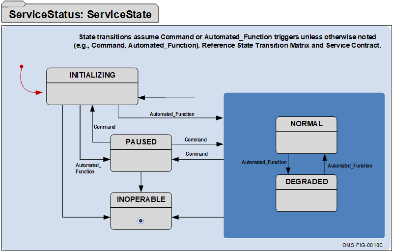

Figure 3.1-1 Service
Status State Diagram

Figures 3.1.2-1, Service Status State Diagram Crossed-Out Example,
3.1.2-2, Service Status State Diagram Recreated Using Cameo Example, and
3.1.2-3, Service Status State Diagram Recreated Using PlantUML Example,
provide examples of how to modify Figure 3.1-1 or create a new state
diagram for a Service that does not use the DEGRADED state.

Figure 3.1.2-1, Service Status State Diagram Crossed-Out Example, uses
red “Xs” to indicate that the DEGRADED state and the transitions into
and out of the state are not supported by the Service.

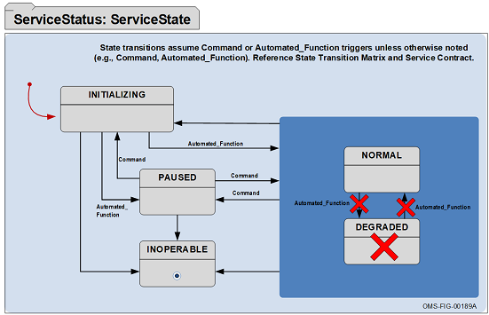

Figure 3.1.2-1 Service
Status State Diagram Crossed-Out Example

Figure 3.1.2-2, Service Status State Diagram Recreated Using Cameo
Example, shows the Service’s states without the DEGRADED state in a new
drawing that was created by the Adopting Program’s use of the UML tool
Cameo Enterprise Architecture.

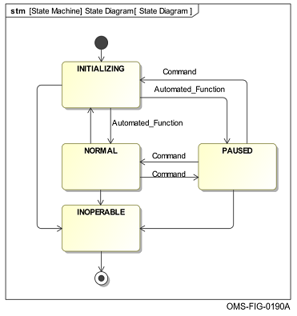

Figure 3.1.2-2 Service
Status State Diagram Recreated Using Cameo Example

Figure 3.1.2-3, Service Status State Diagram Recreated Using PlantUML
Example, shows the Service’s states without the DEGRADED state in a new
drawing that was created by the Adopting Program’s use of the drawing
tool PlantUML. Code for this example can be found in Appendix D.

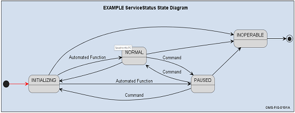

Figure 3.1.2-3 Service
Status State Diagram Recreated Using PlantUML Example

In this section, provide a figure for the allowed state transitions for
your Service, if different than Figure 3.1-2. If your Service uses all
the states and transitions as shown in Figure 3.1-2, then Figure 3.1-2
may be used without modification. Otherwise, replace the figure with an
updated figure, either by creating a new figure or annotating the
existing figure.

Please note that new states or transitions are not allowed. If a state
is not used, its associated transitions are also removed. In addition,
transition triggers may be removed, but cannot be added. For example, an
“A” transition, which has two transition triggers (Automated Function
and Command, “A1” and “A2”, respectively), can be replaced by a single
transition such as “A1” or “A2.” However, an “A1” or “A2” transition
cannot be replaced by an “A” transition, unless a state is removed.

Updates to Figures 3.1-1 and 3.1-2 that show the modified states and
transitions must be consistent.

Figure 3.1-2 Allowed
Service State Transitions

Figures 3.1.2-4, Allowed Service State Transitions Crossed-Out Example,
3.1.2-5, Allowed Service State Transitions Recreated Using Cameo
Example, and 3.1.2-6, Allowed Service State Transitions Recreated Using
PlantUML Example, provide examples of how to modify Figure 3.1-2 or
create a new state transition table for a Service that does not use the
DEGRADED state.

If annotating Figure 3.1-2, use the following conventions for mark ups:

-   If removing a state, the entire row and column needs to be crossed
    out indicating that all transitions to and from that state have been
    removed

-   If an individual transition changes from Allowed to Unallowed, mark
    the transition with a red “X” (not shown in example)

-   If an individual transition changes from an “A” to an “A1” or “A2,”
    update the entry and mark it with a red oval (not shown in example)

Figure 3.1.2-4, Allowed Service State Transitions Crossed-Out Example,
uses thick red lines to indicate that the DEGRADED state and all its
transitions are not supported by the Service.

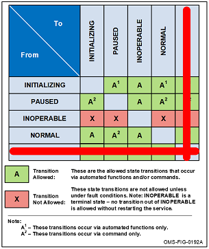

Figure 3.1.2-4 Allowed
Service State Transitions Crossed-Out Example

Figure 3.1.2-5, Allowed Service State Transitions Recreated Using Cameo
Example, shows the Service’s state transitions without the DEGRADED
state in a new table that was created by the Adopting Program’s use of
the UML tool Cameo Enterprise Architecture.

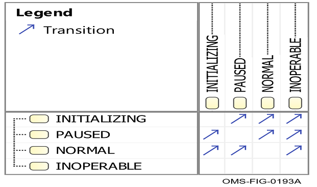

Figure 3.1.2-5 Allowed
Service State Transitions Recreated Using Cameo Example

Figure 3.1.2-6, Allowed Service State Transitions Recreated Using
PlantUML Example, shows the Service’s state transitions without the
DEGRADED state in a new table that was created by the Adopting Program’s
use of the drawing tool PlantUML. Code for this example can be found in
Appendix D.

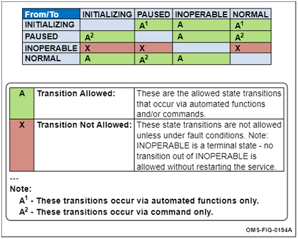

Figure 3.1.2-6 Allowed
Service State Transitions Recreated Using PlantUML Example

##### Service Status Sequence Diagram

Figure 3.1-3, Service Status Sequence Diagram, is the sequence diagram
for Service Status. The sequence diagram shows both the periodic Service
Status and the aperiodic Service Status Data Request functions. As the
name implies, the communication pattern for the periodic Service Status
function is a periodic publishing pattern. At the specified interval,
the Service publishes the **ServiceStatus** message. This interval is
defined in Section 3.1.1.3, Service Status Reporting Interval.

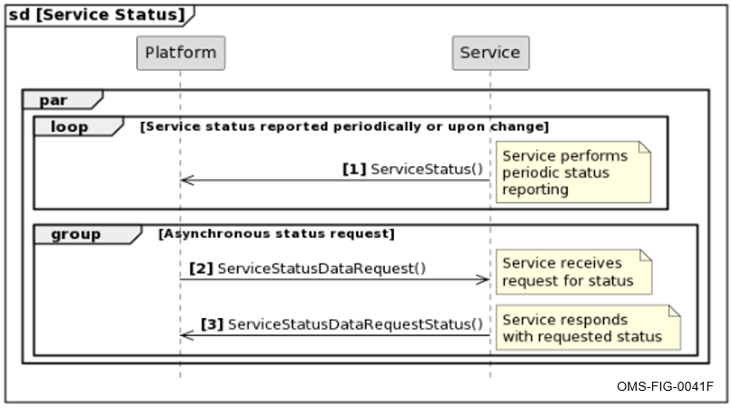

Figure 3.1-3 Service
Status Sequence Diagram

The communication pattern for the aperiodic Service Status function is
Request/Reply; wherein a request is received by the Service. The Service
processes the request and sends a reply if appropriate per the Response
Rules outlined in Figure 3.1-4, **ServiceStatusDataRequest** Response
Rules. This is an on-time operation, meaning that there are no (long)
time intervals between sending the request, the processing of the
request, and sending the reply.

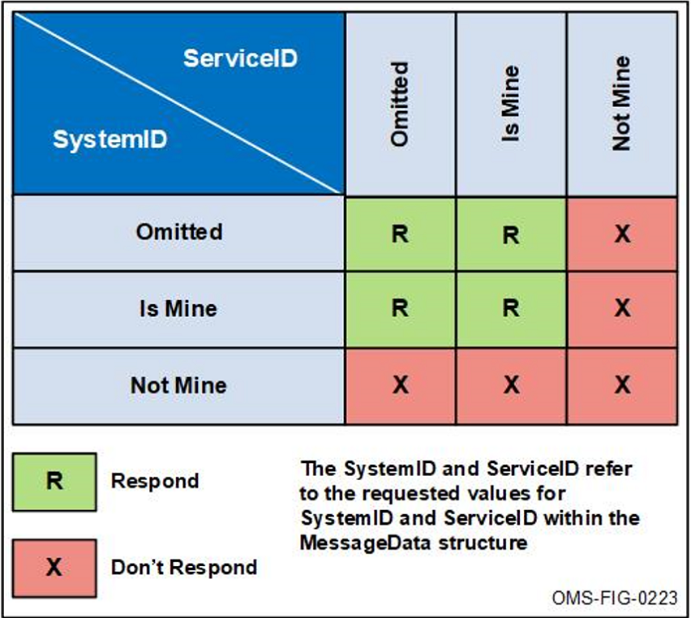

Figure 3.1-4 Service
Status Data Request Response Rules

#### Service Status Post Conditions

This section indicates the possible states during function completion.

Service is running and is in any state (except INOPERABLE), typically
NORMAL.

Examples of post conditions:

-   Output provided

-   Return codes/completion code/Security errors

-   Items updated.

This section is also used to describe any function level authentication.

#### Service Status Error Handling

This section explains the behavior if errors and exceptions occur during
the course of execution of this function.

Also describe how errors/exceptions are handled and reported by the
Service, e.g., error codes table – this may point to an appendix if the
error code table is extensive.

Required Subsystem Functions
----------------------------

This section may not be tailored except where indicated.

This section details the functions provided by OMS Subsystems. Every OMS
Subsystem is required to provide these functions to ensure that all OMS
Subsystems have a basic level of communication with one another. This
section is required for Subsystems.

Services and Isolators should mark this section as “Not Applicable” with
a rationale only in this section. Also add “ - N/A” to read “Required
Subsystem Functions – N/A” as the updated section title header. In the
subsections, remove all green text and populate “N/A” in the first empty
cell of any tables. Figures may be replaced with “Figure not
applicable.” Do not delete figure or table captions. Instead, add “ -
N/A” to figure and table captions in the subsections.

### Subsystem Startup

This section is required for OMS Subsystems.

#### Subsystem Startup Description

This section describes the Subsystem startup function, which includes
establishing network connection. Also refer to Section 2.2,
Initialization, for additional details.

#### Subsystem Startup Preconditions

Once power has been applied to the Subsystem, the Subsystem can begin
its initialization sequence. Network connection must be established to
allow receipt and publication of messages.

A Subsystem typically starts in its PRE\_INITIALIZATION state. Indicate
Subsystem’s Startup State here.

#### Subsystem Startup Reporting Interval

This section indicates Subsystem specific modifiable configuration items
that will be provided.

This section is not applicable for this function.

#### Subsystem Startup Inputs and Outputs

Table 3.2-1, Subsystem Startup Inputs and Outputs, identifies the inputs
and outputs for the Subsystem Startup function.

The cells in this table should contain detailed information per
instructions provided in Section 3.

Table 3.2-1 Subsystem
Startup Inputs and Outputs

<table>
<thead>
<tr class="header">
<th>MP</th>
<th>IO</th>
<th>DE</th>
<th>Data Exchange Name</th>
<th>
Data Exchange Information

(e.g., Topic Name for Messages or Protocol for Data Transfers)
</th>
<th>LoM</th>
<th>P</th>
<th>Nominal Response Time or Nominal Periodic Rate</th>
<th>Max Response Time or Max Periodic Rate</th>
<th>Appendix C Mapping</th>
</tr>
</thead>
<tbody>
<tr class="odd">
<td>D</td>
<td>I</td>
<td>M</td>
<td><strong>FileMetadata</strong></td>
<td>FileMetadata [SOAC-3]</td>
<td>O</td>
<td>A</td>
<td>N/A</td>
<td>N/A</td>
<td>FileMetadata</td>
</tr>
<tr class="even">
<td>D</td>
<td>I</td>
<td>M</td>
<td><strong>FileLocation</strong></td>
<td>FileLocation [SOAC-3]</td>
<td>O</td>
<td>A</td>
<td>N/A</td>
<td>N/A</td>
<td>FileLocation</td>
</tr>
<tr class="odd">
<td>-</td>
<td>I</td>
<td>DT</td>
<td><strong>Subsystem_OFP</strong></td>
<td>tftp [Subsystem_OFP, Binary, Exclusive Use]</td>
<td>O</td>
<td>A</td>
<td>N/A</td>
<td>N/A</td>
<td>N/A</td>
</tr>
<tr class="even">
<td>-</td>
<td>I</td>
<td>DT</td>
<td><strong>SubsystemConfigFile</strong></td>
<td>NFS [Configuration File, Custom Text, Exclusive Use]</td>
<td>O</td>
<td>A</td>
<td>N/A</td>
<td>N/A</td>
<td>N/A</td>
</tr>
<tr class="odd">
<td>-</td>
<td>I</td>
<td>DT</td>
<td><strong>MDF</strong></td>
<td>NFS [MDF, Binary, Exclusive Use]</td>
<td>O</td>
<td>A</td>
<td>N/A</td>
<td>N/A</td>
<td>N/A</td>
</tr>
<tr class="even">
<td>
Column Headings &amp; Cell Abbreviations:

<ul>
<li>
MP=Message Primitive: S=Status-1; C/CS=Command-2; AR/ARS=ActionRequest-2; DR/DRS=DataRequest-2; D=Data-1; DRec=DataRecord-1
</li>
<li>
I/O=Input/Output: I=Input; O=Output
</li>
<li>
DE=Data Exchange: M=OMS Message; DT=Data Transfer; SS=Special Signal; SE=Security Exchange
</li>
<li>
LoM=Level of Mandate: M=Mandatory; O=Optional
</li>
<li>
P=Periodicity: A=Asynchronous; OD=On Demand; P=Periodic
</li>
</ul></td>
<td></td>
<td></td>
<td></td>
<td></td>
<td></td>
<td></td>
<td></td>
<td></td>
<td></td>
</tr>
</tbody>
</table>

#### Subsystem Startup Workflow and Orchestration

This section is used to detail the sequence of interactions required for
the Subsystem Startup function.

Power has been applied to the Subsystem. Initialization begins. The
Subsystem initializes its CAL connection. Once the CAL connection is
initialized, this function can initiate additional functions.

Provide additional initialization details here.

Function interactions may be described using sequence diagrams, state
machine diagrams, tables, and/or text.

A Sequence Diagram describes the pattern of interaction used when
invoking the function. When a sequence diagram is used, this section
should include information on how to interpret it.

It is recommended that sequence diagrams adhere to the UML 2.0 Standard
as described in Section 3.

Use or modify the following green text and message sequences as needed
to define the Subsystem startup behavior, as based on the Notional
Subsystem Startup Sequence Example in the OMS Standard.

Additional functions to be initiated will include the following (update
list as needed):

-   Subsystem Status function defined in Section 3.2.2

-   Subsystem State Command Processing function defined in Section 3.2.3

-   Subsystem Initiated BIT function defined in Section 3.2.4

-   Subsystem Calibration function defined in Section 3.2.5

-   Subsystem Shutdown function defined in Section 3.2.6

-   Required Capability-related functions defined in Section 3.3

-   Specific functions defined in Section 3.4.

The Subsystem may connect to an NFS and/or FTP server for data
transfers. Provide details.

The Subsystem ID should not be documented in this Service Contract as
this is a security issue managed by the Mission Package provider.

Here are three different examples showing how a Subsystem uses data
transfers to retrieve its Mission Data File (MDF) as needed. Keep the
one example that applies to this Subsystem and remove the other
examples; modify message sequence figure to add error handling as
needed.

Example 1: Subsystem uses its Subsystem Configuration File to learn its
MDF information (MDF identification and location) as shown in Figure
3.2.1-1 Mission Data File Stored in Subsystem Configuration File Message
Sequence Example. In this example, the data transfer is using a
synchronous protocol as indicated by a solid line with solid arrowhead.
Other data transfers may use an asynchronous protocol, which would be
indicated by a solid line with open arrowhead.

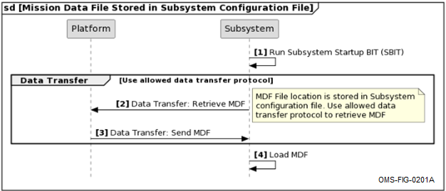

Figure 3.2.1-1 Mission
Data File Stored in Subsystem Configuration File Message Sequence
Example

Example 2: Subsystem waits for an external Service to push the MDF
information (MDF identification and location) to the Subsystem using
**FileMetadata** and **FileLocation** messages as shown in Figure
3.2.1-2 Mission Data File Location Pushed by the Platform Message
Sequence Example.

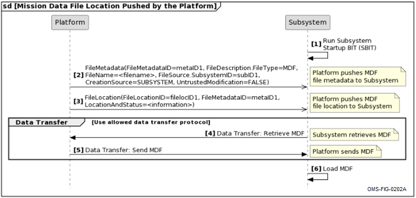

Figure 3.2.1-2 Mission
Data File Location Pushed by the Platform Message Sequence Example

Example 3: Subsystem uses **QueryDataRequest** and
**QueryDataRequestStatus** messages to learn its MDF information (MDF
identification and location) as shown in Figure 3.2.1-3 Mission Data
File QueryDataRequest Message Sequence Example.

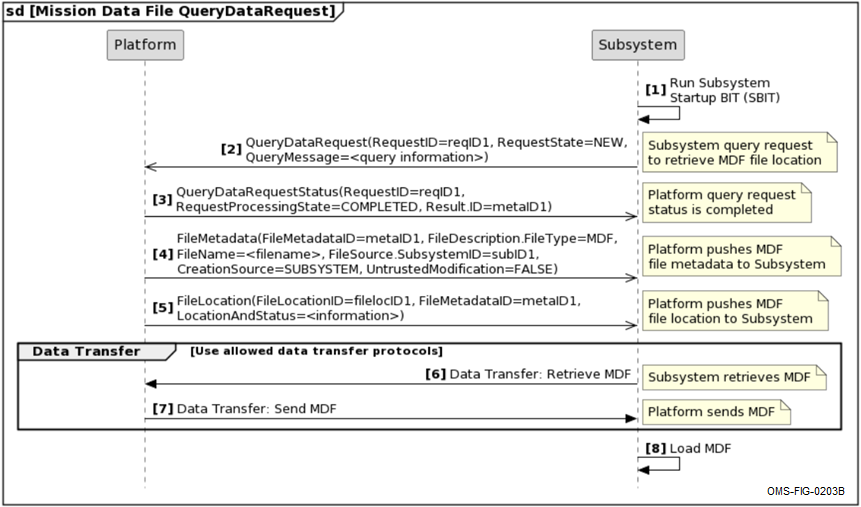

Figure 3.2.1-3 Mission
Data File QueryDataRequest Message Sequence Example

Modify green text and message sequences above as needed to define the
Subsystem startup behavior, as based on the Notional Subsystem Startup
Sequence Example in the OMS Standard.

#### Subsystem Startup Post Conditions

This section indicates the possible states during function completion.

Subsystem is running and is in any state (except SHUTDOWN), typically
STANDBY or INITIALIZATION (awaiting
**SubsystemStateCommand**(CommandedState=OPERATE) message) to continue.

Examples of post conditions:

-   Output provided

-   Return codes/completion code/Security errors

-   Items updated.

This section is also used to describe any function level authentication.

#### Subsystem Startup Error Handling

This section explains the behavior if errors and exceptions occur during
the course of execution of this function.

Also describe how errors/exceptions are handled and reported by the
Subsystem, e.g., error codes table – this may point to an appendix if
the error code table is extensive.

### Subsystem Status

This section is required for OMS Subsystems.

For Services and Isolators that do not publish **SubsystemStatus**, mark
this section and all subsections as “Not Applicable” with a rationale
and populate “N/A” in the first empty cell of any tables. Figures may be
replaced with “Figure not applicable.” Do not delete figure or table
captions. Instead, add “ - N/A” to figure and table captions in the
subsections.

#### Subsystem Status Description

This section describes the Subsystem status function. This OMS Subsystem
reports Subsystem status periodically and aperiodically upon request.
The periodic **SubsystemStatus** message is published at a configurable
interval time; no other trigger is required. The periodic rate is
discussed in Section 3.2.2.3, Subsystem Status Reporting Interval.

In addition to the periodic message, this Subsystem will reply to a
received **SubsystemStatusDataRequest** message with a
**SubsystemStatusDataRequestStatus** message, if the request is
applicable to the Subsystem.

#### Subsystem Status Preconditions

The Subsystem must be up and running, and is initializing or
initialized. Once the Subsystem in initialized, the Subsystem can be in
any state, except SHUTDOWN.

#### Subsystem Status Reporting Interval

This section indicates Subsystem specific modifiable configuration items
that will be provided.

Configuration parameter assignment for periodicity is configurable
within the range of 1 to 600 seconds in 1 second increments.

Identify your configuration parameter assignment technique here,
including the default periodicity for reporting status. Report the
default periodicity in the Inputs and Outputs Table in the next section.

#### Subsystem Status Inputs and Outputs

Table 3.2-2, Subsystem Status Inputs and Outputs, identifies the inputs
and outputs for the Subsystem Status function.

The cells in this table should contain detailed information per
instructions provided in Section 3.

Table 3.2-2 Subsystem
Status Inputs and Outputs

<table>
<thead>
<tr class="header">
<th>MP</th>
<th>IO</th>
<th>DE</th>
<th>Data Exchange Name</th>
<th>
Data Exchange Information

(e.g., Topic Name for Messages or Protocol for Data Transfers)
</th>
<th>LoM</th>
<th>P</th>
<th>Nominal Response Time or Nominal Periodic Rate</th>
<th>Max Response Time or Max Periodic Rate</th>
<th>Appendix C Mapping</th>
</tr>
</thead>
<tbody>
<tr class="odd">
<td><strong>D</strong></td>
<td>O</td>
<td>M</td>
<td><strong>SubsystemStatus</strong></td>
<td>SubsystemStatus</td>
<td>M</td>
<td>P</td>
<td>1 Hz</td>
<td>0.5 Hz</td>
<td>SubsystemStatus</td>
</tr>
<tr class="even">
<td><strong>DR</strong></td>
<td>I</td>
<td>M</td>
<td><strong>SubsystemStatusDataRequest</strong></td>
<td>SubsystemStatusDataRequest</td>
<td>M</td>
<td>A</td>
<td>N/A</td>
<td>N/A</td>
<td>SubsystemStatusDataRequest</td>
</tr>
<tr class="odd">
<td><strong>DRS</strong></td>
<td>O</td>
<td>M</td>
<td><strong>SubsystemStatusDataRequestStatus</strong></td>
<td>SubsystemStatusDataRequestStatus</td>
<td>M</td>
<td>OD</td>
<td>0.5 sec</td>
<td>3 sec</td>
<td>SubsystemStatusDataRequestStatus</td>
</tr>
<tr class="even">
<td>
Column Headings &amp; Cell Abbreviations:

<ul>
<li>
MP=Message Primitive: S=Status-1; C/CS=Command-2; AR/ARS=ActionRequest-2; DR/DRS=DataRequest-2; D=Data-1; DRec=DataRecord-1
</li>
<li>
I/O=Input/Output: I=Input; O=Output
</li>
<li>
DE=Data Exchange: M=OMS Message; DT=Data Transfer; SS=Special Signal; SE=Security Exchange
</li>
<li>
LoM=Level of Mandate: M=Mandatory; O=Optional
</li>
<li>
P=Periodicity: A=Asynchronous; OD=On Demand; P=Periodic
</li>
</ul></td>
<td></td>
<td></td>
<td></td>
<td></td>
<td></td>
<td></td>
<td></td>
<td></td>
<td></td>
</tr>
</tbody>
</table>

#### Subsystem Status Workflow and Orchestration

This section is used to detail the sequence of interactions required for
the Subsystem Status function.

##### Allowed States and Transitions

Figure 3.2-1, Subsystem Status State Diagram, shows allowed states for
reporting **SubsystemStatus**. Figure 3.2-2 Allowed Subsystem State
Transitions, shows allowed states and transitions for this Subsystem.

Per RQMT STD-000414, the Subsystem is required to have an OPERATE state.

This section must contain a state diagram for this Subsystem showing all
supported states and all valid transitions. The Subsystem Status State
Diagram from the OMS Standard is shown in Figure 3.2-1. If this
Subsystem uses all the states and transitions as shown in Figure 3.2-1,
then Figure 3.2-1 may be used without modification. Otherwise, replace
the figure with an updated figure, either by creating a new figure or
crossing out each unsupported state or transition with an “X.” Note that
new states or new transitions cannot be added, but existing states and
transitions may be removed to match the Subsystem’s implementation
(except removal of the OPERATE state). For a state that has been
removed, its incoming and outgoing transitions can be connected,
essentially passing through the removed state.

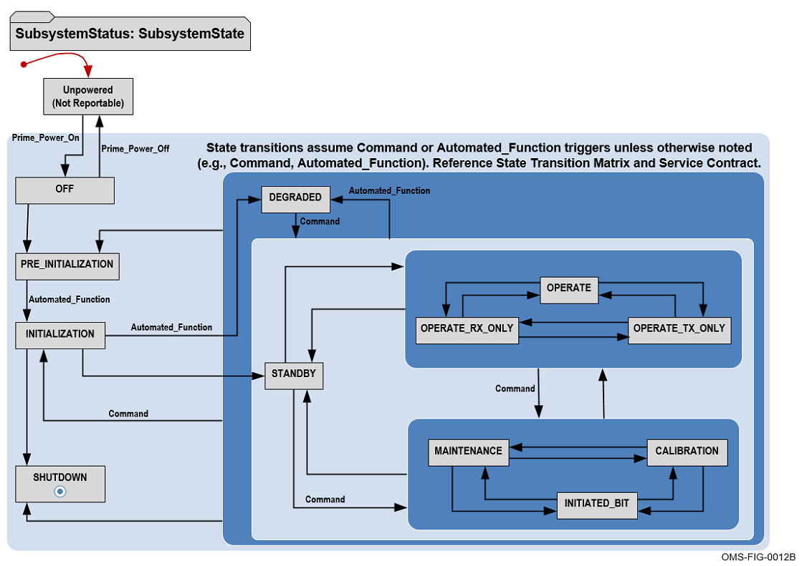

Figure 3.2-1 Subsystem
Status State Diagram

Figures 3.2.2-1, Subsystem Status State Diagram Crossed-Out Example,
3.2.2-2, Subsystem Status State Diagram Recreated Using Cameo Example,
and 3.2.2-3, Subsystem Status State Diagram Recreated Using PlantUML
Example, provide examples of how to modify Figure 3.2-2 or create a new
state diagram for a Subsystem that does not use the PRE-INITIALIZATION
state.

Figure 3.2.2-1, Subsystem Status State Diagram Crossed-Out Example, uses
red “Xs” to indicate that the PRE-INITIALIZATION state and the
transitions into and out of the state are not supported by the
Subsystem. The two crossed-out transitions, from the OFF state to the
PRE-INITIALIZATION state and from the PRE-INITIALIZATION state to the
INITIALIZATION state, are replaced by the green arrow showing the
connected transition from the OFF state into the INITIALIZATION state.
The second green arrow shows the transition from states in the dark blue
box (e.g., DEGRADED, STANDBY, OPERATE, etc.) passing through the removed
PRE-INITIALIZATION state into the INITIALIZATION state.

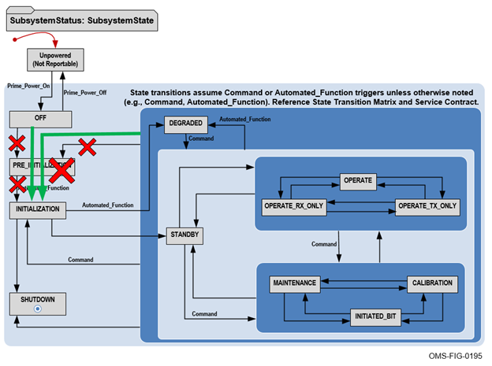

Figure 3.2.2-1 Subsystem
Status State Diagram Crossed-Out Example

Figure 3.2.2-2, Subsystem Status State Diagram Recreated Using Cameo
Example, shows the Subsystem’s states without the PRE-INITIALIZATION
state in a new drawing that was created by the Adopting Program’s use of
the UML tool Cameo Enterprise Architecture.

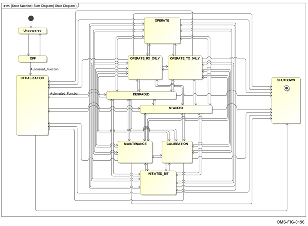

Figure 3.2.2-2 Subsystem
Status State Diagram Recreated Using Cameo Example

Figure 3.2.2-3, Subsystem Status State Diagram Recreated Using PlantUML
Example, shows the Subsystem’s states without the PRE-INITIALIZATION
state in a new drawing that was created by the Adopting Program’s use of
the drawing tool PlantUML Code for this example can be found in Appendix
D.

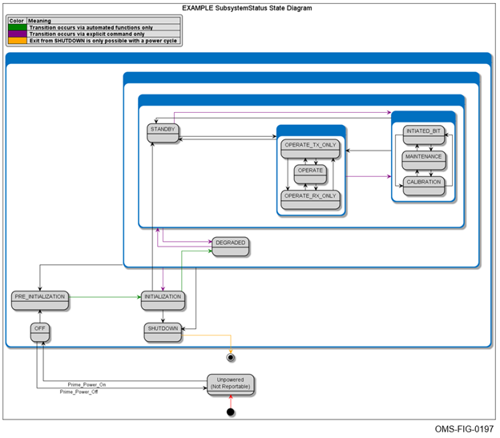

Figure 3.2.2-3 Subsystem
Status State Diagram Recreated Using PlantUML Example

In this section, provide a figure for the allowed state transitions for
your Subsystem, if different than Figure 3.2-2. If your Subsystem uses
all the states and transitions as shown in Figure 3.2-2, then Figure
3.2-2 may be used without modification. Otherwise, replace the figure
with an updated figure, either by creating a new figure or annotating
the existing figure.

New transitions are only allowed if replacing deleted transitions that
result from the removal of a state. In addition, transition triggers may
be removed, but cannot be added unless a state is removed. For example,
an “A” transition, which has two transition triggers (Automated Function
and Command, “A1” and “A2”, respectively), can be replaced by a single
transition such as “A1” or “A2.” However, an “A1” or “A2” transition
cannot be replaced by an “A” transition, unless a state is removed.

Updates to Figures 3.2-1 and 3.2-2 that show the modified states and
transitions must be consistent.

Figure 3.2-2 Allowed
Subsystem State Transitions

Figures 3.2.2-4, Allowed Subsystem State Transitions Crossed-Out
Example, 3.2.2-5, Allowed Subsystem State Transitions Recreated Using
Cameo Example, and 3.2.2-6, Allowed Subsystem State Transitions
Recreated Using PlantUML Example, provide examples of how to modify
Figure 3.2-2 or create a new state transition table for a Subsystem that
does not use the PRE-INITIALIZATION state.

If annotating Figure 3.2-2, use the following conventions for mark ups:

-   If removing a state, cross out the entire row and column using a
    bold red line indicating that all transitions to and from that state
    have been removed

-   If an individual transition changes from Allowed to Unallowed, mark
    the transition with a red “X” (not shown in example)

-   If an individual transition changes from an “A” to an “A1” or “A2,”
    update the entry and mark it with a red oval (not shown in example)

-   If removing a state creates a new connection between states, updated
    all affected transitions that change from Unallowed to Allowed and
    mark them with a green oval

-   If removing a state causes an “A1” or “A2” transition trigger to
    become an “A” transition trigger, update the entry and mark it with
    a green oval (not shown in example).

Figure 3.2.2-4, Allowed Subsystem State Transitions Crossed-Out Example,
uses thick red lines to indicate that the PRE-INITIALIZATION state and
all its transitions are not supported by the Subsystem. The transition
from OFF to INITIALIZATION has been changed from Unallowed to Allowed as
indicated by the green oval.

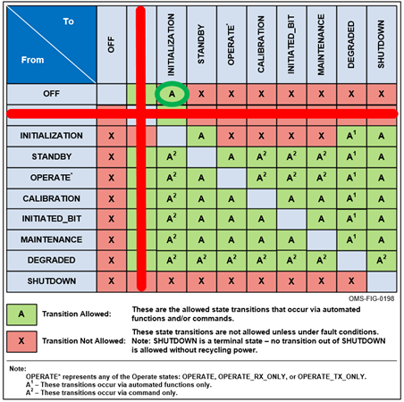

Figure 3.2.2-4 Allowed
Subsystem State Transitions Crossed-Out Example

Figure 3.2.2-5, Allowed Subsystem State Transitions Recreated Using
Cameo Example, shows the Subsystem’s state transitions without the
PRE-INITIALIZATION state in a new table that was created by the Adopting
Program’s use of the UML tool Cameo Enterprise Architecture.

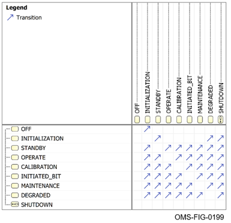

Figure 3.2.2-5 Allowed
Subsystem State Transitions Recreated Using Cameo Example

Figure 3.2.2-6, Allowed Subsystem State Transitions Recreated Using
PlantUML Example, shows the Subsystem’s state transitions without the
PRE-INITIALIZATION state in a new table that was created by the Adopting
Program’s use of the drawing tool PlantUML. Code for this example can be
found in Appendix D.

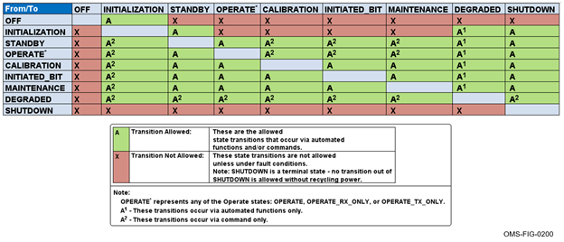

Figure 3.2.2-6 Allowed
Subsystem State Transitions Recreated Using PlantUML Example

##### Subsystem Status Sequence Diagram

Figure 3.2-3, Subsystem Status Sequence Diagram, is the sequence diagram
for Subsystem Status. The sequence diagram shows both the periodic
Subsystem Status and the aperiodic Subsystem Status functions. As the
name implies, the communication pattern for the periodic Subsystem
Status function is a periodic publishing pattern. At the specified
interval, the Subsystem publishes the **SubsystemStatus** message. This
interval is defined in Section 3.2.2.3, Subsystem Status Reporting
Interval.

Figure 3.2-3 Subsystem
Status Sequence Diagram

The communication pattern for the aperiodic Subsystem Status function is
Request/Reply; wherein a request is received by the Subsystem. The
Subsystem processes the request and sends a reply if appropriate per the
Response Rules outlined in Table 3.2-4, **SubsystemStatusDataRequest**
Response Rules. This is an on-time operation, meaning that there are no
(long) time intervals between sending the request, the processing of the
request, and sending the reply.

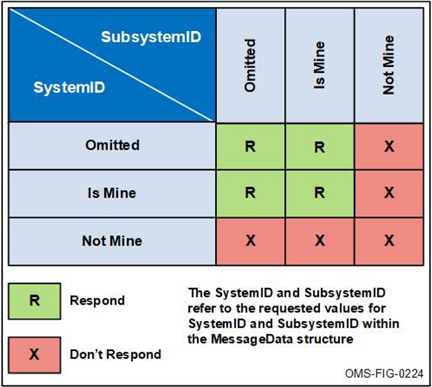

Figure 3.2-4 Subsystem
Status Data Request Response Rules

#### Subsystem Status Post Conditions

This section indicates the possible states during function completion.

Subsystem is running and is in any state (except SHUTDOWN), typically
OPERATE.

Examples of post conditions:

-   Output provided

-   Return codes/completion code/Security errors

-   Items updated.

This section is also used to describe any function level authentication.

#### Subsystem Status Error Handling

This section explains the behavior if errors and exceptions occur during
the course of execution of this function.

Also describe how errors/exceptions are handled and reported by the
Subsystem, e.g., error codes table – this may point to an appendix if
the error code table is extensive.

### Subsystem State Command Processing

This section is only applicable for OMS Subsystems.

Subsystems that do not support Subsystem State Command processing should
mark this section as “Not Applicable” with a rationale in this section.
Also add “- N/A” to the section title header to read “Subsystem State
Command Processing – N/A.”

In subsections, remove all green text and populate the first empty cell
of any tables in green text with “N/A.” Figures may be replaced with
“Figure not applicable.” Do not delete figure or table captions. Also
add “- N/A” to figure and table captions in the subsections.

#### Subsystem State Command Processing Description

This section describes the Subsystem State Command Processing function.

#### Subsystem State Command Processing Preconditions

The Subsystem must be up and running, and is initialized. Once the
Subsystem in initialized, the Subsystem can be in any state, except
SHUTDOWN.

#### Subsystem State Command Processing Reporting Interval

This section indicates Subsystem specific modifiable configuration items
that will be provided.

This section is not applicable for this function.

#### Subsystem State Command Processing Inputs and Outputs

Table 3.2-3 Subsystem State Command Processing Inputs and Outputs,
identifies the inputs and outputs for the Subsystem State Command
Processing function.

The cells in this table should contain detailed information per
instructions provided in Section 3.

Table 3.2-3 Subsystem
State Command Processing Inputs and Outputs

<table>
<thead>
<tr class="header">
<th>MP</th>
<th>IO</th>
<th>DE</th>
<th>Data Exchange Name</th>
<th>
Data Exchange Information

(e.g., Topic Name for Messages or Protocol for Data Transfers)
</th>
<th>LoM</th>
<th>P</th>
<th>Nominal Response Time or Nominal Periodic Rate</th>
<th>Max Response Time or Max Periodic Rate</th>
<th>Appendix C Mapping</th>
</tr>
</thead>
<tbody>
<tr class="odd">
<td>C</td>
<td>I</td>
<td>M</td>
<td>SubsystemStateCommand</td>
<td>SubsystemStateCommand</td>
<td>M</td>
<td>A</td>
<td>N/A</td>
<td>N/A</td>
<td>SubsystemStateCommand</td>
</tr>
<tr class="even">
<td>CS</td>
<td>I</td>
<td>M</td>
<td>SubsystemStateCommandStatus</td>
<td>SubsystemStateCommandStatus</td>
<td>M</td>
<td>OD</td>
<td>0.5 sec</td>
<td>3 sec</td>
<td>SubsystemStateCommandStatus</td>
</tr>
<tr class="odd">
<td>
Column Headings &amp; Cell Abbreviations:

<ul>
<li>
MP=Message Primitive: S=Status-1; C/CS=Command-2; AR/ARS=ActionRequest-2; DR/DRS=DataRequest-2; D=Data-1; DRec=DataRecord-1
</li>
<li>
I/O=Input/Output: I=Input; O=Output
</li>
<li>
DE=Data Exchange: M=OMS Message; DT=Data Transfer; SS=Special Signal; SE=Security Exchange
</li>
<li>
LoM=Level of Mandate: M=Mandatory; O=Optional
</li>
<li>
P=Periodicity: A=Asynchronous; OD=On Demand; P=Periodic
</li>
</ul></td>
<td></td>
<td></td>
<td></td>
<td></td>
<td></td>
<td></td>
<td></td>
<td></td>
<td></td>
</tr>
</tbody>
</table>

#### Subsystem State Command Processing Workflow and Orchestration

This section is used to detail the sequence of interactions required for
the Subsystem State Command Processing function.

Upon receipt of a **SubsystemStateCommand** with
CommandedState=INITIATED\_BIT, Subsystem Initiated BIT processing is
handled in Section 3.2.4, Subsystem Built-In Test (BIT).

Upon receipt of a **SubsystemStateCommand** with
CommandedState=CALIBRATION, Subsystem Calibration processing is handled
in Section 3.2.5, Subsystem Calibration. 

Upon receipt of a **SubsystemStateCommand** with
CommandedState=SHUTDOWN, Subsystem shutdown processing is handled in
Section 3.2.6, Subsystem Shutdown.

Otherwise, upon receipt of a **SubsystemStateCommand**, the Subsystem
performs a state transition to the commanded state if it is able and
allowed, or it rejects the command if a transition to the commanded
state is not allowed as defined by Figure 3.2-3 Subsystem Status
Sequence Diagram. The Subsystem responds with
**SubsystemStateCommandStatus** in which the CommandProcessingState
field is set to ACCEPTED or REJECTED.

While the Subsystem is processing the **SubsystemStateCommand**, the
Subsystem Status function defined in Section 3.2.2, Subsystem Status,
will publish **SubsystemStatus** showing the progress of the Subsystem
state change.

Function interactions may be described using a sequence diagram, state
machine, tables, and/or text.

A Sequence Diagram describes the pattern of interaction used when
invoking the operation. When a sequence diagram is used, this section
should include information on how to interpret it. It is recommended
that sequence diagrams adhere to the UML 2.0 Standard as described in
Section 3.

Use or modify the following green text and message sequences as needed
to define the Subsystem’s state processing behaviors, including error
handling.

Several examples follow that show how a Subsystem can transition between
various states. Keep the examples that applies to this Subsystem and
remove the examples that are not applicable to this Subsystem. Modify
message sequence figures to add error handling as needed. Add additional
message sequences for state transitions not shown in these examples as
needed to fully document the Subsystem state transition behaviors, as
defined in Figure 3.2-1 Subsystem Status State Diagram.

Example 1a: INITIALIZATION to STANDBY using automatic transition after
initialization is complete as shown in Figure 3.2.3-1 Automatic
Subsystem State Transition from INITALIZATION to STANDBY Message
Sequence Example. Subsystem initialization has begun (step 1). The
Subsystem reports it is in its INITIALIZATION state (step 2). The
Subsystem completes its initialization processing (step 3). Subsystem
reports it is now in its STANDBY state (step 4).

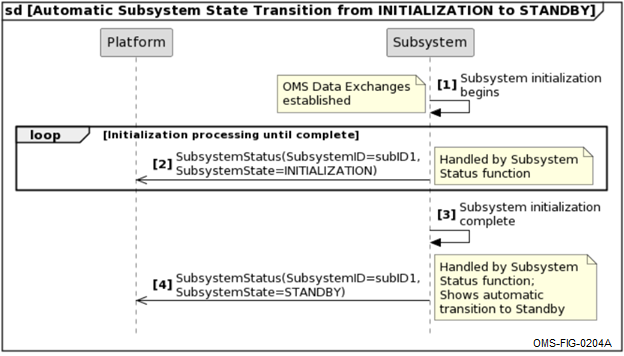

Figure 3.2.3-1 Automatic
Subsystem State Transition from INITALIZATION to STANDBY Message
Sequence Example

Example 1b: INITIALIZATION to STANDBY using a **SubsystemStateCommand**
as shown in Figure 3.2.3-2 Subsystem State Transition from
INITIALIZATION to STANDBY Using **SubsystemStateCommand** Message
Sequence Example. Subsystem initialization has begun (step 1). The
Subsystem reports it is in its INITIALIZATION state (step 2). The
Subsystem completes its initialization processing (step 3). The
Subsystem receives a **SubsystemStateCommand** to transition the
Subsystem to its STANDBY state (step 4). The Subsystem evaluates the
command (step 5). If the Subsystem accepts the command, it responds with
**SubsystemStateCommandStatus** indicating ACCEPTED (step 6) and then
performs its state transition processing (step 7). Once completed,
Subsystem reports it is now in its STANDBY state (step 8). If the
Subsystem rejects the command, it responds with
**SubsystemStateCommandStatus** indicating REJECTED (step 9) and does
not perform the state transition (step 10).

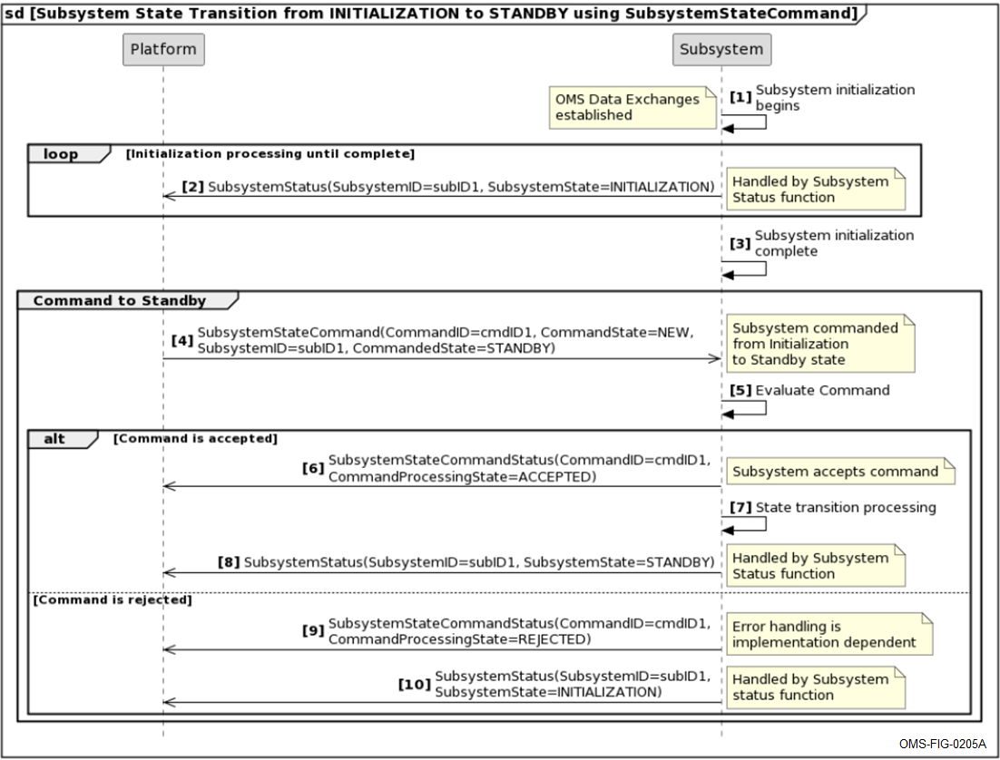

Figure 3.2.3-2 Subsystem
State Transition from INITIALIZATION to STANDBY Using
SubsystemStateCommand Message Sequence Example

Example 2: STANDBY to OPERATE using a **SubsystemStateCommand** as shown
in Figure 3.2.3-3 Subsystem State Transition from STANDBY to OPERATE
Using SubsystemStateCommand Message Sequence Example. Subsystem reports
it is in its STANDBY state (step 1). The Subsystem receives a
**SubsystemStateCommand** to transition the Subsystem to its OPERATE
state (step 2). The Subsystem evaluates the command (step 3). If the
Subsystem accepts the command, it responds with
**SubsystemStateCommandStatus** indicating ACCEPTED (step 4) and then
performs its state transition processing (step 5). Once completed,
Subsystem reports it is now in its OPERATE state (step 6). If the
Subsystem rejects the command, it responds with
**SubsystemStateCommandStatus** indicating REJECTED (step 7) and does
not perform the state transition (step 8).

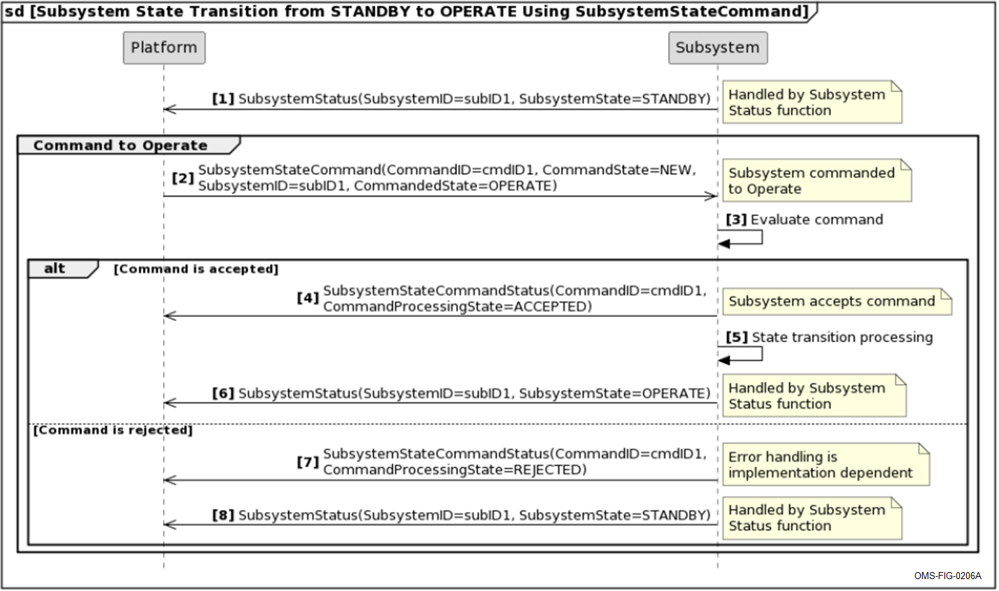

Figure 3.2.3-3 Subsystem
State Transition from STANDBY to OPERATE Using SubsystemStateCommand
Message Sequence Example

Example 3: OPERATE to STANDBY using a **SubsystemStateCommand**. Review
the sequence diagram in Figure 3.2.3-4 Subsystem State Transition from
OPERATE to STANDBY using **SubsystemStateCommand** Message Sequence
Example. Subsystem reports it is in its OPERATE state (step 1). The
Subsystem receives a **SubsystemStateCommand** to transition the
Subsystem to its STANDBY state (step 2). The Subsystem evaluates the
command (step 3). If the Subsystem accepts the command, it responds with
**SubsystemStateCommandStatus** indicating ACCEPTED (step 4). The
Subsystem must cancel all of its Activities by setting status to
COMPLETED in the \***Activity** message(s) and the status of all its
Capabilities must be set to TEMPORARILY\_UNAVAILABLE in the
\***CapabilityStatus** message(s) as shown in the Par box (steps 5-6)
while the Subsystem performs its state transition processing (step 7).
Once complete, the Subsystem reports it is now in its STANDBY state
(step 8). If the Subsystem rejects the command, it responds with
**SubsystemStateCommandStatus** indicating REJECTED (step 9) and does
not perform the state transition (step 10).

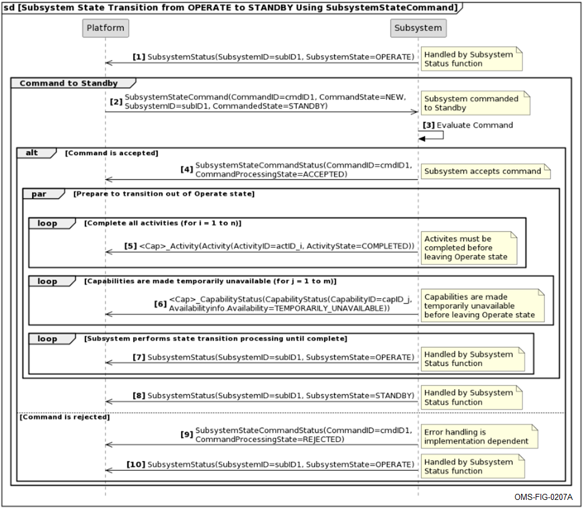

Figure 3.2.3-4 Subsystem
State Transition from OPERATE to STANDBY using SubsystemStateCommand
Message Sequence Example

Example 4: STANDBY to INITIALIZATION using **SubsystemStateCommand**.
Review the sequence diagram in Figure 3.2.3-5 Subsystem State Transition
from STANDBY to INITIALIZATION Using **SubsystemStateCommand** Message
Sequence Example. When a Subsystem transitions out of its STANDBY state
back into the INITIALIZATION state, the Subsystem will re-initialize
itself, including reloading its MDF. Subsystem reports it is in its
STANDBY state (step 1). The Subsystem receives a
**SubsystemStateCommand** to transition the Subsystem to its
INITIALIZATION state (step 2)**.** The Subsystem evaluates the command
(step 3). If the Subsystem accepts the command, it responds with
**SubsystemStateCommandStatus** indicating ACCEPTED (step 4). The
Subsystem performs its state transition processing (step 5). Once
complete, the Subsystem reports it is now in its INITIALIZATION state
(step 6). If the Subsystem rejects the command, it responds with
**SubsystemStateCommandStatus** indicating REJECTED (step 7) and does
not perform the state transition (step 8).

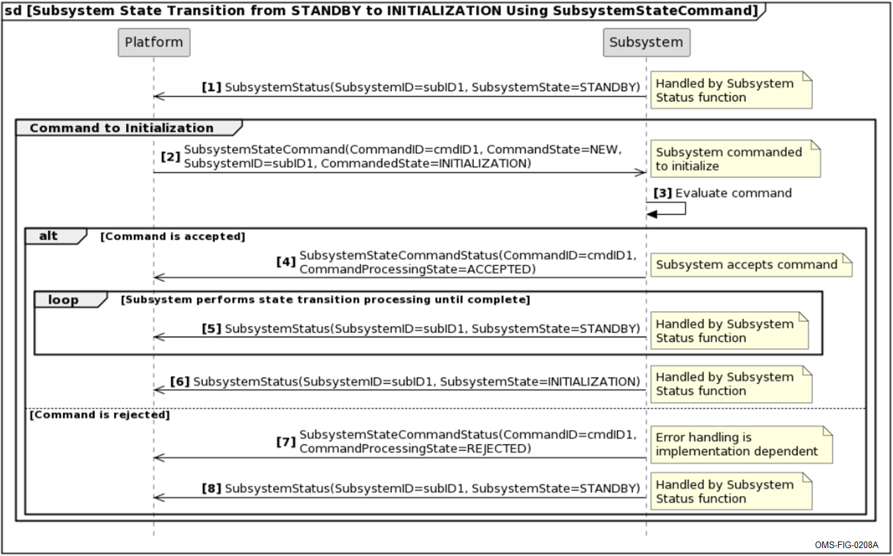

Figure 3.2.3-5 Subsystem
State Transition from STANDBY to INITIALIZATION Using
SubsystemStateCommand Message Sequence Example

Use or modify green text and example message sequences as needed to
define the Subsystem’s state processing behaviors, including error
handling.

#### Subsystem State Command Processing Post Conditions

This section indicates the possible states during function completion.

Subsystem transitions to the commanded state or remains in its current
state due to transition rejection or failure.

Examples of post conditions:

-   Output provided

-   Return codes/completion code/Security errors

-   Items updated.

This section is also used to describe any function level authentication.

#### Subsystem State Command Processing Error Handling

This section explains the behavior if errors and exceptions occur during
the course of execution of this function.

Also describe how errors/exceptions are handled and reported by the
Subsystem, e.g., error codes table – this may point to an appendix if
the error code table is extensive.

### Subsystem Built-In Test (BIT)

This section is only applicable for OMS Subsystems that support BIT
processing.

Subsystems that do not perform BIT processing should mark this section
as “Not Applicable” with a rationale in this section. Also add “ - N/A”
to the section title header as “Subsystem BIT – N/A” for the updated
title.

In subsections, remove all green text and populate the first empty cell
with “N/A” for any tables. Figures may be replaced with “Figure not
applicable.” Do not delete figure or table captions. Also add “ - N/A”
to figure and table captions in the subsections.

#### Subsystem BIT Description

This section describes the Subsystem Built-In Test (BIT) function.

A Subsystem may perform Startup BIT (SBIT) processing during Subsystem
initialization processing.

A Subsystem may perform Periodic BIT (PBIT) processing as a background
task after Subsystem initialization has completed.

A Subsystem may perform Initiated BIT (IBIT) processing in a distinct
INITIATED\_BIT state.

#### Subsystem BIT Preconditions

The Subsystem is up and running, and is initializing or initialized. The
Subsystem can begin performing various BIT processing from any state,
except SHUTDOWN.

#### Subsystem BIT Reporting Interval

This section indicates Subsystem specific modifiable configuration items
that will be provided.

If not applicable, add “This section is not applicable for this
function.” in black text.

Configuration parameter assignment for periodicity is configurable
within the range of 1 to 600 seconds in 1 second increments.

Identify your configuration parameter assignment technique here,
including the default periodicity for reporting status. Report the
default periodicity in the Inputs and Outputs Table in the next section.

#### Subsystem BIT Inputs and Outputs

Table 3.2-4, Subsystem BIT Inputs and Outputs, identifies the inputs and
outputs for the Subsystem BIT function.

The cells in this table should contain detailed information per
instructions provided in Section 3.

Table 3.2-4 Subsystem BIT
Inputs and Outputs

<table>
<thead>
<tr class="header">
<th>MP</th>
<th>IO</th>
<th>DE</th>
<th>Data Exchange Name</th>
<th>
Data Exchange Information

(e.g., Topic Name for Messages or Protocol for Data Transfers)
</th>
<th>LoM</th>
<th>P</th>
<th>Nominal Response Time or Nominal Periodic Rate</th>
<th>Max Response Time or Max Periodic Rate</th>
<th>Appendix C Mapping</th>
</tr>
</thead>
<tbody>
<tr class="odd">
<td>S</td>
<td>O</td>
<td>M</td>
<td>SubsystemBIT_Status</td>
<td>SubsystemBIT_Status</td>
<td>O</td>
<td>P</td>
<td>1 Hz</td>
<td>1 Hz</td>
<td>SubsystemBIT_Status</td>
</tr>
<tr class="even">
<td>D</td>
<td>O</td>
<td>M</td>
<td>SubsystemBIT_Configuration</td>
<td>SubsystemBIT_Configuration</td>
<td>O</td>
<td>P</td>
<td>1 Hz</td>
<td>1 Hz</td>
<td>SubsystemBIT_Configuration</td>
</tr>
<tr class="odd">
<td>C</td>
<td>I</td>
<td>M</td>
<td>SubsystemStateCommand</td>
<td>SubsystemStateCommand</td>
<td>O</td>
<td>A</td>
<td>N/A</td>
<td>N/A</td>
<td>SubsystemStateCommand</td>
</tr>
<tr class="even">
<td>CS</td>
<td>O</td>
<td>M</td>
<td>SubsystemStateCommandStatus</td>
<td>SubsystemStateCommandStatus</td>
<td>O</td>
<td>OD</td>
<td>0.5 sec</td>
<td>3 sec</td>
<td>SubsystemStateCommandStatus</td>
</tr>
<tr class="odd">
<td>C</td>
<td>I</td>
<td>M</td>
<td>SubsystemBIT_Command</td>
<td>SubsystemBIT_Command</td>
<td>O</td>
<td>A</td>
<td>N/A</td>
<td>N/A</td>
<td>SubsystemBIT_Command</td>
</tr>
<tr class="even">
<td>CS</td>
<td>O</td>
<td>M</td>
<td>SubsystemBIT_CommandStatus</td>
<td>SubsystemBIT_CommandStatus</td>
<td>O</td>
<td>OD</td>
<td>0.5 sec</td>
<td>3 sec</td>
<td>SubsystemBIT_CommandStatus</td>
</tr>
<tr class="odd">
<td>-</td>
<td>O</td>
<td>DT</td>
<td>Log_File</td>
<td>DT</td>
<td>O</td>
<td>A</td>
<td>N/A</td>
<td>N/A</td>
<td>N/A</td>
</tr>
<tr class="even">
<td>
Column Headings &amp; Cell Abbreviations:

<ul>
<li>
MP=Message Primitive: S=Status-1; C/CS=Command-2; AR/ARS=ActionRequest-2; DR/DRS=DataRequest-2; D=Data-1; DRec=DataRecord-1
</li>
<li>
I/O=Input/Output: I=Input; O=Output
</li>
<li>
DE=Data Exchange: M=OMS Message; DT=Data Transfer; SS=Special Signal; SE=Security Exchange
</li>
<li>
LoM=Level of Mandate: M=Mandatory; O=Optional
</li>
<li>
P=Periodicity: A=Asynchronous; OD=On Demand; P=Periodic
</li>
</ul></td>
<td></td>
<td></td>
<td></td>
<td></td>
<td></td>
<td></td>
<td></td>
<td></td>
<td></td>
</tr>
</tbody>
</table>

#### Subsystem BIT Workflow and Orchestration

This section is used to detail the sequence of interactions required for
the Subsystem BIT function.

Function interactions may be described using a sequence diagram,
activity diagram, state machine, tables, and/or text.

A Sequence Diagram describes the pattern of interaction used when
invoking the operation. When a sequence diagram is used, this section
should include information on how to interpret it. It is recommended
that sequence diagrams adhere to the UML 2.0 Standard as described in
Section 3.

Use or modify the following green text and message sequences as needed
to define the Subsystem’s function behavior, including error handling.

While the Subsystem is performing its Start-up Test (SBIT), the
Subsystem Status function defined in Section 3.2.2, Subsystem Status,
may publish **SubsystemStatus** showing SubsystemState as
PRE\_INITIALIZATION or INITIALIZATION. The Subsystem may advertise its
BIT configuration in a **SubsystemBIT\_Configuration** message, which
details the various SBIT, Periodic BIT (PBIT), and Initiated BIT (IBIT)
tests the Subsystem can execute. The Subsystem may then periodically
publish the status and results of the BIT tests it has run in a
**SubsystemBIT\_Status** message.

When Subsystem initialization processing is complete, the Subsystem may
transition to the STANDBY state automatically. Otherwise, the Subsystem
may require state command processing to transition into the STANDBY
state, which uses the Subsystem State Command Processing function
defined in Section 3.2.3, Subsystem State Command Processing.

Once a Subsystem transitions into its STANDBY state, a Subsystem may
begin its Periodic BIT (PBIT) processing as a background task until the
Subsystem eventually transitions to the SHUTDOWN state. While the
Subsystem is performing its PBIT processing, the progress of the PBIT
processing may be reported in the periodic **SubsystemBIT\_Status**
message.

While a Subsystem is in its STANDBY (or OPERATE) state, upon receipt of
a **SubsystemStateCommand**(CommandedState=INITIATED\_BIT), the
Subsystem responds by publishing a **SubsystemStateCommandStatus**
message, transitions to the INITIATED\_BIT state, and performs its IBIT
tests. Results of the IBIT tests are included in the next periodic
**SubsystemBIT\_Status** message. Once IBIT processing is complete, if
the IBIT tests were destructive in nature, the Subsystem may transition
automatically to the STANDBY state. Otherwise, the Subsystem may require
state command processing to transition out of the INITIATED\_BIT state
and into the STANDBY state, which uses the Subsystem State Command
Processing function defined in Section 3.2.3, Subsystem State Command
Processing.

Review the first example sequence diagram in Figure 3.2.4-1 Subsystem
State Transition from OPERATE to INITIATED\_BIT using
**SubsystemStateCommand** Message Sequence Example. Subsystem reports it
is in its OPERATE state (step 1). Subsystem advertises its available BIT
tests in **SubsystemBIT\_Configuration** (step 2), indicating four kinds
of BIT tests: bitID1 for Startup BIT (SBIT) that is Subsystem-initiated,
bitID2 for Periodic BIT (PBIT) that is Subsystem-initiated, and bitID3
for Initiated BIT (IBIT) that is command-initiated using the
**SubsystemStateCommand**(CommandedState=INITIATED\_BIT), and bitID4 for
IBIT test that is command-initiated using the **SubsystemBIT\_Command**.
The Subsystem receives a **SubsystemStateCommand** (step 3) to
transition the Subsystem out of its OPERATE state into the
INITIATED\_BIT state. The Subsystem evaluates the command (step 4). If
the Subsystem accepts the command, it responds with
**SubsystemStateCommandStatus** indicating ACCEPTED (step 5). The
Subsystem must cancel all of its Activities by setting status to
COMPLETED in the **\*Activity** message(s) and the status of all its
Capabilities must be set to TEMPORARILY\_UNAVAILABLE in the
**\*CapabilityStatus** message(s) as shown in the first Par box (steps
6-7) while the Subsystem performs its state transition processing (step
8). Once the state transition is complete, the Subsystem reports it is
now in its INITIATED\_BIT state (step 9) and runs IBIT bitID3 while in
the INITIATED\_BIT state (step 10), as shown in the second Par box.
After IBIT testing is complete, the Subsystem reports IBIT test results
in **SubsystemBIT\_Status** (step 11) and then automatically transitions
back to its STANDBY state (step 12) where it waits for a
**SubsystemStateCommand** back to the OPERATE state. If the command was
rejected, the Subsystem responds with **SubsystemStateCommandStatus**
indicating REJECTED (step 13) and does not perform the state transition
nor any IBIT testing (step 14).

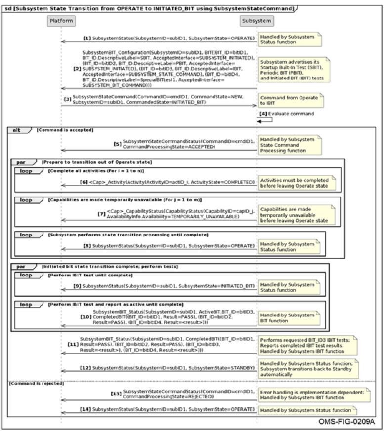

Figure 3.2.4-1 Subsystem
State Transition from OPERATE to INITIATED\_BIT using
SubsystemStateCommand Message Sequence Example

When supported, a Subsystem may be commanded to support specific BIT
tests while in an allowed state appropriate for specific BIT tests, as
advertised in the **SubsystemBIT\_Configuration** message, and without
transitioning into another state. Typically these allowed states are
STANDBY or OPERATE. Upon receipt of a **SubsystemBIT\_Command**, the
Subsystem responds by publishing a **SubsystemBIT\_CommandStatus**
message with acceptance or rejection based on whether it is in an
allowed state that is appropriate to perform the requested BIT tests. If
accepted, the Subsystem performs the requested BIT tests in its current
state and results of the BIT tests are included in the next periodic
**SubsystemBIT\_Status** message. If rejected, the Subsystem cannot
perform the requested BIT tests, which may require the Subsystem to
first be commanded into the appropriate allowed state, which uses the
Subsystem State Command Processing function defined in Section 3.2.3,
Subsystem State Command Processing.

Review the second example message sequence in Figure 3.2.4-2
**SubsystemBIT\_Command** Message Sequence Example. It shows how a
Subsystem may advertise specific Initiated BIT (IBIT) tests in a
**SubsystemBIT\_Configuration** that can be commanded using a
**SubsystemBIT\_Command**. The Subsystem must perform the BIT test in
its current state of OPERATE as a state transition is not allowed (step
1). The Subsystem advertises its available BIT tests in
**SubsystemBIT\_Configuration** (step 2), indicating four kinds of BIT
tests: bitID1 for Startup BIT (SBIT) that is Subsystem-initiated, bitID2
for Periodic BIT (PBIT) that is Subsystem-initiated, bitID3 for IBIT
that is command-initiated using the
**SubsystemStateCommand**(CommandedState**=**INITIATED\_BIT), and bitID4
for IBIT test that is command-initiated using the
**SubsystemBIT\_Command**. The Subsystem receives a
**SubsystemBIT\_Command** (step 3) to perform IBIT bitID4, which is
allowed in the OPERATE state. After verifying the
**SubsystemBIT\_Command** is valid (step 4), the Subsystem accepts the
command by responding with a **SubsystemBIT\_CommandStatus** indicating
ACCEPTED (step 5). The Subsystem performs IBIT bitID4 and may report
active test results in **SubsystemBIT\_Status** (step 6). Once
completed, the Subsystem reports completed test results in
**SubsystemBIT\_Status** (step 7) while remaining in the OPERATE state
(step 8). If the command was rejected, the Subsystem responds with a
**SubsystemBIT\_CommandStatus** indicating REJECTED (step 9) and the
Subsystem stays in the OPERATE without performing any BIT tests (step
10).

Use or modify the green text above and the example message sequences as
needed to define the Subsystem’s function behavior, including error
handling.

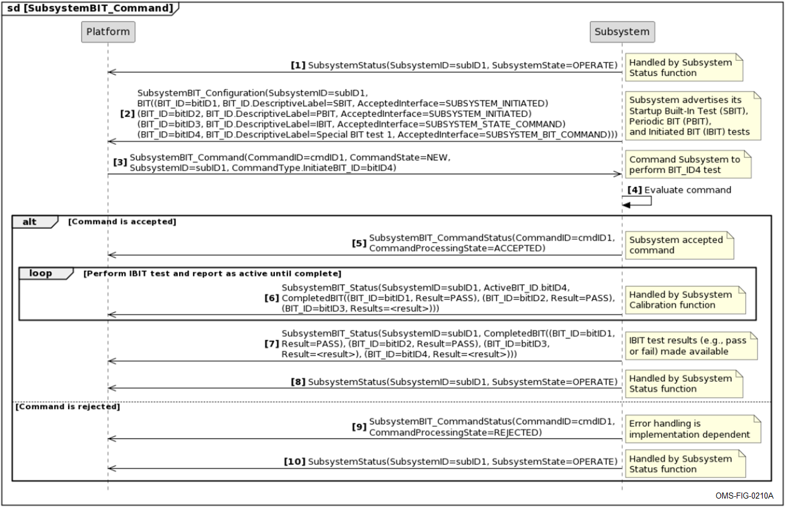

Figure 3.2.4-2
SubsystemBIT\_Command Message Sequence Example

#### Subsystem BIT Post Conditions

This section indicates the possible states during function completion.

During Startup BIT (SBIT) processing completion, the Subsystem will
typically be in the INITIALIZATION state.

During IBIT processing completion, the Subsystem will typically be in
the STANDBY state or its current state if no state transition was
required.

Examples of post conditions:

-   Output provided

-   Return codes/completion code/Security errors

-   Items updated.

This section is also used to describe any function level authentication.

#### Subsystem BIT Error Handling

This section explains the behavior if errors and exceptions occur during
the course of execution of this function.

Also describe how errors/exceptions are handled and reported by the
Subsystem, e.g., error codes table – this may point to an appendix if
the error code table is extensive.

### Subsystem Calibration

This section is only applicable for OMS Subsystems.

Subsystems that do not perform calibration processing should mark this
section as “Not Applicable” with a rationale in this section. Also add “
- N/A” to the section title header as “Subsystem Calibration – N/A” for
the updated title.

In subsections, remove all green text and populate the first empty cell
with “N/A” for any tables. Figures may be replaced with “Figure not
applicable.” Do not delete figure or table captions. Also add “ - N/A”
to figure and table captions in the subsections.

#### Subsystem Calibration Description

This section describes the Subsystem calibration function.

A Subsystem may perform calibration processing as a background task
after Subsystem initialization has completed.

A Subsystem may also perform calibration processing in a distinct
CALIBRATION state.

#### Subsystem Calibration Preconditions

The Subsystem is up and running, and is initialized. The Subsystem can
begin its calibration sequence from any state, except SHUTDOWN.

#### Subsystem Calibration Reporting Interval

This section indicates Subsystem specific modifiable configuration items
that will be provided.

If not applicable, add “This section is not applicable for this
function.” in black text.

Configuration parameter assignment for periodicity is configurable
within the range of 1 to 600 seconds in 1 second increments.

Identify your configuration parameter assignment technique here,
including the default periodicity for reporting status. Report the
default periodicity in the Inputs and Outputs Table in the next section.

#### Subsystem Calibration Inputs and Outputs

Table 3.2-5 Subsystem Calibration Inputs and Outputs, identifies the
inputs and outputs for the Subsystem Calibration function.

The cells in this table should contain detailed information per
instructions provided in Section 3.

Table 3.2-5 Subsystem
Calibration Inputs and Outputs

<table>
<thead>
<tr class="header">
<th>MP</th>
<th>IO</th>
<th>DE</th>
<th>Data Exchange Name</th>
<th>
Data Exchange Information

(e.g., Topic Name for Messages or Protocol for Data Transfers)
</th>
<th>LoM</th>
<th>P</th>
<th>Nominal Response Time or Nominal Periodic Rate</th>
<th>Max Response Time or Max Periodic Rate</th>
<th>Appendix C Mapping</th>
</tr>
</thead>
<tbody>
<tr class="odd">
<td><strong>S</strong></td>
<td>O</td>
<td>M</td>
<td>SubsystemCalibrationStatus</td>
<td>SubsystemCalibrationStatus</td>
<td>O</td>
<td>P</td>
<td>1 Hz</td>
<td>1 Hz</td>
<td>SubsystemCalibrationStatus</td>
</tr>
<tr class="even">
<td><strong>D</strong></td>
<td>O</td>
<td>M</td>
<td>SubsystemCalibrationConfiguration</td>
<td>SubsystemCalibrationConfiguration</td>
<td>O</td>
<td>P</td>
<td>1 Hz</td>
<td>1 Hz</td>
<td>SubsystemCalibrationConfiguration</td>
</tr>
<tr class="odd">
<td><strong>C</strong></td>
<td>I</td>
<td>M</td>
<td>SubsystemStateCommand</td>
<td>SubsystemStateCommand</td>
<td>O</td>
<td>A</td>
<td>N/A</td>
<td>N/A</td>
<td>SubsystemStateCommand</td>
</tr>
<tr class="even">
<td><strong>CS</strong></td>
<td>O</td>
<td>M</td>
<td>SubsystemStateCommandStatus</td>
<td>SubsystemStateCommandStatus</td>
<td>O</td>
<td>OD</td>
<td>0.5 sec</td>
<td>3 sec</td>
<td>SubsystemStateCommandStatus</td>
</tr>
<tr class="odd">
<td><strong>C</strong></td>
<td>I</td>
<td>M</td>
<td>SubsystemCalibrationCommand</td>
<td>SubsystemCalibrationCommand</td>
<td>O</td>
<td>A</td>
<td>N/A</td>
<td>N/A</td>
<td>SubsystemCalibrationCommand</td>
</tr>
<tr class="even">
<td><strong>CS</strong></td>
<td>O</td>
<td>M</td>
<td>SubsystemCalibrationCommandStatus</td>
<td>SubsystemCalibrationCommandStatus</td>
<td>O</td>
<td>OD</td>
<td>0.5 sec</td>
<td>3 sec</td>
<td>SubsystemCalibrationCommandStatus</td>
</tr>
<tr class="odd">
<td>-</td>
<td>O</td>
<td>DT</td>
<td>Log_File</td>
<td>DT</td>
<td>O</td>
<td>A</td>
<td>N/A</td>
<td>N/A</td>
<td>N/A</td>
</tr>
<tr class="even">
<td>
Column Headings &amp; Cell Abbreviations:

<ul>
<li>
MP=Message Primitive: S=Status-1; C/CS=Command-2; AR/ARS=ActionRequest-2; DR/DRS=DataRequest-2; D=Data-1; DRec=DataRecord-1
</li>
<li>
I/O=Input/Output: I=Input; O=Output
</li>
<li>
DE=Data Exchange: M=OMS Message; DT=Data Transfer; SS=Special Signal; SE=Security Exchange
</li>
<li>
LoM=Level of Mandate: M=Mandatory; O=Optional
</li>
<li>
P=Periodicity: A=Asynchronous; OD=On Demand; P=Periodic
</li>
</ul></td>
<td></td>
<td></td>
<td></td>
<td></td>
<td></td>
<td></td>
<td></td>
<td></td>
<td></td>
</tr>
</tbody>
</table>

#### Subsystem Calibration Workflow and Orchestration

This section is used to detail the sequence of interactions required for
the Subsystem Calibration function.

Function interactions may be described using a sequence diagram, state
machine, tables, and/or text.

A Sequence Diagram describes the pattern of interaction used when
invoking the operation. When a sequence diagram is used, this section
should include information on how to interpret it. It is recommended
that sequence diagrams adhere to the UML 2.0 Standard as described in
Section 3.

Use or modify the following green text and message sequences as needed
to define the Subsystem’s function behavior, including error handling.

While the Subsystem is performing its calibration processing, the
Subsystem Status function defined in Section 3.2.2, Subsystem Status,
may publish **SubsystemStatus** showing SubsystemState as
PRE\_INITIALIZATION or INITIALIZATION. The Subsystem may advertise its
calibration configuration in a **SubsystemCalibrationConfiguration**
message, which details its various calibration tests the Subsystem can
execute. The Subsystem may then periodically publish the status and
results of the calibration tests it has run in a
**SubsystemCalibrationStatus** message.

When Subsystem initialization processing is complete, the Subsystem may
transition to the STANDBY state. Otherwise, the Subsystem may require
state command processing to transition into the STANDBY state, which
uses the Subsystem State Command Processing function defined in Section
3.2.3, Subsystem State Command Processing.

Once a Subsystem transitions into its STANDBY state, a Subsystem may
begin its calibration processing as a background task until the
Subsystem eventually transitions to the SHUTDOWN state. While the
Subsystem is performing its periodic calibration processing, the
progress of the periodic calibration processing will be reported in the
periodic **SubsystemCalibrationStatus** message.

While a Subsystem is in its STANDBY or OPERATE state, upon receipt of a
**SubsystemStateCommand**(CommandedState=CALIBRATION), the Subsystem
responds by publishing a **SubsystemStateCommandStatus** message,
transitions to the CALIBRATION state, and performs its calibration
tests. Results of the calibration tests are included in the next
periodic **SubsystemCalibrationStatus** message. Once calibration
processing is complete, if the calibration tests were destructive in
nature, the Subsystem may transition automatically to the STANDBY state.
Otherwise, the Subsystem may require state command processing to
transition out of the CALIBRATION state and into the STANDBY state,
which uses the Subsystem State Command Processing function defined in
Section 3.2.3, Subsystem State Command Processing.

Review the first example sequence diagram in Figure 3.2.5-1 Subsystem
State Transition from OPERATE to CALIBRATION using
**SubsystemStateCommand** Message Sequence Example. Subsystem reports it
is in its OPERATE state (step 1). Subsystem advertises its available
Calibration tests in **SubsystemCalibrationConfiguration** (step 2),
indicating two kinds of Calibration tests: calID1 that is
Subsystem-initiated and calID2 that is command-initiated using the
**SubsystemStateCommand**(CommandedState**=** CALIBRATION). The
Subsystem receives a **SubsystemStateCommand** (step 3) to transition
the Subsystem out of its OPERATE state into the CALIBRATION state. The
Subsystem evaluates the command (step 4). If the Subsystem accepts the
command, it responds with **SubsystemStateCommandStatus** indicating
ACCEPTED (step 5). The Subsystem must cancel all of its Activities by
setting status to COMPLETED in the **\*Activity** message(s) and the
status of all its Capabilities must be set to TEMPORARILY\_UNAVAILABLE
in the **\*CapabilityStatus** message(s) as shown in the first Par box
(steps 6-7) while the Subsystem performs its state transition processing
(step 8). Once the state transition is complete, the Subsystem reports
it is now in its CALIBRATION state (step 9) and runs Calibration calID2
while in the CALIBRATION state (step 10), as shown in the second Par
box. After Calibration testing is complete, the Subsystem reports
Calibration test results in **SubsystemCalibrationStatus** (step 11) and
then automatically transitions back to its STANDBY state (step 12) where
it waits for a S**ubsystemStateCommand** back to the OPERATE state. If
the command was rejected, the Subsystem responds with
**SubsystemStateCommandStatus** indicating REJECTED (step 13) and does
not perform the state transition nor any Calibration testing (step 14).

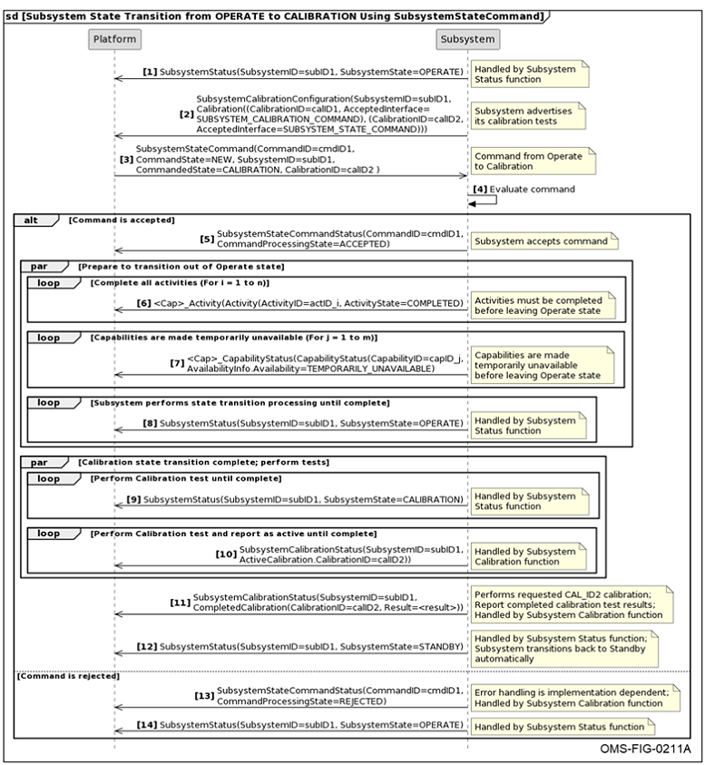

Figure 3.2.5-1 Subsystem
State Transition from OPERATE to CALIBRATION Using SubsystemStateCommand
Message Sequence Example

When supported, a Subsystem may be commanded to support specific
calibration tests while in an allowed state appropriate for specific
calibration tests, as advertised in the
**SubsystemCalibrationConfiguration** message, and without transitioning
into another state. Typically these allowed states are STANDBY or
OPERATE. Upon receipt of a **SubsystemCalibrationCommand**, the
Subsystem responds by publishing a **SubsystemCalibrationCommand
Status** message with acceptance or rejection based on whether it is in
an allowed state that is appropriate to perform the requested
calibration tests. If accepted, the Subsystem performs the requested
calibration tests in its current state and results of the calibration
tests are included in the next periodic **SubsystemCalibrationStatus**
message. If rejected, the Subsystem cannot perform the requested
calibration tests, which may require the Subsystem to first be commanded
into the appropriate state, which uses the Subsystem State Command
Processing function defined in Section 3.2.3, Subsystem State Command
Processing.

Review the second example message sequence in Figure 3.2.5-2
**SubsystemCalibrationCommand** Message Sequence Example. The message
sequence shows a Subsystem may advertise specific Calibration tests in
**SubsystemCalibrationConfiguration** that can be commanded using a
**SubsystemCalibrationCommand**. The Subsystem must perform the
Calibration test in its current state as a state transition is not
allowed (step 1). Subsystem advertises its available Calibration tests
in **SubsystemCalibrationConfiguration** (step 2), indicating two kinds
of Calibration tests: calID1 that is Subsystem-initiated and calID2 that
is command-initiated using the
**SubsystemStateCommand**(CommandedState**=** CALIBRATION). The
Subsystem receives a **SubsystemCalibrationCommand** (step 3) to perform
Calibration calID1, which is allowed in the OPERATE state. After
verifying the **SubsystemCalibrationCommand** is valid (step 4), the
Subsystem accepts the command by responding with a
**SubsystemCalibrationCommandStatus** indicating ACCEPTED (step 5). The
Subsystem performs Calibration calID1 and reports active test results in
**SubsystemCalibrationStatus** (step 6). Once completed, the Subsystem
reports completed test results in **SubsystemCalibrationStatus** (step
7) while remaining in the OPERATE state (step 8). If the command was
rejected, the Subsystem responds with a
**SubsystemCalibrationCommandStatus** indicating REJECTED (step 9) and
the Subsystem stays in the OPERATE without performing any Calibration
tests (step 10).

Use or modify the green text above and the message sequence examples as
needed to define the Subsystem’s function behavior, including error
handling.

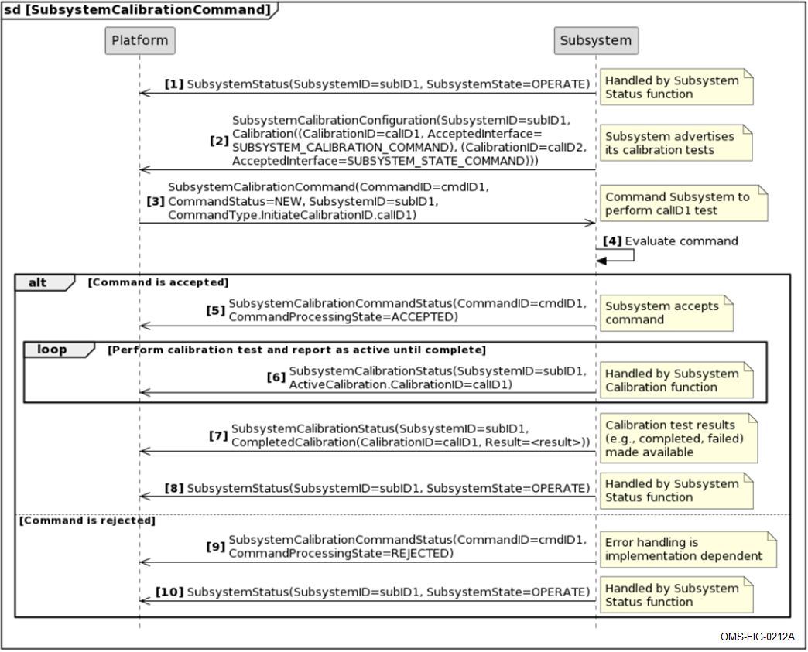

Figure 3.2.5-2
SubsystemCalibrationCommand Message Sequence Example

#### Subsystem Calibration Post Conditions

This section indicates the possible states during function completion.

During calibration processing as a background task, the Subsystem will
typically be in the STANDBY or OPERATE state, or its current state if no
state transition was required.

Examples of post conditions:

-   Output provided

-   Return codes/completion code/Security errors

-   Items updated.

This section is also used to describe any function level authentication.

#### Subsystem Calibration Error Handling

This section explains the behavior if errors and exceptions occur during
the course of execution of this function.

Also describe how errors/exceptions are handled and reported by the
Subsystem, e.g., error codes table – this may point to an appendix if
the error code table is extensive.

### Subsystem Shutdown

This section is only applicable for OMS Subsystems.

#### Subsystem Shutdown Description

This section describes the Subsystem shutdown function. Also refer to
Section 2.4, Shutdown, for additional details.

#### Subsystem Shutdown Preconditions

The Subsystem is up and running, and is initialized. The Subsystem can
begin its shutdown sequence from any state, except SHUTDOWN.

#### Subsystem Shutdown Reporting Interval

This section indicates Subsystem specific modifiable configuration items
that will be provided.

This section is not applicable for this function.

#### Subsystem Shutdown Inputs and Outputs

Table 3.2-6 Subsystem Shutdown Inputs and Outputs, identifies the inputs
and outputs for the Subsystem Shutdown function.

The cells in this table should contain detailed information per
instructions provided in Section 3.

Table 3.2-6 Subsystem
Shutdown Inputs and Outputs

<table>
<thead>
<tr class="header">
<th>MP</th>
<th>IO</th>
<th>DE</th>
<th>Data Exchange Name</th>
<th>
Data Exchange Information

(e.g., Topic Name for Messages or Protocol for Data Transfers)
</th>
<th>LoM</th>
<th>P</th>
<th>Nominal Response Time or Nominal Periodic Rate</th>
<th>Max Response Time or Max Periodic Rate</th>
<th>Appendix C Mapping</th>
</tr>
</thead>
<tbody>
<tr class="odd">
<td>C</td>
<td>I</td>
<td>M</td>
<td>SubsystemStateCommand</td>
<td>SubsystemStateCommand</td>
<td>M</td>
<td>A</td>
<td>N/A</td>
<td>N/A</td>
<td>SubsystemStateCommand</td>
</tr>
<tr class="even">
<td>CS</td>
<td>O</td>
<td>M</td>
<td>SubsystemStateCommandStatus</td>
<td>SubsystemStateCommandStatus</td>
<td>M</td>
<td>OD</td>
<td>0.5 sec</td>
<td>3 sec</td>
<td>SubsystemStateCommandStatus</td>
</tr>
<tr class="odd">
<td>-</td>
<td>O</td>
<td>DT</td>
<td>Log_File</td>
<td>DT</td>
<td>O</td>
<td>A</td>
<td>N/A</td>
<td>N/A</td>
<td>N/A</td>
</tr>
<tr class="even">
<td>
Column Headings &amp; Cell Abbreviations:

<ul>
<li>
MP=Message Primitive: S=Status-1; C/CS=Command-2; AR/ARS=ActionRequest-2; DR/DRS=DataRequest-2; D=Data-1; DRec=DataRecord-1
</li>
<li>
I/O=Input/Output: I=Input; O=Output
</li>
<li>
DE=Data Exchange: M=OMS Message; DT=Data Transfer; SS=Special Signal; SE=Security Exchange
</li>
<li>
LoM=Level of Mandate: M=Mandatory; O=Optional
</li>
<li>
P=Periodicity: A=Asynchronous; OD=On Demand; P=Periodic
</li>
</ul></td>
<td></td>
<td></td>
<td></td>
<td></td>
<td></td>
<td></td>
<td></td>
<td></td>
<td></td>
</tr>
</tbody>
</table>

#### Subsystem Shutdown Workflow and Orchestration

This section is used to detail the sequence of interactions required for
the Subsystem Shutdown function.

While the Subsystem is going through its shutdown process, the Subsystem
Status function defined in Section 3.2.2, Subsystem Status, will publish
**SubsystemStatus** showing the progress of the shutdown process until
it completes with the last message occurrence showing SubsystemState set
to SHUTDOWN.

Function interactions may be described using a sequence diagram, state
machine, tables, and/or text.

A Sequence Diagram describes the pattern of interaction used when
invoking the operation. When a sequence diagram is used, this section
should include information on how to interpret it. It is recommended
that sequence diagrams adhere to the UML 2.0 Standard as described in
Section 3.

Use or modify the following green text and message sequence(s) as needed
or provide other message sequences to define the Subsystem shutdown
behavior from various Subsystem states, as based on the Notional
Subsystem Shutdown Sequence(s) in the OMS Standard.

The first example shown in Figure 3.2.6-1 Subsystem Shutdown Processing
from Any State Except OPERATE Message Sequence Example illustrates a
simple Subsystem Shutdown process. Subsystem reports it is in any state
except OPERATE (step 1). The Subsystem receives a
**SubsystemStateCommand** to transition the Subsystem to its SHUTDOWN
state (step 2). The Subsystem evaluates the command (step 3). If the
Subsystem accepts the command, it responds with
**SubsystemStateCommandStatus** indicating ACCEPTED (step 4). The
Subsystem performs its shutdown processing (step 5). Once complete (step
6), the Subsystem reports it is now in its SHUTDOWN state (step 7) and
no further message processing will occur. Transition into the SHUTDOWN
state is permanent since SHUTDOWN is a terminal state. If the Subsystem
rejects the command, it responds with **SubsystemStateCommandStatus**
indicating REJECTED (step 8) and does not perform the state transition
or shutdown processing (step 9).

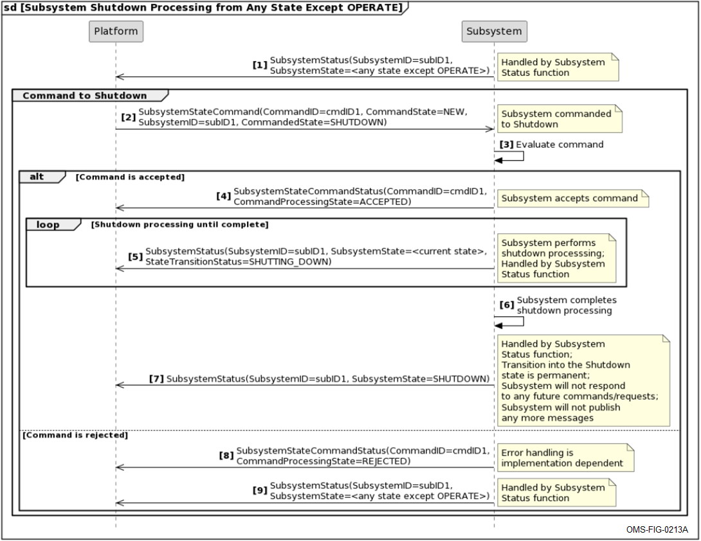

Figure 3.2.6-1 Subsystem
Shutdown Processing from Any State Except OPERATE Message Sequence
Example

The second example shown in Figure 3.2.6-2 Subsystem Shutdown Processing
from OPERATE State Message Sequence Example illustrates a message
sequence showing additional steps the Subsystem must perform to complete
all of its current Activities and disable all of its Capabilities before
starting its Subsystem Shutdown process. Subsystem reports it is in its
OPERATE state (step 1). The Subsystem receives a
**SubsystemStateCommand** to transition the Subsystem to its SHUTDOWN
state (step 2). The Subsystem evaluates the command (step 3). If the
Subsystem accepts the command, it responds with
**SubsystemStateCommandStatus** indicating ACCEPTED (step 4). The
Subsystem must complete all of its Activities by setting status to
COMPLETED in the **\*Activity** message(s) (step 5) and the status of
all its Capabilities must be set to TEMPORARILY\_UNAVAILABLE in the
**\*CapabilityStatus** message(s) as shown in the Par box (step 6) while
the Subsystem performs its state transition processing (step 7). Once
complete (step 8), the Subsystem reports it is now in its SHUTDOWN state
(step 9) and no further message processing will occur. Transition into
the SHUTDOWN state is permanent since SHUTDOWN is a terminal state. If
the Subsystem rejects the command, it responds with
**SubsystemStateCommandStatus** indicating REJECTED (step 10) and does
not perform the state transition or shutdown processing (step 11).

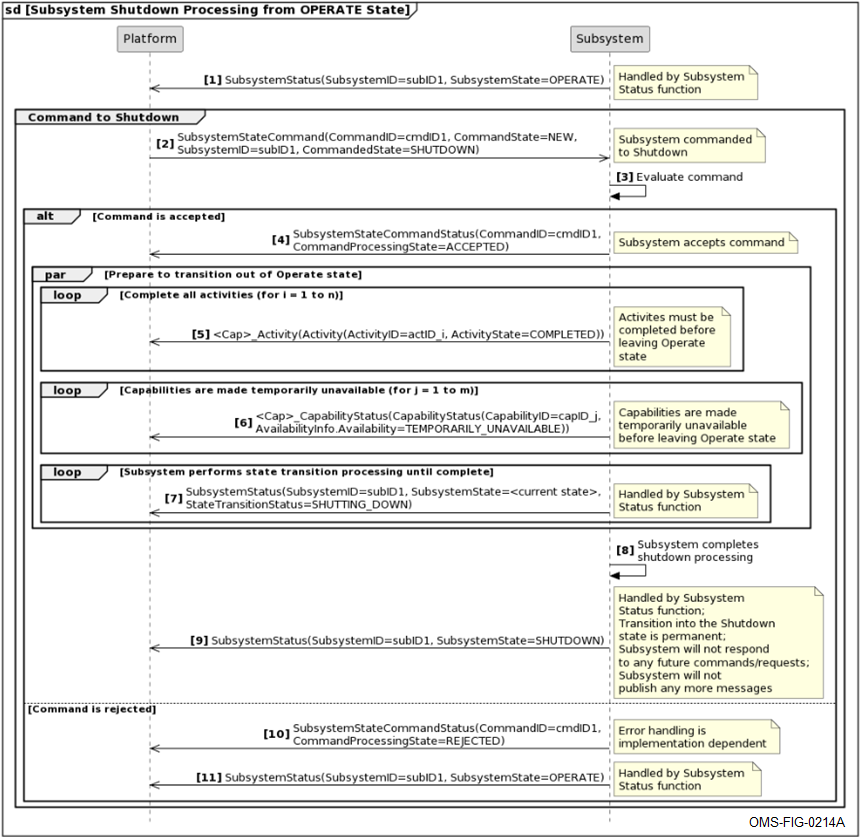

Figure 3.2.6-2 Subsystem
Shutdown Processing from OPERATE State Message Sequence Example

Use or modify green text and message sequences above as needed to define
the Subsystem shutdown behavior, as based on the Notional Subsystem
Shutdown Sequence(s) in the OMS Standard.

#### Subsystem Shutdown Post Conditions

This section indicates the possible states during function completion.

Subsystem in the SHUTDOWN state and is no longer responding, awaiting
power shutdown.

Examples of post conditions:

-   Output provided

-   Return codes/completion code/Security errors

-   Items Updated.

This section is also used to describe any function level authentication.

#### Subsystem Shutdown Error Handling

This section explains the behavior if errors and exceptions occur during
the course of execution of this function.

Also describe how errors/exceptions are handled and reported by the
Subsystem, e.g., error codes table – this may point to an appendix if
the error code table is extensive.

Required Capability-related Functions
-------------------------------------

This section may not be tailored except where indicated.

This section details the Capability-related functions provided by OMS
Subsystems and OMS Services. A Subsystem or Service that provides a
Capability is required to provide these functions to ensure that all
Subsystems and Services have a basic level of communication with one
another.

This section only applies to Subsystems or Services that provide a
Capability. It does not apply to Isolators since an Isolator cannot
bring a Capability on its own. Isolators providing OMS Messages external
to the Mission Package that may include Capability family messages
should be documented in one or more functions in Section 3.4.1 or
greater.

A Subsystem, Service, or Isolator that does not provide a Capability
should mark this section as “Not Applicable” with a rationale only in
this section. Also add “ - N/A” to read “Required Capability-related
Functions – N/A” as the updated section title header. In the
subsections, remove all green text and populate “N/A” in the first empty
cell of any tables. Figures may be replaced with “Figure not
applicable.” Do not delete figure or table captions. Instead, add “ -
N/A” to figure and table captions in the subsections.

### Position Information Processing

This section describes the Position Information Processing function that
supports Capabilities.

This section is only applicable for Subsystems and Services providing a
Capability that is dependent on having position information to
accomplish its mission.

Mark as “Not Applicable” if position information is not required for the
Capability.

#### Position Information Processing Description

This section describes the Position Information Processing function to
subscribe to periodic **PositionReport** or **PositionReportDetailed**
messages.

#### Position Information Processing Preconditions

The Subsystem has initialized and is in the STANDBY state or an
Operational state (e.g., OPERATE), or the Service has initialized and is
in the NORMAL state. Network connection must be established to allow
receipt and publication of messages.

#### Position Information Processing Reporting Interval

This section indicates Service specific modifiable configuration items
that will be provided.

This section is not applicable for this function.

#### Position Information Processing Inputs and Outputs

Table 3.3-1, Position Information Processing Inputs and Outputs,
identifies the inputs and outputs for the Position Information
Processing function.

The cells in this table should contain detailed information per
instructions provided in Section 3.

For example, the green text rows below show both position report
messages. Change green text to black text for the applicable row(s)
being used and remove any green text row not being used.

Table 3.3-1 Position
Information Processing Inputs and Outputs

<table>
<thead>
<tr class="header">
<th>MP</th>
<th>IO</th>
<th>DE</th>
<th>Data Exchange Name</th>
<th>
Data Exchange Information

(e.g., Topic Name for Messages or Protocol for Data Transfers)
</th>
<th>LoM</th>
<th>P</th>
<th>Nominal Response Time or Nominal Periodic Rate</th>
<th>Max Response Time or Max Periodic Rate</th>
<th>Appendix C Mapping</th>
</tr>
</thead>
<tbody>
<tr class="odd">
<td>D</td>
<td>I</td>
<td>M</td>
<td>PositionReport</td>
<td><strong>PositionReport</strong></td>
<td>M</td>
<td>P</td>
<td>1 Hz</td>
<td>1 Hz</td>
<td><strong>PositionReport</strong></td>
</tr>
<tr class="even">
<td>D</td>
<td>I</td>
<td>M</td>
<td>PositionReportDetailed</td>
<td><strong>PositionReportDetailed</strong></td>
<td>M</td>
<td>P</td>
<td>50 Hz</td>
<td>50 Hz</td>
<td><strong>PositionReportDetailed</strong></td>
</tr>
<tr class="odd">
<td>
Column Headings &amp; Cell Abbreviations:

<ul>
<li>
MP=Message Primitive: S=Status-1; C/CS=Command-2; AR/ARS=ActionRequest-2; DR/DRS=DataRequest-2; D=Data-1; DRec=DataRecord-1
</li>
<li>
I/O=Input/Output: I=Input; O=Output
</li>
<li>
DE=Data Exchange: M=OMS Message; DT=Data Transfer; SS=Special Signal; SE=Security Exchange
</li>
<li>
LoM=Level of Mandate: M=Mandatory; O=Optional
</li>
<li>
P=Periodicity: A=Asynchronous; OD=On Demand; P=Periodic
</li>
</ul></td>
<td></td>
<td></td>
<td></td>
<td></td>
<td></td>
<td></td>
<td></td>
<td></td>
<td></td>
</tr>
</tbody>
</table>

#### Position Information Processing Workflow and Orchestration

This section is used to detail the sequence of interactions required for
the Position Information Processing function.

Upon receipt of a **PositionReport** or **PositionReportDetailed**
message, the Subsystem or Service retains the position information for
use by the Capability.

Function interactions may be described using a sequence diagram, state
machine, tables, and/or text.

A Sequence Diagram describes the pattern of interaction used when
invoking the function. When a sequence diagram is used, this section
should include information on how to interpret it. It is recommended
that sequence diagrams adhere to the UML 2.0 Standard as described in
Section 3.

Use or modify the following green text and message sequences as needed
to define the function behavior, including error handling.

Two examples follow. Example 1 shown in Figure 3.3.1-1 Position Report
Message Sequence Example is a message sequence illustrating a Service
subscribing to **PositionReport**. Example 2 shown in Figure 3.3.1-2
Position Report Detailed Message Sequence Example is a message sequence
illustrating a Subsystem subscribing to **PositionReportDetailed**.

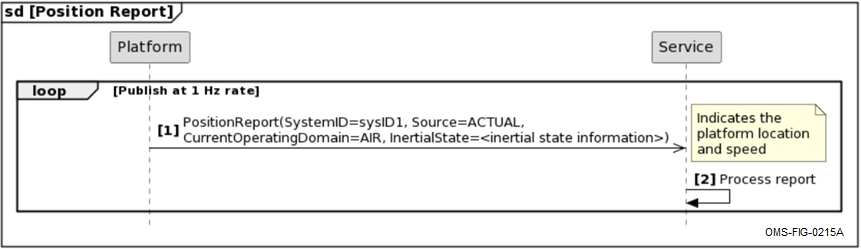

Figure 3.3.1-1 Position
Report Message Sequence Example

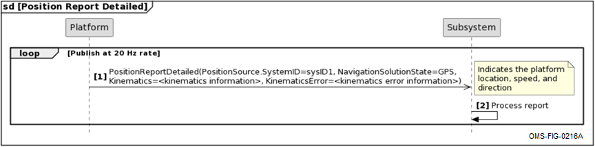

Figure 3.3.1-2 Position
Report Detailed Message Sequence Example

#### Position Information Processing Post Conditions

This section indicates the possible states during function completion.

This function will not cause a state change.

Examples of post conditions:

-   Output provided

-   Return codes/completion code/Security errors

-   Items updated.

This section is also used to describe any function level authentication.

#### Position Information Processing Error Handling

This section explains the behavior if errors and exceptions occur during
the course of execution of this function.

Also describe how errors/exceptions are handled and reported by the
Subsystem, e.g., error codes table – this may point to an appendix if
the error code table is extensive.

### \[CapabilityName\] Capability-related Functions

This section describes the \[CapabilityName\] Capability-related
functions.

This section is applicable for Subsystems and Services providing a
Capability.

Replace \[CapabilityName\] with name of Capability in this heading
(e.g., ESM) and all headings in its subsections. This may also apply to
occurrences found in black and green text in paragraphs and tables.

IMPORTANT: Copy this entire Section 3.3.2 for each additional
Capability.

#### \[CapabilityName\] Capability and Capability Status

This section describes the \[CapabilityName\] Capability and Capability
Status function.

This function publishes **\[CapabilityName\]Capability** and
**\[CapabilityName\]CapabilityStatus** messages.

Availability of Capabilities are initially DISABLED until they are
enabled as defined in Section 3.3.2.2, \[CapabilityName\] Capability
Enable/Disable function.

##### \[CapabilityName\] Capability and Capability Status Description

This section describes the Capability and Capability Status function,
which publishes specific **\[CapabilityName\]Capability** and
**\[CapabilityName\]CapabilityStatus** messages periodically.

Example messages for an ESM Capability are **ESM\_Capability** and
**ESM\_CapabilityStatus**.

##### \[CapabilityName\] Capability and Capability Status Preconditions

The Subsystem has initialized and is in the STANDBY state or an
Operational state (e.g., OPERATE) or the Service has initialized and is
in the NORMAL state.

##### \[CapabilityName\] Capability and Capability Status Reporting Interval

This section indicates Service specific modifiable configuration items
that will be provided.

Configuration parameter assignment for periodicity is configurable
within the range of 1 to 600 seconds in 1 second increments.

Identify your configuration parameter assignment technique here,
including the default periodicity for reporting status. Report the
default periodicity in the Inputs and Outputs Table in the next section.

##### \[CapabilityName\] Capability and Capability Status Inputs and Outputs

Table 3.3-2, \[CapabilityName\] Capability and Capability Status Inputs
and Outputs, identifies the inputs and outputs for the
\[CapabilityName\] Capability and Capability Status function.

The cells in this table should contain detailed information per
instructions provided in Section 3.

For example, the green text rows below are shown for the ESM Capability.

Table 3.3-2
\[CapabilityName\] Capability and Capability Status Inputs and Outputs

<table>
<thead>
<tr class="header">
<th>MP</th>
<th>IO</th>
<th>DE</th>
<th>Data Exchange Name</th>
<th>
Data Exchange Information

(e.g., Topic Name for Messages or Protocol for Data Transfers)
</th>
<th>LoM</th>
<th>P</th>
<th>Nominal Response Time or Nominal Periodic Rate</th>
<th>Max Response Time or Max Periodic Rate</th>
<th>Appendix C Mapping</th>
</tr>
</thead>
<tbody>
<tr class="odd">
<td>D</td>
<td>O</td>
<td>M</td>
<td>ESM_Capability</td>
<td>ESM_Capability</td>
<td>M</td>
<td>P</td>
<td>1 Hz</td>
<td>1 Hz</td>
<td>ESM_Capability</td>
</tr>
<tr class="even">
<td>S</td>
<td>O</td>
<td>M</td>
<td>ESM_CapabilityStatus</td>
<td>ESM_CapabilityStatus</td>
<td>M</td>
<td>P</td>
<td>1 Hz</td>
<td>1 Hz</td>
<td>ESM_CapabilityStatus</td>
</tr>
<tr class="odd">
<td>
Column Headings &amp; Cell Abbreviations:

<ul>
<li>
MP=Message Primitive: S=Status-1; C/CS=Command-2; AR/ARS=ActionRequest-2; DR/DRS=DataRequest-2; D=Data-1; DRec=DataRecord-1
</li>
<li>
I/O=Input/Output: I=Input; O=Output
</li>
<li>
DE=Data Exchange: M=OMS Message; DT=Data Transfer; SS=Special Signal; SE=Security Exchange
</li>
<li>
LoM=Level of Mandate: M=Mandatory; O=Optional
</li>
<li>
P=Periodicity: A=Asynchronous; OD=On Demand; P=Periodic
</li>
</ul></td>
<td></td>
<td></td>
<td></td>
<td></td>
<td></td>
<td></td>
<td></td>
<td></td>
<td></td>
</tr>
</tbody>
</table>

##### \[CapabilityName\] Capability and Capability Status Workflow and Orchestration

This section is used to detail the sequence of interactions required for
the **\[CapabilityName\]** Capability and Capability Status function.

Function interactions may be described using a sequence diagram, state
machine, tables, and/or text.

A Sequence Diagram describes the pattern of interaction used when
invoking the operation. When a sequence diagram is used, this section
should include information on how to interpret it. It is recommended
that sequence diagrams adhere to the UML 2.0 Standard as described in
Section 3.

Modify or add the following green text and message sequence as needed or
provide other message sequences to define the function’s behavior.

Initially, a Capability’s Availability is DISABLED.

Capabilities are enabled/disabled as defined in Section 3.3.2.2.

A Capability has a defined state behavior as shown in Figure 3.3-1,
CapabilityAvailability State Diagram, that is reported as Availability
in the **\[CapabilityName\]CapabilityStatus** messages. Only the defined
state enumerations and transitions are allowed. A defined state or
transition is not required to be used, but if a state or transition is
supported, it must be used as intended.

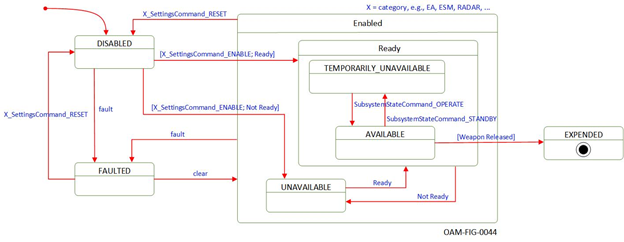

Figure 3.3-1
CapabilityAvailability State Diagram

An example Capability using the ESM domain follows in Figure 3.3.2-1 ESM
Capability & Capability Status Function Message Sequence Example. In
this example, the Subsystem publishes its available Capabilities such as
Acquisition and Geolocation using **ESM\_Capability**, and then provides
Capability Availability status using **ESM\_CapabilityStatus**.

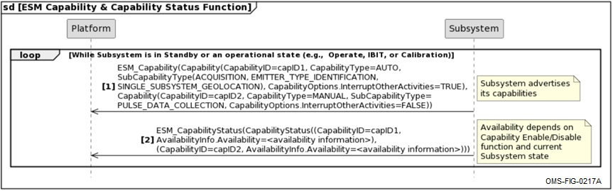

Figure 3.3.2-1 ESM
Capability & Capability Status Function Message Sequence Example

##### \[CapabilityName\] Capability and Capability Status Post Conditions

This section indicates the possible states during function completion.

Examples of post conditions:

-   Output provided

-   Return codes/completion code/Security errors

-   Items updated.

This section is also used to describe any function level authentication.

##### \[CapabilityName\] Capability and Capability Status Error Handling

This section explains the behavior if errors and exceptions occur during
the course of execution of this function.

Also describe how errors/exceptions are handled and reported by the
Subsystem or Service, e.g., error codes table – this may point to an
appendix if the error code table is extensive.

#### \[CapabilityName\] Capability Enable/Disable 

This section describes the \[CapabilityName\] Capability Enable/Disable
function.

This section is applicable for Subsystems and Services providing a
Capability.

##### \[CapabilityName\] Capability Enable/Disable Description

This section describes the \[CapabilityName\] Capability Enable/Disable
function, which subscribes to **\[CapabilityName\]SettingsCommand**
messages and publishes **\[CapabilityName\]SettingsCommandStatus**
response messages.

Example messages for an ESM Capability are **ESM\_SettingsCommand** and
**ESM\_SettingsCommandStatus**.

##### \[CapabilityName\] Capability Enable/Disable Preconditions

The Subsystem has initialized and is in the STANDBY state or an
Operational state (e.g., OPERATE) or the Service has initialized and is
in the NORMAL state. Network connection must be established to allow
receipt and publication of messages.

##### \[CapabilityName\] Capability Enable/Disable Reporting Interval

This section indicates Service specific modifiable configuration items
that will be provided.

This is not applicable for this function.

##### \[CapabilityName\] Capability Enable/Disable Inputs and Outputs

Table 3.3-3, \[CapabilityName\] Capability Enable/Disable Inputs and
Outputs, identifies the inputs and outputs for the \[CapabilityName\]
Capability Enable/Disable Reporting function.

The cells in this table should contain detailed information per
instructions provided in Section 3.

For example, the green text rows below are shown for the ESM Capability.

Table 3.3-3
\[CapabilityName\] Capability Enable/Disable Inputs and Outputs

<table>
<thead>
<tr class="header">
<th>MP</th>
<th>IO</th>
<th>DE</th>
<th>Data Exchange Name</th>
<th>
Data Exchange Information

(e.g., Topic Name for Messages or Protocol for Data Transfers)
</th>
<th>LoM</th>
<th>P</th>
<th>Nominal Response Time or Nominal Periodic Rate</th>
<th>Max Response Time or Max Periodic Rate</th>
<th>Appendix C Mapping</th>
</tr>
</thead>
<tbody>
<tr class="odd">
<td>C</td>
<td>I</td>
<td>M</td>
<td>ESM_SettingsCommand</td>
<td>ESM_SettingsCommand</td>
<td>M</td>
<td>A</td>
<td>N/A</td>
<td>N/A</td>
<td>ESM_SettingsCommand</td>
</tr>
<tr class="even">
<td>CS</td>
<td>O</td>
<td>M</td>
<td>ESM_SettingsCommandStatus</td>
<td>ESM_SettingsCommandStatus</td>
<td>M</td>
<td>OD</td>
<td>TBD</td>
<td>TBD</td>
<td>ESM_SettingsCommandStatus</td>
</tr>
<tr class="odd">
<td>
Column Headings &amp; Cell Abbreviations:

<ul>
<li>
MP=Message Primitive: S=Status-1; C/CS=Command-2; AR/ARS=ActionRequest-2; DR/DRS=DataRequest-2; D=Data-1; DRec=DataRecord-1
</li>
<li>
I/O=Input/Output: I=Input; O=Output
</li>
<li>
DE=Data Exchange: M=OMS Message; DT=Data Transfer; SS=Special Signal; SE=Security Exchange
</li>
<li>
LoM=Level of Mandate: M=Mandatory; O=Optional
</li>
<li>
P=Periodicity: A=Asynchronous; OD=On Demand; P=Periodic
</li>
</ul></td>
<td></td>
<td></td>
<td></td>
<td></td>
<td></td>
<td></td>
<td></td>
<td></td>
<td></td>
</tr>
</tbody>
</table>

##### \[CapabilityName\] Capability Enable/Disable Workflow and Orchestration

This section is used to detail the sequence of interactions required for
the \[CapabilityName\] Capability Enable/Disable function.

Function interactions may be described using a sequence diagram, state
machine, tables, and/or text.

A Sequence Diagram describes the pattern of interaction used when
invoking the function.

When a sequence diagram is used, this section should include information
on how to interpret it. It is recommended that sequence diagrams adhere
to the UML 2.0 Standard as described in Section 3.

Modify or add the following green text and message sequences as needed
or provide other message sequences to define the function’s behaviors,
including error handling.

A Subsystem or Service may receive a
**\[CapabilityName\]SettingsCommand** and responds with a
**\[CapabilityName\] SettingsCommandStatus** message.

Initially, a Capability’s Availability is typically set to DISABLED as
shown in the Figure 3.3-1, CapabilityAvailability State Diagram. A
**\[CapabilityName\]SettingsCommand** is sent to enable one or more
Capabilities, which is typically received while the Subsystem is in its
STANDBY state, but this could so also occur if the Subsystem is already
in the OPERATE state. A **\[CapabilityName\]SettingsCommandStatus**
response of ACCEPTED is sent and the identified Capability/Capabilities
Availability move into the TEMPORARILY\_UNAVAILABLE state (if the
Subsystem is in the STANDBY state) or directly to AVAILABLE (if the
Subsystem is in the OPERATE state). For Services, the Capability
Availability moves directly to AVAILABLE.

Once Capability Availability is AVAILABLE, the Subsystem or Service can
automatically spawn an activity indicated by
**\[CapabilityName\]Activity** as allowed using defined MDFs of
behaviors. If a **\[CapabilityName\]Command** is needed to spawn an
activity, the Service or Subsystem must wait to receive it and follow
with a **\[CapabilityName\]CommandStatus** and
**\[CapabilityName\]Activity** (if command was accepted). Note that
capability commands and their spawned activities are only allowed while
the Subsystem is in its OPERATE state or the Service is in its NORMAL
state.

An example sequence diagram to enable Capabilities in the ESM Subsystem
using **ESM\_SettingsCommand** is shown in Figure 3.3.2-2 ESM Capability
Enable Function Message Sequence Example. Notice the progression of the
Capability Availability states from DISABLED to
TEMPORARAILY\_UNAVAILABLE to AVAILABLE during the process of moving the
Subsystem from STANDBY to OPERATE. Subsystem reports it is in its
STANDBY state (step 1). The Subsystem sends an **ESM\_Capability** to
advertise its available Capabilities in (step 2), indicating two
Capabilities: AUTO capID1 that is Subsystem-initiated and MANUAL capID2
that is command-initiated using the **ESM\_Command**. The Subsystem then
sends an **ESM\_CapabilityStatus** to advertise the availability status
of its Capabilities as DISABLED for both AUTO capID1 and MANUAL capID2
(step 3). The Subsystem receives an **ESM\_SettingsCommand** (step 4) to
enable the Subsystem’s Capabilities. The Subsystem evaluates the command
(step 5). If the Subsystem accepts the command, it responds with
**ESM\_SettingsCommandStatus** indicating ACCEPTED (step 6) and sends
another **ESM\_CapablilityStatus** (step 7) indicating the availability
status of its Capabilities as TEMPORARILY\_UNAVAILABLE. The Subsystem
receives a **SubsystemStateCommand** to transition to the OPERATE state
(step 8). The Subsystem evaluates the command (step 9). If the Subsystem
accepts the command, it responds with **SubsystemStateCommandStatus**
indicating ACCEPTED (step 10) and then performs its state transition
processing. Once completed, Subsystem reports it is now in its OPERATE
state (step 11). The Subsystem sends another **ESM\_CapablilityStatus**
(step 12) indicating the availability status of its Capabilities as
AVAILABLE. If the **ESM\_SettingsCommand** was rejected, the Subsystem
responds with **ESM\_SettingsCommandStatus** indicating REJECTED (step
13) and the availability status of the Capabilities remains as
TEMPORARILY\_UNAVAILABLE (step 14). If the **SubsystemStateCommand** was
rejected, the Subsystem responds with **SubsystemStateCommandStatus**
indicating REJECTED (step 15) and does not perform the state transition
to OPERATE; the availability status of the Capabilities remains DISABLED
(step 16).

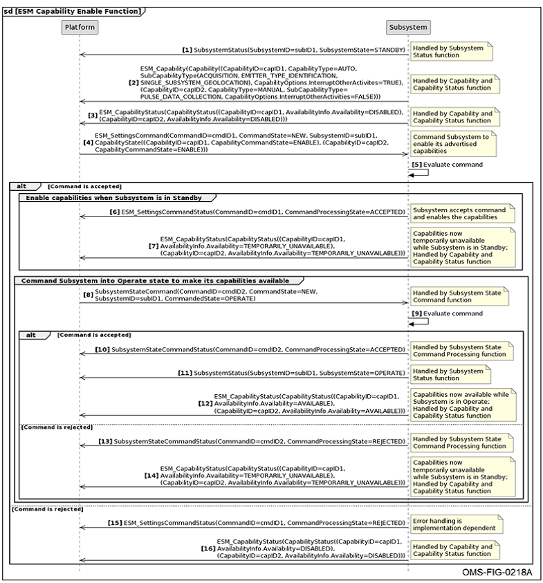

Figure 3.3.2-2 ESM
Capability Enable Function Message Sequence Example

An example sequence diagram to disable Capabilities in the ESM domain
using **ESM\_SettingsCommand** is shown in Figure 3.3.2-3 ESM Capability
Disable Function Message Sequence Example. Subsystem reports it is in
its OPERATE state (step 1). The Subsystem sends an **ESM\_Capability**
to advertise its available Capabilities in (step 2), indicating two
Capabilities: AUTO capID1 that is Subsystem-initiated and MANUAL capID2
that is command-initiated using the **ESM\_Command**. The Subsystem then
sends an **ESM\_CapabilityStatus** to advertise the availability status
of its Capabilities as DISABLED for both AUTO capID1 and MANUAL capID2
(step 3). The Subsystem receives an **ESM\_SettingsCommand** (step 4) to
disable the Subsystem’s Capabilities. The Subsystem evaluates the
command (step 5). If the Subsystem accepts the command, it responds with
**ESM\_SettingsCommandStatus** indicating ACCEPTED (step 6) and sends
another **ESM\_CapablilityStatus** (step 7) indicating the availability
status of its Capabilities as TEMPORARILY\_UNAVAILABLE. If the command
was rejected, the Subsystem responds with **ESM\_SettingsCommandStatus**
indicating REJECTED (step 8) and the availability status of the
Capabilities remains as AVAILABLE (step 9).

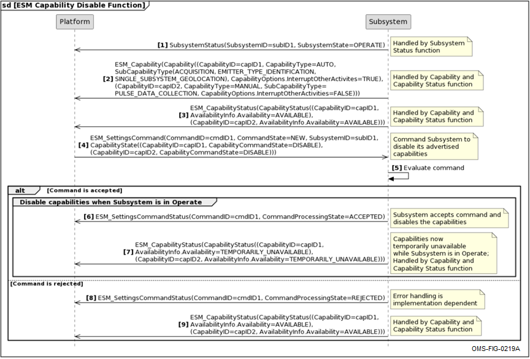

Figure 3.3.2-3 ESM
Capability Disable Function Message Sequence Example

##### \[CapabilityName\] Capability Enable/Disable Post Conditions

This section indicates the possible states during function completion.

Examples of post conditions:

-   Output provided

-   Return codes/completion code/Security errors

-   Items updated.

This section is also used to describe any function level authentication.

##### \[CapabilityName\] Capability Enable/Disable Error Handling

This section explains the behavior if errors and exceptions occur during
the course of execution of this function.

Also describe how errors/exceptions are handled and reported by the
Subsystem or Service, e.g., error codes table – this may point to an
appendix if the error code table is extensive

#### \[CapabilityName\] Capability Operations

This section describes the \[CapabilityName\] Capability Operations
function.

This section is applicable for Subsystems and Services providing a
Capability.

##### \[CapabilityName\] Capability Operations Description

This section describes the \[CapabilityName\] Capability Operations
function that performs a Capability.

##### \[CapabilityName\] Capability Operations Preconditions

The Subsystem has initialized and is in the OPERATE state or the Service
has initialized and is in the NORMAL state. Network connection must be
established to allow receipt and publication of messages.

##### \[CapabilityName\] Capability Operations Reporting Interval

This section indicates Service specific modifiable configuration items
that will be provided.

If not applicable, add “This section is not applicable.” in black text.

Configuration parameter assignment for periodicity is configurable
within the range of 1 to 600 seconds in 1 second increments.

Identify your configuration parameter assignment technique here,
including the default periodicity for reporting status. Report the
default periodicity in the Inputs and Outputs Table in the next section.

##### \[CapabilityName\] Capability Operations Inputs and Outputs

Table 3.3-4, \[CapabilityName\] Capability Operations Inputs and
Outputs, identifies the inputs and outputs for the \[CapabilityName\]
Capability Operations function.

The cells in this table should contain detailed information per
instructions provided in Section 3.

For example, the first 2 green text rows below may apply to an ESM
Capability.

For example, the last 3 green text rows below may apply to a PO/POST
Capability.

Table 3.3-4
\[CapabilityName\] Capability Operations Inputs and Outputs

<table>
<thead>
<tr class="header">
<th>MP</th>
<th>IO</th>
<th>DE</th>
<th>Data Exchange Name</th>
<th>
Data Exchange Information

(e.g., Topic Name for Messages or Protocol for Data Transfers)
</th>
<th>LoM</th>
<th>P</th>
<th>Nominal Response Time or Nominal Periodic Rate</th>
<th>Max Response Time or Max Periodic Rate</th>
<th>Appendix C Mapping</th>
</tr>
</thead>
<tbody>
<tr class="odd">
<td>D</td>
<td>O</td>
<td>M</td>
<td>Entity</td>
<td>Entity</td>
<td>M</td>
<td>A</td>
<td>N/A</td>
<td>N/A</td>
<td>Entity</td>
</tr>
<tr class="even">
<td>D</td>
<td>O</td>
<td>M</td>
<td>SignalReport</td>
<td>SignalReport</td>
<td>M</td>
<td>A</td>
<td>N/A</td>
<td>N/A</td>
<td>SignalReport</td>
</tr>
<tr class="odd">
<td>D</td>
<td>O</td>
<td>M</td>
<td>ProductMetadata</td>
<td>ProductMetadata</td>
<td>M</td>
<td>A</td>
<td>N/A</td>
<td>N/A</td>
<td>ProductMetadata</td>
</tr>
<tr class="even">
<td>D</td>
<td>O</td>
<td>M</td>
<td>ProductLocation</td>
<td>ProductLocation</td>
<td>M</td>
<td>A</td>
<td>N/A</td>
<td>N/A</td>
<td>ProductLocation</td>
</tr>
<tr class="odd">
<td>-</td>
<td>O</td>
<td>DT</td>
<td>ImageFile</td>
<td>NFS [Image, JPEG, Shared Use]</td>
<td>M</td>
<td>A</td>
<td>N/A</td>
<td>N/A</td>
<td>TBD</td>
</tr>
<tr class="even">
<td>
Column Headings &amp; Cell Abbreviations:

<ul>
<li>
MP=Message Primitive: S=Status-1; C/CS=Command-2; AR/ARS=ActionRequest-2; DR/DRS=DataRequest-2; D=Data-1; DRec=DataRecord-1
</li>
<li>
I/O=Input/Output: I=Input; O=Output
</li>
<li>
DE=Data Exchange: M=OMS Message; DT=Data Transfer; SS=Special Signal; SE=Security Exchange
</li>
<li>
LoM=Level of Mandate: M=Mandatory; O=Optional
</li>
<li>
P=Periodicity: A=Asynchronous; OD=On Demand; P=Periodic
</li>
</ul></td>
<td></td>
<td></td>
<td></td>
<td></td>
<td></td>
<td></td>
<td></td>
<td></td>
<td></td>
</tr>
</tbody>
</table>

##### \[CapabilityName\] Capability Operations Workflow and Orchestration

This section is used to detail the sequence of interactions required for
the \[CapabilityName\] Capability Operations function.

Subsystem must be in the OPERATE state or Service must be in the NORMAL
state, and Capability is enabled as defined in Section 3.3.2.2.

Function interactions may be described using a sequence diagram, state
machine, tables, and/or text.

A Sequence Diagram describes the pattern of interaction used when
invoking the function.

When a sequence diagram is used, this section should include information
on how to interpret it. It is recommended that sequence diagrams adhere
to the UML 2.0 Standard as described in Section 3.

Modify or add the following green text and message sequences as needed
or provide other message sequences to define the function’s behaviors,
including error handling.

Three examples follow. The first example shown in Figure 3.3.2-4 ESM
AUTO Operations Message Sequence Example is a message sequence that
pertaining to ESM Auto Capability Operations. This message sequence
assumes that the Subsystem is in its OPERATE state (step 1) and its
advertised AUTO Capability (capID1) and its MANUAL Capability (capID2)
using **ESM\_Capability** message (step 2) are both AVAILABLE as shown
in the **ESM\_CapabilityStatus** message (step 3). Subsystem can now
spawn an Activity (actID1) automatically using **ESM\_Activity** message
(step 4). Step 5 shows that the ESM detected a new signal and creates a
new **SignalReport** for sigID1 (step 6). A new **Entity** (entID1) is
reported to associate signal sigID1 with entID1 (step 7). As long as the
same signal is re-detected (step 8), ESM will continue to report
**SignalReport** and **Entity** associated pair of messages (steps
9-11). Once the ESM Subsystem no longer detects sigID1 after a specified
time (step 12), then ESM will publish a final pair of **SignalReport**
and **Entity** messages showing the signal was REMOVED (step 13) and the
**Entity** was DROPPED (step 14). ESM continues Activity for its AUTO
Capability (step 15).

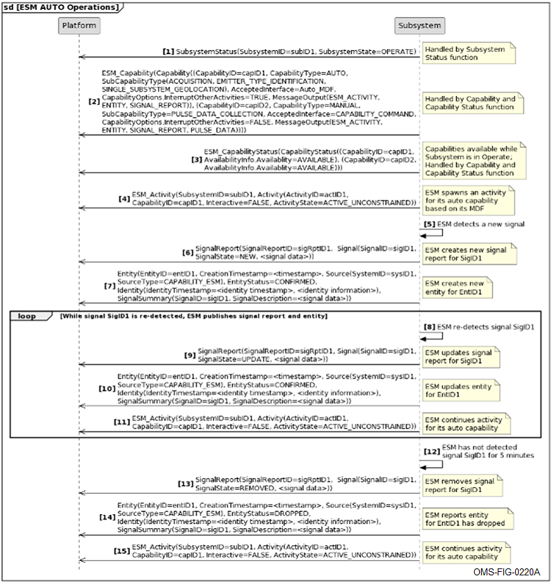

Figure 3.3.2-4 ESM AUTO
Operations Message Sequence Example

The second example shown in Figure 3.3.2-5 ESM MANUAL Operations Message
Sequence Example is a message sequence that pertains to ESM Manual
Capability Operations. This message sequence also assumes that the
Subsystem is in its OPERATE state (step 1) and its advertised AUTO
Capability (capID1) and its MANUAL Capability (capID2) using
**ESM\_Capability** message (step 2) are both AVAILABLE as shown in the
**ESM\_CapabilityStatus** message (step 3). Subsystem spawns an Activity
(actID1) automatically using **ESM\_Activity** message (step 4). Step 5
shows that the ESM detected a new signal and creates a new
**SignalReport** for sigID (step 6)1. A new **Entity** (entID1) is
reported to associate signal sigID1 with entID1 (step 7). At this point,
the Subsystem receives an **ESM\_Command** to perform a pulse data
collection (step 8). The Subsystem evaluates the command (step 9) and if
it is accepted, the Subsystem responds with an **ESM\_CommandStatus**
indicating ACCEPTED (step 10). Subsystem spawns a second Activity
(actID2) using **ESM\_Activity** message (step 11). The Subsystem
performs the pulse data collection (step 12) and publishes the results
in a **PulseData** message (step 13). The Subsystem then publishes an
**ESM\_Activity** for actID2 indicating the collection is complete (step
14). Rejection of the **ESM\_Command** is shown where
**ESM\_CommandStatus** indicates REJECTED (step 15) and no collection is
performed.

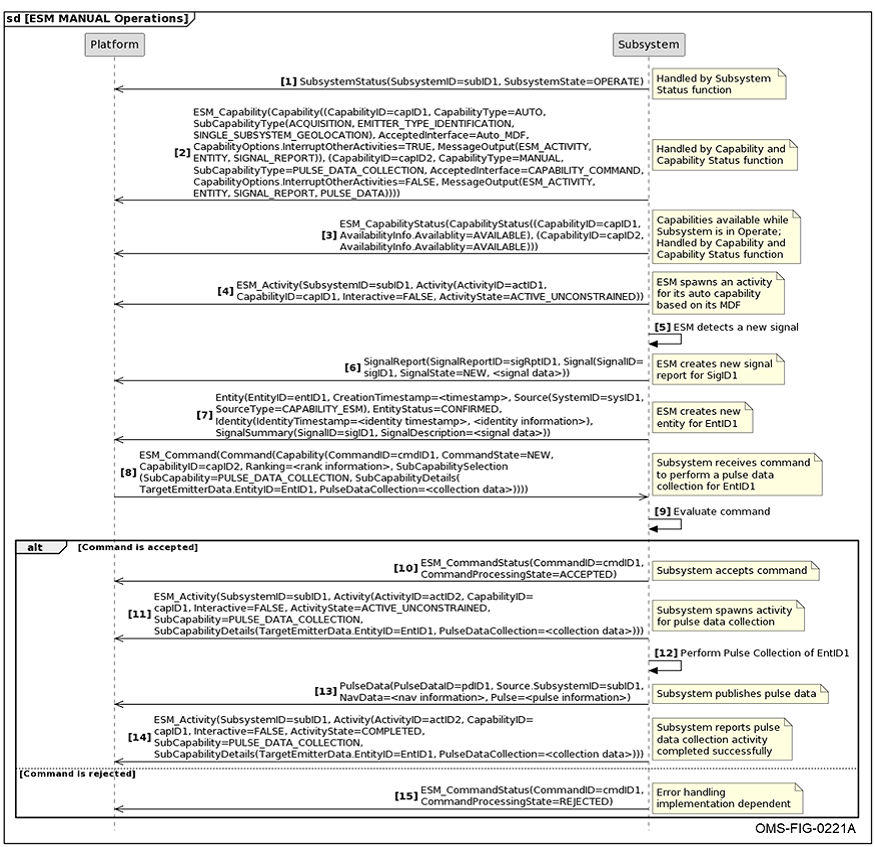

Figure 3.3.2-5 ESM MANUAL
Operations Message Sequence Example

The third example shown in Figure 3.3.2-6, Passive Optical Image Sent
Using Data Transfer Message Sequence Example, is a message sequence that
pertains to data transfer of PO images. This message sequence assumes
that the Subsystem is in its OPERATE state (step 1) and its advertised
PO Capability (capID1) using **PO\_Capability** message (step 2) is
AVAILABLE as shown in the **PO\_CapabilityStatus** message (step 3).
Upon receipt of a **PO\_Command** message to perform an image collection
(step 4), the Subsystem evaluates the command (step 5) and if it is
accepted, the Subsystem responds with a **PO\_CommandStatus** indicating
ACCEPTED (step 6). The Subsystem spawns an Activity (actID1) using
**PO\_Activity** message (step 7) to indicate the Activity is ENABLED.
The Subsystem then uses the same Activity (actID1) to activate the image
collection (step 8). The Subsystem performs image collection (Step 9)
and advertises the image identification and description using the
**ProductMetadata** message (step 10), and the image location using the
**ProductLocation** message (step 11). Upon successful image collection
completion, the Subsystem reports COMPLETED using the **PO\_Activity**
message (step 12). Upon receipt of the completed image collection, the
Platform retrieves the image using data transfer (Step 13). Rejection of
the **PO\_Command** is shown where **PO\_CommandStatus** indicates
REJECTED (step 14) and no collection is performed.

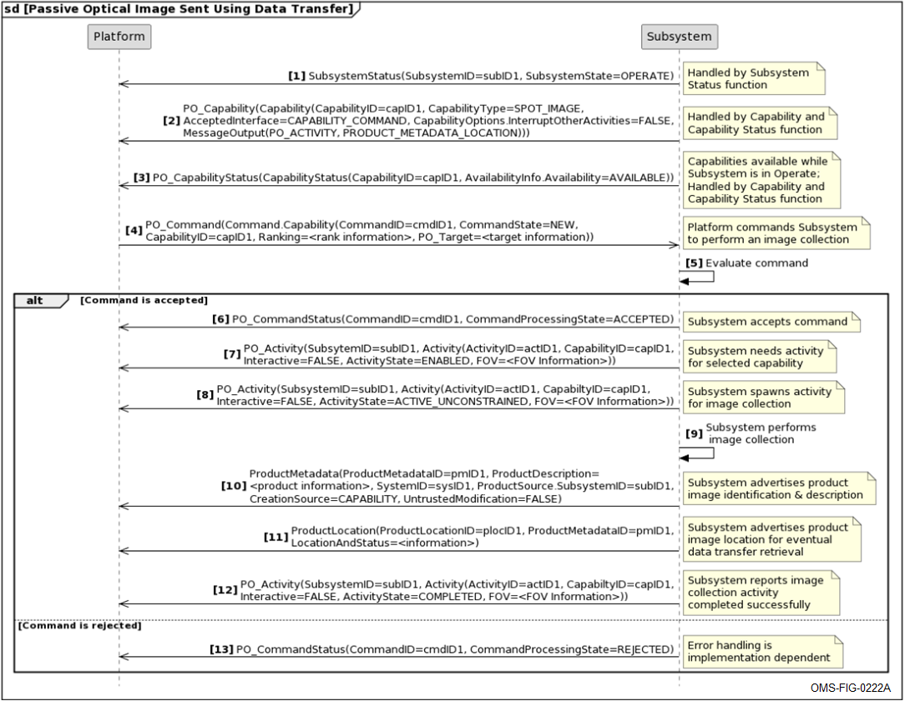

Figure 3.3.2-6 Passive
Optical Image Sent Using Data Transfer Message Sequence Example

##### \[CapabilityName\] Capability Operations Post Conditions

This section indicates the possible states during function completion.

Examples of post conditions:

-   Output provided

-   Return codes/completion code/Security errors

-   Items updated.

This section is also used to describe any function level authentication.

##### \[CapabilityName\] Capability Operations Error Handling

This section explains the behavior if errors and exceptions occur during
the course of execution of this function.

Also describe how errors/exceptions are handled and reported by the
Subsystem or Service, e.g., error codes table – this may point to an
appendix if the error code table is extensive.

Specific Functions
------------------

In the following subsections, the specific functions provided by the
Subsystem, Service, or Isolator, beyond the Required Functions discussed
in earlier subsections of Section 3, are detailed.

A Subsystem, Service, or Isolator not providing any additional specific
functions should mark this section as “Not Applicable” with a rationale
only in this section. Also add “ - N/A” to read “Specific Functions –
N/A” as the updated section title header. In the subsections, remove all
green text and populate “N/A” in the first empty cell of any tables.
Figures may be replaced with “Figure not applicable.” Do not delete
figure or table captions. Instead, add “ - N/A” to figure and table
captions in the subsections.

IMPORTANT: Section 3.4.1, \[FunctionName\], and each of its
sub-paragraphs below should be repeated for each function and numbered
as 3.4.2 (3.4.2.1, 3.4.2.2, etc.); and so on. Note that the square
brackets around \[Function 1\] or \[FunctionName\] throughout are just
field delimiters indicating where your function name should replace it.
The final document should have no square brackets around function names.

### \[FunctionName\]

This section details the specific function provided.

#### \[FunctionName\] Description

This section describes the specific function performed by the Service.

#### \[FunctionName\] Preconditions

This section indicates and describes the conditions that a requester of
this operation must meet and the checks that have to be performed to
assure optimal, secure and error-free execution, and performance of this
operation.

Examples of measures to be taken by the requester are:

-   Provide and validate necessary information

-   Perform necessary (minimum) security checks.

The preconditions can be a textual description, or a graphical
representation of actions/measures taken by the requester.

#### \[FunctionName\] Reporting Interval

This section indicates Service specific modifiable configuration items
that will be provided.

If not applicable, add “This section is not applicable.” in black text.

Configuration parameter assignment for periodicity is configurable
within the range of 1 to 600 seconds in 1 second increments.

Identify your configuration parameter assignment technique here,
including the default periodicity for reporting status. Report the
default periodicity in the Inputs and Outputs Table in the next section.

#### \[FunctionName\] Inputs and Outputs

Table 3.4-1, \[FunctionName\] Inputs and Outputs, identifies the inputs
and outputs for the \[FunctionName\] function.

The cells in this table should contain detailed information per
instructions provided in Section 3.

NOTE: Each message has a PRIMITIVE\_TYPE tag annotation defined in the
UCI schema message definitions corresponding to the MP column value.

Table 3.4-1
\[FunctionName\] Inputs and Outputs

<table>
<thead>
<tr class="header">
<th>MP</th>
<th>IO</th>
<th>DE</th>
<th>Data Exchange Name</th>
<th>
Data Exchange Information

(e.g., Topic Name for Messages or Protocol for Data Transfers)
</th>
<th>LoM</th>
<th>P</th>
<th>Nominal Response Time or Nominal Periodic Rate</th>
<th>Max Response Time or Max Periodic Rate</th>
<th>Appendix C Mapping</th>
</tr>
</thead>
<tbody>
<tr class="odd">
<td></td>
<td></td>
<td></td>
<td></td>
<td></td>
<td></td>
<td></td>
<td></td>
<td></td>
<td></td>
</tr>
<tr class="even">
<td></td>
<td></td>
<td></td>
<td></td>
<td></td>
<td></td>
<td></td>
<td></td>
<td></td>
<td></td>
</tr>
<tr class="odd">
<td>
Column Headings &amp; Cell Abbreviations:

<ul>
<li>
MP=Message Primitive: S=Status-1; C/CS=Command-2; AR/ARS=ActionRequest-2; DR/DRS=DataRequest-2; D=Data-1; DRec=DataRecord-1
</li>
<li>
I/O=Input/Output: I=Input; O=Output
</li>
<li>
DE=Data Exchange: M=OMS Message; DT=Data Transfer; SS=Special Signal; SE=Security Exchange
</li>
<li>
LoM=Level of Mandate: M=Mandatory; O=Optional
</li>
<li>
P=Periodicity: A=Asynchronous; OD=On Demand; P=Periodic
</li>
</ul></td>
<td></td>
<td></td>
<td></td>
<td></td>
<td></td>
<td></td>
<td></td>
<td></td>
<td></td>
</tr>
</tbody>
</table>

\*If an input is not in the current approved schema or OMS Standard
OMSC-STD-001, and a change request has been submitted for approval,
provide the change request reference for that input in Section 5.

#### \[FunctionName\] Workflow and Orchestration

This section is used to detail the sequence of interactions required for
the \[FunctionName\] function.

Function interactions may be described using a sequence diagram, state
machine, tables, and/or text.

A Sequence Diagram describes the pattern of interaction used when
invoking the function. When a sequence diagram is used, this section
should include information on how to interpret it. It is recommended
that sequence diagrams adhere to the UML 2.0 Standard as described in
section 3.

Provide additional text and message sequences here as needed to define
the function’s behaviors, including error handling.

#### \[FunctionName\] Post Conditions

This section indicates the possible states during function completion.

Examples of post conditions:

-   Output provided

-   Return codes/completion code/Security errors

-   Items updated.

This section is also used to describe any function level authentication.

#### \[FunctionName\] Error Handling

This section explains the behavior if errors and exceptions occur during
the course of execution of this function.

Also describe how errors/exceptions are handled and reported by the
Service, e.g., error codes table – this may point to an appendix if the
error code table is extensive.

Non-OMS Messages
================

This section summarizes the Non-OMS Messages used in the functions
defined in Section 3 as shown in Table 4.0-1, Non-OMS Messages.

A Non-OMS Message is a discrete unit of information exchanged in a
messaging pattern (as opposed to a Data Transfer, Special Signal, or
Security Information Exchange) that does not use an OMS CAL.

WARNING: The use of Non-OMS Messages are not allowed. Any Subsystem,
Service, or Isolator using Non-OMS Messages will not be OMS compliant at
any tier.

The columns in Table 4.0-1, Non-OMS Messages, should contain the
following information:

-   Non-OMS Message Name – Provide the name of the Non-OMS Message. This
    name is the item being sent or received by this service which is
    listed in the functions above.

-   Description – Provide the details and/or a reference to the
    documented details that describe the Non-OMS Message. At a minimum,
    these details should include:

<!-- -->

-   Protocol/Middleware used to exchange the Non-OMS Message

-   Description of the message format

-   Other descriptive information

<!-- -->

-   Rationale – Provide the reason for the use of the Non-OMS Message

If none are used, mark this section as "Not Applicable" with a rationale
and the first empty cell of the table with "N/A".

Table 4.0-1 Non-OMS
Messages

<table>
<thead>
<tr class="header">
<th>Non-OMS Message Name</th>
<th>Description</th>
<th>Rationale</th>
</tr>
</thead>
<tbody>
<tr class="odd">
<td>Add rows as required</td>
<td></td>
<td></td>
</tr>
</tbody>
</table>

Change Request Identification
=============================

This section identifies the Change Request (CR) as applicable as shown
in Table 5.0-1, Change Request Identification.

If no change request is pending for this Service Contract, mark this
section as "Not Applicable" with a rationale and the first empty cell of
the table with "N/A". Table 5.0-1, Change Request Identification,
provides identification information that must be included in the change
request. If multiple change requests have been submitted, Table 5.0-1
should contain a separate row for each change request submitted.

Table 5.0-1 Change
Request Identification

<table>
<thead>
<tr class="header">
<th>CR#</th>
<th>Title</th>
<th>Date</th>
<th>Status</th>
<th>Status Date</th>
<th>Brief CR Description</th>
</tr>
</thead>
<tbody>
<tr class="odd">
<td>Reference ID (OAM-XXXX)</td>
<td>Title to Change Request</td>
<td>Submission Date</td>
<td>Backlog, In Work, Under Tech Review, Ready For Review, Approved</td>
<td>Date when it completed this phase</td>
<td>Brief description of the proposed change.</td>
</tr>
<tr class="even">
<td>Add rows as required</td>
<td></td>
<td></td>
<td></td>
<td></td>
<td></td>
</tr>
</tbody>
</table>

Cybersecurity Posture
=====================

This section identifies the cybersecurity posture of the Subsystem,
Service, or Isolator.

Describe the cybersecurity posture of the Subsystem, Service, or
Isolator. The Cybersecurity Posture Section should describe the
cybersecurity posture implementation of the Subsystem, Service, or
Isolator. The addendum may include classified implementation details
with reference to Interface Control Documents (ICDs). The cybersecurity
posture as characterized by the Cyber Survivability Risk Category (CSRC)
identifies the level of rigor needed to describe the OMS Cybersecurity
features that fall under the applicable Cyber Survivability Attributes
(CSAs).

The cybersecurity posture descriptions are in summary format with a
pointer to an external unclassified, non-proprietary document or
detailed in the follow section including diagrams to relay the
implementation.

In accordance with the OMSC-STD-001, OMS D&D Standard, the cybersecurity
posture of an Isolator is limited to the software components for the
OMS-facing side of the isolation layer. For the non-OMS facing isolation
layer, the cybersecurity information can be referenced in external
documents.

Cyber Survivability Attributes (CSAs)
-------------------------------------

This section identifies the CSAs applicable to the Subsystem, Service,
or Isolator.

Provide descriptions of the cybersecurity features used as evidence to
meet the program-assigned System Survivability Key Performance
Parameters (KPPs). These descriptions are in summary format with a
pointer to an external reference, pointer to an OMS Service Contract
section, or detailed including diagrams to relay to the reader how the
feature is employed within the Subsystem, Service, or Isolator. If a CSA
is not applicable or not addressed, denote this with “N/A”. See the
Cybersecurity Guide for more information.

### Prevent CSAs

This section identifies and documents the System Survivability Key
Performance Parameters (KPPs) Prevent CSAs implementation for the
Subsystem, Service, or Isolator. Table 6.1-1 identifies the System
Survivability KPP Prevent CSAs applicable to the Subsystem, Service, or
Isolator.

In the table below, indicate the CSAs applicable to the Subsystem,
Service, or Isolator by adding an “x”. If the CSAs are not applicable or
not addressed, denote this section with “N/A” and leave Table 6.1-1
empty.

Table 6.1-1 Applicable
System Survivability KPP Prevent CSAs

<table>
<thead>
<tr class="header">
<th>CSA-01</th>
<th>CSA-02</th>
<th>CSA-03</th>
<th>CSA-04</th>
<th>CSA-05</th>
<th>CSA-06</th>
</tr>
</thead>
<tbody>
<tr class="odd">
<td></td>
<td></td>
<td></td>
<td></td>
<td></td>
<td></td>
</tr>
</tbody>
</table>

For applicable CSAs, provide a brief, high-level description (1-2
sentences) of how each Cyber Survivability Attribute (CSA) identified in
Table 6-1 is explicitly addressed by the OMS Subsystem, Service, or
Isolator. The description should be unclassified and non-proprietary,
and capture the cybersecurity posture. The cybersecurity posture should
be commensurate with the expected CSRC.

-   CSA-01: Control Access

-   CSA-02: Reduce System’s Cyber Detectability

-   CSA-03: Secure Transmissions and Communication

-   CSA-04: Protect System’s Information from Exploitation

-   CSA-05: Partition and Ensure Critical Functions as Mission
    Completion Performance Levels

-   CSA-06: Minimize and Harden Attack Surfaces

If an external source is referenced for additional information on the
CSA implementation, denote this with a reference to the unclassified,
non-proprietary document. If referencing a previous section, denote this
with a reference to the applicable Service Contract section(s). See the
Cybersecurity Guide for more information.

### Mitigate CSAs

This section identifies and documents the System Survivability KPP
Mitigate CSAs implementation for the Subsystem, Service, or Isolator.
Table 6.1-2 identifies the System Survivability KPP Mitigate CSAs
applicable to the Subsystem, Service, or Isolator.

In the table below, indicate the CSAs applicable to the Subsystem,
Service, or Isolator by adding an “x”. If the CSAs are not applicable or
not addressed, denote this section with “N/A” and leave Table 6.1-2
empty.

Table 6.1-2 Applicable
System Survivability KPP Mitigate CSAs

<table>
<thead>
<tr class="header">
<th>CSA-07</th>
<th>CSA-08</th>
</tr>
</thead>
<tbody>
<tr class="odd">
<td></td>
<td></td>
</tr>
</tbody>
</table>

For the applicable CSAs, provide a brief, high-level description (1-2
sentences) of how each Cyber Survivability Attribute (CSA) is explicitly
addressed by the Subsystem, Service, or Isolator. The description should
be unclassified and non-proprietary, and capture the cybersecurity
posture. The cybersecurity posture should be commensurate with the
expected CSRC.

-   CSA-07 Baseline and Monitor Systems and Detect Anomalies

-   CSA-08 Manage System Performance and Enable Cyberspace

If an external source is referenced for additional information on the
CSA implementation, denote this with a reference to the unclassified,
non-proprietary document. If referencing a previous section, denote this
with a reference to the applicable Service Contract section(s). See the
Cybersecurity Guide for more information.

### Recover CSA

This section identifies and documents the System Survivability KPP
Recover CSA implementation for the Subsystem, Service, or Isolator.

Provide a brief, high-level description (1-2 sentences) of how the
CSA-09 Recover System Capabilities is explicitly addressed by the
Subsystem, Service, or Isolator. The description should be unclassified
and non-proprietary, and capture the cybersecurity posture. The
cybersecurity posture should be commensurate with the expected CSRC.

If an external source is referenced for additional information on the
CSA implementation, denote this with a reference to the unclassified,
non-proprietary document. If referencing a previous section, denote this
with a reference to the applicable Service Contract section(s). See the
Cybersecurity Guide for more information.

If the CSA is not applicable or not addressed, denote this with “N/A”.

### Adapt CSA

This section identifies and documents the System Survivability KPP Adapt
CSA implementation for the Subsystem, Service, or Isolator.

Provide a brief, high-level description (1-2 sentences) of how the
CSA-10 Actively Manage System’s Configuration to Achieve and Maintain an
Operationally-Relevant Cyber Risk Posture is explicitly addressed by the
Subsystem, Service, or Isolator. The description should be unclassified
and non-proprietary, and capture the cybersecurity posture. The
cybersecurity posture should be commensurate with the expected CSRC.

If an external source is referenced for additional information on the
CSA implementation, denote this with a reference to the unclassified,
non-proprietary document. If referencing a previous section, denote this
with a reference to the applicable Service Contract section(s). See the
Cybersecurity Guide for more information.

If the CSA is not applicable or not addressed, denote this with “N/A”.

Security Addendum
=================

This section identifies the Security Addendum document(s).

The Security Addendum is expected to be external to the Service Contract
and can be composed of one or more separate documents that:

-   Might already be existing/planned program documents that could be
    referenced to supply OMS-related information,

-   Might have to be published at different security levels, and

-   Could be developed/published at different points in the program
    lifecycle.

The name of the document(s) must be unclassified and non-proprietary.
Referenced documents may be proprietary. The Security Addendum provides
additional, classified and/or proprietary details relating to the
security of the Service. The addendum may include classified
implementation details with reference to Interface Control Documents
(ICDs).

Appendix A Acronyms and Abbreviations
=====================================

This section lists the abbreviations and acronyms used in this document
not a copy of the OMS lexicon as shown in Table A.0-1, List of Acronyms
and Abbreviation Definitions.

In addition, acronyms should be spelled out at first use in the body of
the document.

Table A.0-1 List of
Acronyms and Abbreviation Definitions

<table>
<thead>
<tr class="header">
<th>Acronym/Abbreviation</th>
<th>Definition</th>
</tr>
</thead>
<tbody>
<tr class="odd">
<td>ASB</td>
<td>Abstract Service Bus</td>
</tr>
<tr class="even">
<td>CAL</td>
<td>Critical Abstraction Layer</td>
</tr>
<tr class="odd">
<td>CSA</td>
<td>Cyber Survivability Attribute</td>
</tr>
<tr class="even">
<td>CSRC</td>
<td>Cyber Survivability Risk Category</td>
</tr>
<tr class="odd">
<td>ICD</td>
<td>Interface Control Document</td>
</tr>
<tr class="even">
<td>KPP</td>
<td>Key Performance Parameter</td>
</tr>
<tr class="odd">
<td>OACWG</td>
<td>Open Architecture Collaborative Working Group</td>
</tr>
<tr class="even">
<td>OAM</td>
<td>Open Architecture Management</td>
</tr>
<tr class="odd">
<td>OCE</td>
<td>Open Computing Environment</td>
</tr>
<tr class="even">
<td>OMS</td>
<td>Open Mission Systems</td>
</tr>
<tr class="odd">
<td>SOAC</td>
<td>Supported Operational Attribute Configuration</td>
</tr>
<tr class="even">
<td>UCI</td>
<td>Universal C2 Interface</td>
</tr>
<tr class="odd">
<td>UML</td>
<td>Unified Modeling Language</td>
</tr>
<tr class="even">
<td>Add rows as required</td>
<td></td>
</tr>
</tbody>
</table>

Appendix B Glossary
===================

This section lists the terms used in this document as shown in Table
B.0-1, List of Term Definitions.

Note: the list of terms used should not be a copy of the OMS lexicon.

Table B.0-1 List of Term
Definitions

<table>
<thead>
<tr class="header">
<th>Term</th>
<th>Definition</th>
</tr>
</thead>
<tbody>
<tr class="odd">
<td>Abstract Service Bus</td>
<td>The Abstract Service Bus (ASB) is an intermediary that allows mission Service functions to be widely available to other mission services, Subsystems, and resources. The ASB implements the CAL, Data Transfer interfaces, Special Signal interfaces, and Security Exchange interfaces. The ASB also defines the physical interfaces.</td>
</tr>
<tr class="even">
<td>Add rows as required</td>
<td></td>
</tr>
</tbody>
</table>

Appendix C Message Details
==========================

This appendix consists of one or more spreadsheet workbooks with a
separate tab for each message use based on each function’s input and
output messages.

Please note that the Adopting Program may choose to create a document
table within this section of the document if appropriate for a simple
service contract. An example Excel Workbook is provided as guidance.

See file Example\_ServiceContract\_AppC\_OMS-FIG-0174E.xlsx

As part of the Starter Kit, the SchemaToXLS tool is provided to assist
Adopting Programs in generating this Appendix C Table from the available
UCI Schema as an output Excel Workbook containing individual tabs for
each message or individual Excel workbooks for each message required by
this Service Contract. See OAM Starter Kit for details. The example
Example\_ServiceContract\_AppC\_OMS-FIG-0174E.xlsx was generated by the
SchemaToXLS tool for the following messages: **ServiceStatus**,
**ServiceStatusDataRequest**, **ServiceStatusDataRequestStatus**,
**SubsystemStatus**, **SubsystemStatusDataRequest**,
**SubsystemStatusDataRequestStatus**. Add or delete any messages as
applicable. If different fields of the same message are used in
different functions, there must be a different message workbook/tab for
each function that uses different fields of the same message. If the
same message fields are used in multiple functions, the same message
workbook/tab can be used, but it must reference the functions that apply
to it.

A Table of Contents tab should be created to summarize messages as
identified by the individual message tabs to related functions performed
by the Subsystem, Service, or Isolator. The format of this Table of
Contents will consist of the following columns, as a minimum, in the
order shown. The SchemaToXLS tool will produce an initial Table of
Contents for the user.

-   Appendix C Mapping - one entry per message tab; this name could be
    abbreviated for shorter tab names; recommend hyperlink to jump to
    tab within the spreadsheet

-   Full Message Name - indicate full message name

-   Message Direction (Input/Output) - indicate message as “Input” or
    “Output”

The format for these tables will consist of the following columns, as a
minimum, in the order shown.

-   Element – one entry per element in the message

<!-- -->

-   Any item with multiplicity should indicate the number of minimum
    occurrences (minOccurs) and maximum occurrences (maxOccurs). The
    SchemaToXLS tool automatically populates the occurrences in the
    format \[minOccurs:maxOccurs\]. Unb indicates unbounded. Use the
    Notes column to indicate which will be used by the Service.

<!-- -->

-   Schema Use:

<!-- -->

-   Required – indicates the element is a required element per the
    schema (must be populated if its parent element is populated)

-   Optional – indicates the element is an Optional element per the
    schema (only needs to be filled out if applicable).

<!-- -->

-   Choice – indicates the element is part of a Choice per the schema

<!-- -->

-   Service Use:

<!-- -->

-   For Input Messages:

<!-- -->

-   Mandatory – indicates the element is required for the function to
    execute appropriately

-   If a range is included in the Schema Use column, include in the
    Service Use column, and adjust the range if needed to indicate
    further limitation of the range

-   Supported – indicates the element will be used if provided and the
    appropriate conditions are met

-   If a range is included in the Schema Use column, include in the
    Service Use column, and adjust the range if needed to indicate
    further limitation of the range

-   Unused – indicated the element will not be used for the function.

<!-- -->

-   For Output Messages:

<!-- -->

-   Mandatory – indicates the element will be populated

-   If a range is included in the Schema Use column, include in the
    Service Use column, and adjust the range if needed to indicate
    further limitation of the range

-   Supported – indicates the element will be populated if the
    appropriate conditions were met

-   If a range is included in the Schema Use column, include in the
    Service Use column, and adjust the range if needed to indicate
    further limitation of the range

-   Unused – indicates the element will never be populated.

<!-- -->

-   Notes:

<!-- -->

-   This field is a free-form field to be used to provide additional
    information not included in the Description column. For example:

-   Clarify element usage (e.g., speed is in nm/s, latitude is expected
    in radians).

<!-- -->

-   Indicate behavior if range limitations are exceeded (e.g., message
    will be rejected if range limitation is exceeded, or message will be
    accepted up to the number of items in the allowed range).

<!-- -->

-   Description (from schema):

<!-- -->

-   Indicate the Element description. This field is auto populated by
    the SchemaToXLS tool.

<!-- -->

-   Extension Type:

<!-- -->

-   If Abstract Types (e.g., Polymorphic Extension Type or Capability
    Base Type) are used, indicate the name of the extension types. This
    field is auto populated by the SchemaToXLS tool.

<!-- -->

-   Type

<!-- -->

-   Indicates the Type Name. This field is auto populated by the
    SchemaToXLS tool.

This section also includes a table to document the usage of any
ForeignKey and other user-defined index elements of the schema that are
used by the Service.

This table could be included either in the document directly or in the
spreadsheet workbook. This table is used to capture any data mapping
that is not defined elsewhere in Appendix C or other documentation.

Table C.0-1 Mapping of
Foreign Keys and Indexes

<table>
<thead>
<tr class="header">
<th>Schema Data Element</th>
<th>Usage</th>
<th>Notes</th>
</tr>
</thead>
<tbody>
<tr class="odd">
<td>
ESM_SettingsCommand.

MessageData.EditESM_Profile.CurrentMDF.MDF_ID
</td>
<td>
UUID: 0000000000AAAAA

Mapping: MDF File 1
</td>
<td></td>
</tr>
<tr class="even">
<td>SubsystemBIT_Status.MessageData.Fault</td>
<td>See Note</td>
<td>Fault IDs and definitions defined in document ABCD-0001</td>
</tr>
</tbody>
</table>

Appendix D Examples In PlantUML Code
====================================

This section contains an embedded zip file housing the PlantUML code for
most of the sequence diagrams in Section 3 Functions. PlantUML is a
drawing tool licensed under GPL, LGPL, ASL, EPL or MIT. There is no
license for the PlantUML syntax itself, so everyone can use it. PlantUML
can be found at [http://plantuml.com](http://plantuml.com). This
code is being provided as a starting point for systems engineers to
customize for the OMS Services they are developing. There is no
requirement or expectation that PlantUML should be used instead of other
UML drawing tools or modeling tools. When you provide your message
sequences, you are not required to provide the PlantUML or other code.
If providing code, add to optional Appendix D.
