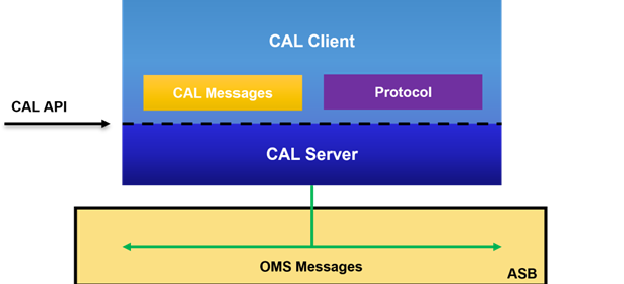
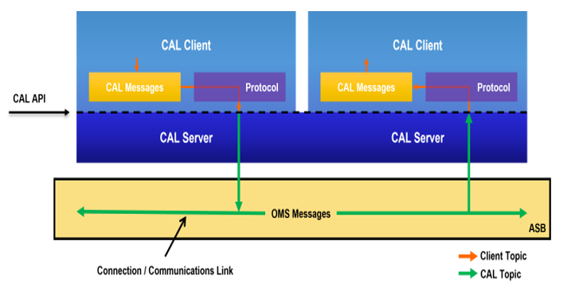
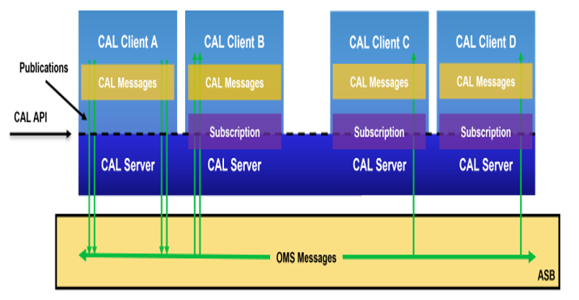

Open Mission Systems (OMS)

Definition And Documentation (D&D)

Language-Agnostic (LA) Critical Abstraction Layer (CAL) Specification

22 January 2026

Prepared By:

Open Architecture Collaborative Working Group (OACWG)

This page is intentionally left blank.

Abstract

Open Mission Systems (OMS) is a non-proprietary, open architecture
standard for integrating subsystems and services into mission packages.

This document defines the required attributes and behaviors for
implementations of the Open Mission Systems (OMS) Language-Agnostic (LA)
Critical Abstraction Layer (CAL) Application Programming Interface
(API). A provider of an OMS Platform is responsible for delivering
required CAL Server implementations with well-defined CAL APIs. The
required attributes and behaviors defined by this document provide
commonality between disparate CAL Server implementations, regardless of
the messaging technology stack selected by the implementer. This
document makes no restriction on the tools, libraries, or products that
may be used to meet the requirements and fully implement the CAL API.

This page is intentionally left blank.

Revision Record

<table>
<thead>
<tr class="header">
<th>REVISION</th>
<th>DATE</th>
<th>DESCRIPTION</th>
</tr>
</thead>
<tbody>
<tr class="odd">
<td>B</td>
<td>22 January 2026</td>
<td>Initial public release</td>
</tr>
</tbody>
</table>

This page is intentionally left blank.

Table of Contents

[1 Introduction 1](#introduction)

[2 Scope 2](#scope)

[3 References 3](#references)

[3.1 OMS D&D Documents 3](#oms-dd-documents)

[3.2 Other Documents 3](#other-documents)

[4 CAL Terms and Definitions 4](#cal-terms-and-definitions)

[4.1 OMS Messages 4](#oms-messages)

[4.2 CAL Messages 5](#cal-messages)

[4.3 CAL Client 5](#cal-client)

[4.4 CAL Server 5](#cal-server)

[4.5 Network Configuration 5](#network-configuration)

[4.6 Service Identifier 6](#service-identifier)

[4.7 Topics and Connections 6](#topics-and-connections)

[4.8 Subscription Groups 7](#subscription-groups)

[5 Protocols 8](#protocols)

[5.1 The WebSocket Protocol 8](#the-websocket-protocol)

[5.1.1 Subprotocols 9](#subprotocols)

[5.1.1.1 OMS WebSocket Protocol 9](#oms-websocket-protocol)

[5.1.1.1.1 Core Concepts 11](#core-concepts)

[5.1.1.1.2 Protocol Conventions 12](#protocol-conventions)

[5.1.1.1.3 Protocol Operations 13](#protocol-operations)

[5.1.1.1.4 OWP External References 20](#owp-external-references)

[6 CAL Message Formats 21](#cal-message-formats)

[6.1 OMS JSON 21](#oms-json)

[6.1.1 Global Element Declarations 21](#global-element-declarations)

[6.1.1.1 Examples 21](#examples)

[6.1.2 Particles 23](#particles)

[6.1.3 Complex Type Definitions 24](#complex-type-definitions)

[6.1.3.1 Examples 24](#examples-1)

[6.1.4 Simple Type Definitions 30](#simple-type-definitions)

[6.1.4.1 Examples 31](#examples-2)

[6.1.5 Validation 32](#validation)

[6.1.5.1 Document Information Item 33](#document-information-item)

[6.1.5.2 Namespace Name and Local Name of a Member
33](#namespace-name-and-local-name-of-a-member)

[6.1.5.3 Element Information Items of a Member
34](#element-information-items-of-a-member)

[6.1.5.4 Character Information Items of Values
34](#character-information-items-of-values)

[6.1.6 OMS JSON External References 35](#oms-json-external-references)

[7 Acronyms and Symbols 37](#acronyms-and-symbols)

[8 Glossary 38](#glossary)

This page is intentionally left blank.

List of Figures

[Figure 4.0-1 CAL Client Stack 4](#_Toc219358826)

[Figure 4.7-1 CAL and Client Topics 6](#_Toc219358827)

[Figure 4.8-1 Subscription Groups 7](#_Toc219358828)

This page is intentionally left blank.

List of Tables

[Table 3.1-1 OMS D&D Documents 3](#_Toc219358829)

[Table 3.2-1 Other Documents 3](#_Toc219358830)

[Table 5.0-1 Protocols 8](#_Toc219358831)

[Table 5.1-1 Subprotocols 9](#_Toc219358832)

[Table 5.1-2 OWP CAL Message Formats 10](#_Toc219358833)

[Table 5.1-3 Protocol Operations 13](#_Toc219358834)

[Table 5.1-4 INIT Object 14](#_Toc219358835)

[Table 5.1-5 INFO Object 17](#_Toc219358836)

[Table 5.1-6 Identifiers Object 18](#_Toc219358837)

[Table 5.1-7 Errors 19](#_Toc219358838)

[Table 5.1-8 OWP External References 20](#_Toc219358839)

[Table 6.1-1 Document Information Item 33](#_Toc219358840)

[Table 6.1-2 Element Information Items of a Member 34](#_Toc219358841)

[Table 6.1-3 Character Information Items of Values 35](#_Toc219358842)

[Table 6.1-4 OMS JSON External References 35](#_Toc219358843)

This page is intentionally left blank.

Introduction
============

The Language-Agnostic (LA) Critical Abstraction Layer (CAL)
Specification enables the use of modern programming languages and
provides a non-proprietary interface for cloud-based systems to
communicate with other CAL Clients on a Platform. This specification
exists as an alternative to the language-dependent CAL APIs of C++ and
Java. The LA-CAL Specification defines standard interactions and
behaviors for OMS Messaging by CAL Clients and CAL Servers through a CAL
API, replacing the need for ad-hoc adapters. Protocols standardize
communication between CAL Servers and CAL Clients. Unlike with
language-dependent CAL APIs, CAL Clients that use an LA-CAL are
responsible for UUID generation and message construction. LA-CAL uses
language-independent data interchange formats to represent its CAL
Messages as opposed to the CAL Message objects constructed by
language-dependent CAL APIs. Each data interchange format follows its
own grammar resulting in well-formed CAL Messages.

Scope
=====

In the following sections, the LA-CAL Specification requirements are
described and enumerated as certification requirements (CERTs). Guidance
and descriptive text have been added to assist the developer in
achieving the goals of this specification and to help verification
engineers fully understand the intention of the requirements and how
they should be tested.

Terms and definitions in this document should be considered first when
other OMS specifications provide overlapping terms or definitions,
except for those defined in OMSC-STD-001, OMS Standard, and
OMSC-STD-002, Abbreviations and Glossary.

References
==========

OMS D&D Documents
-----------------

Table 3.1-1 OMS D&D
Documents

<table>
<thead>
<tr class="header">
<th>Document Number</th>
<th>Document Title</th>
<th>Revision</th>
<th>Date</th>
</tr>
</thead>
<tbody>
<tr class="odd">
<td>OMSC-STD-001</td>
<td>OMS Standard Version 2.5</td>
<td>M</td>
<td>22 January 2026</td>
</tr>
<tr class="even">
<td>OMSC-STD-002</td>
<td>Abbreviations and Glossary</td>
<td>M</td>
<td>22 January 2026</td>
</tr>
<tr class="odd">
<td>OMSC-TMP-001</td>
<td>Platform Description Document (PDD) Template</td>
<td>M</td>
<td>22 January 2026</td>
</tr>
<tr class="even">
<td>OMSC-TMP-003</td>
<td>Service Contract Template</td>
<td>M</td>
<td>22 January 2026</td>
</tr>
</tbody>
</table>

Other Documents
---------------

Table 3.2-1 Other
Documents

<table>
<thead>
<tr class="header">
<th>Document Number</th>
<th>Document Title</th>
<th>Revision</th>
<th>Date</th>
</tr>
</thead>
<tbody>
<tr class="odd">
<td>OAC-SPC-001</td>
<td>Universal Command and Control (C2) Interface (UCI) Schema Style and Design Specification</td>
<td>E</td>
<td>22 January 2026</td>
</tr>
<tr class="even">
<td>IETF RFC 4122</td>
<td>A Universally Unique IDentifier (UUID) URN Namespace</td>
<td></td>
<td>July 2005</td>
</tr>
<tr class="odd">
<td>IETF RFC 6455</td>
<td>The WebSocket Protocol</td>
<td></td>
<td>December 2011</td>
</tr>
<tr class="even">
<td>IETF RFC 8259</td>
<td>The JavaScript Object Notation (JSON) Data Interchange Format</td>
<td></td>
<td>December 2017</td>
</tr>
<tr class="odd">
<td>N/A</td>
<td>XML Schema Part 1: Structures Second Edition</td>
<td>1.0</td>
<td>28 October 2004</td>
</tr>
<tr class="even">
<td></td>
<td>Namespaces in XML 1.0 (Third Edition)</td>
<td></td>
<td>08 December 2009</td>
</tr>
<tr class="odd">
<td></td>
<td>XML Information Set (Second Edition)</td>
<td></td>
<td>04 February 2004</td>
</tr>
</tbody>
</table>

CAL Terms and Definitions
=========================

The Critical Abstraction Layer (CAL) is the OMS-defined Application
Programming Interface (API) through which CAL Clients interact with a
CAL Server as shown in Figure 4.0-1, CAL Client Stack. This API includes
interfaces for publishing and receiving CAL Messages. OMS messaging
interactions between OMS participants must use the CAL-provided publish
and subscribe interface.

Figure 4.0-1 CAL Client
Stack

OMS Messages
------------

OMS Messages are defined in the OMS Message Schema, an eXtensible Markup
Language (XML) Schema Definition (XSD) file. The OMS Message Schema is
based on the Universal Command and Control (C2) Interface (UCI) message
schema. The version of the UCI message schema and the definition of any
OMS-specific schema extension are found in the OMSC-STD-001, OMS
Standard.

CAL Messages
------------

CAL Messages are representations of OMS Messages (see Section 4.1, OMS
Messages) in code according to a message format defined in Section 6,
CAL Message Formats. A CAL Server (see Section 4.4, CAL Server) converts
between CAL Messages and OMS Messages; a process sometimes called
serialization/de-serialization. When a message is being manipulated by a
CAL Client it is a CAL Message. When a message is in its serialized form
it is an OMS Message. This distinction between CAL Messages and OMS
Messages is used to prevent ambiguity in CERTs and descriptive text and
to ensure that the CERTs are only levied against entities under the
purview of the CAL. In other words, CERTs are not levied against OMS
Messages (as defined in Section 4.1, OMS Messages) in this document.

CAL Client
----------

A CAL Client (see Figure 4.0-1, CAL Client Stack) uses a CAL Server to
send and receive CAL Messages. Each CAL Client is uniquely identified by
their Service Identifier (see Section 4.6, Service Identifier).
Throughout this document the term "CAL Client" is used to indicate the
software that interacts with a CAL Server. One type of CAL Client is an
OMS Service; however, CAL Servers may be used by applications that are
not fully compliant OMS Services.

CAL Server
----------

A CAL Server is a manifestation and fulfillment of the requirements
defined in this specification. One or more CAL Servers serve as an
integral component of an Abstract Service Bus (ASB); an ASB is a
required element of an OMS Platform. A Platform may make available an
appropriate CAL Server that satisfies this specification. A CAL Client
(see Section 4.3, CAL Client) connects to a CAL Server using a protocol
specified in Section 5, Protocols. CAL Servers may be implemented in any
programming language and do not need to be in the same language as any
CAL Client. For example, a CAL Client implemented in Python can connect
to a CAL Server implemented in Rust. Even though any programming
language may be used, developers must still be sensitive to the fact
that there are unsigned data types in the schema and handle such types
appropriately.

Network Configuration
---------------------

A CAL Server is configured at runtime to connect with underlying
middleware technologies, network resources, and transport layers. The
Network Configuration identifies valid CAL Topics, their associated
network connections, and how these network connections are actually
implemented across the available network resources.

Service Identifier
------------------

A Service Identifier is a string name given to a Service that is used to
associate it with a globally unique identifier called a UUID (Internet
Engineering Task Force (IETF) Request for Comments (RFC) 4122) specific
to an instance of that Service on a single specific system. By system,
it is meant an element that could be represented as, e.g., a vehicle, a
node acting as a collection of vehicles, or a node on a ground control
system. The Service Identifier is a required parameter used when a CAL
Client initializes a Connection to a CAL Server.

Topics and Connections
----------------------

A Connection is a communication link established between CAL Clients
through an ASB. A CAL Topic is a CAL Server's internal identifier for a
communications link between publications and subscriptions. Multiple
Connections may be associated with a single CAL Topic: CAL Clients may
have Connections to multiple subscriptions over a given CAL Topic; and
subscriptions can have Connections to multiple CAL Clients over a given
CAL Topic. A Client Topic is the logical topic name used by a CAL Client
to identify the communications between publications and subscriptions. A
CAL Server maps internal CAL Topics to Client Topics. Figure 4.7-1, CAL
and Client Topics, depicts these interactions.

Figure 4.7-1 CAL and
Client Topics

Subscription Groups
-------------------

A Subscription Group is a grouping of one or more subscriptions formed
on a CAL Topic. Subscription Groups provide a mechanism for application
fault tolerance and scalable workload processing. A Client Subscription
Group is identified by name given by a CAL Client. A CAL Subscription
Group is a CAL Server's internal mapping of a Client Subscription Group.
Two subscriptions are members of the same CAL Subscription Group when
the same CAL Subscription Group and CAL Topic are specified. CAL
Subscription Groups with the same identifier are distinct if they are
registered on different CAL Topics.

When a published message matches the topic of a Subscription Group, only
one member of that group receives the message. This contrasts from
typical publish and subscribe behavior in which all subscribers receive
the message. Figure 4.8-1, Subscription Groups, shows CAL Clients B, C,
and D having subscriptions forming a Subscription Group. Messages
published from CAL Client A are distributed among the group.

Figure 4.8-1 Subscription
Groups

Protocols
=========

A Language-Agnostic CAL is constructed as a layered protocol from other
open standards. The following sections describe required behaviors and
interactions required by an LA-CAL implementation to enable
machine-to-machine communication aligning with OMS Standard.

> CERT LACAL-000001 \[An LA-CAL shall implement at least one protocol in
> the "Protocols" table.\]

Table 5.0-1 Protocols

<table>
<thead>
<tr class="header">
<th>Protocol</th>
</tr>
</thead>
<tbody>
<tr class="odd">
<td>The WebSocket Protocol</td>
</tr>
</tbody>
</table>

The WebSocket Protocol
----------------------

The WebSocket Protocol, defined in RFC 6455, enables two-way
communication between a client and a remote server. The protocol
consists of an opening handshake followed by basic message framing,
layered over TCP. The protocol has two parts: a handshake and the data
transfer. The handshake consists of an HTTP connection upgrade request,
followed by an HTTP response from the server. After a successful
handshake, clients and servers transfer data back and forth in
conceptual units referred to in this specification as "WebSocket
messages". On the wire, a WebSocket message is composed of one or more
frames. Each frame belonging to the same WebSocket message contains the
same type of data. All data is communicated as textual data, encoded as
UTF-8 text.

RFC 6455 levies certain requirements on server implementations. These
requirements are defined in RFC 6455 Section 4.2, Server-Side
Requirements, and must be complied with by all CAL Server
implementations.

> CERT LACAL-000002 \[An LA-CAL that supports the WebSocket Protocol
> shall implement the Server-Side Requirements as defined in RFC 6455.\]

A CAL Server must require that the *Sec-WebSocket-Protocol* header field
is present in the client's opening handshake, whereas in RFC 6455
Section 4.2.1, Reading the Client's Opening Handshake, this header field
is listed as optional. Other header fields will be handled as described
by the aforementioned section. Each WebSocket subprotocol described in
Section 5.1.1, Subprotocols, will use a different subprotocol value. In
the case of multiple supported subprotocols listed in the client's
opening handshake, only one may be selected and will be in the HTTP
header sent back in the server's opening handshake.

> CERT LACAL-000003 \[An LA-CAL that supports the WebSocket Protocol
> shall set the Sec-WebSocket-Protocol header field to one of the
> subprotocols defined in the "Subprotocols" table, when sending the
> server's opening handshake.\]

When none of the subprotocols requested in the client's opening
handshake can be satisfied, a CAL Server will stop processing the
client's opening handshake and return an HTTP response with status 400
Bad Request, as opposed to sending a null subprotocol value. Currently,
only one subprotocol is allowed, the OWP subprotocol, but others may be
added in future releases of OMS.

> CERT LACAL-000004 \[An LA-CAL that supports the WebSocket Protocol
> shall stop processing the client's opening handshake and return an
> HTTP response with status "400 Bad Request" if the client's opening
> handshake does not set the Sec-WebSocket-Protocol header field with a
> subprotocol from the "Subprotocols" table.\]
>
> CERT LACAL-000005 \[An LA-CAL that supports the WebSocket Protocol
> shall implement at least one subprotocol in the "Subprotocols"
> table.\]

Table 5.1-1 Subprotocols

<table>
<thead>
<tr class="header">
<th>Subprotocol</th>
<th>Sec-WebSocket-Protocol Value</th>
</tr>
</thead>
<tbody>
<tr class="odd">
<td>OMS WebSocket Protocol</td>
<td><em>owp</em></td>
</tr>
</tbody>
</table>

### Subprotocols

#### OMS WebSocket Protocol

This section describes version 1.0 of the OMS WebSocket Protocol (OWP).
The version of OWP is composed of major and minor components, separated
by a dot, and will only change when substantive changes are made to the
subprotocol and does not necessarily change for every release of OMS.
The following scheme will be adhered to:

-   Increase the minor by 1 when **any** of the following are true:

<!-- -->

-   If an operation is added

-   If a new key-value pair is added to an existing JSON object

-   If a new optional field is added to an existing operation such that
    the semantics and behavior remain the same for existing clients
    using that operation

<!-- -->

-   Increase the major by 1 and set the minor to 0 when **any** of the
    following are true:

<!-- -->

-   If an operation is removed

-   If the semantics of an operation are altered such that it impacts
    the expected **client** behavior

-   If an existing key-value pair of a JSON object is removed or its
    semantics are changed

-   If a new optional or required field is added to an existing
    operation such that it changes the semantics or behavior of the
    operation

All other changes, such as clarifying explanations, will not change the
version of OWP

CAL Clients that declare OWP as one of their subprotocols during the
client's opening handshake will initiate a CAL connection with the CAL
Server in conformance with this section if the CAL Server chooses OWP as
the subprotocol value.

CAL Messages are sent over this subprotocol in certain operations such
as **PUB** and **MSG**. These must conform to one of the message formats
defined in Section 6, CAL Message Formats. Currently, only one message
format is allowed, Section 6.1, OMS JSON, but others may be added in
future releases of OMS.

Any references underlined in this section have associated links given by
Table 5.1-8, OWP External References.

> CERT LACAL-000006 \[An LA-CAL that supports the OMS WebSocket Protocol
> shall enforce that CAL Message Formats for OWP subprotocol operations
> conform to formats as defined in the "OWP CAL Message Formats"
> table.\]

Table 5.1-2 OWP CAL
Message Formats

<table>
<thead>
<tr class="header">
<th>CAL Message Formats</th>
<th>Definition</th>
</tr>
</thead>
<tbody>
<tr class="odd">
<td>OMS JSON</td>
<td>See Section 6.1, OMS JSON</td>
</tr>
</tbody>
</table>

##### Core Concepts

###### Connecting and Initializing

To form an OWP connection, a CAL Client connects to a CAL Server through
a new WebSocket connection with exactly one of the values from Table
5.1-1, Subprotocols, for the subprotocol field. After the opening
handshake for the connection is completed, the client must send an
**INIT** protocol operation to negotiate the properties of the OWP
connection as specified in Section 5.1.1.1.3.1, The INIT Operation, as
the first protocol operation. After the **INIT** protocol operation is
sent by a connected CAL Client, an **INFO** protocol operation is sent
by the CAL Server as specified in Section 5.1.1.1.3.5, The INFO
Operation. The **INFO** protocol operation contains information such as
the negotiated protocol and schema versions, the server's identifier,
and other Service-associated UUIDs.

###### Publish and Subscribe

After the **INFO** protocol operation is received, a CAL Client uses the
**PUB** and **SUB** protocol operations to publish and subscribe to CAL
Messages. To publish a message, a CAL Client provides a topic and CAL
Message as specified in Section 5.1.1.1.3.2, The PUB Operation. To
subscribe to a topic and begin receiving messages, a CAL Client provides
a unique subscription identifier, the message name, the topic, and an
optional subscription group name as specified in Section 5.1.1.1.3.3,
The SUB Operation. A CAL Client registers itself as a member of a
subscription group by providing the optional subscription group name in
the **SUB** protocol operation. After subscribing to a topic, a CAL
Client receives incoming messages with the **MSG** protocol operation
sent by the CAL Server as specified in Section 5.1.1.1.3.6, The MSG
Operation. The subscription identifier in the **MSG** protocol operation
refers to a subscription of the connection. For more information on
subscription groups and how they function, see Section 4.8, Subscription
Groups. To stop receiving messages from a subscription, a CAL Client
uses the **UNSUB** protocol operation with the associated subscription
identifier as specified in Section 5.1.1.1.3.4, The UNSUB Operation.

###### Positive and Negative Acknowledgments

After every client protocol operation, the CAL Server sends either a
**-ERR** protocol operation (negative acknowledgment) or a **+OK**
protocol operation (positive acknowledgment) if verbose was *true* in
the **INIT** protocol operation and the protocol operation completed
successfully. The first **+OK** protocol operation is sent before the
**INFO** protocol operation on verbose connections. If a protocol
operation specified does not exist or is not a client protocol operation
according to Table 5.1-3, Protocol Operations, then the CAL Server sends
a **-ERR** protocol operation with the error message of
*Illegal-Operation*. If the protocol operation contains the wrong number
of fields, then the CAL Server sends a **-ERR** protocol operation with
the error message of *Illegal-Argument*. *Illegal-Argument* may also be
the error message of a **-ERR** protocol operation for other reasons, as
described in subsequent sections. If the responding server experiences
an error internal to the software component or underlying infrastructure
while processing any protocol operation, it may either send a **-ERR**
protocol operation with the error message of *Internal-Error* or fail
the connection as defined by RFC 6455 Section 7.1.7, Fail the WebSocket
Connection. Additional error messages specific to client protocol
operations are described in subsequent sections.

###### Shutdown

The WebSocket connection between a CAL Client and CAL Server may be
closed by either peer as dictated by RFC 6455 Section 7, Closing the
Connection. WebSocket status codes may be provided during the closing
handshake as allowed by RFC 6455 Section 7.4, Status Codes. Status codes
used by either client or server are to be documented in the appropriate
sections of the Service Contract or Platform Description Document (PDD).
After the WebSocket connection is closed, the OWP connection is also
considered to be closed and all active subscriptions are disposed of for
that connection, as though each subscription was unsubscribed from as
specified in Section 5.1.1.1.3.4, The UNSUB Operation.

##### Protocol Conventions

###### Field Delimiters

A protocol operation is a sequence of fields separated by field
delimiters with the first field being the operation name. The field
delimiters are space (*0x20*) and horizontal tab (*0x09*). Consecutive
delimiters are to be treated as a single field delimiter.

###### Newlines

Newline characters, such as carriage return (*0x0D*) and line feed
(*0x0A*), are not considered field delimiters; however, these characters
may be used inside of a field.

##### Protocol Operations

Syntax for the protocol operations use angle brackets to denote a
required field (e.g. &lt;required field&gt;) and square brackets to
denote an optional field (e.g. \[optional field\]). Only one protocol
operation is allowed per WebSocket message.

Table 5.1-3 Protocol
Operations

<table>
<thead>
<tr class="header">
<th>Name</th>
<th>Sent By</th>
<th>Description</th>
</tr>
</thead>
<tbody>
<tr class="odd">
<td>INIT</td>
<td>Client</td>
<td>Negotiate the properties of the OWP connection</td>
</tr>
<tr class="even">
<td>PUB</td>
<td>Client</td>
<td>Publish a message on a topic</td>
</tr>
<tr class="odd">
<td>SUB</td>
<td>Client</td>
<td>Subscribe to messages on a topic</td>
</tr>
<tr class="even">
<td>UNSUB</td>
<td>Client</td>
<td>Unsubscribe from messages on a topic</td>
</tr>
<tr class="odd">
<td>INFO</td>
<td>Server</td>
<td>Inform the client about details of the connection, server, and configuration</td>
</tr>
<tr class="even">
<td>MSG</td>
<td>Server</td>
<td>Deliver a message on a topic to the client</td>
</tr>
<tr class="odd">
<td>+OK</td>
<td>Server</td>
<td>Acknowledge a well-formed client protocol operation on a verbose connection</td>
</tr>
<tr class="even">
<td>-ERR</td>
<td>Server</td>
<td>Indicate a protocol operation error</td>
</tr>
</tbody>
</table>

###### The INIT Operation

A client first sends an **INIT** operation to negotiate properties of
the connection. If a client's requested subprotocol versions, schema
version, or Service Identifier cannot be satisfied; **INIT** is not the
first operation sent; or **INIT** is sent more than once, the server
must fail the connection as defined by RFC 6455 Section 7.1.7, Fail the
WebSocket Connection. When multiple subprotocol versions are specified,
one of those values will be chosen by the server as the subprotocol
version. The schema version is the ·value
space· of the version attribute in the schema as constrained by
CERT SCH-002403.

> CERT LACAL-000007 \[An LA-CAL that supports the OMS WebSocket Protocol
> shall implement the OWP subprotocol INIT operation.\]

####### Syntax

INIT &lt;JSON text&gt;

where:

-   **JSON text**: A JSON object whose members are defined by Table
    5.1-4, INIT Object

Table 5.1-4 INIT Object

<table>
<thead>
<tr class="header">
<th>String</th>
<th>Value</th>
<th>Required?</th>
<th>Description</th>
</tr>
</thead>
<tbody>
<tr class="odd">
<td>versions</td>
<td>array of strings</td>
<td>Yes</td>
<td>Desired subprotocol versions</td>
</tr>
<tr class="even">
<td>schema</td>
<td>string</td>
<td>Yes</td>
<td>Desired schema version for message validation</td>
</tr>
<tr class="odd">
<td>verbose</td>
<td>true or false</td>
<td>No</td>
<td>Whether the server will send <strong>+OK</strong> after each successful operation; if not provided, the default value is true</td>
</tr>
<tr class="even">
<td>service_id</td>
<td>string</td>
<td>Yes</td>
<td>Service Identifier associated with this connection</td>
</tr>
</tbody>
</table>

####### Errors

In addition to the behaviors described in Section 5.1.1.1.1.3, Positive
and Negative Acknowledgments, this operation may yield a **-ERR** with
the **error message** of any of the following:

-   *Illegal-Argument*: If the first field is not a valid **JSON text**

-   *Illegal-State*: If this operation is sent more than once or is not
    the first operation

-   *Unsupported-Version*: If none of the client requested subprotocol
    versions are supported by the server

-   *Unsupported-Schema*: If the client requested schema version is not
    supported by the server

-   *Unsupported-Service*: If the client requested Service Identifier is
    not supported by the server

###### The PUB Operation

A client publishes messages to the server with the **PUB** operation. A
valid message is delivered to all clients subscribed to the topic,
otherwise the publication is dropped.

> CERT LACAL-000008 \[An LA-CAL that supports the OMS WebSocket Protocol
> shall implement the OWP subprotocol PUB operation.\]

####### Syntax

PUB &lt;topic&gt; &lt;message&gt;

where:

-   **topic**: The topic where the **message** will be published,
    matching the regular expression *^\[A-Za-z0-9\_\\-.\]+$*

-   **message**: A CAL Message that conforms to a format in Table 5.1-2,
    OWP CAL Message Formats

####### Errors

In addition to the behaviors described in Section 5.1.1.1.1.3, Positive
and Negative Acknowledgments, this operation may yield a **-ERR** with
the **error message** of any of the following:

-   *Illegal-Argument*: If **topic** does not match the given regular
    expression

-   *Illegal-State*: If **topic** is not an allowed topic name

-   *Invalid-Message*: If **message** does not conform to a format in
    Table 5.1-2, OWP CAL Message Formats

###### The SUB Operation

A client subscribes to messages on a topic with the **SUB** operation.
Any published message matching those fields will be delivered. When a
subscription group is declared, messages are selectively delivered to
exactly one group member.

> CERT LACAL-000009 \[An LA-CAL that supports the OMS WebSocket Protocol
> shall implement the OWP subprotocol SUB operation.\]

####### Syntax

SUB &lt;subscription id&gt; &lt;message name&gt; &lt;topic&gt; \[group\]

where:

-   **subscription id**: The unique subscription identifier, generated
    by and local to the CAL Client, matching the regular expression
    *^\[A-Za-z0-9\_\\-.\]+$*

-   **message name**: The {target
    namespace} and {name} of a
    *global* {element}, specified as
    "{name}" if {target namespace} is *https://www.vdl.afrl.af.mil/programs/oam*;
    otherwise "{{target namespace}}{name}"

-   **topic**: The topic that the messages will be received from,
    matching the regular expression *^\[A-Za-z0-9\_\\-.\]+$*

-   **group**: The optional subscription group name, matching the
    regular expression *^\[A-Za-z0-9\_\\-.\]+$*

####### Errors

In addition to the behaviors described in Section 5.1.1.1.1.3, Positive
and Negative Acknowledgments, this operation may yield a **-ERR** with
the **error message** of any of the following:

-   *Illegal-Argument*: If **subscription id** does not match the given
    regular expression, if **message name** is not the {target namespace} and {name} of a *global* {element}, if **topic** does not match the
    given regular expression, or if **group** does not match the given
    regular expression

-   *Illegal-State*: If **subscription id** is already in use or if
    **topic** is not an allowed topic name

###### The UNSUB Operation

A client unsubscribes to messages associated with a given subscription
identifier with the **UNSUB** operation. A client will no longer receive
such messages unless a new subscription is made.

> CERT LACAL-000010 \[An LA-CAL that supports the OMS WebSocket Protocol
> shall implement the OWP subprotocol UNSUB operation.\]

####### Syntax

UNSUB &lt;subscription id&gt;

where:

-   **subscription id**: The unique subscription identifier, generated
    by and local to the CAL Client, matching the regular expression
    *^\[A-Za-z0-9\_\\-.\]+$*

####### Errors

In addition to the behaviors described in Section 5.1.1.1.1.3, Positive
and Negative Acknowledgments, this operation may yield a **-ERR** with
the **error message** of any of the following:

-   *Illegal-Argument*: If **subscription id** does not match the given
    regular expression

-   *Illegal-State*: If **subscription id** is not an active
    subscription

###### The INFO Operation

The server responds to **INIT** with an **INFO** operation. After the
properties of the OWP connection are negotiated, the server may send
additional **INFO** operations to signal changes in network topology or
associated identifiers.

> CERT LACAL-000011 \[An LA-CAL that supports the OMS WebSocket Protocol
> shall implement the OWP subprotocol INFO operation.\]

The chosen subprotocol version in the **INFO** operation is the version
specified in Section 5.1.1.1, OMS WebSocket Protocol.

####### Syntax

INFO &lt;JSON text&gt;

where:

-   **JSON text**: A JSON object whose members are defined by Table
    5.1-5, INFO Object

Table 5.1-5 INFO Object

<table>
<thead>
<tr class="header">
<th>String</th>
<th>Value</th>
<th>Required?</th>
<th>Description</th>
</tr>
</thead>
<tbody>
<tr class="odd">
<td>version</td>
<td>string</td>
<td>Yes</td>
<td>In-use OWP subprotocol version</td>
</tr>
<tr class="even">
<td>server_id</td>
<td>string</td>
<td>Yes</td>
<td>CAL Server implementation-specific server identifier, matching the regular expression <em>^[A-Za-z0-9_\-.]+$</em></td>
</tr>
<tr class="odd">
<td>uuids</td>
<td>Identifiers Object</td>
<td>Yes</td>
<td>Identifiers associated with the connected Service</td>
</tr>
<tr class="even">
<td>system_label</td>
<td>string</td>
<td>Yes</td>
<td>System label associated with the initializing Service</td>
</tr>
<tr class="odd">
<td>connect_urls</td>
<td>array of strings</td>
<td>No</td>
<td>Server URLs that the client can connect to</td>
</tr>
</tbody>
</table>

Table 5.1-6 Identifiers
Object

<table>
<thead>
<tr class="header">
<th>String</th>
<th>Value</th>
<th>Required?</th>
<th>Description</th>
</tr>
</thead>
<tbody>
<tr class="odd">
<td>system</td>
<td>string</td>
<td>Yes</td>
<td>System UUID that conforms to RFC 4122 Section 3, Namespace Registration Template, associated with the initializing Service</td>
</tr>
<tr class="even">
<td>service</td>
<td>string</td>
<td>Yes</td>
<td>Service UUID that conforms to RFC 4122 Section 3, Namespace Registration Template, associated with the initializing Service</td>
</tr>
<tr class="odd">
<td>subsystem</td>
<td>string</td>
<td>No</td>
<td>Subsystem UUID that conforms to RFC 4122 Section 3, Namespace Registration Template, associated with the initializing Service</td>
</tr>
<tr class="even">
<td>capabilities</td>
<td>object whose values are strings</td>
<td>No</td>
<td>Capability names as keys and UUIDs as values that conform to RFC 4122 Section 3, Namespace Registration Template, associated with the initializing Service</td>
</tr>
<tr class="odd">
<td>components</td>
<td>object whose values are strings</td>
<td>No</td>
<td>Component names as keys and UUIDs as values that conform to RFC 4122 Section 3, Namespace Registration Template, associated with the initializing Service</td>
</tr>
</tbody>
</table>

###### The MSG Operation

A client receives messages associated with a subscription identifier
from the **MSG** operation.

> CERT LACAL-000012 \[An LA-CAL that supports the OMS WebSocket Protocol
> shall implement the OWP subprotocol MSG operation.\]

####### Syntax

MSG &lt;subscription id&gt; &lt;message&gt;

where:

-   **subscription id**: The unique subscription identifier from the
    corresponding **SUB** operation

-   **message**: A CAL Message that conforms to a format in Table 5.1-2,
    OWP CAL Message Formats

###### The +OK Operation

A server positively acknowledges a successful client protocol operation
with the **+OK** operation on a verbose connection.

> CERT LACAL-000013 \[An LA-CAL that supports the OMS WebSocket Protocol
> shall implement the OWP subprotocol +OK operation.\]

####### Syntax

+OK

###### The -ERR Operation

A server negatively acknowledges a client protocol operation with the
**-ERR** operation on both verbose and non-verbose connections.

> CERT LACAL-000014 \[An LA-CAL that supports the OMS WebSocket Protocol
> shall implement the OWP subprotocol -ERR operation.\]

####### Syntax

-ERR &lt;error message&gt; \[details\]

where:

-   **error message**: Standard error as defined in Table 5.1-7, Errors

-   **details**: CAL Server implementation-specific information

Table 5.1-7 Errors

<table>
<thead>
<tr class="header">
<th>Error Message</th>
<th>Description</th>
</tr>
</thead>
<tbody>
<tr class="odd">
<td>Unsupported-Version</td>
<td>Occurs when none of the client requested subprotocol versions are supported by the server</td>
</tr>
<tr class="even">
<td>Unsupported-Schema</td>
<td>Occurs when the client requested schema version is not supported by the server</td>
</tr>
<tr class="odd">
<td>Unsupported-Service</td>
<td>Occurs when the client requested Service Identifier is not supported by the server</td>
</tr>
<tr class="even">
<td>Illegal-Operation</td>
<td>Occurs when the leading characters of a written WebSocket message do not signify a client protocol operation per Table 5.1-3, Protocol Operations</td>
</tr>
<tr class="odd">
<td>Illegal-Argument</td>
<td>Occurs when the syntax of an existing operation is malformed or otherwise incorrectly specified</td>
</tr>
<tr class="even">
<td>Illegal-State</td>
<td>Occurs when an operation cannot be fulfilled due to the current state of the connection</td>
</tr>
<tr class="odd">
<td>Internal-Error</td>
<td>Occurs when an operation cannot be fulfilled by the server due to an error internal to the software component or underlying infrastructure</td>
</tr>
<tr class="even">
<td>Invalid-Message</td>
<td>Occurs when attempting to publish a message that is invalid per the client's specified schema</td>
</tr>
</tbody>
</table>

##### OWP External References

Table 5.1-8 OWP External
References

<table>
<thead>
<tr class="header">
<th>Term</th>
<th>Location</th>
</tr>
</thead>
<tbody>
<tr class="odd">
<td>{element}</td>
<td>https://www.w3.org/TR/xmlschema-1/#cElement_Declarations</td>
</tr>
<tr class="even">
<td>{name}</td>
<td>https://www.w3.org/TR/xmlschema-1/#e-name</td>
</tr>
<tr class="odd">
<td>{target namespace}</td>
<td>https://www.w3.org/TR/xmlschema-1/#e-target_namespace</td>
</tr>
<tr class="even">
<td>·value space·</td>
<td>https://www.w3.org/TR/xmlschema-2/#dt-value-space</td>
</tr>
</tbody>
</table>

CAL Message Formats
===================

OMS JSON
--------

JSON is a lightweight, text-based, language-independent data interchange
format. This document specifies how JSON text, as prescribed by RFC
8259, is realized from an XML Schema.

This document assumes that all XML Schema documents that are evaluated
henceforth comply with the UCI Schema Style and Design Specification
OAC-SPC-001. Application of the following OMS JSON format specification
on a schema that does not follow the aforementioned specification is
undefined.

Any references underlined in this section have associated links given by
Table 6.1-4, OMS JSON External References. Values enclosed in double
quotes in this section represent the value of a JSON string.

### Global Element Declarations

For a JSON text of a *global* Element
Declaration, **all** of the following must be true:

It is an object with *exactly one* member.

The string is given by the appropriate
**case** among the following:

-   **If** {target namespace} is *https://www.vdl.afrl.af.mil/programs/oam*,
    **then** "{name}".

-   **Otherwise** "{{target
    namespace}}{name}".

The value is given by the appropriate
**case** among the following:

-   **If** {type definition} is a Simple Type Definition, **then** the text
    prescribed by Section 6.1.4, Simple Type Definitions.

-   **If** {type definition} is a Complex Type Definition, **then** the text
    prescribed by Section 6.1.3, Complex Type Definitions.

#### Examples

Representation of an Element Declaration
whose {type definition} is a Simple Type Definition

&lt;xs:schema
targetNamespace="https://www.vdl.afrl.af.mil/programs/oam"&gt;

&lt;xs:element name="MyElement" type="xs:boolean"/&gt;

&lt;/xs:schema&gt;

may result in the following JSON text:

{

"MyElement": true

}

Representation of an Element Declaration whose {type definition} is a
Complex Type Definition

&lt;xs:schema targetNamespace="https://www.vdl.afrl.af.mil/programs/oam"

xmlns:uci="https://www.vdl.afrl.af.mil/programs/oam"&gt;

&lt;xs:element name="MyElement" type="uci:MyComplexType"/&gt;

&lt;xs:complexType name="MyComplexType"&gt;

&lt;xs:sequence&gt;

&lt;xs:element name="A" type="xs:string"/&gt;

&lt;/xs:sequence&gt;

&lt;/xs:complexType&gt;

&lt;/xs:schema&gt;

may result in the following JSON text:

{

"MyElement": {

"A": "Hello world"

}

}

Representation of an Element Declaration
whose {target namespace} is not *https://www.vdl.afrl.af.mil/programs/oam*

&lt;xs:schema targetNamespace="uci.program.extension.gov"&gt;

&lt;xs:element name="MyExtensionElement" type="xs:string"/&gt;

&lt;/xs:schema&gt;

may result in the following JSON text:

{

"{uci.program.extension.gov}MyExtensionElement": "abc"

}

### Particles

For the text of a particle, the
appropriate **case** among the following must be true:

1.  **If** {term} is a model group, **then** the appropriate
    **case** among the following:

    1.  **If** {compositor} is *sequence*, **then** the text prescribed
        by Section 6.1.2, Particles, for each of the {particles} in any
        order.

    2.  **If** {compositor} is *choice*,
        **then** the text prescribed by Section 6.1.2, Particles, for
        *one* of the {particles}.

2.  **If** {term} is an Element Declaration, **then** **all** of
    the following must be true:

    1.  It is a member.

    2.  The string is given by the
        appropriate **case** among the following:

        1.  **If** {target namespace} is
            *https://www.vdl.afrl.af.mil/programs/oam*,
            **then** "{name}".

        2.  **Otherwise** "{{target
            namespace}}{name}".

    3.  The value is given by the
        appropriate **case** among the following:

        1.  **If** {max occurs} is
            *greater than one* or *unbounded*, **then** array whose each value is prescribed per the clause
            below.

        2.  **Otherwise** the appropriate **case** among the following:

            1.  **If** {type definition}
                is a Simple Type
                Definition, **then** the text prescribed by
                Section 6.1.4, Simple Type Definitions.

            2.  **If** {type definition}
                is a Complex Type
                Definition, **then** the appropriate case among
                the following:

                1.  **If** {type
                    definition} can be validly derived as defined
                    in Type Derivation OK
                    (Complex) (§3.4.6), **then** **all** of the
                    following:

                    1.  **If** a type is used in a context where another
                        type was expected, **then** the member whose string is "$type" and
                        whose value is
                        the appropriate **case** among the following:

                        1.  **If** {complexType
                            target namespace} is *https://www.vdl.afrl.af.mil/programs/oam*,
                            **then** "{complexType
                            name}."

                        2.  **Otherwise** "{{complexType target
                            namespace}}{complexType
                            name}."

                    2.  The text prescribed by Section 6.1.3, Complex
                        Type Definitions.

                2.  **Otherwise** the text prescribed by Section 6.1.3,
                    Complex Type Definitions.

### Complex Type Definitions

For the text of a Complex Type
Definition, **all** of the following must be true:

1.  It is an object.

2.  Its members are prescribed by the
    appropriate **case** among the following:

    1.  If {content type} is empty, then none.

    2.  If {content type} is a pair consisting of a ·content model·
        (I.e. a Particle (§2.2.3.2)) and elementOnly, then the text
        prescribed by Section 6.1.2, Particles, for the ·content model·.

#### Examples

Representation of a Complex Type
Definition whose {content type} is
*empty*, e.g. *MyEmptyType*

&lt;xs:complexType name="MyEmptyType"/&gt;

may result in the following JSON text:

{}

Representation of a Complex Type
Definition whose {content type} is
the pair of *elementOnly* and the particle corresponding to the &lt;sequence&gt; among the \[children\], e.g. *MyBasicSequenceType*

&lt;xs:complexType name="MyBasicSequenceType"&gt;

&lt;xs:sequence&gt;

&lt;xs:element name="A" type="xs:int"/&gt;

&lt;xs:element name="B" type="xs:string" minOccurs="0" maxOccurs="2"&gt;

&lt;/xs:sequence&gt;

&lt;/xs:complexType&gt;

may result in any of the following JSON texts:

{

"A": 123,

"B": \[ "first", "second" \]

}

{

"B": \[ "first" \],

"A": 123

}

{

"B": \[\],

"A": 123

}

{

"A": 123

}

Representation of a Complex Type
Definition whose {content type} is
the pair of *elementOnly* and a particle whose {term} is a model group whose {compositor} is *sequence* and whose {particles} are the particle of the {content type} of the type definition ·resolved· to by the ·actual value· of the *base* \[attribute\] followed by the ·effective content·, e.g. *MyDerivedType*

&lt;xs:complexType name="MyBaseType"&gt;

&lt;xs:sequence&gt;

&lt;xs:element name="A" type="xs:double"/&gt;

&lt;/xs:sequence&gt;

&lt;/xs:complexType&gt;

&lt;xs:complexType name="MyDerivedType"&gt;

&lt;xs:complexContent&gt;

&lt;xs:extension base="MyBaseType"&gt;

&lt;xs:sequence&gt;

&lt;xs:element name="B" type="xs:string"/&gt;

&lt;xs:element name="C" type="xs:hexBinary"/&gt;

&lt;/xs:sequence&gt;

&lt;/xs:extension&gt;

&lt;/xs:complexContent&gt;

&lt;/xs:complexType&gt;

may result in the following JSON text:

{

"A": 3.14,

"B": "PI",

"C": "ee"

}

or *MyCombinatorType*

&lt;xs:complexType name="MyAbstractBaseType" abstract="true"&gt;

&lt;xs:sequence&gt;

&lt;xs:element name="A" type="xs:string"/&gt;

&lt;/xs:sequence&gt;

&lt;/xs:complexType&gt;

&lt;xs:complexType name="MyConcreteType"&gt;

&lt;xs:complexContent&gt;

&lt;xs:extension base="MyAbstractBaseType"&gt;

&lt;xs:sequence&gt;

&lt;xs:element name="B" type="xs:int" maxOccurs="4"&gt;

&lt;/xs:sequence&gt;

&lt;/xs:extension&gt;

&lt;/xs:complexContent&gt;

&lt;/xs:complexType&gt;

&lt;xs:complexType name="MyOtherType"&gt;

&lt;xs:complexContent&gt;

&lt;xs:extension base="MyAbstractBaseType"/&gt;

&lt;/xs:complexContent&gt;

&lt;/xs:complexType&gt;

&lt;xs:complexType name="MyCombinatorType"&gt;

&lt;xs:sequence&gt;

&lt;xs:element name="C" type="MyAbstractBaseType" maxOccurs="2"/&gt;

&lt;/xs:sequence&gt;

&lt;/xs:complexType&gt;

may result in the following JSON text:

{

"C": \[

{

"A": "From the base type",

"$type": "MyConcreteType",

"B": \[ 1, 2, 3, 4 \]

},

{

"$type": "MyOtherType",

"A": "Not completely empty"

}

\]

}

Representation of a Complex Type
Definition whose ·effective
content· is empty and the {content
type} is the type definition ·resolved· to by the ·actual value· of the *base* \[attribute\], e.g. *MyImplType*

&lt;xs:complexType name="MyBaseType"&gt;

&lt;xs:sequence&gt;

&lt;xs:element name="MyField1" type="string"/&gt;

&lt;xs:element name="MyField2" type="string" minOccurs="0"/&gt;

&lt;/xs:sequence&gt;

&lt;/xs:complexType&gt;

&lt;xs:complexType name="MyImplType"&gt;

&lt;xs:complexContent&gt;

&lt;xs:extension base="MyBaseType"/&gt;

&lt;/xs:complexContent&gt;

&lt;/xs:complexType&gt;

may result in any of the following JSON texts:

{

"MyField1": "My Field 1"

}

{

"MyField1": "My Field 1",

"MyField2": "My Field 2",

"$type": "MyImplType"

}

Representation of a Complex Type
Definition whose {content type} is
the pair of *elementOnly* and a particle whose {term} is a model group whose {compositor} is *choice*, e.g. *MyChoiceType*

&lt;xs:complexType name="MyFirstType"&gt;

&lt;xs:sequence&gt;

&lt;xs:element name="C" type="xs:unsignedInt"/&gt;

&lt;/xs:sequence&gt;

&lt;/xs:complexType&gt;

&lt;xs:complexType name="MySecondType"&gt;

&lt;xs:sequence&gt;

&lt;xs:element name="D" type="xs:string"/&gt;

&lt;/xs:sequence&gt;

&lt;/xs:complexType&gt;

&lt;xs:complexType name="MyChoiceType"&gt;

&lt;xs:choice&gt;

&lt;xs:element name="A" type="MyFirstType"/&gt;

&lt;xs:element name="B" type="MySecondType" maxOccurs="3"/&gt;

&lt;/xs:choice&gt;

&lt;/xs:complexType&gt;

may result in any of the following JSON texts:

{

"A": {

"C": 134

}

}

{

"B": \[

{

"D": "abc"

},

{

"D": "123"

}

\]

}

### Simple Type Definitions

A Simple Type Definition is mapped based
only on its {primitive type definition}.

For the text of the ·actual value· of a
Simple Type Definition, the appropriate
**case** among the following must be true:

1.  **If** {primitive type definition} is
    xs:boolean, **then** true or false depending on the ·actual value·.

2.  **If** {primitive type definition} is
    xs:float or xs:double, **then** number or *one* of the following strings: "NaN", "Infinity", or "-Infinity".

3.  **If** {primitive type definition} is
    xs:decimal, **then** number.

4.  **If** {simpleType name} is
    *UniversallyUniqueIdentifierType* and {simpleType target namespace} is [*https://www.vdl.afrl.af.mil/programs/oam*](https://www.vdl.afrl.af.mil/programs/oam),
    **then** string whose value conforms
    to RFC 4122 Section 3, Namespace Registration Template.

5.  **Otherwise** string.

#### Examples

Representation of a Simple Type Definition whose {primitive type
definition} is xs:string

&lt;xs:simpleType name="MyStringType"&gt;

&lt;xs:restriction base="xs:normalizedString"/&gt;

&lt;/xs:simpleType&gt;

may result in the following JSON text:

"abcdefghijkl"

Representation of a Simple Type Definition whose {primitive type
definition} is xs:boolean

&lt;xs:simpleType name="MyBooleanType"&gt;

&lt;xs:restriction base="xs:boolean"/&gt;

&lt;/xs:simpleType&gt;

may result in either the following JSON texts:

true

or

false

Representation of a Simple Type Definition whose {primitive type
definition} is xs:decimal

&lt;xs:simpleType name="MyDecimalType"&gt;

&lt;xs:restriction base="xs:int"/&gt;

&lt;/xs:simpleType&gt;

may result in either of the following JSON texts:

9999

-9999

Representation of a Simple Type Definition whose {primitive type
definition} is xs:float or xs:double

&lt;xs:simpleType name="MyFloatType"&gt;

&lt;xs:restriction base="xs:float"/&gt;

&lt;/xs:simpleType&gt;

may result in any the following JSON texts:

99.99

9.9E99

9999

-9999e-99

"NaN"

"Infinity"

"-Infinity"

Representation of a Simple Type Definition whose {simpleType name} is
*UniversallyUniqueIdentifierType* and {simpleType target namespace} is
*https://www.vdl.afrl.af.mil/programs/oam*

&lt;xs:schema
targetNamespace="https://www.vdl.afrl.af.mil/programs/oam"&gt;

&lt;xs:simpleType name="UniversallyUniqueIdentifierType"/&gt;

&lt;/xs:schema&gt;

may result in any of the following JSON texts:

"697eba54-6f37-11ed-a1eb-0242ac120002"

"539a5e3a-1c72-4c19-83c7-0024c0a15d8c"

"00000000-0000-0000-0000-000000000000"

### Validation

An OMS JSON message is valid if and only if its schema-validity
assessment is valid with respect to its XML Schema. This determination
relies on an associated document information item for the message as
prescribed by Section 6.1.5.1, Document Information Item, and its
descendant element information items.

#### Document Information Item

Table 6.1-1 Document
Information Item

<table>
<thead>
<tr class="header">
<th>Property Name</th>
<th>Property Value</th>
</tr>
</thead>
<tbody>
<tr class="odd">
<td>[children]</td>
<td>A list of exactly one element information item, the [document element].</td>
</tr>
<tr class="even">
<td>[document element]</td>
<td>The element information item for the single member prescribed by Section 6.1.5.3, Element Information Items of a Member.</td>
</tr>
<tr class="odd">
<td>[notations]</td>
<td><em>empty set</em></td>
</tr>
<tr class="even">
<td>[unparsed entities]</td>
<td><em>empty set</em></td>
</tr>
<tr class="odd">
<td>[base URI]</td>
<td><em>absent</em></td>
</tr>
<tr class="even">
<td>[character encoding scheme]</td>
<td><em>UTF-8</em></td>
</tr>
<tr class="odd">
<td>[standalone]</td>
<td>No value</td>
</tr>
<tr class="even">
<td>[version]</td>
<td>"1.0"</td>
</tr>
<tr class="odd">
<td>[all declarations processed]</td>
<td><em>false</em></td>
</tr>
</tbody>
</table>

#### Namespace Name and Local Name of a Member

The namespace name of a member is given by the appropriate **case**
among the following:

**If** the string starts with "{" (*0x7B*), **then** the characters
between braces "{" and "}" (*0x7D*).

**Otherwise**, *https://www.vdl.afrl.af.mil/programs/oam*.

The local name of a member is given by the appropriate **case** among
the following:

**If** the string starts with "{", **then** all the characters after the
closing brace "}".

**Otherwise**, the entire string.

#### Element Information Items of a Member

The element information items of a member are prescribed by Table 6.1-2, Element
Information Items of a Member.

Table 6.1-2 Element
Information Items of a Member

<table>
<thead>
<tr class="header">
<th>Property Name</th>
<th>Property Value</th>
</tr>
</thead>
<tbody>
<tr class="odd">
<td>[namespace name]</td>
<td>The namespace name as defined by Section 6.1.5.2, Namespace Name and Local Name of a Member.</td>
</tr>
<tr class="even">
<td>[local name]</td>
<td>The local name as defined by Section 6.1.5.2, Namespace Name and Local Name of a Member.</td>
</tr>
<tr class="odd">
<td>[prefix]</td>
<td>No value</td>
</tr>
<tr class="even">
<td>[children]</td>
<td>
A list given by the appropriate case among the following:

1. <strong>If</strong> value is an object, <strong>then</strong> the element information items given by mapping each member according to Section 6.1.5.3, Element Information Items of a Member, in an order ·valid· with respect to its associated {content type}'s particle, as defined in Element Sequence Locally Valid (Particle) (§3.9.4).

2. <strong>If</strong> value is an array, <strong>then</strong>, for each value in the array, the element information item prescribed by Section 6.1.5.3, Element Information Items of a Member, except [namespace name] is the [parent]'s [namespace name] and [local name] is the [parent]'s [local name].

3. <strong>Otherwise</strong>, the character information items prescribed by Section 6.1.5.4, Character Information Items of Values.
</td>
</tr>
<tr class="odd">
<td>[attributes]</td>
<td><em>empty set</em></td>
</tr>
<tr class="even">
<td>[namespace attributes]</td>
<td><em>empty set</em></td>
</tr>
<tr class="odd">
<td>[in-scope namespaces]</td>
<td><em>empty set</em></td>
</tr>
<tr class="even">
<td>[base URI]</td>
<td>No value</td>
</tr>
<tr class="odd">
<td>[parent]</td>
<td>The document information item or element information items which contains this information item in its [children] property.</td>
</tr>
</tbody>
</table>

#### Character Information Items of Values

The character information items of a value is given by the appropriate
case among the following:

**If** value is string, **then** the list of character information items
from each char production of the string (i.e., without leading and
trailing quotation marks) as prescribed by Table 6.1-3, Character
Information Items of Values.

**If** value is number, true, or false, **then** the list of character
information items from each character of the value as prescribed by
Table 6.1-3, Character Information Items of Values.

**Otherwise**, none.

Table 6.1-3 Character
Information Items of Values

<table>
<thead>
<tr class="header">
<th>Property Name</th>
<th>Property Value</th>
</tr>
</thead>
<tbody>
<tr class="odd">
<td>[character code]</td>
<td>The ISO 10646 character code of the character.</td>
</tr>
<tr class="even">
<td>[element content whitespace]</td>
<td>true</td>
</tr>
<tr class="odd">
<td>[parent]</td>
<td>The element information item which contains this information item in its [children] property.</td>
</tr>
</tbody>
</table>

### OMS JSON External References

Table 6.1-4 OMS JSON
External References

<table>
<thead>
<tr class="header">
<th>Term</th>
<th>Location</th>
</tr>
</thead>
<tbody>
<tr class="odd">
<td>actual value</td>
<td>https://www.w3.org/TR/xmlschema-1/#key-vv</td>
</tr>
<tr class="even">
<td>array</td>
<td>https://datatracker.ietf.org/doc/html/rfc8259#section-5</td>
</tr>
<tr class="odd">
<td>[attribute]</td>
<td>https://www.w3.org/TR/xml-infoset/#infoitem.element</td>
</tr>
<tr class="even">
<td>character information items</td>
<td>https://www.w3.org/TR/xml-infoset/#infoitem.character</td>
</tr>
<tr class="odd">
<td>[children]</td>
<td>https://www.w3.org/TR/xml-infoset/#infoitem.element</td>
</tr>
<tr class="even">
<td>Complex Type Definition</td>
<td>https://www.w3.org/TR/xmlschema-1/#Complex_Type_Definition_details</td>
</tr>
<tr class="odd">
<td>{complexType name}</td>
<td>https://www.w3.org/TR/xmlschema-1/#ct-name</td>
</tr>
<tr class="even">
<td>{complexType target namespace}</td>
<td>https://www.w3.org/TR/xmlschema-1/#ct-target_namespace</td>
</tr>
<tr class="odd">
<td>{compositor}</td>
<td>https://www.w3.org/TR/xmlschema-1/#compositor</td>
</tr>
<tr class="even">
<td>·content model·</td>
<td><a href="https://www.w3.org/TR/xmlschema-1/#compositor">https://www.w3.org/TR/xmlschema-1/#compositor</a></td>
</tr>
<tr class="odd">
<td>{content type}</td>
<td>https://www.w3.org/TR/xmlschema-1/#content_type</td>
</tr>
<tr class="even">
<td>document information item</td>
<td>https://www.w3.org/TR/xml-infoset/#infoitem.document</td>
</tr>
<tr class="odd">
<td>·effective content·</td>
<td>https://www.w3.org/TR/xmlschema-1/#key-exg</td>
</tr>
<tr class="even">
<td>Element Declaration</td>
<td>https://www.w3.org/TR/xmlschema-1/#Element_Declaration_details</td>
</tr>
<tr class="odd">
<td>element information item</td>
<td>https://www.w3.org/TR/xml-infoset/#infoitem.element</td>
</tr>
<tr class="even">
<td>element information items</td>
<td>https://www.w3.org/TR/xml-infoset/#infoitem.element</td>
</tr>
<tr class="odd">
<td>Element Sequence Locally Valid (Particle) (§3.9.4)</td>
<td>https://www.w3.org/TR/xmlschema-1/#cvc-particle</td>
</tr>
<tr class="even">
<td>false</td>
<td>https://datatracker.ietf.org/doc/html/rfc8259#section-3</td>
</tr>
<tr class="odd">
<td>local name</td>
<td>https://www.w3.org/TR/xmlschema-1/#q-local</td>
</tr>
<tr class="even">
<td>{max occurs}</td>
<td>https://www.w3.org/TR/xmlschema-1/#p-max_occurs</td>
</tr>
<tr class="odd">
<td>member</td>
<td>https://datatracker.ietf.org/doc/html/rfc8259#section-4</td>
</tr>
<tr class="even">
<td>model group</td>
<td>https://www.w3.org/TR/xmlschema-1/#Model_Group_details</td>
</tr>
<tr class="odd">
<td>{name}</td>
<td>https://www.w3.org/TR/xmlschema-1/#e-name</td>
</tr>
<tr class="even">
<td>namespace name</td>
<td>https://www.w3.org/TR/xml-names/#dt-NSName</td>
</tr>
<tr class="odd">
<td>number</td>
<td>https://datatracker.ietf.org/doc/html/rfc8259#section-6</td>
</tr>
<tr class="even">
<td>object</td>
<td>https://datatracker.ietf.org/doc/html/rfc8259#section-4</td>
</tr>
<tr class="odd">
<td>Particle (§2.2.3.2)</td>
<td>https://www.w3.org/TR/xmlschema-1/#Particle</td>
</tr>
<tr class="even">
<td>particle</td>
<td>https://www.w3.org/TR/xmlschema-1/#Particle_details</td>
</tr>
<tr class="odd">
<td>{particles}</td>
<td>https://www.w3.org/TR/xmlschema-1/#particles</td>
</tr>
<tr class="even">
<td>{primitive type definition}</td>
<td>https://www.w3.org/TR/xmlschema-1/#st-primitive_type_definition</td>
</tr>
<tr class="odd">
<td>·resolved·</td>
<td>https://www.w3.org/TR/xmlschema-1/#src-resolve</td>
</tr>
<tr class="even">
<td>schema-validity assessment</td>
<td>https://www.w3.org/TR/xmlschema-1/#validation_outcome</td>
</tr>
<tr class="odd">
<td>&lt;sequence&gt;</td>
<td>https://www.w3.org/TR/xmlschema-1/#element-sequence</td>
</tr>
<tr class="even">
<td>Simple Type Definition</td>
<td>https://www.w3.org/TR/xmlschema-1/#Simple_Type_Definition_details</td>
</tr>
<tr class="odd">
<td>{simpleType name}</td>
<td>https://www.w3.org/TR/xmlschema11-1/#std-name</td>
</tr>
<tr class="even">
<td>{simpleType target namespace}</td>
<td>https://www.w3.org/TR/xmlschema11-1/#std-target_namespace</td>
</tr>
<tr class="odd">
<td>string</td>
<td>https://datatracker.ietf.org/doc/html/rfc8259#section-7</td>
</tr>
<tr class="even">
<td>{target namespace}</td>
<td>https://www.w3.org/TR/xmlschema-1/#e-target_namespace</td>
</tr>
<tr class="odd">
<td>{term}</td>
<td>https://www.w3.org/TR/xmlschema-1/#term</td>
</tr>
<tr class="even">
<td>true</td>
<td>https://datatracker.ietf.org/doc/html/rfc8259#section-3</td>
</tr>
<tr class="odd">
<td>{type definition}</td>
<td>https://www.w3.org/TR/xmlschema-1/#type_definition</td>
</tr>
<tr class="even">
<td>Type Derivation OK (Complex) (§3.4.6)</td>
<td>https://www.w3.org/TR/xmlschema-1/#cos-ct-derived-ok</td>
</tr>
<tr class="odd">
<td>value</td>
<td>https://datatracker.ietf.org/doc/html/rfc8259#section-3</td>
</tr>
<tr class="even">
<td>·valid·</td>
<td>https://www.w3.org/TR/xmlschema-1/#key-vn</td>
</tr>
<tr class="odd">
<td>XML Schema</td>
<td>https://www.w3.org/TR/xmlschema-1/</td>
</tr>
<tr class="even">
<td>xs:boolean</td>
<td>https://www.w3.org/TR/xmlschema-2/#boolean</td>
</tr>
<tr class="odd">
<td>xs:decimal</td>
<td>https://www.w3.org/TR/xmlschema-2/#decimal</td>
</tr>
<tr class="even">
<td>xs:double</td>
<td>https://www.w3.org/TR/xmlschema-2/#double</td>
</tr>
<tr class="odd">
<td>xs:float</td>
<td>https://www.w3.org/TR/xmlschema-2/#float</td>
</tr>
<tr class="even">
<td>xs:string</td>
<td>https://www.w3.org/TR/xmlschema-2/#string</td>
</tr>
</tbody>
</table>

Acronyms and Symbols
====================

For the list of OMS acronyms, refer to the document OMSC-STD-002,
Abbreviations and Glossary.

Glossary
========

For the glossary of terms, refer to the document OMSC-STD-002,
Abbreviations and Glossary.
